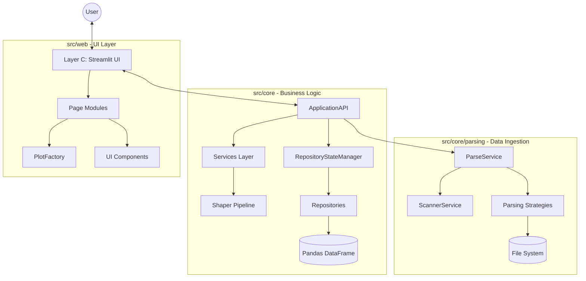

# RING-5 Application Architecture

> **Version:** 3.0 (Clean Architecture)
> **Status:** Active
> **Last Update:** February 2026

## 1. High-Level Overview

RING-5 is a statistical analysis engine for Gem5 simulations. It transforms raw hierarchical statistics into publication-ready visualizations using a strict **Clean Architecture** with clear layer separation.



## 2. Directory Structure

```
src/
├── core/                           # Layer A + B: Core Domain
│   ├── application_api.py          # 🎯 MAIN FACADE - Single entry point
│   ├── models/                     # Shared data models and protocols
│   │   ├── __init__.py              # Re-exports all models
│   │   ├── parsing_models.py        # ScannedVariable, StatConfig
│   │   ├── portfolio_models.py      # PortfolioData TypedDict
│   │   └── plot_protocol.py         # PlotProtocol
│   ├── parsing/                    # Layer A: Data Ingestion
│   │   ├── parse_service.py        # Async parsing orchestration
│   │   ├── scanner_service.py      # Variable discovery
│   │   ├── parser.py               # Core parsing logic
│   │   ├── strategies/             # Strategy Pattern implementations
│   │   ├── workers/                # Multiprocessing workers
│   │   └── perl/                   # Perl parser scripts
│   ├── services/                   # Layer B: Business Logic
│   │   ├── shapers/                # Data transformation pipeline
│   │   │   ├── factory.py          # ShaperFactory
│   │   │   ├── base_shaper.py      # Abstract base
│   │   │   └── impl/               # Shaper implementations
│   │   ├── csv_pool_service.py     # CSV loading/caching
│   │   ├── portfolio_service.py    # Portfolio management
│   │   ├── pipeline_service.py     # Transformation pipelines
│   │   └── ...                     # Other domain services
│   ├── state/                      # State Management
│   │   ├── state_manager.py        # RepositoryStateManager
│   │   └── repositories/           # Repository Pattern
│   │       ├── config_repository.py
│   │       ├── data_repository.py
│   │       ├── plot_repository.py
│   │       └── ...
│   ├── config/                     # Configuration management
│   ├── common/                     # Shared utilities
│   └── multiprocessing/            # Async/parallel infrastructure
│
└── web/                            # Layer C: Presentation
    └── pages/                      # Streamlit page modules
        ├── upload_data.py
        ├── manage_plots.py
        ├── portfolio.py
        └── ui/                     # UI components
            ├── plotting/           # Visualization
            │   ├── plot_factory.py # PlotFactory
            │   ├── base_plot.py    # Abstract plot
            │   └── types/          # Plot implementations
            ├── components/         # Reusable widgets
            └── data_managers/      # Data management UI
```

## 3. Architectural Layers

### Layer A: Data Ingestion (`src/core/parsing/`)

- **Responsibility:** Adapting the external world (Gem5 files) to the internal Domain.
- **Key Components:**
  - `ParseService`: Async parsing orchestration
  - `ScannerService`: Variable discovery and pattern aggregation
  - `ParsingStrategy` (Strategy Pattern): Simple/Advanced parsing modes
  - `Workers`: Multiprocessing for parallel file processing
- **Data Types:** Raw stats.txt → Typed DTOs → CSV/DataFrame

### Layer B: Business Logic (`src/core/services/`)

- **Responsibility:** The "Brain". Processing data, calculating metrics, filtering.
- **Key Components:**
  - `ApplicationAPI`: **Main facade** - single entry point for UI
  - `RepositoryStateManager`: Central state coordination
  - `Shapers`: Transformation functions (pure, immutable)
  - `Services`: Domain-specific operations (CSV pool, portfolios, pipelines)
- **Constraint:** Pure Python/Pandas. No UI dependencies.

### Layer C: Presentation (`src/web/`)

- **Responsibility:** Interaction and Visualization.
- **Key Components:**
  - `Page modules`: Streamlit page implementations
  - `PlotFactory`: Creates Plotly figures (Factory Pattern)
  - `UI Components`: Reusable Streamlit widgets
- **Constraint:** Humble Object pattern. Delegates all logic to ApplicationAPI.

## 4. Key Design Patterns

| Pattern                     | Usage                                                                   |
| :-------------------------- | :---------------------------------------------------------------------- |
| **Facade**                  | `ApplicationAPI` is the single entry point for UI → Core communication. |
| **Strategy**                | Swapping between Simple and Advanced parsing strategies.                |
| **Chain of Responsibility** | `Shaper` pipelines for transforming dataframes step-by-step.            |
| **Factory**                 | `PlotFactory`, `ShaperFactory` for creating instances from config.      |
| **Repository**              | `*Repository` classes abstract state storage (`st.session_state`).      |
| **Singleton**               | `ApplicationAPI` instance shared across UI pages.                       |

## 5. Data Flow

1.  **Ingest:** `ScannerService` discovers variables → `ParseService` orchestrates async parsing → Workers extract stats → CSV output.
2.  **Load:** UI calls `ApplicationAPI.load_data()` → `CsvPoolService` loads DataFrame → `RepositoryStateManager` persists.
3.  **Process:** Data flows through `Shapers` (Filter → Calculate → Normalize) via `PipelineService`.
4.  **Visualize:** Processed DataFrame → `PlotFactory` → `go.Figure` → Render to Streamlit.

## 6. Technology Stack

- **Language:** Python 3.12+ (Strict Typing)
- **Data:** Pandas, NumPy (Vectorized)
- **Viz:** Plotly Graph Objects
- **UI:** Streamlit
- **Testing:** Pytest, Hypothesis

## 7. Quality Assurance & Review Process

### Code Review Philosophy

> "A release is not a commit, it's a contract."

All code merged to protected branches (`main`, `develop`) must undergo rigorous review.

### Review Workflow

See **[`/release-branch-review`](./workflows/release-branch-review.md)** for the complete 10-phase review process:

| Phase               | Focus Area                 | Blocking |
| ------------------- | -------------------------- | -------- |
| 1. Scope Assessment | Change quantification      | No       |
| 2. Commit History   | Hygiene & logical grouping | No       |
| 3. Architecture     | Layer boundaries, patterns | **Yes**  |
| 4. Type Safety      | mypy --strict compliance   | **Yes**  |
| 5. Test Coverage    | Existence & passing        | **Yes**  |
| 6. Security         | Bandit, pip-audit          | **Yes**  |
| 7. Performance      | Complexity, anti-patterns  | No       |
| 8. Documentation    | API docs, changelogs       | No       |
| 9. Code Quality     | Smells, naming             | No       |
| 10. Integration     | Full test suite            | **Yes**  |

### Merge Criteria

**Blocking (Must Pass):**

- All tests pass (100%)
- Type checking passes (mypy --strict)
- No security vulnerabilities (Critical/High)
- Architectural boundaries respected
- No regression in existing functionality

**Strongly Recommended:**

- Test coverage ≥ 80% for new code
- All public APIs documented
- Clean commit history

---

**Note:** This architecture emphasizes separation of concerns. The Domain Layer (Layer B) is the most critical asset and must be kept pure.
