# Step 02 -- Core Models & Type System Analysis

> **RING-5 Unified Engine v2 -- Exhaustive Model Catalog**
> Generated from source at commit `a524c82` on branch `005/unified-engine-ui-v2`

---

## 1. Executive Summary

The RING-5 core model layer (`src/core/models/`) defines the **common language** shared
across all three architectural layers (Parsing, Application API, Presentation). It is
deliberately external to any single layer so that every module can depend on it without
introducing circular or upward imports.

### Key Statistics (at a glance)

| Metric | Count |
|---|---|
| Total model files | 20 |
| TypedDict classes | 18 |
| Dataclass classes | 18 |
| Protocol classes | 1 |
| Type aliases | 3 |
| Module-level constants | 6 |
| Validation functions | 1 |
| Total fields across all models | ~260+ |

### Design Principles

1. **Immutability where possible** -- Parsing models use `frozen=True` dataclasses to
   guarantee reproducibility across threads.
2. **TypedDict for serialization** -- All service-layer data structures exchanged between
   services, protocols, and APIs use `TypedDict` to replace `Dict[str, Any]`.
3. **Discriminated unions** -- Shaper configurations use a `Union` of per-type TypedDicts
   discriminated by the `type` field, replacing a flat 39-field mega-union.
4. **Engine-agnostic visualization** -- The `visualization/` sub-package defines dataclass
   configs consumed by both Plotly and matplotlib connectors; neither modifies them.
5. **Protocol-based decoupling** -- `PlotProtocol` uses `typing.Protocol` with
   `runtime_checkable` to decouple core from web-layer concrete implementations.
6. **Sentinel-based inheritance** -- Typography and legend configs use `-1` sentinel values
   to express "inherit from parent," resolved top-down by `resolve_spec()`.

### File Organization

```
src/core/models/
    __init__.py                    # Public API re-exports (36 symbols)
    data_models.py                 # TypedDicts: CSV pool, config persistence, pipeline, cache
    parsing_models.py              # Frozen dataclasses: ScannedVariable, StatConfig, ParseBatchResult
    history_models.py              # TypedDict: OperationRecord
    plot_protocol.py               # Protocol: PlotProtocol + PlotDeserializer alias
    plot_config.py                 # TypedDict: ShapeConfig
    portfolio_models.py            # TypedDict: PortfolioData
    shaper_models.py               # TypedDicts: 10 shaper configs + ShaperStepConfig union
    csv_contract.py                # Constants + validate_parser_csv() function
    visualization/
        __init__.py                # Package re-exports (25+ symbols)
        figure_config.py           # Dataclasses: FigureConfig, DimensionConfig, MarginsConfig, SeparatorConfig
        trace_config.py            # Dataclasses: TraceConfig + 5 subclasses
        axis_config.py             # Dataclasses: AxisConfig, AxesConfig
        legend_config.py           # Dataclasses: LegendConfig, LegendSpacingConfig, ColorbarConfig
        typography_config.py       # Dataclass: TypographyConfig
        annotation_config.py       # Dataclasses: AnnotationConfig, ReferenceLineConfig
        data_label_config.py       # Dataclass: DataLabelConfig (frozen)
        series_style_config.py     # Dataclass: SeriesStyleConfig (frozen)
        palettes.py                # Dict constants: PALETTE_REGISTRY (18 palettes)
        trace_build_result.py      # Dataclass: TraceBuildResult
```

---

## 2. Primary Data Models

### 2.1 `data_models.py` -- Service-Layer TypedDicts

**File**: `src/core/models/data_models.py`
**Purpose**: Defines exact shapes of dictionaries exchanged between services, protocols,
and APIs. Replaces `Dict[str, Any]` in protocol definitions.

#### 2.1.1 `CsvMetadata` (line 44)

| Property | Value |
|---|---|
| **Kind** | `TypedDict` (total=True) |
| **Produced by** | `CsvPoolService._get_csv_metadata()` |
| **Consumed by** | CSV pool management, `CsvPoolEntry` embedding |

| Field | Type | Required | Default | Purpose |
|---|---|---|---|---|
| `columns` | `list[str]` | Yes (total) | -- | Column names in the CSV file |
| `rows` | `int` | Yes (total) | -- | Number of data rows |
| `dtypes` | `dict[str, str]` | Yes (total) | -- | Column name to pandas dtype mapping |

#### 2.1.2 `CsvPoolEntry` (line 56)

| Property | Value |
|---|---|
| **Kind** | `TypedDict` (total=False, with Required markers) |
| **Produced by** | `CsvPoolService.load_pool()` |
| **Consumed by** | Web layer CSV selection UI |

| Field | Type | Required | Default | Purpose |
|---|---|---|---|---|
| `path` | `str` | **Required** | -- | Absolute path to CSV file |
| `name` | `str` | **Required** | -- | Display name (filename) |
| `size` | `int` | **Required** | -- | File size in bytes |
| `modified` | `float` | **Required** | -- | Last modification timestamp (epoch) |
| `columns` | `list[str]` | Optional | -- | Column names (from CsvMetadata) |
| `rows` | `int` | Optional | -- | Row count (from CsvMetadata) |
| `dtypes` | `dict[str, str]` | Optional | -- | Dtype mapping (from CsvMetadata) |

**Design note**: The `total=False` with explicit `Required` markers creates a mixed
TypedDict where the filesystem fields are always present but metadata fields are only
present when metadata caching succeeds.

#### 2.1.3 `SavedConfigEntry` (line 83)

| Property | Value |
|---|---|
| **Kind** | `TypedDict` (total=True) |
| **Produced by** | `ConfigService.load_saved_configs()` |
| **Consumed by** | Config browser UI |

| Field | Type | Required | Default | Purpose |
|---|---|---|---|---|
| `path` | `str` | Yes (total) | -- | Absolute path to config JSON file |
| `name` | `str` | Yes (total) | -- | User-visible config name |
| `modified` | `float` | Yes (total) | -- | Last modification timestamp (epoch) |
| `description` | `str` | Yes (total) | -- | Human-readable description |

#### 2.1.4 `SavedConfigData` (line 96)

| Property | Value |
|---|---|
| **Kind** | `TypedDict` (total=False, with Required markers) |
| **Serialized by** | `ConfigService` to/from JSON |

| Field | Type | Required | Default | Purpose |
|---|---|---|---|---|
| `name` | `str` | **Required** | -- | Configuration name |
| `description` | `str` | Optional | -- | Human-readable description |
| `timestamp` | `str` | Optional | -- | ISO-8601 save timestamp |
| `shapers` | `list[ShaperStepConfig]` | **Required** | -- | Shaper pipeline steps |
| `csv_path` | `str \| None` | Optional | -- | Associated CSV file path |

#### 2.1.5 `PipelineData` (line 115)

| Property | Value |
|---|---|
| **Kind** | `TypedDict` (total=False, with Required markers) |
| **Serialized by** | `PipelineService` to/from JSON |
| **Format** | Uses **nested** `PipelineStep` format |

| Field | Type | Required | Default | Purpose |
|---|---|---|---|---|
| `name` | `str` | **Required** | -- | Pipeline name |
| `description` | `str` | Optional | -- | Human-readable description |
| `pipeline` | `list[PipelineStep]` | **Required** | -- | Ordered list of pipeline steps |
| `timestamp` | `str` | Optional | -- | ISO-8601 save timestamp |

#### 2.1.6 `ParseVariableConfig` (line 133)

| Property | Value |
|---|---|
| **Kind** | `TypedDict` (total=False, with Required markers) |
| **Created by** | Variable editor UI |
| **Stored in** | `StateManager.get_parse_variables()` |
| **Consumed by** | Parser layer, portfolio serialization |

| Field | Type | Required | Default | Purpose |
|---|---|---|---|---|
| `name` | `str` | **Required** | -- | Variable name (e.g., `system.cpu0.ipc`) |
| `type` | `str` | **Required** | -- | Variable type (`scalar`, `vector`, `distribution`, `histogram`, `configuration`) |
| `_id` | `str` | **Required** | -- | Unique identifier for this config entry |
| `alias` | `str` | Optional | -- | Display alias for column renaming |
| `vectorEntries` | `list[str] \| str` | Optional | -- | Vector element selection |
| `useSpecialMembers` | `bool` | Optional | -- | Whether to include special member stats |
| `statisticsOnly` | `bool` | Optional | -- | Parse only statistical summaries |
| `statistics` | `list[str]` | Optional | -- | Distribution/histogram statistics to extract |
| `minimum` | `float` | Optional | -- | Distribution range minimum |
| `maximum` | `float` | Optional | -- | Distribution range maximum |
| `enableRebin` | `bool` | Optional | -- | Enable histogram rebinning |
| `bins` | `int` | Optional | -- | Number of rebin bins |
| `max_range` | `float` | Optional | -- | Maximum range for rebinning |
| `onEmpty` | `str` | Optional | -- | Behavior on empty data (`"skip"`, `"error"`, etc.) |
| `repeat` | `str` | Optional | -- | Perl parser repeat count |
| `patternSelection` | `list[str]` | Optional | -- | Pattern index selection list |
| `parsed_ids` | `list[str]` | Optional | -- | Already-parsed variable IDs |
| `keepIndices` | `bool` | Optional | -- | Whether to keep pattern indices in output |

**Design note**: This is the largest TypedDict in the system with 18 fields. The
majority are optional because they apply only to specific variable types (vector,
distribution, histogram).

#### 2.1.7 `ScannedVariableDict` (line 186)

| Property | Value |
|---|---|
| **Kind** | `TypedDict` (total=False, with Required markers) |
| **Produced by** | `ScannedVariable.to_dict()` |
| **Consumed by** | State management, variable service, portfolio serialization |

| Field | Type | Required | Default | Purpose |
|---|---|---|---|---|
| `name` | `str` | **Required** | -- | Variable name |
| `type` | `str` | **Required** | -- | Variable type string |
| `entries` | `list[str]` | **Required** | -- | Sub-entries (vector elements, histogram bins) |
| `minimum` | `float` | Optional | -- | Distribution range minimum |
| `maximum` | `float` | Optional | -- | Distribution range maximum |
| `pattern_indices` | `list[str]` | Optional | -- | Pattern index identifiers |
| `count` | `int` | Optional | -- | Entry count |

#### 2.1.8 `PipelineStep` (line 209)

| Property | Value |
|---|---|
| **Kind** | `TypedDict` (total=True) |
| **Stored in** | `BasePlot.pipeline` |
| **Format** | **Nested** format (config is a sub-dict) |

| Field | Type | Required | Default | Purpose |
|---|---|---|---|---|
| `id` | `int` | Yes (total) | -- | Step sequence identifier |
| `type` | `str` | Yes (total) | -- | Shaper type key (factory registry key) |
| `config` | `ShaperStepConfig` | Yes (total) | -- | Shaper parameters as nested dict |

**Design note**: Distinct from `ShaperStepConfig` which is the **flat** format. `PipelineStep`
wraps a `ShaperStepConfig` inside an `id`/`type`/`config` envelope for pipeline ordering.

#### 2.1.9 `ColumnInfoResult` (line 229)

| Property | Value |
|---|---|
| **Kind** | `TypedDict` (total=True) |
| **Returned by** | `ApplicationAPI.get_column_info()` |
| **Consumed by** | Web layer UI for column display |

| Field | Type | Required | Default | Purpose |
|---|---|---|---|---|
| `total_columns` | `int` | Yes (total) | -- | Total number of DataFrame columns |
| `total_rows` | `int` | Yes (total) | -- | Total number of DataFrame rows |
| `numeric_columns` | `list[str]` | Yes (total) | -- | Columns with numeric dtype |
| `categorical_columns` | `list[str]` | Yes (total) | -- | Columns with string/category dtype |
| `columns` | `list[str]` | Yes (total) | -- | All column names in order |

#### 2.1.10 `CacheStatsEntry` (line 248)

| Property | Value |
|---|---|
| **Kind** | `TypedDict` (total=False) |
| **Returned by** | `SimpleCache.stats()` |

| Field | Type | Required | Default | Purpose |
|---|---|---|---|---|
| `size` | `int` | Optional | -- | Current number of cached entries |
| `maxsize` | `int` | Optional | -- | Maximum cache capacity |
| `hits` | `int` | Optional | -- | Total cache hits |
| `misses` | `int` | Optional | -- | Total cache misses |
| `hit_rate` | `float` | Optional | -- | Hit rate as fraction (0.0-1.0) |

#### 2.1.11 `CacheStatsInfo` (line 261)

| Property | Value |
|---|---|
| **Kind** | `TypedDict` (total=True) |
| **Returned by** | `CsvPoolService.get_cache_stats()` |

| Field | Type | Required | Default | Purpose |
|---|---|---|---|---|
| `metadata_cache` | `CacheStatsEntry` | Yes (total) | -- | Stats for the metadata cache |
| `dataframe_cache` | `CacheStatsEntry` | Yes (total) | -- | Stats for the DataFrame cache |
| `index_size` | `int` | Yes (total) | -- | Number of indexed CSV files |

---

### 2.2 `parsing_models.py` -- Frozen Dataclasses for Parser Boundary

**File**: `src/core/models/parsing_models.py`
**Purpose**: Immutable dataclasses representing the "common language" shared across all
layers. Originally in `src.parsing.models`, externalized so parsing, application API,
and UI layers all have visibility.

**Design**: All models are `frozen=True` to guarantee reproducibility across threads.

#### 2.2.1 Type Alias: `StatParamValue` (line 24)

```python
StatParamValue = str | int | float | bool | list[str] | None
```

Union type for `StatConfig.params` dictionary values. Covers all parameter types
accepted by `FileParserStrategy` implementations.

#### 2.2.2 `ParseBatchResult` (line 27)

| Property | Value |
|---|---|
| **Kind** | `dataclass` (frozen=True) |
| **Purpose** | Thread-safe result of a parse submission |
| **Produced by** | Worker pool parse submissions |
| **Consumed by** | `construct_final_csv` |

| Field | Type | Default | Purpose |
|---|---|---|---|
| `futures` | `list[Future[dict[str, Any]]]` | -- (required) | Concurrent futures from worker pool |
| `var_names` | `list[str]` | -- (required) | Variable names in submission order |

**Design note**: Bundles futures with variable names so `construct_final_csv` can
guarantee column ordering without relying on shared class-level mutable state.

#### 2.2.3 `ScannedVariable` (line 42)

| Property | Value |
|---|---|
| **Kind** | `dataclass` (frozen=True) |
| **Purpose** | Base metadata for a variable discovered by a simulator parser |
| **Produced by** | Simulator-specific scanner implementations |
| **Consumed by** | Variable selection UI, parser configuration |

| Field | Type | Default | Purpose |
|---|---|---|---|
| `name` | `str` | -- (required) | Variable name (e.g., `system.cpu0.ipc`) |
| `type` | `str` | -- (required) | Simulator-specific type (`scalar`, `vector`, etc.) |
| `entries` | `list[str]` | `[]` (factory) | Sub-entries (vector elements, histogram bins) |
| `pattern_indices` | `list[str] \| None` | `None` | Pattern indices for regex-expanded variables |

**Methods**:

| Method | Signature | Purpose |
|---|---|---|
| `to_dict()` | `() -> ScannedVariableDict` | Serialize to dictionary for JSON-compatible output. Conditionally includes `pattern_indices` only when not `None`. |
| `from_dict()` | `(cls, data: ScannedVariableDict) -> ScannedVariable` | Class method to reconstruct model from dictionary form. |

**Inheritance note**: This is the simulator-agnostic base class. Simulator-specific
subclasses may add extra fields such as distribution min/max ranges.

#### 2.2.4 `StatConfig` (line 78)

| Property | Value |
|---|---|
| **Kind** | `dataclass` (frozen=True) |
| **Purpose** | Configuration for a specific statistic extraction |
| **Consumed by** | `FileParserStrategy` implementations |

| Field | Type | Default | Purpose |
|---|---|---|---|
| `name` | `str` | -- (required) | Variable name or regex pattern (e.g., `system.cpu\d+.ipc`) |
| `type` | `str` | -- (required) | One of: `scalar`, `vector`, `distribution`, `histogram`, `configuration` |
| `repeat` | `int` | `1` | Number of dump repetitions expected |
| `params` | `dict[str, StatParamValue]` | `{}` (factory) | Type-specific parameters (entries, min/max, etc.) |
| `statistics_only` | `bool` | `False` | If True, parse only statistical summaries |
| `is_regex` | `bool` | `False` | Whether `name` is a regex requiring expansion. Auto-set when name contains `\d+`. |
| `keep_indices` | `bool` | `False` | Whether to keep pattern indices in output columns |

---

## 3. History & Portfolio Models

### 3.1 `history_models.py` -- Operation Tracking

**File**: `src/core/models/history_models.py`
**Purpose**: Tracks data transformation operations performed by managers (preprocessor,
mixer, outlier remover, seeds reducer).

#### 3.1.1 `OperationRecord` (line 12)

| Property | Value |
|---|---|
| **Kind** | `TypedDict` (total=True) |
| **Produced by** | Manager operations (preprocessor, mixer, outlier remover, seeds reducer) |
| **Consumed by** | Portfolio serialization, operation history display |

| Field | Type | Required | Default | Purpose |
|---|---|---|---|---|
| `source_columns` | `list[str]` | Yes (total) | -- | Input column(s) used in the operation |
| `dest_columns` | `list[str]` | Yes (total) | -- | Output column(s) produced or affected |
| `operation` | `str` | Yes (total) | -- | Human-readable name of the operation |
| `timestamp` | `str` | Yes (total) | -- | ISO-8601 timestamp of confirmation |

### 3.2 `portfolio_models.py` -- Session Serialization

**File**: `src/core/models/portfolio_models.py`
**Purpose**: TypedDict for complete session serialization and restoration across all layers.

#### 3.2.1 `PortfolioData` (line 18)

| Property | Value |
|---|---|
| **Kind** | `TypedDict` (total=False) |
| **Purpose** | Complete session state for save/restore |
| **Serialized by** | Portfolio save/load service |

| Field | Type | Required | Default | Purpose |
|---|---|---|---|---|
| `parse_variables` | `list[ParseVariableConfig]` | Optional | -- | Parser variable configurations |
| `stats_path` | `str` | Optional | -- | Base path to simulator stats files |
| `stats_pattern` | `str` | Optional | -- | Pattern for stats file naming |
| `csv_path` | `str` | Optional | -- | Path to processed CSV data |
| `use_parser` | `bool` | Optional | -- | Whether parser mode is enabled |
| `scanned_variables` | `list[ScannedVariableDict]` | Optional | -- | Variables discovered by scanner |
| `data_csv` | `str` | Optional | -- | CSV string representation of data |
| `plots` | `list[dict[str, Any]]` | Optional | -- | Serialized plot configurations |
| `plot_counter` | `int` | Optional | -- | Current plot ID counter |
| `config` | `dict[str, Any]` | Optional | -- | Application configuration dictionary |
| `shapers` | `list[ShaperStepConfig]` | Optional | -- | Global shaper pipeline steps |
| `manager_history` | `list[OperationRecord]` | Optional | -- | Rolling list of last 20 manager operations |
| `portfolio_history` | `list[OperationRecord]` | Optional | -- | Full list of operations in this portfolio |

**Design note**: All fields are optional (`total=False`) to support incremental
portfolio restoration where only a subset of state is saved/loaded. The composite
references to `ParseVariableConfig`, `ScannedVariableDict`, `ShaperStepConfig`, and
`OperationRecord` make this the highest-connectivity TypedDict in the system.

---

## 4. Plot Protocol & Config

### 4.1 `plot_protocol.py` -- Core Plot Interface

**File**: `src/core/models/plot_protocol.py`
**Purpose**: Defines the core interface for plot objects, decoupling the core layer from
web-layer implementation details.

#### 4.1.1 `PlotProtocol` (line 17)

| Property | Value |
|---|---|
| **Kind** | `Protocol` (runtime_checkable) |
| **Purpose** | Structural subtyping interface for plot objects |
| **Implemented by** | `BasePlot` (web layer) and its subclasses |
| **Used by** | Core services that manipulate plots |

| Attribute | Type | Purpose |
|---|---|---|
| `plot_id` | `int` | Unique plot identifier |
| `name` | `str` | Display name of the plot |
| `plot_type` | `str` | Plot type discriminator (`bar`, `line`, `scatter`, etc.) |
| `config` | `dict[str, Any]` | Plot-specific configuration dictionary |
| `pipeline` | `list[PipelineStep]` | Data processing pipeline steps |
| `pipeline_counter` | `int` | Auto-incrementing step ID counter |
| `legend_mappings_by_column` | `dict[str, dict[str, str]]` | Per-column legend label mappings |
| `legend_mappings` | `dict[str, str]` | Global legend label mappings |
| `processed_data` | `pd.DataFrame \| None` | Cached processed DataFrame |

| Method | Signature | Purpose |
|---|---|---|
| `to_dict()` | `() -> dict[str, Any]` | Serialize the plot to a dictionary |

**Design note**: Using `@runtime_checkable` enables `isinstance()` checks against
`PlotProtocol` without requiring concrete inheritance. This is the key boundary between
the core and web layers -- core services work exclusively through this protocol.

#### 4.1.2 Type Alias: `PlotDeserializer` (line 41)

```python
PlotDeserializer = Callable[[dict[str, Any]], PlotProtocol | None]
```

A callable that deserializes a dictionary into a `PlotProtocol` instance. Injected at
startup so the core layer never imports web-layer classes. Returns `None` when
deserialization fails.

### 4.2 `plot_config.py` -- Annotation Shape Configuration

**File**: `src/core/models/plot_config.py`
**Purpose**: TypedDicts for plot configuration data structures.

#### 4.2.1 `ShapeConfig` (line 14)

| Property | Value |
|---|---|
| **Kind** | `TypedDict` (total=False, with Required markers) |
| **Used for** | Horizontal/vertical reference lines, circles, rectangles |
| **Rendered via** | Plotly `layout.shapes` mechanism |

| Field | Type | Required | Default | Purpose |
|---|---|---|---|---|
| `type` | `str` | **Required** | -- | Shape type: `"line"`, `"circle"`, `"rect"` |
| `x0` | `float \| str` | **Required** | -- | Start X coordinate |
| `y0` | `float \| str` | **Required** | -- | Start Y coordinate |
| `x1` | `float \| str` | **Required** | -- | End X coordinate |
| `y1` | `float \| str` | **Required** | -- | End Y coordinate |
| `line` | `dict[str, str \| float \| int]` | Optional | -- | Line style: `color` (str), `width` (float/int) |

---

## 5. Shaper Models

### 5.1 `shaper_models.py` -- Discriminated Union of Shaper Configurations

**File**: `src/core/models/shaper_models.py`
**Purpose**: Replaces the flat 39-field `ShaperStepConfig` mega-union with type-safe,
per-shaper TypedDicts. Each shaper type has exactly the fields it needs.

**Architecture**: Uses a discriminated union pattern where the `type` field in
`BaseShaperConfig` acts as the discriminator. The `ShaperStepConfig` type alias is a
`Union` of all per-type configs.

#### 5.1.1 `BaseShaperConfig` (line 30)

| Property | Value |
|---|---|
| **Kind** | `TypedDict` (total=False, with Required markers) |
| **Purpose** | Shared fields for every shaper step |
| **Inherited by** | All other shaper configs |

| Field | Type | Required | Default | Purpose |
|---|---|---|---|---|
| `type` | `str` | **Required** | -- | Shaper identifier (factory registry key) |
| `id` | `int` | Optional | -- | Step ID for pipeline ordering |

#### 5.1.2 `MeanShaperConfig` (line 47) -- extends `BaseShaperConfig`

| Property | Value |
|---|---|
| **Kind** | `TypedDict` (total=False, inherits BaseShaperConfig) |
| **Purpose** | Calculate arithmetic, geometric, or harmonic means |

| Field | Type | Required | Default | Purpose |
|---|---|---|---|---|
| `meanVars` | `list[str]` | **Required** | -- | Columns to aggregate (e.g., `["ipc", "cpi"]`) |
| `meanAlgorithm` | `str` | **Required** | -- | Algorithm: `"arithmean"`, `"geomean"`, `"hmean"` |
| `groupingColumns` | `list[str]` | **Required** | -- | Columns defining groups (e.g., `["config"]`) |
| `replacingColumn` | `str` | **Required** | -- | Column that holds the mean label (e.g., `"benchmark"` -> `"geomean"`) |

#### 5.1.3 `NormalizeShaperConfig` (line 73) -- extends `BaseShaperConfig`

| Property | Value |
|---|---|
| **Kind** | `TypedDict` (total=False, inherits BaseShaperConfig) |
| **Purpose** | Divide metric columns by a reference row's values (speedup over baseline) |

| Field | Type | Required | Default | Purpose |
|---|---|---|---|---|
| `normalizeVars` | `list[str]` | **Required** | -- | Columns to normalize (numerator metrics) |
| `normalizerColumn` | `str` | **Required** | -- | Column with reference category (e.g., `"config"`) |
| `normalizerValue` | `str` | **Required** | -- | Specific reference value (e.g., `"baseline"`) |
| `groupBy` | `list[str]` | **Required** | -- | Columns defining normalization groups |
| `normalizerVars` | `list[str]` | Optional | -- | Additional variable columns for context |
| `normalizeSd` | `bool` | Optional | -- | Whether to normalize standard deviation columns |

#### 5.1.4 `SortShaperConfig` (line 105) -- extends `BaseShaperConfig`

| Property | Value |
|---|---|
| **Kind** | `TypedDict` (total=False, inherits BaseShaperConfig) |
| **Purpose** | Reorder DataFrame rows based on explicit category orderings |

| Field | Type | Required | Default | Purpose |
|---|---|---|---|---|
| `order_dict` | `dict[str, list[str]]` | **Required** | -- | Column name to ordered value list mapping |

#### 5.1.5 `SplitApplyGroupConfig` (line 123)

| Property | Value |
|---|---|
| **Kind** | `TypedDict` (total=False) -- NOT inheriting BaseShaperConfig |
| **Purpose** | Configuration for a single group within a SplitApply shaper |

| Field | Type | Required | Default | Purpose |
|---|---|---|---|---|
| `columns` | `list[str]` | Optional | -- | Column values defining this group |
| `pipeline` | `list[ShaperStepConfig]` | Optional | -- | Sub-pipeline to apply to this group's data |

**Design note**: This TypedDict does NOT inherit from `BaseShaperConfig` because it is
a sub-component of `SplitApplyShaperConfig`, not a standalone shaper. It contains a
recursive reference to `ShaperStepConfig` for nested pipeline composition.

#### 5.1.6 `SplitApplyShaperConfig` (line 135) -- extends `BaseShaperConfig`

| Property | Value |
|---|---|
| **Kind** | `TypedDict` (total=False, inherits BaseShaperConfig) |
| **Purpose** | Split data by columns, apply independent sub-pipelines, merge results |

| Field | Type | Required | Default | Purpose |
|---|---|---|---|---|
| `joinColumns` | `list[str]` | **Required** | -- | Columns to split on (e.g., `["benchmark"]`) |
| `groups` | `list[SplitApplyGroupConfig]` | **Required** | -- | List of group definitions with sub-pipelines |

#### 5.1.7 `TransformerShaperConfig` (line 155) -- extends `BaseShaperConfig`

| Property | Value |
|---|---|
| **Kind** | `TypedDict` (total=False, inherits BaseShaperConfig) |
| **Purpose** | Convert column types or reorder categorical values |

| Field | Type | Required | Default | Purpose |
|---|---|---|---|---|
| `column` | `str` | **Required** | -- | Target column to transform |
| `target_type` | `str` | **Required** | -- | Desired output type (`"categorical"`, `"numeric"`) |
| `order` | `list[str] \| None` | Optional | -- | Explicit category ordering (None = infer) |

#### 5.1.8 `ColumnSelectorConfig` (line 177) -- extends `BaseShaperConfig`

| Property | Value |
|---|---|
| **Kind** | `TypedDict` (total=False, inherits BaseShaperConfig) |
| **Purpose** | Keep only specified columns, drop the rest |

| Field | Type | Required | Default | Purpose |
|---|---|---|---|---|
| `columns` | `list[str]` | **Required** | -- | Column names to retain |

#### 5.1.9 `ConditionSelectorConfig` (line 194) -- extends `BaseShaperConfig`

| Property | Value |
|---|---|
| **Kind** | `TypedDict` (total=False, inherits BaseShaperConfig) |
| **Purpose** | Filter rows based on conditions applied to a column |

| Field | Type | Required | Default | Purpose |
|---|---|---|---|---|
| `column` | `str` | **Required** | -- | Column to filter on |
| `mode` | `str` | **Required** | -- | Filter mode: `"values"`, `"range"`, `"threshold"`, `"top_n"`, `"bottom_n"` |
| `threshold` | `float` | Optional | -- | Numeric threshold for `"threshold"` mode |
| `range` | `list[float]` | Optional | -- | `[min, max]` for `"range"` mode |
| `values` | `list[str]` | Optional | -- | Allowed values for `"values"` mode |

#### 5.1.10 `ItemSelectorConfig` (line 220) -- extends `BaseShaperConfig`

| Property | Value |
|---|---|
| **Kind** | `TypedDict` (total=False, inherits BaseShaperConfig) |
| **Purpose** | Select rows where a column contains specific string values |

| Field | Type | Required | Default | Purpose |
|---|---|---|---|---|
| `column` | `str` | **Required** | -- | Column to match against |
| `strings` | `list[str]` | **Required** | -- | Values to keep or remove |
| `mode` | `str` | Optional | -- | `"include"` or `"exclude"` |

#### 5.1.11 `PivotLongerShaperConfig` (line 241) -- extends `BaseShaperConfig`

| Property | Value |
|---|---|
| **Kind** | `TypedDict` (total=False, inherits BaseShaperConfig) |
| **Purpose** | Pivot data from wide to long format (melt) |

| Field | Type | Required | Default | Purpose |
|---|---|---|---|---|
| `id_vars` | `list[str]` | **Required** | -- | Columns to use as identifier variables |
| `value_vars` | `list[str]` | **Required** | -- | Columns to unpivot |
| `var_name` | `str` | **Required** | -- | Name for the 'variable' column |
| `value_name` | `str` | **Required** | -- | Name for the 'value' column |
| `extract_pattern` | `str` | Optional | -- | Regex pattern with capture group for variable extraction |
| `extract_group_indices` | `list[int]` | Optional | -- | Which regex groups to extract |
| `extract_separator` | `str` | Optional | -- | Separator for group concatenation |
| `selection_filters` | `dict[int, list[str]]` | Optional | -- | Per-group value filtering |
| `selection_strategy` | `str` | Optional | -- | `"discard"` or `"merge"` |
| `merge_label` | `str` | Optional | -- | Merge label (e.g., `"other"`, `"9+"`) |

#### 5.1.12 `PivotWiderShaperConfig` (line 266) -- extends `BaseShaperConfig`

| Property | Value |
|---|---|
| **Kind** | `TypedDict` (total=False, inherits BaseShaperConfig) |
| **Purpose** | Pivot data from long to wide format |

| Field | Type | Required | Default | Purpose |
|---|---|---|---|---|
| `index` | `list[str]` | **Required** | -- | Columns for the new frame's index |
| `columns` | `str` | **Required** | -- | Column for the new frame's column headers |
| `values` | `str` | **Required** | -- | Column for populating new frame's values |

#### 5.1.13 Type Alias: `ShaperStepConfig` (line 293)

```python
ShaperStepConfig = Union[
    MeanShaperConfig,
    NormalizeShaperConfig,
    SortShaperConfig,
    SplitApplyShaperConfig,
    TransformerShaperConfig,
    ColumnSelectorConfig,
    ConditionSelectorConfig,
    ItemSelectorConfig,
    PivotLongerShaperConfig,
    PivotWiderShaperConfig,
]
```

Discriminated union of all shaper configurations. The `type` field from `BaseShaperConfig`
acts as the discriminator. Consumers use `config["type"]` to determine which specific config
shape to expect. This replaces the old flat `ShaperStepConfig` mega-union from `data_models.py`.

---

## 6. CSV Contract

### 6.1 `csv_contract.py` -- Parser Output Format Specification

**File**: `src/core/models/csv_contract.py`
**Purpose**: Defines the mandatory CSV format that all simulator parsers must produce.
The CSV is the "common language" between Layer A (Parsing) and Layer B (Core).

#### 6.1.1 Module Constants

| Constant | Type | Value | Purpose |
|---|---|---|---|
| `MISSING_VALUE` | `str` | `""` | Representation for missing/unavailable values |
| `CSV_ENCODING` | `str` | `"utf-8"` | Character encoding for all parser CSV output |
| `CSV_DIALECT` | `str` | `"excel"` | CSV dialect for Python `csv` module |

#### 6.1.2 Format Rules

1. Header row is mandatory
2. Each row represents one dump interval (begin/end simpoint pair)
3. Column names are variable names (hierarchical, dot-separated)
4. Values are numeric (float) or string (for configuration variables)
5. Missing values are represented as empty string
6. No simulator-specific metadata in the CSV -- only data values

#### 6.1.3 `validate_parser_csv()` (line 51)

```python
def validate_parser_csv(path: Path) -> list[str]
```

| Parameter | Type | Purpose |
|---|---|---|
| `path` | `Path` | Path to the CSV file to validate |
| **Returns** | `list[str]` | Validation warnings (empty = valid) |
| **Raises** | `FileNotFoundError` | If the file does not exist |
| **Raises** | `ValueError` | If fundamentally invalid (no header, empty) |

**Validation checks performed**:
1. File existence
2. Non-empty header row
3. Duplicate column name detection
4. Empty column name detection
5. Leading/trailing whitespace in column names
6. Data row existence
7. Column count consistency (each row vs. header)

---

## 7. Visualization Config Hierarchy

### 7.1 `visualization/__init__.py` -- Package Public API

**File**: `src/core/models/visualization/__init__.py`
**Purpose**: Single source of truth for all visualization configuration. Both Plotly and
matplotlib connectors consume these models; neither modifies them.

**Re-exports**: 25+ symbols organized by category:
- Annotations: `AnnotationConfig`, `ReferenceLineConfig`
- Axes: `AxisConfig`, `AxesConfig`
- Data labels: `DataLabelConfig`
- Figure + dimensions: `FigureConfig`, `DimensionConfig`, `MarginsConfig`, `SeparatorConfig`
- Legend: `LegendConfig`, `LegendSpacingConfig`
- Palettes: `PALETTE_REGISTRY`, `resolve_palette`, `get_palette_names`, `is_colorblind_safe`
- Resolvers: `resolve_config`
- Series style: `SeriesStyleConfig`
- Traces: `TraceConfig`, `BarTraceConfig`, `LineTraceConfig`, `ScatterTraceConfig`, `HistogramTraceConfig`, `TraceBuildResult`
- Typography: `TypographyConfig`

### 7.2 `figure_config.py` -- Top-Level Figure Configuration

**File**: `src/core/models/visualization/figure_config.py`
**Purpose**: The canonical, engine-agnostic description of a complete figure.

#### 7.2.1 `MarginsConfig` (line 32)

| Property | Value |
|---|---|
| **Kind** | `dataclass` (mutable) |
| **Unit** | Points (1 pt ~ 1/72 inch) |

| Field | Type | Default | Purpose |
|---|---|---|---|
| `top` | `float` | `40.0` | Top margin in points |
| `bottom` | `float` | `80.0` | Bottom margin in points |
| `left` | `float` | `60.0` | Left margin in points |
| `right` | `float` | `30.0` | Right margin in points |
| `pad` | `float` | `0.0` | Inner padding between axes and plot area |

**Methods**: `to_dict() -> dict[str, float]` -- Serialize to plain dictionary.

#### 7.2.2 `DimensionConfig` (line 62)

| Property | Value |
|---|---|
| **Kind** | `dataclass` (mutable) |
| **Unit** | Width/height in inches; margins in points |

| Field | Type | Default | Purpose |
|---|---|---|---|
| `width` | `float` | `7.0` | Figure width in inches (default: single-column IEEE) |
| `height` | `float` | `4.0` | Figure height in inches |
| `dpi` | `int` | `300` | Dots-per-inch for raster output |
| `margins` | `MarginsConfig` | `MarginsConfig()` | Margin configuration |
| `bar_width_scale` | `float` | `1.0` | Multiplier for bar width (matplotlib) |
| `bargap` | `float` | `0.15` | Gap between bar groups (Plotly) |
| `bargroupgap` | `float` | `0.1` | Gap within bar groups (Plotly) |

#### 7.2.3 `SeparatorConfig` (line 84)

| Property | Value |
|---|---|
| **Kind** | `dataclass` (mutable) |
| **Purpose** | Group separator lines between bar clusters |

| Field | Type | Default | Purpose |
|---|---|---|---|
| `enabled` | `bool` | `False` | Whether separators are drawn |
| `style` | `Literal["solid", "dash", "dot", "dashdot"]` | `"dash"` | Line style |
| `color` | `str` | `"gray"` | Line color |

#### 7.2.4 `FigureConfig` (line 98) -- THE TOP-LEVEL CONTAINER

| Property | Value |
|---|---|
| **Kind** | `dataclass` (mutable) |
| **Purpose** | Single source of truth for complete figure description |
| **Consumed by** | Plotly connector, matplotlib connector |

| Field | Type | Default | Purpose |
|---|---|---|---|
| `dimensions` | `DimensionConfig` | `DimensionConfig()` | Physical dimensions and bar gaps |
| `typography` | `TypographyConfig` | `None` -> `TypographyConfig()` via `__post_init__` | Font sizes and weights |
| `axes` | `AxesConfig` | `None` -> `AxesConfig()` via `__post_init__` | Axes configuration (x, y, y2) |
| `legends` | `list[LegendConfig]` | `[]` | Legend instances (typically 1-3) |
| `traces` | `list[TraceConfig]` | `[]` | Trace specifications |
| `annotations` | `list[AnnotationConfig]` | `[]` | Text annotations |
| `separator` | `SeparatorConfig` | `SeparatorConfig()` | Group separator config |
| `data_labels` | `DataLabelConfig \| None` | `None` | Data label config |
| `series_styles` | `list[SeriesStyleConfig]` | `[]` | Per-trace style overrides (positional) |
| `trace_overrides` | `dict[str, SeriesStyleConfig]` | `{}` | Per-trace overrides keyed by trace name |
| `color_palette` | `list[str]` | Wong 8-color palette | Default color sequence (hex strings) |
| `barmode` | `Literal["group", "stack", "overlay", "relative"]` | `"group"` | Bar grouping mode |
| `hatching_sequence` | `list[str]` | `["/", "\\", "\|", "-", "+", "x", "o", "O"]` | B&W hatch patterns |
| `reference_lines` | `list[ReferenceLineConfig]` | `[]` | Horizontal/vertical reference lines |
| `hovermode` | `str` | `"x unified"` | Hover interactivity mode |
| `enable_stripes` | `bool` | `False` | Whether to draw striped backgrounds |
| `show_error_bars` | `bool` | `False` | Whether error bars are visible |
| `title` | `str` | `""` | Figure title |
| `paper_bgcolor` | `str` | `"white"` | Paper (outside axes) background color |
| `plot_bgcolor` | `str` | `"white"` | Plot area background color |
| `font_family` | `str` | `"serif"` | Global font family |
| `latex_extra_preamble` | `str` | `""` | Extra LaTeX preamble for tikz export |
| `metadata` | `dict[str, str]` | `{}` | Arbitrary metadata (benchmark name, seed, etc.) |

**Methods**:

| Method | Signature | Purpose |
|---|---|---|
| `__post_init__()` | `() -> None` | Lazy-initializes `typography` and `axes` via imports to avoid circular deps |
| `to_dict()` | `() -> dict[str, Any]` | Full recursive serialization via `dataclasses.asdict()` |
| `from_dict()` | `(cls, data: dict[str, Any]) -> FigureConfig` | Full round-trip deserialization with sub-config reconstruction |

**`from_dict` reconstruction chain**: The `from_dict` class method reconstructs the
entire config tree by instantiating each sub-config from its own `from_dict` or
constructor:
- `MarginsConfig(**margins_data)` -> `DimensionConfig(margins=..., **dims_data)`
- `TypographyConfig(**typo_data)`
- `AxesConfig.from_dict(axes_data)`
- `[LegendConfig.from_dict(ld) for ld in legends_data]`
- `[AnnotationConfig(**ad) for ad in annotations_data]`
- `SeparatorConfig(**sep_data)`
- `DataLabelConfig.from_dict(dl_data)` (if present)
- `[SeriesStyleConfig.from_dict(sd) for sd in ss_data]`
- `{k: SeriesStyleConfig.from_dict(v) for k, v in to_raw.items()}`
- `[ReferenceLineConfig(**rd) for rd in rl_data]`

**Workflow**:
1. Build from user config (`PlotlyFigureSpecBuilder`)
2. Optionally overlay a preset (`PresetSpecBuilder`)
3. Resolve sentinels (`resolve_spec`)
4. Pass to a connector (`FigureSpecToPlotly` / `FigureSpecToMatplotlib`)

**Default color palette** (Wong colorblind-safe):
```
#000000, #E69F00, #56B4E9, #009E73, #F0E442, #0072B2, #D55E00, #CC79A7
```

---

## 8. Trace Config System

### 8.1 `trace_config.py` -- Engine-Agnostic Trace Descriptions

**File**: `src/core/models/visualization/trace_config.py`
**Purpose**: Each trace describes *what* data is plotted and *how* it should look without
referencing any specific charting library. Connectors translate these into `go.Bar`,
`go.Scatter`, or `ax.bar()` calls.

**Design note**: `TraceConfig` carries pre-computed positioning data so that the
matplotlib connector does **not** need to reimplement bar grouping math -- it
gets the exact x-positions, widths, and offsets pre-computed by the plot type.

#### 8.1.1 `TraceConfig` (line 20) -- Base Trace

| Property | Value |
|---|---|
| **Kind** | `dataclass` (mutable) |
| **Purpose** | Base trace specification shared by all trace types |
| **Discriminator** | `trace_type` field |

| Field | Type | Default | Purpose |
|---|---|---|---|
| `name` | `str` | `""` | Legend label |
| `trace_type` | `Literal["bar", "line", "scatter", "histogram", "heatmap"]` | `"bar"` | Discriminator for sub-type dispatch |
| `x` | `list[str \| int \| float]` | `[]` | X-axis data values |
| `y` | `list[int \| float]` | `[]` | Y-axis data values |
| `yaxis` | `Literal["y", "y2"]` | `"y"` | Which Y-axis this trace belongs to |
| `color` | `str` | `""` | Trace color (hex, rgb, or named) |
| `opacity` | `float` | `1.0` | Fill/marker opacity (0-1) |
| `visible` | `bool` | `True` | Whether trace is visible |
| `show_in_legend` | `bool` | `True` | Whether to include in legend |
| `legendgroup` | `str` | `""` | Group identifier for linked legend entries |
| `custom_data` | `dict[str, Any]` | `{}` | Arbitrary per-trace metadata |

#### 8.1.2 `BarTraceConfig` (line 51) -- extends `TraceConfig`

| Property | Value |
|---|---|
| **Kind** | `dataclass` (mutable, inherits TraceConfig) |
| **Purpose** | Bar-specific parameters with pre-computed grouping positions |

**Inherited fields**: All 11 fields from `TraceConfig` (with `trace_type` overridden to `"bar"`).

| Additional Field | Type | Default | Purpose |
|---|---|---|---|
| `x_positions` | `list[float]` | `[]` | Pre-computed center x-coordinate of each bar |
| `bar_width` | `float` | `0.8` | Width of each bar |
| `offset` | `float` | `0.0` | Horizontal offset for grouped bars |
| `pattern` | `str` | `""` | Hatch pattern (`""`, `"/"`, `"\\"`, `"x"`, etc.) |
| `border_width` | `float` | `0.0` | Border stroke width around bars (pts) |
| `border_color` | `str` | `""` | Border color for bars (hex or named) |
| `text_values` | `list[str] \| None` | `None` | Data label text per bar |
| `text_position` | `Literal["inside", "outside", "auto", "none"]` | `"none"` | Label placement mode |
| `text_angle` | `float` | `0.0` | Label text rotation in degrees |
| `text_font_size` | `int` | `6` | Label font size in points |
| `error_y` | `list[float] \| None` | `None` | Symmetric error bar values |

#### 8.1.3 `LineTraceConfig` (line 79) -- extends `TraceConfig`

| Property | Value |
|---|---|
| **Kind** | `dataclass` (mutable, inherits TraceConfig) |

| Additional Field | Type | Default | Purpose |
|---|---|---|---|
| `line_width` | `float` | `2.0` | Line width in points |
| `line_dash` | `Literal["solid", "dash", "dot", "dashdot", "longdash"]` | `"solid"` | Dash pattern |
| `marker_symbol` | `str` | `"circle"` | Marker shape string |
| `marker_size` | `int` | `6` | Marker diameter in points |
| `show_markers` | `bool` | `True` | Whether markers are visible |
| `fill` | `Literal["none", "tozeroy", "tonexty"]` | `"none"` | Fill area mode |
| `error_y` | `list[float] \| None` | `None` | Symmetric error bar values |

#### 8.1.4 `ScatterTraceConfig` (line 96) -- extends `TraceConfig`

| Property | Value |
|---|---|
| **Kind** | `dataclass` (mutable, inherits TraceConfig) |

| Additional Field | Type | Default | Purpose |
|---|---|---|---|
| `marker_symbol` | `str` | `"circle"` | Marker shape string |
| `marker_size` | `int` | `8` | Marker diameter in points |
| `marker_line_width` | `float` | `0.0` | Marker border stroke width |
| `marker_line_color` | `str` | `""` | Marker border color |
| `colorscale` | `str \| None` | `None` | Continuous color mapping scale name |
| `size_values` | `list[float] \| None` | `None` | Bubble chart sizes per point |
| `error_y` | `list[float] \| None` | `None` | Symmetric error bar values |

#### 8.1.5 `HistogramTraceConfig` (line 112) -- extends `TraceConfig`

| Property | Value |
|---|---|
| **Kind** | `dataclass` (mutable, inherits TraceConfig) |
| **Note** | Rarely used; RING-5 histograms are typically pre-binned as `BarTraceConfig` |

| Additional Field | Type | Default | Purpose |
|---|---|---|---|
| `nbins` | `int` | `20` | Number of bins |
| `normalization` | `Literal["", "percent", "probability", "density"]` | `""` | Normalization mode |
| `cumulative` | `bool` | `False` | Whether cumulative histogram |

#### 8.1.6 `HeatmapTraceConfig` (line 130) -- extends `TraceConfig`

| Property | Value |
|---|---|
| **Kind** | `dataclass` (mutable, inherits TraceConfig) |
| **Purpose** | Heatmap with z-matrix data, labels, and cell formatting |

| Additional Field | Type | Default | Purpose |
|---|---|---|---|
| `col_labels` | `list[str]` | `[]` | Column (x-axis) labels |
| `row_labels` | `list[str]` | `[]` | Row (y-axis) labels |
| `z` | `list[list[float \| None]]` | `[]` | Cell values matrix (rows x cols) |
| `colorscale` | `str \| list[list[str \| float]]` | `"Viridis"` | Named or custom color scale |
| `show_values` | `bool` | `True` | Whether to render cell values |
| `text` | `list[list[str]] \| None` | `None` | Custom text per cell |
| `text_font_size` | `int` | `10` | Cell text font size |
| `text_color_mode` | `str` | `"contrast"` | Color logic: `"auto"`, `"contrast"`, `"custom"` |
| `text_color` | `str` | `"#000000"` | Custom text color when mode is `"custom"` |
| `totals_position` | `str` | `""` | Where totals appear: `""`, `"right"`, `"top"` |
| `totals_count` | `int` | `0` | Number of totals rows/columns (0 or 1) |

**Trace class inheritance hierarchy**:
```
TraceConfig (base, 11 fields)
    BarTraceConfig      (trace_type="bar",       +11 fields = 22 total)
    LineTraceConfig     (trace_type="line",       +7 fields  = 18 total)
    ScatterTraceConfig  (trace_type="scatter",    +7 fields  = 18 total)
    HistogramTraceConfig(trace_type="histogram",  +3 fields  = 14 total)
    HeatmapTraceConfig  (trace_type="heatmap",    +11 fields = 22 total)
```

---

## 9. Axis, Legend, Typography Configs

### 9.1 `axis_config.py` -- Axis Configuration

**File**: `src/core/models/visualization/axis_config.py`
**Purpose**: Replaces scattered axis configuration across `PlotDisplayConfig`,
`PositioningConfig`, and `LayoutExtractor` with a single engine-agnostic model.

**Module constant**: `INHERIT_F: float = -1.0` -- Sentinel for "inherit from parent."

#### 9.1.1 `AxisConfig` (line 22)

| Property | Value |
|---|---|
| **Kind** | `dataclass` (mutable) |
| **Purpose** | Configuration for a single axis (x, y, or y2) |
| **Used in** | `AxesConfig.x`, `AxesConfig.y`, `AxesConfig.y2` |

**Label fields**:

| Field | Type | Default | Purpose |
|---|---|---|---|
| `label` | `str` | `""` | Axis label text |
| `label_pad` | `float` | `10.0` | Distance from tick labels (pts) |
| `label_position` | `float` | `0.5` | Position along axis (0=start, 0.5=center, 1=end) |
| `label_standoff` | `int` | `-1` | Standoff distance (-1 = auto) |
| `title_vshift` | `float` | `0.0` | Vertical shift for title annotation |

**Tick fields**:

| Field | Type | Default | Purpose |
|---|---|---|---|
| `tick_angle` | `float` | `0.0` | Rotation in degrees |
| `tick_pad` | `float` | `5.0` | Distance from axis (pts) |
| `tick_ha` | `Literal["left", "center", "right"]` | `"center"` | Horizontal alignment |
| `tick_offset` | `float` | `0.0` | Horizontal offset (pts, fine-tuning) |
| `tick_values` | `list[float \| int \| str] \| None` | `None` | Explicit tick positions |
| `tick_text` | `list[str] \| None` | `None` | Explicit tick labels |
| `tick_font_color` | `str` | `""` | Tick label color (empty = inherit) |
| `show_ticks` | `bool` | `True` | Whether tick marks are visible |
| `tick_side` | `str` | `""` | Tick placement side (empty = default) |
| `tick_dash` | `str` | `"solid"` | Tick line dash pattern |
| `show_tick_labels` | `bool` | `True` | Whether tick labels are visible |
| `dtick` | `float \| None` | `None` | Fixed tick interval |

**Range & Scale fields**:

| Field | Type | Default | Purpose |
|---|---|---|---|
| `range` | `list[float] \| None` | `None` | `[min, max]` or None for auto |
| `scale` | `Literal["linear", "log"]` | `"linear"` | Axis scale type |
| `margin` | `float` | `0.02` | Margin as fraction of data range |
| `automargin` | `bool` | `True` | Let engine auto-adjust margins |

**Grid fields**:

| Field | Type | Default | Purpose |
|---|---|---|---|
| `show_grid` | `bool` | `True` | Whether grid lines are visible |
| `grid_color` | `str` | `"#E5E5E5"` | Grid line color |
| `grid_width` | `float` | `1.0` | Grid line width |
| `axis_color` | `str` | `"#444"` | Axis line color |
| `axis_line_color` | `str` | `""` | Explicit axis line color (empty = inherit `axis_color`) |
| `axis_line_width` | `float` | `1.0` | Axis line width |

**Ordering fields**:

| Field | Type | Default | Purpose |
|---|---|---|---|
| `category_order` | `list[str] \| None` | `None` | Explicit category order |
| `label_aliases` | `dict[str, str] \| None` | `None` | Tick label remapping |

**Total**: 28 fields per axis.

**Methods**:
- `to_dict() -> dict[str, Any]` -- Full serialization via `dataclasses.asdict()`.
- `from_dict(cls, data) -> AxisConfig` -- Reconstructs from dict, filtering unknown keys via `__dataclass_fields__`.

#### 9.1.2 `AxesConfig` (line 80)

| Property | Value |
|---|---|
| **Kind** | `dataclass` (mutable) |
| **Purpose** | Container for all axes in a figure (x, y, optional y2) |

| Field | Type | Default | Purpose |
|---|---|---|---|
| `x` | `AxisConfig` | `AxisConfig()` | Primary X-axis configuration |
| `y` | `AxisConfig` | `AxisConfig()` | Primary Y-axis configuration |
| `y2` | `AxisConfig \| None` | `None` | Secondary Y-axis (None = no twin axis) |
| `group_label_offset` | `float` | `-0.12` | Vertical offset below axis for group labels |
| `group_label_alternate` | `bool` | `True` | Whether to alternate group label levels |
| `group_label_alt_spacing` | `float` | `0.05` | Distance between alternating levels |
| `group_order` | `list[str] \| None` | `None` | Explicit group ordering |
| `top_axis_line_width` | `float` | `0.0` | Top axis line width (0 = hidden) |
| `top_axis_line_color` | `str` | `"#444"` | Top axis line color |
| `right_axis_line_width` | `float` | `0.0` | Right axis line width (0 = hidden) |
| `right_axis_line_color` | `str` | `"#444"` | Right axis line color |

**Methods**:
- `to_dict() -> dict[str, Any]` -- Serializes x, y as dicts; conditionally includes y2.
- `from_dict(cls, data) -> AxesConfig` -- Reconstructs all sub-axes from nested dicts.

### 9.2 `legend_config.py` -- Legend Configuration

**File**: `src/core/models/visualization/legend_config.py`
**Purpose**: Uniform model for all legend instances. Replaces special-cased `legend2_x`,
`legend3_borderpad` etc. scattered across `LaTeXPreset`. Each legend is a `LegendConfig`
with identical fields; a figure holds `List[LegendConfig]` -- typically 1-3 entries.

**Module constant**: `INHERIT_F: float = -1.0` -- Sentinel for "inherit from primary."

#### 9.2.1 `ColorbarConfig` (line 23)

| Property | Value |
|---|---|
| **Kind** | `dataclass` (mutable) |
| **Purpose** | Colorbar-specific settings for heatmap plots |

| Field | Type | Default | Purpose |
|---|---|---|---|
| `title_side` | `Literal["top", "right", "bottom", "left"]` | `"top"` | Title position relative to colorbar |
| `range_mode` | `Literal["auto", "manual"]` | `"auto"` | Whether range is auto-computed or manual |
| `zmin` | `float \| None` | `None` | Manual minimum value |
| `zmax` | `float \| None` | `None` | Manual maximum value |
| `nticks` | `int` | `5` | Number of ticks on colorbar |
| `tick_decimals` | `int` | `2` | Decimal places for tick formatting |
| `shared` | `bool` | `True` | Whether colorbar is shared across subplots |
| `tick_angle` | `float` | `0.0` | Rotation for tick labels (degrees) |
| `tick_side` | `str` | `"right"` | Tick placement: `"right"` or `"left"` |

**Methods**: `to_dict()`, `from_dict(cls, data)` -- Standard serialization pair.

#### 9.2.2 `LegendSpacingConfig` (line 61)

| Property | Value |
|---|---|
| **Kind** | `dataclass` (mutable) |
| **Purpose** | Fine-grained spacing parameters for a legend box |

| Field | Type | Default | Purpose |
|---|---|---|---|
| `columnspacing` | `float` | `0.5` | Spacing between columns |
| `handletextpad` | `float` | `0.3` | Padding between handle and text |
| `labelspacing` | `float` | `0.2` | Spacing between legend entries |
| `handlelength` | `float` | `1.0` | Length of the legend handle |
| `handleheight` | `float` | `0.7` | Height of the legend handle |
| `borderpad` | `float` | `0.2` | Padding inside legend border |
| `borderaxespad` | `float` | `0.5` | Padding between legend and axes |

**Methods**: `to_dict()`, `from_dict(cls, data)` -- Standard serialization pair.

#### 9.2.3 `LegendConfig` (line 94)

| Property | Value |
|---|---|
| **Kind** | `dataclass` (mutable) |
| **Purpose** | Complete configuration for a single legend instance |
| **Contains** | `LegendSpacingConfig`, `ColorbarConfig` as sub-configs |

**Role & visibility fields**:

| Field | Type | Default | Purpose |
|---|---|---|---|
| `role` | `Literal["primary", "secondary", "tertiary"]` | `"primary"` | Semantic role identifier |
| `visible` | `bool` | `True` | Whether this legend is rendered |

**Typography fields**:

| Field | Type | Default | Purpose |
|---|---|---|---|
| `font_size` | `int` | `8` | Text size in points (-1 = inherit) |
| `font_family` | `str` | `""` | Font family (empty = inherit global) |
| `bold` | `bool` | `False` | Whether text is bold |

**Layout fields**:

| Field | Type | Default | Purpose |
|---|---|---|---|
| `ncol` | `int` | `1` | Number of columns (-1 = auto) |
| `col_width` | `float` | `-1.0` | Column width (-1 = auto) |
| `entrywidth` | `int` | `0` | Plotly entrywidth in pixels (0 = auto) |
| `indentation` | `int` | `0` | Horizontal indentation in px |
| `orientation` | `Literal["horizontal", "vertical"]` | `"vertical"` | Layout direction |
| `itemsizing` | `Literal["constant", "trace"]` | `"constant"` | Legend marker sizing mode |
| `itemwidth` | `int` | `30` | Item width in pixels |
| `tracegroupgap` | `int` | `10` | Gap between trace groups |
| `order` | `Literal["normal", "reversed"]` | `"normal"` | Display order |
| `trace_distribution` | `str` | `""` | Comma-separated trace indices (empty = all) |

**Position fields**:

| Field | Type | Default | Purpose |
|---|---|---|---|
| `position_x` | `float` | `-1.0` | X position as fraction (-1 = auto) |
| `position_y` | `float` | `-1.0` | Y position as fraction (-1 = auto) |
| `anchor_x` | `Literal["left", "center", "right", "auto"]` | `"auto"` | Horizontal anchor |
| `anchor_y` | `Literal["top", "middle", "bottom", "auto"]` | `"auto"` | Vertical anchor |
| `valign` | `Literal["top", "middle", "bottom"]` | `"middle"` | Vertical text alignment |
| `custom_position` | `bool` | `False` | Whether to use position_x/y |

**Styling fields**:

| Field | Type | Default | Purpose |
|---|---|---|---|
| `bgcolor` | `str` | `""` | Background color (empty = transparent) |
| `border_width` | `float` | `0.0` | Border line width (0 = no border) |
| `border_color` | `str` | `"#444"` | Border line color |
| `font_color` | `str` | `"#444"` | Legend text color |
| `title_font_color` | `str` | `"#444"` | Legend title text color |
| `title_font_size` | `int` | `-1` | Legend title font size (-1 = follow font_size) |
| `title` | `str` | `""` | Legend title text |

**Sub-config fields**:

| Field | Type | Default | Purpose |
|---|---|---|---|
| `spacing` | `LegendSpacingConfig` | `LegendSpacingConfig()` | Fine-grained spacing |
| `colorbar` | `ColorbarConfig` | `ColorbarConfig()` | Heatmap colorbar settings |

**Tertiary-annotation extras**:

| Field | Type | Default | Purpose |
|---|---|---|---|
| `number_fontsize` | `int` | `-1` | Size of number digits (-1 = follow font_size) |
| `text_fontsize` | `int` | `-1` | Size of label text (-1 = follow font_size) |

**Total**: 33 fields -- the largest dataclass in the visualization sub-package.

**Methods**:
- `derive_anchors(position_x, position_y) -> tuple[str, str]` -- Static method.
  Auto-derives anchor from position for intuitive placement. When x > 0.8 -> anchor
  left; x < 0.2 -> anchor right; otherwise center. Same logic for y.
- `to_dict() -> dict[str, Any]` -- Full serialization including sub-configs.
- `from_dict(cls, data) -> LegendConfig` -- Reconstructs with `LegendSpacingConfig`
  and `ColorbarConfig` deserialization; filters unknown keys.

### 9.3 `typography_config.py` -- Typography Configuration

**File**: `src/core/models/visualization/typography_config.py`
**Purpose**: Per-element font size and weight specification. Replaces the dual vocabulary
of `FontStyleConfig` (matplotlib-side) and scattered font keys in `PlotDisplayConfig`
(Plotly-side).

**Module constants**:
- `INHERIT: int = -1` -- Sentinel for "inherit from parent"
- `INHERIT_F: float = -1.0` -- Float sentinel variant

#### 9.3.1 `TypographyConfig` (line 23)

| Property | Value |
|---|---|
| **Kind** | `dataclass` (mutable) |
| **Purpose** | Complete font specification for every text element |
| **Size unit** | Points (typographic standard) |

**Inheritance chain** (resolved top-down by `resolve_spec()`):
```
font_size_base (root)
    font_size_title
    font_size_xlabel
    font_size_ylabel
        font_size_y2label  (inherits ylabel if -1)
    font_size_ticks
        font_size_yticks   (inherits ticks if -1)
            font_size_y2ticks  (inherits yticks if -1)
    font_size_annotations
    font_size_legend       (primary legend)
        font_size_legend2  (inherits legend if -1)
        font_size_legend3  (inherits legend if -1)
            legend3_number_fontsize  (inherits legend3 if -1)
            legend3_text_fontsize    (inherits legend3 if -1)
```

**Size fields**:

| Field | Type | Default | Purpose |
|---|---|---|---|
| `font_size_base` | `int` | `10` | Root reference for all inheritance |
| `font_size_title` | `int` | `10` | Figure title font size |
| `font_size_xlabel` | `int` | `9` | X-axis label font size |
| `font_size_ylabel` | `int` | `9` | Y-axis label font size |
| `font_size_y2label` | `int` | `-1` | Secondary Y label (-1 = follow ylabel) |
| `font_size_ticks` | `int` | `7` | X-tick label font size |
| `font_size_yticks` | `int` | `7` | Y-tick label font size |
| `font_size_y2ticks` | `int` | `-1` | Secondary Y ticks (-1 = follow yticks) |
| `font_size_annotations` | `int` | `6` | Bar value annotation size |
| `font_size_legend` | `int` | `8` | Primary legend text size |
| `font_size_legend2` | `int` | `-1` | Secondary legend (-1 = follow legend) |
| `font_size_legend3` | `int` | `-1` | Tertiary legend (-1 = follow legend) |
| `legend3_number_fontsize` | `int` | `-1` | Tertiary legend number digits (-1 = follow legend3) |
| `legend3_text_fontsize` | `int` | `-1` | Tertiary legend label text (-1 = follow legend3) |

**Bold flags**:

| Field | Type | Default | Purpose |
|---|---|---|---|
| `bold_title` | `bool` | `False` | Bold figure title |
| `bold_xlabel` | `bool` | `False` | Bold X-axis label |
| `bold_ylabel` | `bool` | `False` | Bold Y-axis label |
| `bold_y2label` | `bool` | `False` | Bold secondary Y-axis label |
| `bold_ticks` | `bool` | `False` | Bold tick labels |
| `bold_annotations` | `bool` | `True` | Bold bar value annotations (default: True) |
| `bold_group_labels` | `bool` | `True` | Bold X-axis grouping labels (default: True) |
| `bold_legend` | `bool` | `False` | Bold primary legend |
| `bold_legend2` | `bool` | `False` | Bold secondary legend |
| `bold_legend3` | `bool` | `False` | Bold tertiary legend |

**Total**: 24 fields (14 sizes + 10 bold flags).

---

## 10. Annotation, Data Label, Series Style Configs

### 10.1 `annotation_config.py` -- Text and Reference Line Annotations

**File**: `src/core/models/visualization/annotation_config.py`
**Purpose**: Covers bar value labels, grouping labels, tertiary/numbered annotations,
free-form text annotations, and reference lines.

#### 10.1.1 `AnnotationConfig` (line 19)

| Property | Value |
|---|---|
| **Kind** | `dataclass` (mutable) |
| **Purpose** | Engine-agnostic description of a text annotation |
| **Discriminator** | `annotation_type` field |

**Content fields**:

| Field | Type | Default | Purpose |
|---|---|---|---|
| `text` | `str` | `""` | Annotation text content |
| `annotation_type` | `Literal["text", "bar_value", "group_label", "boxed"]` | `"text"` | Rendering mode discriminator |

**Position fields**:

| Field | Type | Default | Purpose |
|---|---|---|---|
| `x` | `float \| str` | `0.0` | X coordinate |
| `y` | `float \| str` | `0.0` | Y coordinate |
| `xref` | `Literal["data", "paper"]` | `"data"` | X coordinate system |
| `yref` | `Literal["data", "paper"]` | `"data"` | Y coordinate system |
| `xanchor` | `Literal["left", "center", "right", "auto"]` | `"auto"` | Horizontal anchor |
| `yanchor` | `Literal["top", "middle", "bottom", "auto"]` | `"auto"` | Vertical anchor |
| `text_angle` | `float` | `0.0` | Rotation in degrees |

**Arrow fields**:

| Field | Type | Default | Purpose |
|---|---|---|---|
| `show_arrow` | `bool` | `False` | Whether to show pointer arrow |
| `arrow_head` | `int` | `0` | Arrow head style index |
| `arrow_color` | `str` | `"#444"` | Arrow color |

**Font fields**:

| Field | Type | Default | Purpose |
|---|---|---|---|
| `font_size` | `int` | `-1` | Font size (-1 = use element default from TypographyConfig) |
| `font_color` | `str` | `"#444"` | Text color |
| `font_bold` | `bool` | `False` | Bold text |

**Box styling fields** (for `"boxed"` annotation_type):

| Field | Type | Default | Purpose |
|---|---|---|---|
| `border_width` | `float` | `0.0` | Border line width |
| `border_color` | `str` | `"#444"` | Border color |
| `border_pad` | `float` | `2.0` | Padding inside border |
| `bgcolor` | `str` | `""` | Background color (empty = transparent) |
| `align` | `Literal["left", "center", "right"]` | `"left"` | Text alignment within box |

**Total**: 20 fields.

#### 10.1.2 `ReferenceLineConfig` (line 65)

| Property | Value |
|---|---|
| **Kind** | `dataclass` (mutable) |
| **Purpose** | A horizontal or vertical reference line across the plot |
| **Examples** | Baseline at y=1.0, threshold at y=100, mean line |

| Field | Type | Default | Purpose |
|---|---|---|---|
| `enabled` | `bool` | `False` | Whether this reference line is drawn |
| `axis` | `Literal["x", "y"]` | `"y"` | Which axis the line is on |
| `value` | `float` | `0.0` | Position on the axis |
| `color` | `str` | `"red"` | Line color |
| `width` | `float` | `1.5` | Line width in points |
| `style` | `Literal["solid", "dash", "dot", "dashdot"]` | `"dash"` | Line dash pattern |
| `label` | `str` | `""` | Optional label text |

### 10.2 `data_label_config.py` -- Data Label Configuration

**File**: `src/core/models/visualization/data_label_config.py`
**Purpose**: Controls how numeric value labels appear on plot traces.

#### 10.2.1 `DataLabelConfig` (line 16)

| Property | Value |
|---|---|
| **Kind** | `dataclass` (frozen=True) |
| **Purpose** | Specification for data labels (value annotations) on traces |
| **Frozen** | Yes -- immutable once created |

| Field | Type | Default | Purpose |
|---|---|---|---|
| `enabled` | `bool` | `False` | Whether data labels are shown |
| `color_mode` | `Literal["auto", "contrast", "custom"]` | `"auto"` | How label color is determined |
| `custom_color` | `str` | `"#000000"` | Color when `color_mode == "custom"` |
| `font_size` | `int` | `10` | Label font size in points |
| `rotation` | `int` | `0` | Text rotation in degrees (-90 to 90) |
| `position` | `Literal["auto", "inside", "outside"]` | `"auto"` | Vertical placement |
| `anchor` | `Literal["auto", "top", "middle", "bottom"]` | `"auto"` | Text anchor within label |
| `format_string` | `str` | `".2f"` | d3-format string (e.g., `.2f`, `.1%`) |
| `display_logic` | `Literal["all", "above_threshold", "below_threshold"]` | `"all"` | Which values show labels |
| `threshold` | `float` | `0.0` | Numeric threshold for conditional display |
| `size_constraint` | `Literal["none", "inside"]` | `"none"` | How oversized labels are handled |
| `auto_contrast` | `bool` | `True` | Flip text color based on background luminance |

**Total**: 12 fields.

**Methods**:
- `to_dict() -> dict[str, Any]` -- Explicit serialization (not using `asdict` because frozen).
- `from_dict(cls, data) -> DataLabelConfig` -- Explicit deserialization with safe defaults and type coercion for each field.

### 10.3 `series_style_config.py` -- Per-Trace Style Overrides

**File**: `src/core/models/visualization/series_style_config.py`
**Purpose**: Per-trace styling overrides for multi-series plots. Each `SeriesStyleConfig`
maps 1:1 to a trace.

#### 10.3.1 `SeriesStyleConfig` (line 16)

| Property | Value |
|---|---|
| **Kind** | `dataclass` (frozen=True) |
| **Purpose** | Override base trace styling per-series |
| **Frozen** | Yes -- immutable once created |

| Field | Type | Default | Purpose |
|---|---|---|---|
| `line_width` | `float` | `2.0` | Line width in points |
| `marker_size` | `int` | `6` | Marker diameter in points |
| `opacity` | `float` | `1.0` | Fill/marker opacity (0.0-1.0) |
| `bar_border_width` | `float` | `0.0` | Border width around bars (pts) |
| `bar_border_color` | `str` | `""` | Border color for bars |
| `hatching_pattern` | `str` | `""` | Hatch pattern for bars (empty = none) |
| `color` | `str` | `""` | Explicit trace color override |
| `symbol` | `str` | `""` | Marker symbol override (e.g., `"square"`, `"diamond"`) |
| `display_name` | `str` | `""` | Rename the trace legend entry |

**Total**: 9 fields.

**Methods**:
- `to_dict() -> dict[str, Any]` -- Explicit field-by-field serialization.
- `from_dict(cls, data) -> SeriesStyleConfig` -- Explicit deserialization with type coercion.

---

## 11. Palette System

### 11.1 `palettes.py` -- Unified Palette Registry

**File**: `src/core/models/visualization/palettes.py`
**Purpose**: Single source of truth for all color palette data. All palettes are stored
as pre-resolved `list[str]` of hex colors.

#### 11.1.1 Colorblind-Safe Palettes (`_COLORBLIND_PALETTES`)

| Palette Name | Colors | Size | Source |
|---|---|---|---|
| `wong` | `#000000, #E69F00, #56B4E9, #009E73, #F0E442, #0072B2, #D55E00, #CC79A7` | 8 | Wong (2011) |
| `okabe_ito` | `#E69F00, #56B4E9, #009E73, #F0E442, #0072B2, #D55E00, #CC79A7, #000000` | 8 | Okabe & Ito (2002) |
| `tol_bright` | `#4477AA, #EE6677, #228833, #CCBB44, #66CCEE, #AA3377, #BBBBBB` | 7 | Paul Tol |
| `viridis_8` | `#440154, #482878, #3E4A89, #31688E, #26838E, #1F9E89, #6DCD59, #FDE725` | 8 | Viridis 8-stop |
| `seaborn_cb` | `#0173B2, #DE8F05, #029E73, #D55E00, #CC78BC, #CA9161, #FBAFE4, #949494` | 8 | Seaborn colorblind |

#### 11.1.2 Plotly Qualitative Palettes (`_PLOTLY_PALETTES`)

| Palette Name | Size | Notes |
|---|---|---|
| `Plotly` | 10 | Plotly default |
| `D3` | 10 | D3.js category10 |
| `G10` | 10 | Google 10-color |
| `T10` | 10 | Tableau 10 |
| `Alphabet` | 26 | 26-letter large palette |
| `Dark24` | 24 | Dark 24-color scheme |
| `Light24` | 24 | Light 24-color scheme |
| `Set1` | 9 | ColorBrewer Set1 |
| `Set2` | 8 | ColorBrewer Set2 |
| `Set3` | 12 | ColorBrewer Set3 |
| `Pastel` | 11 | Carto Pastel |
| `Safe` | 11 | Carto Safe |
| `Vivid` | 11 | Carto Vivid |
| `Bold` | 11 | Carto Bold |

#### 11.1.3 `PALETTE_REGISTRY` (line 303)

```python
PALETTE_REGISTRY: dict[str, list[str]] = {
    **_COLORBLIND_PALETTES,
    **_PLOTLY_PALETTES,
}
```

**Total**: 18 palettes merged into a single registry. Colorblind-safe palettes are
listed first in ordering (`_PALETTE_ORDER`).

#### 11.1.4 Backward-Compatibility Shims

The module re-exports `resolve_palette`, `get_palette_names`, and `is_colorblind_safe`
from `src.core.services.visualization.palette_service` for backward compatibility.
These shims are marked for removal in Phase 10 (Dead Code Removal).

---

## 12. TraceBuildResult & Protocol Catalog

### 12.1 `trace_build_result.py` -- Aggregated Plot Output

**File**: `src/core/models/visualization/trace_build_result.py`
**Purpose**: Return type of `BasePlot.create_traces()`. Bundles data traces with
layout-level metadata needed by the downstream connector.

#### 12.1.1 `TraceBuildResult` (line 22)

| Property | Value |
|---|---|
| **Kind** | `dataclass` (mutable) |
| **Produced by** | `BasePlot.create_traces()` and subclass implementations |
| **Consumed by** | `FigureSpecToPlotly`, `FigureSpecToMatplotlib` connectors |

| Field | Type | Default | Purpose |
|---|---|---|---|
| `traces` | `Sequence[TraceConfig]` | `[]` | Engine-agnostic trace specifications |
| `annotations` | `list[AnnotationConfig]` | `[]` | Text annotations (group labels, tertiary legends) |
| `layout_annotations` | `list[dict[str, Any]]` | `[]` | Raw annotation dicts passed straight to layout |
| `shapes` | `list[ShapeConfig]` | `[]` | Plotly-format shape dicts (separators, shading) |
| `barmode` | `str` | `"group"` | Bar grouping mode |
| `custom_x_ticks` | `dict[str, list[float] \| list[str] \| list[bool]] \| None` | `None` | X-axis tick overrides (`"vals"`, `"text"` keys) |
| `secondary_y` | `bool` | `False` | Whether a secondary Y-axis is used |

### 12.2 Complete Protocol Catalog

| Protocol | File | Line | Runtime Checkable | Attributes | Methods | Implemented By |
|---|---|---|---|---|---|---|
| `PlotProtocol` | `plot_protocol.py` | 17 | Yes | 9 attributes | `to_dict()` | `BasePlot` (web layer) |

**Note**: RING-5 uses a single protocol at the core/web boundary. This is intentionally
minimal -- the core layer needs only `PlotProtocol` to work with any plot implementation.

---

## 13. Type Alias Catalog

| Alias | File | Line | Definition | Purpose |
|---|---|---|---|---|
| `StatParamValue` | `parsing_models.py` | 24 | `str \| int \| float \| bool \| list[str] \| None` | Union of all parameter types for `StatConfig.params` |
| `PlotDeserializer` | `plot_protocol.py` | 41 | `Callable[[dict[str, Any]], PlotProtocol \| None]` | Injected callable to deserialize dicts into plots |
| `ShaperStepConfig` | `shaper_models.py` | 293 | `Union[MeanShaperConfig, NormalizeShaperConfig, SortShaperConfig, SplitApplyShaperConfig, TransformerShaperConfig, ColumnSelectorConfig, ConditionSelectorConfig, ItemSelectorConfig, PivotLongerShaperConfig, PivotWiderShaperConfig]` | Discriminated union of all shaper configs |

---

## 14. Model Relationship Diagram

```mermaid
classDiagram
    direction TB

    %% ─── Parsing Models ───────────────────────────────
    class ScannedVariable {
        <<frozen dataclass>>
        +name: str
        +type: str
        +entries: list~str~
        +pattern_indices: list~str~ | None
        +to_dict() ScannedVariableDict
        +from_dict() ScannedVariable
    }

    class StatConfig {
        <<frozen dataclass>>
        +name: str
        +type: str
        +repeat: int
        +params: dict
        +statistics_only: bool
        +is_regex: bool
        +keep_indices: bool
    }

    class ParseBatchResult {
        <<frozen dataclass>>
        +futures: list~Future~
        +var_names: list~str~
    }

    %% ─── Data Model TypedDicts ────────────────────────
    class ScannedVariableDict {
        <<TypedDict>>
        +name: str
        +type: str
        +entries: list~str~
        +minimum: float
        +maximum: float
        +pattern_indices: list~str~
    }

    class ParseVariableConfig {
        <<TypedDict>>
        +name: str
        +type: str
        +_id: str
        +alias: str
        +vectorEntries: list | str
        ... 15 more optional fields
    }

    class PipelineStep {
        <<TypedDict>>
        +id: int
        +type: str
        +config: ShaperStepConfig
    }

    class OperationRecord {
        <<TypedDict>>
        +source_columns: list~str~
        +dest_columns: list~str~
        +operation: str
        +timestamp: str
    }

    class PortfolioData {
        <<TypedDict>>
        +parse_variables: list
        +stats_path: str
        +csv_path: str
        +plots: list
        +shapers: list
        +manager_history: list
        +portfolio_history: list
    }

    %% ─── Shaper Configs ──────────────────────────────
    class BaseShaperConfig {
        <<TypedDict>>
        +type: str
        +id: int
    }

    class MeanShaperConfig {
        <<TypedDict>>
    }
    class NormalizeShaperConfig {
        <<TypedDict>>
    }
    class SortShaperConfig {
        <<TypedDict>>
    }
    class SplitApplyShaperConfig {
        <<TypedDict>>
    }
    class SplitApplyGroupConfig {
        <<TypedDict>>
    }

    %% ─── Plot Protocol ───────────────────────────────
    class PlotProtocol {
        <<Protocol>>
        +plot_id: int
        +name: str
        +plot_type: str
        +config: dict
        +pipeline: list~PipelineStep~
        +processed_data: DataFrame | None
        +to_dict() dict
    }

    %% ─── Visualization Hierarchy ─────────────────────
    class FigureConfig {
        <<dataclass>>
        +dimensions: DimensionConfig
        +typography: TypographyConfig
        +axes: AxesConfig
        +legends: list~LegendConfig~
        +traces: list~TraceConfig~
        +annotations: list~AnnotationConfig~
        +data_labels: DataLabelConfig | None
        +series_styles: list~SeriesStyleConfig~
        +color_palette: list~str~
    }

    class DimensionConfig {
        <<dataclass>>
        +width: float
        +height: float
        +dpi: int
        +margins: MarginsConfig
    }

    class MarginsConfig {
        <<dataclass>>
        +top: float
        +bottom: float
        +left: float
        +right: float
    }

    class TypographyConfig {
        <<dataclass>>
        14 size fields
        10 bold flags
    }

    class AxesConfig {
        <<dataclass>>
        +x: AxisConfig
        +y: AxisConfig
        +y2: AxisConfig | None
    }

    class AxisConfig {
        <<dataclass>>
        28 fields
    }

    class LegendConfig {
        <<dataclass>>
        +role: str
        +spacing: LegendSpacingConfig
        +colorbar: ColorbarConfig
        33 total fields
    }

    class TraceConfig {
        <<dataclass>>
        +name: str
        +trace_type: str
        +x: list
        +y: list
    }

    class BarTraceConfig {
        <<dataclass>>
        +x_positions: list~float~
        +bar_width: float
    }

    class TraceBuildResult {
        <<dataclass>>
        +traces: Sequence~TraceConfig~
        +annotations: list~AnnotationConfig~
        +shapes: list~ShapeConfig~
    }

    %% ─── Relationships ───────────────────────────────
    ScannedVariable --> ScannedVariableDict : to_dict()
    PortfolioData --> ParseVariableConfig : contains
    PortfolioData --> ScannedVariableDict : contains
    PortfolioData --> OperationRecord : contains
    PortfolioData --> BaseShaperConfig : via ShaperStepConfig
    PipelineStep --> BaseShaperConfig : config field
    PlotProtocol --> PipelineStep : pipeline

    BaseShaperConfig <|-- MeanShaperConfig
    BaseShaperConfig <|-- NormalizeShaperConfig
    BaseShaperConfig <|-- SortShaperConfig
    BaseShaperConfig <|-- SplitApplyShaperConfig
    SplitApplyShaperConfig --> SplitApplyGroupConfig : groups

    FigureConfig --> DimensionConfig
    FigureConfig --> TypographyConfig
    FigureConfig --> AxesConfig
    FigureConfig --> LegendConfig
    FigureConfig --> TraceConfig
    FigureConfig --> AnnotationConfig
    FigureConfig --> DataLabelConfig
    FigureConfig --> SeriesStyleConfig
    FigureConfig --> ReferenceLineConfig

    DimensionConfig --> MarginsConfig
    AxesConfig --> AxisConfig
    LegendConfig --> LegendSpacingConfig
    LegendConfig --> ColorbarConfig

    TraceConfig <|-- BarTraceConfig
    TraceConfig <|-- LineTraceConfig
    TraceConfig <|-- ScatterTraceConfig
    TraceConfig <|-- HistogramTraceConfig
    TraceConfig <|-- HeatmapTraceConfig

    TraceBuildResult --> TraceConfig
    TraceBuildResult --> AnnotationConfig
    TraceBuildResult --> ShapeConfig
```



---

## 15. Summary Statistics

### 15.1 Model Counts by Kind

| Kind | Count | Models |
|---|---|---|
| `TypedDict` (total=True) | 5 | `CsvMetadata`, `SavedConfigEntry`, `PipelineStep`, `ColumnInfoResult`, `CacheStatsInfo`, `OperationRecord` |
| `TypedDict` (total=False, mixed) | 12 | `CsvPoolEntry`, `SavedConfigData`, `PipelineData`, `ParseVariableConfig`, `ScannedVariableDict`, `CacheStatsEntry`, `PortfolioData`, `ShapeConfig`, `BaseShaperConfig`, `MeanShaperConfig`, `NormalizeShaperConfig`, `SortShaperConfig`, `SplitApplyGroupConfig`, `SplitApplyShaperConfig`, `TransformerShaperConfig`, `ColumnSelectorConfig`, `ConditionSelectorConfig`, `ItemSelectorConfig`, `PivotLongerShaperConfig`, `PivotWiderShaperConfig` |
| `dataclass` (frozen=True) | 4 | `ParseBatchResult`, `ScannedVariable`, `StatConfig`, `DataLabelConfig`, `SeriesStyleConfig` |
| `dataclass` (mutable) | 14 | `MarginsConfig`, `DimensionConfig`, `SeparatorConfig`, `FigureConfig`, `TraceConfig`, `BarTraceConfig`, `LineTraceConfig`, `ScatterTraceConfig`, `HistogramTraceConfig`, `HeatmapTraceConfig`, `AxisConfig`, `AxesConfig`, `ColorbarConfig`, `LegendSpacingConfig`, `LegendConfig`, `TypographyConfig`, `AnnotationConfig`, `ReferenceLineConfig`, `TraceBuildResult` |
| `Protocol` | 1 | `PlotProtocol` |
| Type Alias | 3 | `StatParamValue`, `PlotDeserializer`, `ShaperStepConfig` |

### 15.2 Field Counts by Model (Top 10)

| Model | Total Fields | Kind |
|---|---|---|
| `LegendConfig` | 33 | dataclass |
| `AxisConfig` | 28 | dataclass |
| `TypographyConfig` | 24 | dataclass |
| `FigureConfig` | 22 | dataclass |
| `BarTraceConfig` | 22 | dataclass (11 base + 11 own) |
| `HeatmapTraceConfig` | 22 | dataclass (11 base + 11 own) |
| `AnnotationConfig` | 20 | dataclass |
| `ParseVariableConfig` | 18 | TypedDict |
| `LineTraceConfig` | 18 | dataclass (11 base + 7 own) |
| `ScatterTraceConfig` | 18 | dataclass (11 base + 7 own) |

### 15.3 Serialization Method Coverage

| Has `to_dict()` | Has `from_dict()` | Models |
|---|---|---|
| Yes | Yes | `ScannedVariable`, `FigureConfig`, `AxisConfig`, `AxesConfig`, `LegendConfig`, `LegendSpacingConfig`, `ColorbarConfig`, `DataLabelConfig`, `SeriesStyleConfig` |
| Yes | No | `MarginsConfig`, `TraceBuildResult` (not typically deserialized standalone) |
| No | No | All TypedDicts (inherently serializable as dicts), `TraceConfig` and subclasses, `AnnotationConfig`, `ReferenceLineConfig`, `SeparatorConfig`, `DimensionConfig` |

### 15.4 Inheritance Hierarchies

**TypedDict inheritance** (shaper_models.py):
```
BaseShaperConfig
    MeanShaperConfig
    NormalizeShaperConfig
    SortShaperConfig
    SplitApplyShaperConfig
    TransformerShaperConfig
    ColumnSelectorConfig
    ConditionSelectorConfig
    ItemSelectorConfig
    PivotLongerShaperConfig
    PivotWiderShaperConfig
```

**Dataclass inheritance** (trace_config.py):
```
TraceConfig
    BarTraceConfig
    LineTraceConfig
    ScatterTraceConfig
    HistogramTraceConfig
    HeatmapTraceConfig
```

### 15.5 Cross-Module Dependencies

| Source Module | Depends On | Through |
|---|---|---|
| `parsing_models.py` | `data_models.py` | `ScannedVariableDict` import |
| `data_models.py` | `shaper_models.py` | Re-exports for backward compat |
| `plot_protocol.py` | `data_models.py` | `PipelineStep` import |
| `portfolio_models.py` | `data_models.py`, `history_models.py` | Multiple TypedDict imports |
| `figure_config.py` | All viz sub-modules | TYPE_CHECKING imports, lazy runtime imports |
| `trace_build_result.py` | `plot_config.py`, `annotation_config.py`, `trace_config.py` | Direct imports |
| `visualization/__init__.py` | All viz modules + `palette_service` + `config_resolver` | Re-exports |

### 15.6 Key Design Patterns

1. **Mixed TypedDicts** (`total=False` + `Required`): Used by `CsvPoolEntry`,
   `SavedConfigData`, `PipelineData`, `ParseVariableConfig`, `ScannedVariableDict`,
   `ShapeConfig`, and all shaper configs. This pattern enables optional fields while
   marking essential fields as always-present.

2. **Discriminated Union**: The `ShaperStepConfig` union uses the `type` field from
   `BaseShaperConfig` as a discriminator, enabling type narrowing in consumers.

3. **Sentinel Inheritance**: Typography and legend configs use `-1` (integer) or
   `-1.0` (float) sentinels to express "inherit from parent." The `resolve_spec()`
   function resolves these top-down.

4. **Lazy Imports for Cycle Breaking**: `FigureConfig.__post_init__` uses runtime
   imports to break circular dependencies while maintaining type safety via
   `TYPE_CHECKING` guards.

5. **Frozen Dataclasses for Thread Safety**: `ParseBatchResult`, `ScannedVariable`,
   `StatConfig`, `DataLabelConfig`, and `SeriesStyleConfig` are frozen to guarantee
   thread-safe sharing across concurrent parsing workers.

6. **Dependency Inversion via Protocol**: `PlotProtocol` with `PlotDeserializer`
   enables the core layer to work with plots without knowing their concrete
   implementation. The deserializer is injected at startup.

---

*End of Step 02 -- Core Models & Type System Analysis*
