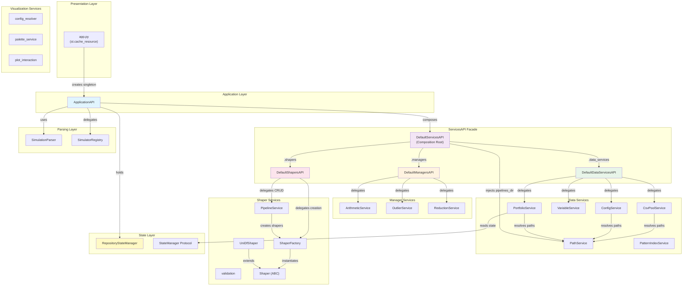

# Step 03 -- Core Services API Analysis

## 1. Executive Summary

The RING-5 Core Services API constitutes the business-logic tier of the application, sitting between the presentation layer (Streamlit web UI) and the state/persistence layer. It is organized around a **three-tier facade pattern**: `ApplicationAPI` (the public entry point for the UI) composes a `ServicesAPI` facade which itself composes three domain-aligned sub-APIs -- `ManagersAPI`, `DataServicesAPI`, and `ShapersAPI`. In addition, a standalone `visualization` sub-package provides config resolution, palette lookup, and plot-interaction logic as pure-function services.

**Key architectural patterns:**

- **Facade + Composition Root**: `DefaultServicesAPI` is the composition root that wires all sub-APIs together, injecting cross-module dependencies via constructor injection.
- **Protocol-first design**: Every sub-API is defined as a `@runtime_checkable` `Protocol`, enabling testability and future alternative implementations.
- **Stateless services**: Individual services (`ArithmeticService`, `OutlierService`, `ReductionService`, etc.) expose only `@staticmethod` or `@classmethod` methods -- no instance state.
- **Singleton instantiation**: `ApplicationAPI` is instantiated once via `@st.cache_resource` in `app.py` and stored in `st.session_state.api`.

**File count**: 42 Python files under `src/core/services/`, organized into 4 sub-packages (`managers/`, `data_services/`, `shapers/`, `visualization/`) plus top-level service files.

---

## 2. ApplicationAPI -- The Public Facade

**File**: `src/core/application_api.py` (429 lines)

### 2.1 Constructor

```python
class ApplicationAPI:
    def __init__(
        self,
        plot_deserializer: PlotDeserializer | None = None,
        parser: SimulationParser | None = None,
    ) -> None:
```

**Initialization sequence:**

1. Creates `RepositoryStateManager(plot_deserializer=plot_deserializer)` -- the single source of truth for application state.
2. Creates `DefaultServicesAPI(self.state_manager)` -- the unified services facade.
3. Sets parser backend: `parser or SimulatorRegistry.get_parser("gem5")` (lazy gem5 default).

### 2.2 Singleton Instantiation via Streamlit

In `app.py` (lines 54-58):

```python
@st.cache_resource(show_spinner="Initializing RING-5...")
def get_api() -> ApplicationAPI:
    return ApplicationAPI(plot_deserializer=BasePlot.from_dict)

api = get_api()
st.session_state.api = api
```

The `@st.cache_resource` decorator ensures:
- Exactly one `ApplicationAPI` instance exists per Streamlit server process.
- The instance survives across reruns (page navigations, widget interactions).
- The `state_manager` and all services share the same lifecycle.
- `BasePlot.from_dict` is injected as the plot deserializer, keeping the core layer free of web-layer imports.

### 2.3 Sub-API Property Accessors

| Property | Return Type | Delegates To |
|---|---|---|
| `api.managers` | `ManagersAPI` | `self._services.managers` |
| `api.data_services` | `DataServicesAPI` | `self._services.data_services` |
| `api.shapers` | `ShapersAPI` | `self._services.shapers` |

These expose the sub-APIs for direct use by UI components, enabling calls like `api.managers.remove_outliers(df, col, groups)`.

### 2.4 Complete Public Method Catalog

#### Data Loading & Session

| Method | Signature | Delegates To | Description |
|---|---|---|---|
| `load_data` | `(csv_path: str) -> None` | `data_services.load_csv_file` + `state_manager.set_data` | Orchestrates load + persistence |
| `load_from_pool` | `(csv_path: str) -> None` | `self.load_data(csv_path)` | Convenience alias for pool loading |
| `get_current_view` | `() -> dict[str, Any]` | `state_manager.get_data/processed/config` | Assembles pipeline state dict |
| `reset_session` | `() -> None` | `state_manager.clear_data/clear_all` | Full session reset |
| `load_csv_file` | `(file_path: str) -> pd.DataFrame` | `data_services.load_csv_file` | Direct CSV load returning DataFrame |
| `get_column_info` | `(df: pd.DataFrame | None) -> ColumnInfoResult` | In-line logic | Returns column metadata for UI |

#### Parsing & Scanning

| Method | Signature | Delegates To | Description |
|---|---|---|---|
| `find_stats_files` | `(search_path: str, pattern: str = "stats.txt") -> list[str]` | `Path.rglob` via `normalize_user_path` | Finds stats files in directory |
| `submit_parse_async` | `(stats_path, stats_pattern, variables, output_dir, strategy_type, scanned_vars) -> ParseBatchResult` | `self._parser.submit_parse_async` | Submits async parsing job |
| `finalize_parsing` | `(output_dir, results, strategy_type, var_names) -> str | None` | `self._parser.finalize_parsing` | Finalizes parse results into CSV |
| `submit_scan_async` | `(stats_path, stats_pattern, limit) -> list[Future[...]]` | `self._parser.submit_scan_async` | Submits async scanning job |
| `finalize_scan` | `(results) -> list[ScannedVariable]` | `self._parser.aggregate_scan_results` | Aggregates scan results |
| `get_parse_status` | `() -> str` | Returns `"idle"` | Static status (UI tracks state) |
| `get_scanner_status` | `() -> str` | Returns `"idle"` | Static status (UI tracks state) |

#### Shapers & Pipelines

| Method | Signature | Delegates To | Description |
|---|---|---|---|
| `apply_shapers` | `(data: pd.DataFrame, pipeline_config: list[ShaperStepConfig]) -> pd.DataFrame` | `shapers.process_pipeline` | Executes shaper pipeline |

#### Configuration Management

| Method | Signature | Delegates To | Description |
|---|---|---|---|
| `save_configuration` | `(name, description, shapers_config, csv_path) -> str` | `data_services.save_configuration` | Saves config to disk |
| `load_configuration` | `(config_path: str) -> SavedConfigData` | `data_services.load_configuration` | Loads config from file |
| `load_csv_pool` | `() -> list[CsvPoolEntry]` | `data_services.load_csv_pool` | Lists CSV pool entries |
| `load_saved_configs` | `() -> list[SavedConfigEntry]` | `data_services.load_saved_configs` | Lists saved configs |
| `delete_configuration` | `(config_path: str) -> bool` | `data_services.delete_configuration` | Deletes config file |
| `add_to_csv_pool` | `(file_path: str) -> str` | `data_services.add_to_csv_pool` | Adds file to CSV pool |
| `delete_from_pool` | `(file_path: str) -> bool` | `data_services.delete_from_csv_pool` | Deletes from CSV pool |
| `delete_from_csv_pool` | `(file_path: str) -> bool` | `self.delete_from_pool` | Alias |

#### Visualization Config (State Delegation)

| Method | Signature | Delegates To |
|---|---|---|
| `get_visualization_config` | `(plot_id: int) -> FigureConfig | None` | `state_manager.get_visualization_config` |
| `set_visualization_config` | `(plot_id: int, config: FigureConfig) -> None` | `state_manager.set_visualization_config` |
| `remove_visualization_config` | `(plot_id: int) -> None` | `state_manager.remove_visualization_config` |

#### Previews (State Delegation)

| Method | Signature | Delegates To |
|---|---|---|
| `set_preview` | `(operation_name: str, data: pd.DataFrame) -> None` | `state_manager.set_preview` |
| `get_preview` | `(operation_name: str) -> pd.DataFrame | None` | `state_manager.get_preview` |
| `has_preview` | `(operation_name: str) -> bool` | `state_manager.has_preview` |
| `clear_preview` | `(operation_name: str) -> None` | `state_manager.clear_preview` |

#### History (Dual State Delegation)

| Method | Signature | Delegates To |
|---|---|---|
| `add_manager_history_record` | `(record: OperationRecord) -> None` | `state_manager.add_manager_history_record` + `add_portfolio_history_record` |
| `get_manager_history` | `() -> list[OperationRecord]` | `state_manager.get_manager_history` |
| `get_portfolio_history` | `() -> list[OperationRecord]` | `state_manager.get_portfolio_history` |
| `remove_manager_history_record` | `(record: OperationRecord) -> None` | `state_manager.remove_manager_history_record` + `remove_portfolio_history_record` |

#### Simulator Registry Facades (Static)

| Method | Signature | Delegates To |
|---|---|---|
| `available_simulators` | `() -> list[str]` | `SimulatorRegistry.available_simulators()` |
| `available_simulator_info` | `() -> list[SimulatorInfo]` | `SimulatorRegistry.available_simulator_info()` |
| `get_simulator_info` | `(name: str) -> SimulatorInfo` | `SimulatorRegistry.get_info(name)` |
| `cancel_pending_scans` | `() -> None` | `ScanWorkPool.get_instance().cancel_all()` |

### 2.5 Total Method Count

**35 public methods** on `ApplicationAPI`, organized into 8 functional groups. The class acts as a pure orchestrator: it performs no computation of its own (except `get_column_info` and `find_stats_files`) and delegates everything to either `_services` or `state_manager`.

---

## 3. ServicesAPI -- The Unified Services Facade

### 3.1 Protocol Definition

**File**: `src/core/services/services_api.py`

```python
@runtime_checkable
class ServicesAPI(Protocol):
    @property
    def managers(self) -> ManagersAPI: ...
    @property
    def data_services(self) -> DataServicesAPI: ...
    @property
    def shapers(self) -> ShapersAPI: ...
```

Three properties, zero methods. The facade is purely structural -- it groups the three sub-APIs behind a single entry point.

### 3.2 Default Implementation

**File**: `src/core/services/services_impl.py`

```python
class DefaultServicesAPI:
    def __init__(self, state_manager: StateManager) -> None:
        self._managers = DefaultManagersAPI()
        self._data_services = DefaultDataServicesAPI(state_manager)
        self._shapers = DefaultShapersAPI(PathService.get_pipelines_dir())
```

**Dependency injection at composition root:**

- `DefaultManagersAPI()` -- no dependencies (stateless).
- `DefaultDataServicesAPI(state_manager)` -- receives `StateManager` for portfolio serialization.
- `DefaultShapersAPI(PathService.get_pipelines_dir())` -- receives pipelines directory from `PathService`.

The cross-module dependency (`ShapersAPI` needs `PathService` from `data_services`) is resolved here at the composition root rather than through direct imports between sub-packages.

---

## 4. ManagersAPI -- Data Transformation Services

### 4.1 Protocol

**File**: `src/core/services/managers/managers_api.py`

8 methods across 3 domains:

| Domain | Methods | Description |
|---|---|---|
| **Arithmetic** | `list_operators`, `apply_operation`, `apply_mixer`, `validate_merge_inputs` | Column math + multi-merge |
| **Outlier Removal** | `remove_outliers`, `validate_outlier_inputs` | IQR-based outlier detection |
| **Seeds Reduction** | `reduce_seeds`, `validate_seeds_reducer_inputs` | Multi-seed aggregation |

### 4.2 ArithmeticService

**File**: `src/core/services/managers/arithmetic_service.py` (172 lines)

All methods are `@staticmethod`. No instance state.

**Supported operators** (from `list_operators()`):
1. `Division` (aliases: `divide`, `/`)
2. `Sum` (aliases: `add`, `+`)
3. `Subtraction` (aliases: `subtract`, `minus`, `-`)
4. `Multiplication` (aliases: `multiply`, `*`)

**`apply_operation(df, operation, src1, src2, dest) -> pd.DataFrame`**:
- Creates a copy of the input DataFrame.
- Applies the binary operation between columns `src1` and `src2`.
- Division replaces zero denominators with `np.nan` to avoid `ZeroDivisionError`.
- Result stored in column `dest`.
- Raises `ValueError` for unknown operations.

**`apply_mixer(df, dest_col, source_cols, operation, separator) -> pd.DataFrame`**:
- Merges multiple columns into a single destination column.
- Supported operations: `Sum`, `Mean` / `Mean (Average)`, `Concatenate`.
- **SD propagation**: Automatically detects `{col}.sd` or `{col}_stdev` columns and propagates standard deviation:
  - For `Sum`: `new_sd = sqrt(sum(sd_i^2))`
  - For `Mean`: `new_sd = sqrt(sum(sd_i^2)) / n`
- This is scientifically critical for maintaining statistical validity across derived metrics.

**`validate_merge_inputs(df, columns, operation, new_column_name) -> list[str]`**:
- Returns list of error strings (empty = valid).
- Validates: at least 2 columns, columns exist in DataFrame, valid operation, non-empty and non-duplicate column name.

### 4.3 OutlierService

**File**: `src/core/services/managers/outlier_service.py` (74 lines)

**`remove_outliers(df, outlier_col, group_by_cols, multiplier=1.5) -> pd.DataFrame`**:
- Uses IQR (Interquartile Range) method: values outside `[Q1 - m*IQR, Q3 + m*IQR]` are removed.
- Default multiplier `1.5` identifies mild outliers (standard statistical practice).
- Supports two modes:
  - **Global** (empty `group_by_cols`): computes IQR across entire column.
  - **Grouped**: computes IQR per group via `df.groupby(group_by_cols)[outlier_col].transform(...)`.
- Returns empty DataFrame unchanged; missing column returns DataFrame as-is.

**`validate_outlier_inputs(df, outlier_col, group_by_cols) -> list[str]`**:
- Validates: column exists, column is numeric, group columns exist.

### 4.4 ReductionService

**File**: `src/core/services/managers/reduction_service.py` (58 lines)

**`reduce_seeds(df, categorical_cols, statistic_cols) -> pd.DataFrame`**:
- Groups by `categorical_cols`, computes `mean()` and `std()` for `statistic_cols`.
- Standard deviation columns are renamed with `.sd` suffix (e.g., `ipc` -> `ipc.sd`).
- Merges mean and std DataFrames on categorical columns.
- Column ordering: categorical columns first, then interleaved value/sd columns.

**`validate_seeds_reducer_inputs(df, categorical_cols, statistic_cols) -> list[str]`**:
- Validates: at least one categorical column, at least one statistic column, all columns exist, statistic columns are numeric.

---

## 5. DataServicesAPI -- Data Storage & Domain Entities

### 5.1 Protocol

**File**: `src/core/services/data_services/data_services_api.py`

29 methods across 5 domains:

| Domain | Methods | Description |
|---|---|---|
| **CSV Pool** (4) | `load_csv_pool`, `add_to_csv_pool`, `delete_from_csv_pool`, `load_csv_file` | File pool management |
| **Configuration** (4) | `save_configuration`, `load_configuration`, `load_saved_configs`, `delete_configuration` | Config persistence |
| **Cache** (2) | `get_cache_stats`, `clear_caches` | Cache monitoring |
| **Variables** (15) | `generate_variable_id`, `add_variable`, `update_variable`, `delete_variable`, `ensure_variable_ids`, `filter_internal_stats`, `find_variable_by_name`, `aggregate_discovered_entries`, `aggregate_distribution_range`, `parse_comma_separated_entries`, `format_entries_as_string`, `find_entries_for_variable`, `update_scanned_entries`, `has_variable_with_name`, `build_statistics_list` | Parser variable CRUD |
| **Portfolios** (4) | `list_portfolios`, `save_portfolio`, `load_portfolio`, `delete_portfolio` | Workspace snapshots |

### 5.2 CsvPoolService

**File**: `src/core/services/data_services/csv_pool_service.py` (320 lines)

**Architecture**: Class-level caches (thread-safe via `threading.Lock`), all methods are `@staticmethod`.

**Caching strategy (Cache-Aside pattern):**

| Cache | Type | Max Size | TTL | Purpose |
|---|---|---|---|---|
| `_metadata_cache` | `SimpleCache` | 100 entries | 10 min | Column names, row counts, dtypes |
| `_dataframe_cache` | `SimpleCache` | 10 entries | 5 min | Parsed DataFrame LRU |
| `_pool_index` | `dict` | unbounded | -- | Filename-to-entry O(1) lookup |

**Cache key computation**: MD5 hash of `"{file_path}_{mtime}"` (first 16 chars). This ensures cache invalidation when files are modified.

**Key methods:**

- **`load_pool() -> list[CsvPoolEntry]`**: Scans `{root}/.ring5/csv_pool/*.csv`, sorted by modification time (newest first). Enriches each entry with cached metadata.
- **`add_to_pool(csv_path: str) -> str`**: Copies file to pool with timestamp prefix `parsed_YYYYMMDD_HHMMSS.csv`. Uses `shutil.copy` for atomic copy.
- **`load_csv_file(csv_path: str) -> pd.DataFrame`**: Validates path (non-empty, exists, not directory), checks DataFrame cache, falls back to `pd.read_csv(sep=None, engine="python")` for automatic separator detection. Populates both DataFrame and metadata caches.
- **`delete_from_pool(csv_path: str) -> bool`**: Validates path is within pool directory before unlinking. Returns `False` on failure (graceful degradation).

**Security**: All file operations use `validate_path_within()` to prevent path traversal attacks.

### 5.3 ConfigService

**File**: `src/core/services/data_services/config_service.py` (144 lines)

Manages JSON configuration files in `{root}/.ring5/saved_configs/`.

**Key methods:**

- **`save_configuration(name, description, shapers_config, csv_path) -> str`**: Serializes to JSON with timestamp-based filename `{safe_name}_{timestamp}.json`. Returns saved path.
- **`load_configuration(config_path) -> SavedConfigData`**: Loads and returns parsed JSON. Path validated within config directory.
- **`load_saved_configs() -> list[SavedConfigEntry]`**: Lists all `.json` files sorted by mtime (newest first), extracting `name`, `path`, `modified`, `description`.
- **`delete_configuration(config_path) -> bool`**: Validates path, unlinks file. Returns `False` on failure.

### 5.4 VariableService

**File**: `src/core/services/data_services/variable_service.py` (542 lines)

The largest service by line count. Manages parser variable configurations (CRUD operations for scalar, vector, distribution, histogram, and configuration variable types).

**ReDoS protection**: All regex operations go through `_compile_safe_pattern()` which:
1. Rejects patterns longer than 500 characters.
2. Validates against a character allowlist: `[a-zA-Z0-9_.\\+\[\]{}()|^$*?]`.
3. Returns `None` if compilation fails, triggering fallback to exact-match.

**Internal stats filtering**: Default exclusion set:
```python
DEFAULT_INTERNAL_STATS = frozenset({
    "total", "mean", "gmean", "stdev", "samples", "overflows", "underflows"
})
```

**Key methods and signatures:**

| Method | Signature | Description |
|---|---|---|
| `generate_variable_id` | `() -> str` | UUID4 generation |
| `add_variable` | `(variables, var_config) -> list` | Appends with auto-generated `_id` |
| `update_variable` | `(variables, index, var_config) -> list` | Replace at index (raises `IndexError`) |
| `delete_variable` | `(variables, index) -> list` | Remove at index (raises `IndexError`) |
| `ensure_variable_ids` | `(variables) -> list` | Fills missing `_id` fields |
| `filter_internal_stats` | `(entries, internal_stats=None) -> list` | Removes sim meta-statistics, sorts |
| `find_variable_by_name` | `(variables, name, exact=True) -> config | None` | Exact or regex match |
| `aggregate_discovered_entries` | `(snapshot, var_name) -> list` | Union of entries across scanned files |
| `aggregate_distribution_range` | `(snapshot, var_name) -> tuple` | Global min/max across scanned files |
| `find_entries_for_variable` | `(available_variables, var_name) -> list` | Entry search with regex support |
| `update_scanned_entries` | `(scanned_vars, var_name, new_entries) -> list` | Immutable update of scanned var entries |
| `has_variable_with_name` | `(variables, name) -> bool` | Name existence check |
| `build_statistics_list` | `(selected: dict) -> list` | Filters boolean map to selected names |
| `parse_comma_separated_entries` | `(entries_str) -> list` | String splitting utility |
| `format_entries_as_string` | `(entries) -> str` | Join with `", "` |

All operations are **immutable** -- they return new lists rather than mutating inputs.

### 5.5 PortfolioService

**File**: `src/core/services/data_services/portfolio_service.py` (199 lines)

Manages complete workspace snapshots (Memento pattern). Unlike other services, `PortfolioService` is **stateful** -- it holds a reference to `StateManager` for accessing parser state during serialization.

**Portfolio schema (V2):**
```json
{
    "schema_version": 2,
    "version": "2.0",
    "timestamp": "ISO-8601",
    "data_csv": "CSV string",
    "csv_path": "original/path.csv",
    "plots": [{"config": {}, "figure_spec": {}, ...}],
    "plot_counter": 5,
    "config": {},
    "parse_variables": [],
    "stats_path": "...",
    "stats_pattern": "...",
    "scanned_variables": [],
    "manager_history": [],
    "portfolio_history": []
}
```

**Figure spec enrichment**: `save_portfolio` accepts an optional `figure_spec_enricher` callback from the presentation layer. This callback converts plot config dicts into `FigureConfig` dicts without the core layer importing web-layer classes.

**Migration**: `load_portfolio` runs `PortfolioMigrator.migrate(raw)` to handle backward compatibility. V1-to-V2 migration:
- Adds `config["engine"] = "plotly"` as default for each plot.
- Removes all `export_*` keys from plot configs (superseded by V2 download section).
- Uses `deepcopy` for safety.

### 5.6 PathService

**File**: `src/core/services/data_services/path_service.py` (58 lines)

Centralized file-system navigation. All methods are `@staticmethod` with lazy-initialized class-level path caches.

| Method | Returns | Path |
|---|---|---|
| `get_root_dir()` | `Path` | Project root (5 parents up from this file) |
| `get_data_dir()` | `Path` | `{root}/.ring5/` |
| `get_pipelines_dir()` | `Path` | `{root}/.ring5/pipelines/` |
| `get_portfolios_dir()` | `Path` | `{root}/.ring5/portfolios/` |

All directories are created with `mkdir(parents=True, exist_ok=True)` on first access.

### 5.7 PatternIndexService

**File**: `src/core/services/data_services/pattern_index_service.py` (269 lines)

Handles regex pattern variables (e.g., `system.ruby.l\d+_cntrl\d+.stat`) that match multiple hardware components.

**Key methods:**

| Method | Description |
|---|---|
| `is_pattern_variable(var_name)` | Checks if `\d+` is in the name |
| `extract_index_positions(var_name)` | Extracts position labels (e.g., `["l", "cntrl"]`) |
| `parse_entry_indices(entries)` | Maps position index to set of unique values |
| `filter_entries(entries, selections)` | Filters entries by position-value selections |
| `format_entry_display(entry, positions)` | Formats `"0_1"` as `"l{0}_cntrl{1}"` |
| `reconstruct_concrete_name(pattern, id)` | Inverse: `"system.cpu\d+.ipc"` + `"3"` -> `"system.cpu3.ipc"` |

Uses string splitting (not regex) for index extraction to avoid ReDoS on user input.

---

## 6. ShapersAPI -- Pipeline & Transformation Services

### 6.1 Protocol

**File**: `src/core/services/shapers/shapers_api.py`

7 methods:

| Method | Description |
|---|---|
| `list_pipelines()` | Lists saved pipeline names |
| `save_pipeline(name, config, description)` | Saves pipeline to JSON |
| `load_pipeline(name)` | Loads pipeline by name |
| `delete_pipeline(name)` | Deletes pipeline JSON |
| `process_pipeline(data, config)` | Executes shaper chain |
| `create_shaper(shaper_type, params)` | Factory method for single shaper |
| `get_available_shaper_types()` | Lists registered shaper types |

### 6.2 PipelineService

**File**: `src/core/services/shapers/pipeline_service.py` (214 lines)

**Instance methods** (require `pipelines_dir` from constructor):
- `list_pipelines()`: Scans `*.json` in pipelines directory, returns stem names.
- `save_pipeline(name, config, description)`: Validates non-empty name, sanitizes filename, writes JSON with timestamp.
- `load_pipeline(name)`: Loads JSON with path validation.
- `delete_pipeline(name)`: Unlinks JSON file if exists.

**Static methods:**
- `process_pipeline(data, pipeline_config)`: Core execution engine. Iterates over `pipeline_config` list, creating shapers via `ShaperFactory.create_shaper()` and applying them via `DataFrame.pipe()`. Includes per-shaper and total perf timing via `time.perf_counter()`. Errors wrapped as `ValueError(f"Failed to apply shaper {type}: {e}")`.
- `prepare_loaded_pipeline(pipeline_data)`: Deep-copies steps and computes next pipeline counter based on max step ID. Returns `(steps, next_counter)` tuple.

**Pipeline execution flow:**
```
for each step in pipeline_config:
    1. Extract shaper_type from step["type"]
    2. ShaperFactory.create_shaper(shaper_type, step)
    3. current_data = current_data.pipe(shaper)
    4. Log timing: "PERF: Shaper {i} ({type}) took {time}s"
```

No initial DataFrame copy is made -- each shaper is expected to create its own copy internally.

### 6.3 ShaperFactory

**File**: `src/core/services/shapers/factory.py` (141 lines)

**Factory pattern** with class-level registry. 10 registered shaper types:

| Registry Key | Class | Display Name |
|---|---|---|
| `mean` | `Mean` | Mean Calculator |
| `columnSelector` | `ColumnSelector` | Column Selector |
| `conditionSelector` | `ConditionSelector` | Filter |
| `itemSelector` | `ItemSelector` | Item Selector |
| `normalize` | `Normalize` | Normalize |
| `pivotLonger` | `PivotLonger` | Pivot Longer (Melt) |
| `pivotWider` | `PivotWider` | Pivot Wider |
| `sort` | `Sort` | Sort |
| `splitApply` | `SplitApply` | Split-Apply (Per-Axis) |
| `transformer` | `Transformer` | Transformer |

**Key methods:**

| Method | Description |
|---|---|
| `register(shaper_type, shaper_class)` | Runtime registration (Open/Closed Principle) |
| `get_available_types()` | Returns list of registry keys |
| `get_display_name_map()` | Returns `{display_name: type_id}` mapping for UI dropdowns |
| `get_display_name(shaper_type)` | Returns display name for a type |
| `create_shaper(shaper_type, params)` | Creates instance; raises `ValueError` if type unknown |

### 6.4 Shaper Base Classes

**File**: `src/core/services/shapers/shaper.py` (92 lines)

```python
class Shaper(ABC):
    def __init__(self, params: dict[str, Any]) -> None:
        if not isinstance(params, dict):
            raise ValueError("Shaper parameters must be a dictionary.")
        self.params = params
        self._verify_params()

    @abstractmethod
    def _verify_params(self) -> bool: ...

    def _verify_preconditions(self, data_frame: pd.DataFrame) -> bool:
        # Rejects None and empty DataFrames

    def __call__(self, data_frame: pd.DataFrame) -> pd.DataFrame:
        self._verify_preconditions(data_frame)
        return data_frame
```

**`UniDfShaper`** (file: `src/core/services/shapers/uni_df_shaper.py`, 41 lines):

Extends `Shaper` with additional type check: raises `ValueError` if input is not a `pd.DataFrame`. All concrete shaper implementations extend either `Shaper` or `UniDfShaper`.

### 6.5 Shaper Validation

**File**: `src/core/services/shapers/validation.py` (75 lines)

Pre-flight validation before shaper construction. Contains required-params registry:

```python
_REQUIRED_PARAMS = {
    "mean":              ["groupingColumns", "meanVars"],
    "normalize":         ["normalizeVars", "normalizerColumn", "normalizerValue", "groupBy"],
    "pivotLonger":       ["id_vars", "value_vars", "var_name", "value_name"],
    "pivotWider":        ["index", "columns", "values"],
    "sort":              ["order_dict"],
    "splitApply":        ["joinColumns", "groups"],
    "columnSelector":    ["columns"],
    "conditionSelector": ["column"],
    "transformer":       ["column"],
    "itemSelector":      ["column", "strings"],
}
```

**`validate_shaper_config(shaper_type, config) -> tuple[bool, list[str] | None]`**:
- Returns `(True, None)` if all required params present and non-empty.
- Returns `(False, missing_fields)` listing missing/empty fields.
- Empty strings and empty lists are treated as "missing".

**`get_required_params(shaper_type) -> list[str]`**:
- Returns list of required parameter names, empty list for unknown types.

---

## 7. Visualization Services

### 7.1 Package Structure

**File**: `src/core/services/visualization/__init__.py`

Re-exports:
- `resolve_config` (from `config_resolver`)
- `resolve_palette`, `get_palette_names`, `is_colorblind_safe` (from `palette_service`)
- `try_float`, `try_float_edit`, `update_config_from_relayout`, `resolve_item_order` (from `plot_interaction`)

### 7.2 Config Resolver -- Sentinel Resolution Algorithm

**File**: `src/core/services/visualization/config_resolver.py` (185 lines)

**Sentinel values**: `-1` (int) or `-1.0` (float) means "inherit from parent". This module resolves all sentinels in ONE pass so downstream connectors never see `-1`.

**Entry point**: `resolve_config(spec: FigureConfig) -> FigureConfig`

- **Pure function**: returns deep copy, never mutates input.
- Calls three internal resolvers: `_resolve_typography()`, `_resolve_legends()`, `_resolve_axes()`.

#### Typography Inheritance Chain

```
font_size_base
|-- font_size_title
|-- font_size_xlabel
|-- font_size_ylabel
|   +-- font_size_y2label   (inherits from ylabel)
|-- font_size_ticks
|   |-- font_size_yticks     (inherits from ticks)
|   +-- font_size_y2ticks    (inherits from yticks)
|-- font_size_annotations
+-- font_size_legend
    |-- font_size_legend2    (inherits from legend)
    +-- font_size_legend3    (inherits from legend)
        |-- legend3_number_fontsize  (inherits from legend3)
        +-- legend3_text_fontsize    (inherits from legend3)
```

Resolution is done in dependency order:
1. `font_size_y2label <- font_size_ylabel`
2. `font_size_yticks <- font_size_ticks`
3. `font_size_y2ticks <- font_size_yticks` (uses already-resolved yticks)
4. `font_size_legend2 <- font_size_legend`
5. `font_size_legend3 <- font_size_legend`
6. `legend3_number_fontsize <- font_size_legend3`
7. `legend3_text_fontsize <- font_size_legend3`

#### Legend Inheritance

Secondary and tertiary legends inherit from primary (index 0):
- `font_size` -> primary's `font_size` (where -1)
- `title_font_size` -> own `font_size` (where -1)
- `number_fontsize` -> own `font_size` (where -1)
- `text_fontsize` -> own `font_size` (where -1)
- All `LegendSpacingConfig` fields: iterate dataclass `fields()`, replace `-1.0` with parent value.

Primary legend also resolves its own `title_font_size`, `number_fontsize`, `text_fontsize` relative to its `font_size`.

#### Axes Inheritance

Y2 axis inherits from Y axis:
- `y2.label_pad <- y.label_pad` (where -1.0)
- `y2.tick_pad <- y.tick_pad` (where -1.0)

Only applies when `axes.y2 is not None`.

### 7.3 Palette Service

**File**: `src/core/services/visualization/palette_service.py` (78 lines)

Logic layer for palette operations. Data resides in `src/core/models/visualization/palettes.py`.

#### All Registered Palettes (18 total)

**Colorblind-safe palettes (5)** -- listed first in `get_palette_names()`:

| Name | Colors | Source |
|---|---|---|
| `wong` | 8 | Wong (2011) Nature Methods |
| `okabe_ito` | 8 | Okabe-Ito colorblind-safe |
| `tol_bright` | 7 | Paul Tol's bright scheme |
| `viridis_8` | 8 | Viridis (8-color discrete) |
| `seaborn_cb` | 8 | Seaborn colorblind palette |

**Plotly qualitative palettes (13)** -- sorted alphabetically:

| Name | Colors | Description |
|---|---|---|
| `Alphabet` | 26 | Large categorical palette |
| `Bold` | 11 | CartoDB Bold |
| `D3` | 10 | D3.js category10 |
| `Dark24` | 24 | Large dark palette |
| `G10` | 10 | Google charts palette |
| `Light24` | 24 | Large light palette |
| `Pastel` | 11 | CartoDB Pastel |
| `Plotly` | 10 | Plotly default |
| `Safe` | 11 | CartoDB Safe |
| `Set1` | 9 | ColorBrewer Set1 |
| `Set2` | 8 | ColorBrewer Set2 |
| `Set3` | 12 | ColorBrewer Set3 |
| `T10` | 10 | Tableau 10 |
| `Vivid` | 11 | CartoDB Vivid |

**Registry construction**: `PALETTE_REGISTRY = {**_COLORBLIND_PALETTES, **_PLOTLY_PALETTES}` (dictionary merge, colorblind-safe keys take precedence).

**Palette ordering**: `_PALETTE_ORDER = list(colorblind.keys()) + sorted(plotly.keys())` -- colorblind-safe first, then Plotly alphabetical.

**Service functions:**

| Function | Signature | Behavior |
|---|---|---|
| `resolve_palette(name)` | `(object) -> list[str]` | Exact match -> case-insensitive -> fallback to `"wong"`. Returns copy. |
| `get_palette_names()` | `() -> list[str]` | Returns ordered names (colorblind-safe first) |
| `is_colorblind_safe(name)` | `(str) -> bool` | Membership check against `_COLORBLIND_PALETTES` |

The fallback palette is always `"wong"` (Wong 2011 Nature Methods colorblind-safe palette).

### 7.4 Plot Interaction Service

**File**: `src/core/services/visualization/plot_interaction.py` (261 lines)

Pure functions for handling interactive plot state changes (no UI dependencies).

**`update_config_from_relayout(config, relayout_data) -> tuple[dict, bool]`**:

Processes Plotly client-side relayout events. Handles:
1. **Zoom/pan**: `xaxis.range[0]`, `xaxis.range[1]` -> `range_x` list; same for y-axis.
2. **Reset zoom**: `xaxis.autorange` / `yaxis.autorange` -> sets `range_x`/`range_y` to `None`.
3. **Legend drag**: `legend.x`, `legend.y`, `legend2.x`, etc. -> `legend_x`, `legend2_x`, etc. Also auto-sets `xanchor="left"`, `yanchor="top"` when position changes.
4. **Legend title edit**: `legend.title.text` -> `legend_title`.

Change detection uses `math.isclose(rel_tol=1e-9)` for float comparison to avoid unnecessary reruns from floating-point noise.

**`resolve_item_order(items, default_order, current_order) -> list[str]`**:

Synchronizes display ordering for reorderable lists:
- No existing order: use `default_order` if provided, else natural order.
- Items unchanged: return `current_order` as-is.
- Items changed: preserve existing order for common items, append new items at end; remove absent items.

**Utility functions:**
- `try_float(value: str)` -- float conversion with string fallback.
- `try_float_edit(value: Any)` -- broader type handling (handles None, int, etc.).

---

## 8. Config Validation Service

**File**: `src/core/services/config_validation_service.py` (378 lines)

Two classes for JSON-based pipeline configuration management:

### 8.1 ConfigValidator

- Validates RING-5 configuration files against a JSON schema (`pipeline_schema.json`).
- Uses `jsonschema.Draft7Validator`.
- Schema path validated within `src/core/models/config/schemas/` directory.
- Methods: `validate(config) -> bool`, `validate_file(config_path) -> bool`, `get_errors(config) -> list[str]`.

### 8.2 ConfigTemplateGenerator

Generates configuration templates with guided prompts. Contains reference dictionaries:

**Supported plot types:**
```python
"bar", "line", "heatmap", "grouped_bar", "stacked_bar", "box", "violin", "scatter"
```

**Aggregate methods:**
```python
"mean", "median", "sum", "geomean"
```

**Themes:**
```python
"default", "whitegrid", "darkgrid", "white", "dark", "ticks"
```

Methods: `create_minimal_config()`, `create_plot_config()`, `add_variable()`, `enable_seeds_reducer()`, `enable_outlier_removal()`, `enable_normalizer()`, `save_config()`.

Also provides a module-level convenience function:
- `create_simple_bar_plot_config(output_path, stats_path, x_var, y_var, hue_var=None) -> RingConfig`

---

## 9. Portfolio Migrator

**File**: `src/core/services/portfolio_migrator.py` (72 lines)

Schema version migration for backward compatibility.

| Version | Changes |
|---|---|
| V1 (original) | Flat config dicts, `export_*` keys for LaTeX |
| V2 (current) | `engine` field per plot, no `export_*` keys |

`PortfolioMigrator.migrate(raw)` -- idempotent migration:
1. Reads `schema_version` (defaults to 1 if absent).
2. If `< 2`: runs `_migrate_v1_to_v2()` (deep copy, add engine defaults, remove export keys).
3. Sets `schema_version = CURRENT_VERSION (2)`.

---

## 10. Service Dependency Graph



---

## 11. Error Handling Patterns Per Service

### 11.1 ApplicationAPI

| Pattern | Example |
|---|---|
| **Try-catch + re-raise** | `load_data()`: catches Exception, logs error, re-raises |
| **Graceful empty return** | `find_stats_files()`: returns `[]` if path doesn't exist |
| **Static status** | `get_parse_status()`, `get_scanner_status()`: always return `"idle"` |
| **Null safety** | `get_column_info(None)`: returns zero-count `ColumnInfoResult` |

### 11.2 Manager Services

| Service | Pattern |
|---|---|
| **ArithmeticService** | Raises `ValueError` for unknown operations. Division by zero -> `NaN` (via `s2.replace(0, np.nan)`). |
| **OutlierService** | Early return for empty DataFrame or missing column. Validates numeric dtype. |
| **ReductionService** | Early return for empty DataFrame. Returns error list from validation. |

All validation methods return `list[str]` error lists (empty = valid). Computation methods trust pre-validated inputs.

### 11.3 Data Services

| Service | Pattern |
|---|---|
| **CsvPoolService** | `FileNotFoundError` / `IsADirectoryError` / `ValueError` for load. `False` return + warning log for delete failures. `None` return for metadata read failures. |
| **ConfigService** | `OSError` catch for delete (returns `False`). `json.JSONDecodeError` catch for corrupt configs (skipped with debug log). |
| **VariableService** | `IndexError` for out-of-bounds CRUD. Safe regex compilation returns `None` for invalid patterns. |
| **PortfolioService** | `ValueError` for empty name. `FileNotFoundError` for missing portfolio. Silent fallback in `figure_spec_enricher` callback (logs debug, continues without spec). |
| **PathService** | No error handling needed -- `mkdir(parents=True, exist_ok=True)` is always safe. |

### 11.4 Shaper Services

| Service | Pattern |
|---|---|
| **ShaperFactory** | `ValueError` with available-types listing for unknown shaper type. |
| **PipelineService** | `ValueError` for empty pipeline name. `FileNotFoundError` for missing pipeline. Process pipeline wraps per-shaper errors as `ValueError(f"Failed to apply shaper {type}: {e}")`. |
| **Shaper base** | `ValueError` for non-dict params, None params, None DataFrame, empty DataFrame. |
| **UniDfShaper** | `ValueError` if input is not `pd.DataFrame` instance. |
| **validation.py** | Returns `(False, missing_fields)` tuple -- never raises. |

### 11.5 Visualization Services

| Service | Pattern |
|---|---|
| **config_resolver** | Pure functions -- no error handling needed. Operates on deep copy. |
| **palette_service** | Fallback to `"wong"` palette for any invalid/missing/None input. Never raises. |
| **plot_interaction** | Returns `(config, False)` for empty relayout data. `math.isclose` with try/except for non-numeric values. |

---

## 12. Security Measures

### 12.1 Path Traversal Prevention

All file I/O services use `validate_path_within(path, base_dir)` to ensure paths cannot escape their designated directories:
- `CsvPoolService`: validates within `csv_pool/` directory.
- `ConfigService`: validates within `saved_configs/` directory.
- `PipelineService`: validates within `pipelines/` directory.
- `PortfolioService`: validates within `portfolios/` directory.

### 12.2 Filename Sanitization

`sanitize_filename(name)` is applied before constructing file paths in:
- `PipelineService.save_pipeline()`
- `ConfigService.save_configuration()`
- `PortfolioService.save_portfolio()` / `load_portfolio()` / `delete_portfolio()`

### 12.3 ReDoS Protection

`VariableService` uses `_compile_safe_pattern()`:
1. **Length limit**: max 500 characters.
2. **Character allowlist**: `[a-zA-Z0-9_.\\+\[\]{}()|^$*?]`.
3. **Compilation failure handling**: returns `None`, triggering fallback to exact-match.

### 12.4 Input Validation

The glob pattern in `find_stats_files()` is sanitized via `sanitize_glob_pattern(pattern)` before being passed to `Path.rglob()`.

---

## 13. Service Instantiation Flow

```
app.py
  |
  +--[@st.cache_resource]
  |    get_api()
  |      |
  |      +-- ApplicationAPI(plot_deserializer=BasePlot.from_dict)
  |            |
  |            +-- RepositoryStateManager(plot_deserializer)
  |            |
  |            +-- DefaultServicesAPI(state_manager)
  |            |     |
  |            |     +-- DefaultManagersAPI()          [stateless]
  |            |     |     +-- ArithmeticService       [static methods]
  |            |     |     +-- OutlierService           [static methods]
  |            |     |     +-- ReductionService         [static methods]
  |            |     |
  |            |     +-- DefaultDataServicesAPI(state_manager)
  |            |     |     +-- PortfolioService(state_manager)  [stateful]
  |            |     |     +-- CsvPoolService           [static methods, class caches]
  |            |     |     +-- ConfigService            [static methods]
  |            |     |     +-- VariableService           [static/class methods]
  |            |     |
  |            |     +-- DefaultShapersAPI(PathService.get_pipelines_dir())
  |            |           +-- PipelineService(pipelines_dir)  [instance-based]
  |            |           +-- ShaperFactory            [class-level registry]
  |            |
  |            +-- SimulatorRegistry.get_parser("gem5")
  |
  +-- st.session_state.api = api
```

### Lifecycle Notes

- **Singleton scope**: `ApplicationAPI` lives for the entire Streamlit server process (via `@st.cache_resource`).
- **No lazy loading**: All sub-APIs and services are instantiated eagerly during `ApplicationAPI.__init__`.
- **`PortfolioService`** is the only data service that holds a reference to `StateManager`.
- **`CsvPoolService`** maintains class-level caches (`_metadata_cache`, `_dataframe_cache`, `_pool_index`) that persist across all requests.
- **`PathService`** caches directory paths at class level -- first call creates directories, subsequent calls return cached paths.

---

## 14. Cross-Cutting Concerns

### 14.1 Logging

All services use `logging.getLogger(__name__)` for structured logging:
- `ApplicationAPI`: logs initialization and data loading.
- `PipelineService`: logs per-shaper and total timing (`PERF:` prefix).
- `CsvPoolService`: debug logs for metadata read failures.
- `ConfigService`: debug logs for unreadable config files.
- `PortfolioService`: debug logs for figure spec enrichment failures.

### 14.2 Immutability

- **DataFrame operations**: All managers create copies (`df.copy()`) before modification. Shapers follow the same convention (documented in `process_pipeline` comment: "each shaper creates its own copy internally").
- **List operations**: `VariableService` returns new lists (`.copy()` + append/delete). Never mutates input lists.
- **Config resolution**: `resolve_config()` deep-copies the input `FigureConfig`.
- **Portfolio migration**: `_migrate_v1_to_v2()` uses `copy.deepcopy()`.

### 14.3 Performance Instrumentation

`PipelineService.process_pipeline()` includes built-in performance timing:
```
PERF: Shaper 0 (columnSelector) took 0.0012s
PERF: Shaper 1 (normalize) took 0.0034s
PERF: process_pipeline total took 0.0046s for 50000 rows
```

`CsvPoolService` documents expected latencies:
- Metadata cache: `<1ms` (cached), `50-500ms` (disk read)
- DataFrame cache: 10 entries LRU, 5-min TTL

---

## 15. Backward Compatibility Shims

Two files exist as deprecated re-export shims:

1. **`src/core/services/plot_interaction_service.py`**: Re-exports from `visualization.plot_interaction`. Scheduled for removal in Phase 10 (Dead Code Removal).

2. **`src/core/models/visualization/palettes.py`** (bottom): Re-exports `resolve_palette`, `get_palette_names`, `is_colorblind_safe` from the canonical `palette_service` location. Also scheduled for Phase 10 removal.

These shims ensure existing imports continue to work during the ongoing refactoring from models-layer logic to services-layer logic (P2 compliance).

---

## 16. API/Impl Separation Pattern

### 16.1 Architecture

Every sub-API follows the same pattern:

```
{domain}_api.py     -> Protocol (interface definition)
{domain}_impl.py    -> DefaultXxxAPI (concrete implementation)
individual_service.py -> Service class (actual business logic)
```

### 16.2 Swappability

Since all APIs are `@runtime_checkable` Protocols:
- **Alternative implementations** can be created without modifying existing code.
- **Test doubles** can be constructed by implementing the Protocol.
- **The composition root** (`DefaultServicesAPI.__init__`) is the only place where concrete types are bound to abstractions.

### 16.3 Current Implementations

| Protocol | Implementation | Notes |
|---|---|---|
| `ServicesAPI` | `DefaultServicesAPI` | Single implementation |
| `ManagersAPI` | `DefaultManagersAPI` | Single implementation, stateless |
| `DataServicesAPI` | `DefaultDataServicesAPI` | Single implementation, stateful (portfolio) |
| `ShapersAPI` | `DefaultShapersAPI` | Single implementation |

No alternative implementations exist in production code, but the protocol pattern enables them without modification.

---

## 17. Summary Statistics

| Metric | Count |
|---|---|
| **Total service files** | 42 Python files under `src/core/services/` |
| **Sub-packages** | 4 (`managers/`, `data_services/`, `shapers/`, `visualization/`) |
| **Protocol definitions** | 4 (`ServicesAPI`, `ManagersAPI`, `DataServicesAPI`, `ShapersAPI`) |
| **ApplicationAPI public methods** | 35 |
| **ManagersAPI methods** | 8 |
| **DataServicesAPI methods** | 29 |
| **ShapersAPI methods** | 7 |
| **Visualization service functions** | 7 |
| **Registered shaper types** | 10 |
| **Registered palettes** | 18 (5 colorblind-safe + 13 Plotly) |
| **Concrete service classes** | 14 |
| **Lines of code (services only)** | ~3,500 |

---

## Downstream Dependencies

This analysis feeds into:
- `DEVELOPER_GUIDE_PLAN.md` -> `core/services-reference.md`, `api-reference/application-api.md`
- `AI_KNOWLEDGE_BASE_PLAN.md` -> `reference/services-catalog.md`
- Step 06 (shaper deep-dive) -- uses shaper service catalog
- Step 18 (data flow) -- needs service interaction map
- Step 19 (extension points) -- needs API/Impl pattern docs
