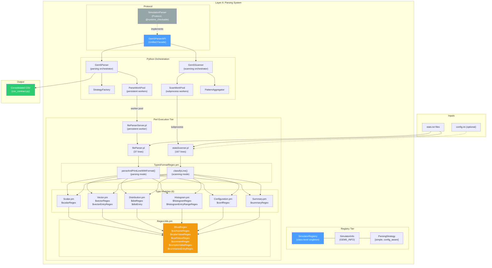

# Step 05 — Parsing System Analysis

## 1. Executive Summary

The RING-5 parsing system is a layered, registry-driven architecture that transforms
raw gem5 simulator output files (`stats.txt`) into structured CSV data consumable by
the core analysis engine. It consists of three conceptual tiers:

1. **Registry tier** (`src/parsing/registry.py`) -- a singleton-style `SimulatorRegistry`
   that maps simulator names to metadata descriptors (`SimulatorInfo`) and lazy-instantiated
   parser factories.
2. **Python orchestration tier** (`src/parsing/gem5/impl/`) -- `Gem5Parser` and `Gem5Scanner`
   classes that coordinate parallel file scanning, regex expansion, strategy selection, and
   worker-pool dispatch.
3. **Perl execution tier** (`src/parsing/gem5/perl/`) -- high-performance Perl scripts
   (`statsScanner.pl`, `fileParser.pl`) that perform the actual line-by-line regex
   classification and value extraction against gem5 stat files.

A formal **CSV contract** (`src/core/models/csv_contract.py`) governs the interchange
format between the parsing layer (Layer A) and the core analysis layer (Layer B),
ensuring that all simulator backends produce identically structured output regardless
of their internal parsing strategy.

The architecture is designed for extensibility: adding a new simulator requires only
implementing the `SimulationParser` protocol and calling `SimulatorRegistry.register()`.

---

## 2. File Inventory

| File | Role |
|------|------|
| `src/parsing/__init__.py` | Public API -- re-exports `ParseService` and `ScannerService` |
| `src/parsing/registry.py` | `SimulatorRegistry`, `SimulatorInfo`, `ParsingStrategy`, `GEM5_INFO` |
| `src/parsing/parser_protocol.py` | `SimulationParser` protocol (structural typing contract) |
| `src/parsing/gem5/__init__.py` | gem5 sub-package docstring |
| `src/parsing/gem5/models.py` | `Gem5ScannedVariable` (extends `ScannedVariable` with min/max) |
| `src/parsing/gem5/impl/gem5_parser_api.py` | `Gem5ParserAPI` -- unified facade implementing `SimulationParser` |
| `src/parsing/gem5/impl/gem5_parser.py` | `Gem5Parser` -- parsing orchestrator (regex expansion, strategy, CSV aggregation) |
| `src/parsing/gem5/impl/gem5_scanner.py` | `Gem5Scanner` -- scanning orchestrator (file discovery, pattern aggregation) |
| `src/parsing/gem5/perl/fileParser.pl` | Perl entry point for per-file stat extraction |
| `src/parsing/gem5/perl/fileParserServer.pl` | Persistent Perl server for worker pool integration |
| `src/parsing/gem5/perl/statsScanner.pl` | Perl entry point for variable discovery (scanning) |
| `src/parsing/gem5/perl/libs/TypesFormatRegex.pm` | Master dispatch module -- `parseAndPrintLineWithFormat`, `classifyLine` |
| `src/parsing/gem5/perl/libs/Scanning/RegexUtils.pm` | Shared regex constants (7 regex patterns) |
| `src/parsing/gem5/perl/libs/Scanning/Type/Scalar.pm` | Scalar line regex |
| `src/parsing/gem5/perl/libs/Scanning/Type/Vector.pm` | Vector line regex |
| `src/parsing/gem5/perl/libs/Scanning/Type/Distribution.pm` | Distribution line regex |
| `src/parsing/gem5/perl/libs/Scanning/Type/Histogram.pm` | Histogram line regex |
| `src/parsing/gem5/perl/libs/Scanning/Type/Configuration.pm` | Configuration line regex |
| `src/parsing/gem5/perl/libs/Scanning/Type/Summary.pm` | Summary line regex |
| `src/core/models/csv_contract.py` | CSV format contract -- constants and `validate_parser_csv()` |

---

## 3. SimulatorRegistry: Registration, Lookup, and Lazy Instantiation

### 3.1 Architecture

`SimulatorRegistry` is a **class-level singleton** pattern using two class-level dictionaries:

```python
# Source: src/parsing/registry.py, lines 73-82
class SimulatorRegistry:
    _registry: dict[str, tuple[SimulatorInfo, Callable[[], SimulationParser]]] = {}
    _instances: dict[str, SimulationParser] = {}
```

- `_registry` stores metadata and factory callables, keyed by simulator name.
- `_instances` caches created parser objects (lazy instantiation).

### 3.2 Registration Flow

Registration couples a `SimulatorInfo` descriptor to a factory callable:

```python
# Source: src/parsing/registry.py, line 232
SimulatorRegistry.register(GEM5_INFO, _create_gem5_parser)
```

The `register()` class method enforces **uniqueness** -- attempting to register the same
name twice raises `ValueError`. This prevents accidental double-registration during
module re-imports:

```python
# Source: src/parsing/registry.py, lines 84-106
@classmethod
def register(cls, info: SimulatorInfo, factory: Callable[[], SimulationParser]) -> None:
    if info.name in cls._registry:
        raise ValueError(
            f"Simulator '{info.name}' is already registered. "
            "Use a unique name for each simulator backend."
        )
    cls._registry[info.name] = (info, factory)
    logger.info(f"Registered simulator: {info.display_name} ({info.name})")
```

### 3.3 Lazy Instantiation

`get_parser(name)` implements the **lazy factory** pattern:

```python
# Source: src/parsing/registry.py, lines 108-134
@classmethod
def get_parser(cls, name: str) -> SimulationParser:
    if name not in cls._registry:
        available = ", ".join(sorted(cls._registry.keys())) or "(none)"
        raise KeyError(f"Unknown simulator '{name}'. Available: {available}")
    if name not in cls._instances:
        _, factory = cls._registry[name]
        cls._instances[name] = factory()
        logger.info(f"Created parser instance for simulator: {name}")
    return cls._instances[name]
```

The factory for gem5 uses a **deferred import** to avoid circular dependencies:

```python
# Source: src/parsing/registry.py, lines 225-229
def _create_gem5_parser() -> SimulationParser:
    from src.parsing.gem5.impl.gem5_parser_api import Gem5ParserAPI
    return Gem5ParserAPI()
```

### 3.4 Query API

| Method | Returns | Purpose |
|--------|---------|---------|
| `get_parser(name)` | `SimulationParser` | Lazy-creates and caches a parser instance |
| `get_info(name)` | `SimulatorInfo` | Returns metadata without instantiation |
| `available_simulators()` | `list[str]` | Sorted list of registered simulator names |
| `available_simulator_info()` | `list[SimulatorInfo]` | All metadata, sorted by name |
| `_reset()` | `None` | Test-only: clears both dictionaries |

### 3.5 Auto-Registration

The gem5 backend self-registers at module load time (line 232 of `registry.py`):

```python
SimulatorRegistry.register(GEM5_INFO, _create_gem5_parser)
```

This means any `import src.parsing.registry` causes gem5 to be available. No manual
wiring is needed. Future simulators would follow the same pattern: define a `SimulatorInfo`,
a factory, and call `register()` at module scope.

---

## 4. GEM5_INFO: The gem5 Descriptor

### 4.1 SimulatorInfo Dataclass

```python
# Source: src/parsing/registry.py, lines 42-71
@dataclass(frozen=True)
class SimulatorInfo:
    name: str
    display_name: str
    description: str = ""
    file_pattern: str = "stats.txt"
    variable_types: list[str] = field(default_factory=list)
    internal_stats: frozenset[str] = field(default_factory=frozenset)
    parsing_strategies: list[ParsingStrategy] = field(default_factory=list)

    def __post_init__(self) -> None:
        if not self.parsing_strategies:
            raise ValueError(f"Simulator '{self.name}' must define at least one parsing strategy.")
```

The `__post_init__` validator ensures every simulator defines at least one parsing strategy.
The dataclass is `frozen=True`, making it immutable after construction.

### 4.2 ParsingStrategy Dataclass

```python
# Source: src/parsing/registry.py, lines 26-39
@dataclass(frozen=True)
class ParsingStrategy:
    name: str           # Unique strategy identifier (e.g., "simple")
    display_name: str   # Human-readable label for UI display
    description: str = ""  # Brief explanation shown as tooltip/help text
```

### 4.3 The 5 Variable Types

The `variable_types` list defines the gem5 stat taxonomy. Each maps to a specific Perl
regex module and parsing behavior:

| # | Type | Perl Module | gem5 Format | Example |
|---|------|-------------|-------------|---------|
| 1 | `scalar` | `Scalar.pm` | `name value # comment` | `system.cpu.ipc 1.523 # IPC` |
| 2 | `vector` | `Vector.pm` | `name::entry value [perc cumm]` | `system.cpu.op_class::IntAlu 1234 50.00% 50.00%` |
| 3 | `distribution` | `Distribution.pm` | `name::bucket value perc cumm` | `system.l2.miss_latency::128 45 12.50% 87.50%` |
| 4 | `histogram` | `Histogram.pm` | `name::lo-hi value perc cumm` | `system.mem.bw_read::0-1024 100 25.00% 25.00%` |
| 5 | `configuration` | `Configuration.pm` | `name=value` | `system.cpu.type=DerivO3CPU` |

Note: There is also a `summary` type handled in `Summary.pm`, but it is treated as a
**meta-type** that drives type evolution (see Section 6.5) rather than a standalone
variable type exposed to the UI.

### 4.4 The 13 Internal Stats

Internal stats are structural metadata emitted by gem5 for complex types. They are
excluded from the UI variable selection to avoid confusing users:

```python
# Source: src/parsing/registry.py, lines 191-207
internal_stats=frozenset({
    "total",          # Sum of all entries in a vector/dist
    "mean",           # Arithmetic mean
    "gmean",          # Geometric mean
    "stdev",          # Standard deviation
    "samples",        # Number of samples collected
    "sample_period",  # Sampling interval
    "min_val",        # Minimum observed value
    "max_val",        # Maximum observed value
    "min_bucket",     # Lowest bucket boundary
    "max_bucket",     # Highest bucket boundary
    "num_buckets",    # Bucket count
    "underflows",     # Values below min bucket
    "overflows",      # Values above max bucket
})
```

These stats appear as `::total`, `::mean`, etc. in the raw gem5 output. The scanner
recognizes them via the `$summariesEntryRegex` pattern but filters them out during
variable selection in the UI layer.

### 4.5 The 2 Parsing Strategies

```python
# Source: src/parsing/registry.py, lines 208-222
parsing_strategies=[
    ParsingStrategy(
        name="simple",
        display_name="Simple (stats.txt only)",
        description="Parse stats.txt files without config metadata.",
    ),
    ParsingStrategy(
        name="config_aware",
        display_name="Config-Aware (Integrates config.ini)",
        description="Config-Aware strategy allows extracting metadata "
                    "from simulation config files.",
    ),
]
```

| Strategy | Name | Description |
|----------|------|-------------|
| **Simple** | `simple` | Parses `stats.txt` files only. No external metadata. Fastest option. |
| **Config-Aware** | `config_aware` | Integrates `config.ini` metadata. Allows extracting simulation configuration parameters as variables. |

The strategy is resolved at parse time via `StrategyFactory.create(strategy_type)`.

---

## 5. SimulationParser Protocol

The system uses Python's structural typing (`Protocol`) to decouple the core from
any specific simulator:

```python
# Source: src/parsing/parser_protocol.py, lines 7-61
@runtime_checkable
class SimulationParser(Protocol):
    def submit_parse_async(
        self, stats_path: str, stats_pattern: str,
        variables: list[StatConfig], output_dir: str,
        strategy_type: str = "simple",
        scanned_vars: list[ScannedVariable] | None = None,
    ) -> ParseBatchResult: ...

    def finalize_parsing(
        self, output_dir: str, results: list[dict[str, Any]],
        strategy_type: str = "simple",
        var_names: list[str] | None = None,
    ) -> str | None: ...

    def submit_scan_async(
        self, stats_path: str, stats_pattern: str = "stats.txt",
        limit: int = 5,
    ) -> list[Future[list[ScannedVariable]]]: ...

    def aggregate_scan_results(
        self, results: list[list[ScannedVariable]],
    ) -> list[ScannedVariable]: ...
```

Any class that implements these four methods satisfies the protocol. The `@runtime_checkable`
decorator enables `isinstance()` checks at runtime.

### 5.1 Method Contracts

| Method | Input | Output | Semantics |
|--------|-------|--------|-----------|
| `submit_parse_async` | path, pattern, variables, output_dir, strategy | `ParseBatchResult` | Launches parallel file parsing, returns batch result handle |
| `finalize_parsing` | output_dir, results, strategy | `str \| None` | Aggregates partial results into final CSV, returns CSV path |
| `submit_scan_async` | path, pattern, limit | `list[Future[...]]` | Discovers variables across files asynchronously |
| `aggregate_scan_results` | raw results | `list[ScannedVariable]` | Deduplicates and merges scan results |

### 5.2 Gem5ParserAPI: The Unified Facade

```python
# Source: src/parsing/gem5/impl/gem5_parser_api.py
class Gem5ParserAPI(SimulationParser):
    def submit_parse_async(self, ...):
        return Gem5Parser.submit_parse_async(...)

    def finalize_parsing(self, ...):
        return Gem5Parser.finalize_parsing(...)

    def submit_scan_async(self, ...):
        return Gem5Scanner.submit_scan_async(...)

    def aggregate_scan_results(self, ...):
        return Gem5Scanner.aggregate_scan_results(...)
```

`Gem5ParserAPI` is a thin facade that delegates to `Gem5Parser` (for parsing) and
`Gem5Scanner` (for scanning). It is the object returned by the registry factory.
This design separates scan and parse responsibilities into independent services while
presenting a unified interface to consumers.

---

## 6. Gem5 Scanner: Variable Discovery Pipeline

### 6.1 Overview

The `Gem5Scanner` class handles the **scanning** phase -- discovering what variables
exist in a collection of gem5 stat files before the user selects which to parse.

### 6.2 File Discovery

```python
# Source: src/parsing/gem5/impl/gem5_scanner.py, lines 29-70
@staticmethod
def submit_scan_async(
    stats_path: str, stats_pattern: str = "stats.txt", limit: int = 5
) -> list[Future[list[ScannedVariable]]]:
```

1. Normalizes and validates `stats_path` using `normalize_user_path()`.
2. Sanitizes the glob pattern with `sanitize_glob_pattern()`.
3. Uses `Path.rglob(safe_pattern)` with **early-stop** optimization: when `limit > 0`,
   stops collecting files as soon as the limit is reached, avoiding full tree traversal.
4. Sorts found files for deterministic ordering.
5. Creates `Gem5ScanWork` items and submits them to `ScanWorkPool.get_instance()`.

```python
# Early-stop logic
if limit > 0:
    files_unsorted: list[Path] = []
    for f in search_path.rglob(safe_pattern):
        files_unsorted.append(f)
        if len(files_unsorted) >= limit:
            break
    files: list[Path] = sorted(files_unsorted)
```

### 6.3 Perl Invocation for Scanning

Each `Gem5ScanWork` item invokes `statsScanner.pl` with:
- Argument 1: the stats file path
- Argument 2 (optional): comma-separated config variable names for detection hints

The scanner outputs JSON to stdout:

```json
[
  {"name": "system.cpu.ipc", "type": "scalar"},
  {"name": "system.cpu.op_class", "type": "vector", "entries": ["::IntAlu", "::MemRead"]},
  {"name": "system.l2.miss_latency", "type": "distribution", "entries": ["::128", "::256"],
   "minimum": 128, "maximum": 256}
]
```

### 6.4 Result Aggregation

`aggregate_scan_results()` performs a two-phase merge:

**Phase 1 -- Variable Merging:**

```python
# Source: src/parsing/gem5/impl/gem5_scanner.py, lines 73-94
@staticmethod
def aggregate_scan_results(results: list[list[ScannedVariable]]) -> list[ScannedVariable]:
    merged_registry: dict[str, ScannedVariable] = {}
    for file_vars in results:
        for var in file_vars:
            Gem5Scanner._merge_variable(merged_registry, var)
    merged_vars = sorted(list(merged_registry.values()), key=lambda x: x.name)
    aggregated_vars = PatternAggregator.aggregate_patterns(merged_vars)
    return aggregated_vars
```

The `_merge_variable()` method handles three cases:

| Case | Variable Type | Merge Strategy |
|------|---------------|----------------|
| New variable | Any | Insert directly into registry |
| Duplicate | `vector` or `histogram` | Union of entries (`set \| set`), sorted |
| Duplicate | `distribution` | Expand min/max range across all files |

For distribution merging, the method specifically creates `Gem5ScannedVariable` instances
to carry the merged `minimum` and `maximum` values:

```python
# Source: src/parsing/gem5/impl/gem5_scanner.py, lines 120-148
elif var.type == "distribution":
    gem5_existing = existing if isinstance(existing, Gem5ScannedVariable) else None
    gem5_var = var if isinstance(var, Gem5ScannedVariable) else None
    new_min = min(cur_min, var_min) if both defined else (var_min or cur_min)
    new_max = max(cur_max, var_max) if both defined else (var_max or cur_max)
    registry[name] = Gem5ScannedVariable(
        name=existing.name, type=existing.type, ...,
        minimum=new_min, maximum=new_max,
    )
```

**Phase 2 -- Pattern Aggregation:**

```python
aggregated_vars = PatternAggregator.aggregate_patterns(merged_vars)
```

This consolidates variables with numeric index patterns (e.g., `system.cpu0.ipc`,
`system.cpu1.ipc`, ...) into a single regex-backed aggregate pattern, reducing the
variable list presented to the user.

### 6.5 Type Evolution in the Scanner

The `statsScanner.pl` script implements a **type evolution** system where a variable's
type can be upgraded as more lines are encountered:

```
scalar --> vector --> distribution --> histogram
```

Rules (implemented in `manageType` and `processSummary` in `statsScanner.pl`):

| Rule | Trigger | Action |
|------|---------|--------|
| Scalar to Vector | Entry line appears (e.g., `::IntAlu`) | Upgrade type to `vector` |
| Vector to Distribution | Summary stat appears (`::samples`, `::mean`, `::stdev`, `::gmean`) | Upgrade type to `distribution` |
| Distribution to Histogram | Range entry appears (`::0-1024`) | Upgrade type to `histogram` |
| Never downgrade | Histogram with summary stats | Type remains `histogram` |

The `manageType` subroutine enforces the hierarchy:

```perl
# Source: src/parsing/gem5/perl/statsScanner.pl, lines 59-82
sub manageType {
    my ($name, $new_type, $vars) = @_;
    my $current_type = $vars->{$name}{type};
    # scalar -> vector/distribution/histogram
    if ($current_type eq 'scalar' && ($new_type eq 'vector' || ...)) {
        $vars->{$name}{type} = $new_type;
    }
    # vector -> distribution/histogram
    elsif ($current_type eq 'vector' && ($new_type eq 'distribution' || ...)) {
        $vars->{$name}{type} = $new_type;
    }
    # distribution -> histogram (FIX for Issue 1900)
    elsif ($current_type eq 'distribution' && $new_type eq 'histogram') {
        $vars->{$name}{type} = $new_type;
    }
}
```

The `processSummary` subroutine handles the special case where a summary stat implies
a richer type than previously observed:

```perl
# Source: src/parsing/gem5/perl/statsScanner.pl, lines 31-57
sub processSummary {
    my ($name, $entry, $vars) = @_;
    if (exists $vars->{$name}) {
        addEntry($name, $entry, $vars);
        # Upgrade scalar -> vector if any entry exists
        if ($vars->{$name}{type} eq 'scalar') {
            $vars->{$name}{type} = 'vector';
        }
        # Upgrade vector -> distribution if advanced summary stat
        if ($vars->{$name}{type} eq 'vector' &&
            ($entry eq 'samples' || $entry eq 'mean' || ...)) {
            $vars->{$name}{type} = 'distribution';
        }
        # Note: histogram stays histogram (no downgrade)
    }
}
```

### 6.6 Config Hint Check

The scanner supports a config-hint mechanism where variables known to be configuration
values (passed as the second CLI argument) are reclassified:

```perl
# Source: src/parsing/gem5/perl/statsScanner.pl, lines 111-113
if ($type eq 'scalar' && exists $config_vars{$name}) {
    $type = 'configuration';
}
```

This handles cases where configuration values syntactically resemble scalars (`name value`)
but semantically represent static configuration rather than time-varying statistics.

### 6.7 Gem5ScannedVariable

The gem5-specific `Gem5ScannedVariable` extends the base `ScannedVariable` model:

```python
# Source: src/parsing/gem5/models.py
@dataclass(frozen=True)
class Gem5ScannedVariable(ScannedVariable):
    minimum: float | None = None
    maximum: float | None = None
```

These fields are populated only for distribution types and define the natural data range
of the bucket boundaries. They are used by the UI to pre-fill range inputs.

Serialization includes conditional fields:

```python
def to_dict(self) -> ScannedVariableDict:
    result = super().to_dict()
    if self.minimum is not None:
        result["minimum"] = self.minimum
    if self.maximum is not None:
        result["maximum"] = self.maximum
    return result
```

---

## 7. Gem5 Parser: Extraction and CSV Generation Pipeline

### 7.1 Overview

The `Gem5Parser` class handles the **parsing** phase -- extracting specific variable
values from gem5 stat files and producing a consolidated CSV.

### 7.2 Submit Parse Async

```python
# Source: src/parsing/gem5/impl/gem5_parser.py, lines 97-200
@staticmethod
def submit_parse_async(
    stats_path, stats_pattern, variables, output_dir,
    strategy_type="simple", scanned_vars=None
) -> ParseBatchResult:
```

The method executes a 4-step pipeline:

**Step 1 -- Regex Expansion (lines 113-193):**

For each `StatConfig` with `is_regex=True`, the parser:
1. Compiles the regex pattern using `re.compile(config.name)`.
2. Matches against the scanned variables using `pattern.fullmatch(sv_name)`.
3. If `keep_indices=True`: expands into individual concrete variable configs using
   `PatternIndexService.reconstruct_concrete_name()`.
4. If `keep_indices=False`: stores matched IDs in `params["parsed_ids"]`.
5. Warns about potential memory issues if expansion exceeds 50 concrete variables.

```python
if config.keep_indices:
    # Expand regex into concrete individual StatConfig items
    for cname in concrete_names:
        individual = replace(config, name=cname, is_regex=False, keep_indices=False, ...)
        processed_configs.append(individual)
    continue
else:
    # Store matched IDs for batch processing
    params["parsed_ids"] = matched_ids
    expanded_config = replace(config, params=params)
```

**Step 2 -- Strategy Resolution (line 196):**
```python
strategy = StrategyFactory.create(strategy_type)
```

**Step 3 -- Work Item Generation (line 199-200):**
```python
batch_work = strategy.get_work_items(stats_path, stats_pattern, processed_configs)
```

**Step 4 -- Pool Dispatch:**
Work items are submitted to `ParseWorkPool` for parallel execution.

### 7.3 Perl Invocation for Parsing

Each parse work item invokes `fileParser.pl` with:
- Argument 1: the stats file path
- Arguments 2..N: filter regexes (variable names/patterns to extract)

The parser outputs lines in a structured format:

```
type/varName::entry/value
```

Examples:
```
scalar/system.cpu.ipc/1.523
vector/system.cpu.op_class::IntAlu/1234
distribution/system.l2.miss_latency::128/45
configuration/system.cpu.type/DerivO3CPU
summary/system.l2.miss_latency::total/360
```

### 7.4 Performance Characteristics

The system uses a **persistent Perl worker pool** (`fileParserServer.pl`), providing:

| Metric | Subprocess | Worker Pool | Speedup |
|--------|-----------|-------------|---------|
| Per-file latency | 30-50 ms | < 1 ms | ~54x |
| 20-file batch | ~0.5 s | ~0.01 s | ~50x |

Scalability is `O(n/p)` where `n` = files and `p` = pool size.

The performance gain comes from avoiding Perl interpreter startup overhead. The
`fileParserServer.pl` keeps one or more Perl processes alive, accepting parse commands
over stdin/stdout.

### 7.5 CSV Aggregation

After all parse work completes, `finalize_parsing()` aggregates individual per-file
results into a single consolidated CSV file conforming to the CSV contract (see Section 11).

### 7.6 Thread Safety

The docstring explicitly states:
> Variable names are encapsulated in `ParseBatchResult`, no shared mutable class-level
> state. Multiple concurrent parse batches are fully isolated.

The worker pool itself uses internal locks for thread safety.

---

## 8. Perl Integration: Python-to-Perl Data Exchange

### 8.1 Architecture

The Perl subsystem is structured as a modular library:

```
src/parsing/gem5/perl/
  fileParser.pl          # Entry point for value extraction (37 lines)
  fileParserServer.pl    # Persistent server mode (worker pool)
  statsScanner.pl        # Entry point for variable discovery (167 lines)
  libs/
    TypesFormatRegex.pm  # Master dispatch (classifyLine, parseAndPrintLineWithFormat)
    Scanning/
      RegexUtils.pm      # 7 shared regex constants
      Type/
        Scalar.pm        # $scalarRegex
        Vector.pm        # $vectorRegex, $vectorEntryRegex
        Distribution.pm  # $distRegex, $distEntry
        Histogram.pm     # $histogramRegex, $histogramEntryRangeRegex
        Configuration.pm # $confRegex
        Summary.pm       # $summaryRegex
```

### 8.2 Data Flow: Scanning Mode

```
Python (Gem5Scanner)
  |
  +--> ScanWorkPool
         |
         +--> subprocess: statsScanner.pl <stats_file> [config_vars]
                |
                +--> classifyLine() for each non-empty line
                +--> manageType() / processSummary() for type evolution
                +--> outputResults() generates JSON to stdout
                |
  <-- parse JSON from stdout
  |
  +--> _merge_variable() -- dedup/merge across files
  +--> PatternAggregator.aggregate_patterns() -- consolidate
  |
  --> list[ScannedVariable]
```

### 8.3 Data Flow: Parsing Mode

```
Python (Gem5Parser)
  |
  +--> Regex expansion of StatConfig items
  +--> StrategyFactory.create(strategy_type)
  +--> strategy.get_work_items(...)
  |
  +--> ParseWorkPool
         |
         +--> worker pool --> fileParserServer.pl
                                |
                                +--> fileParser.pl <stats_file> <filter1> <filter2> ...
                                       |
                                       +--> setFilterRegexes(@ARGV) -- compile filters
                                       +--> parseAndPrintLineWithFormat() for each line
                                       +--> stdout: type/name::entry/value lines
                                       |
  <-- parse structured lines from stdout
  |
  +--> finalize_parsing() --> consolidated CSV
```

### 8.4 fileParser.pl (37 lines)

The parsing entry point is minimal by design:

```perl
# Source: src/parsing/gem5/perl/fileParser.pl
#!/usr/bin/perl
use strict;
use warnings;
use FindBin;
use lib "$FindBin::Bin/libs";
use TypesFormatRegex;

my $filename = shift or die "Please provide a filename as an argument.\n";
die "Please provide at least one filter as an argument.\n" unless @ARGV;
setFilterRegexes(@ARGV);
open(my $fh, '<:raw', $filename) or die "Could not open file '$filename' $!";

my $buffer;
my $line_count = 0;
my $max_lines = 1_000_000;  # Safety limit

while (defined($buffer = <$fh>) && $line_count++ < $max_lines) {
    chomp $buffer;
    next if $buffer =~ /^\s*$/;
    parseAndPrintLineWithFormat($buffer);
}
close($fh);
```

Key characteristics:
1. Uses `:raw` buffered I/O for performance.
2. Applies a 1,000,000 line safety limit to prevent infinite loops.
3. Delegates all classification and formatting to `TypesFormatRegex.pm`.

### 8.5 statsScanner.pl (167 lines)

The scanning entry point is more complex:

```perl
# Source: src/parsing/gem5/perl/statsScanner.pl
my $filename = shift or die "Usage: statsScanner.pl <stats_file> [config_vars]\n";
my $config_vars_str = shift || "";
my %config_vars = map { $_ => 1 } split(',', $config_vars_str);

TypesFormatRegex::setFilterRegexes(".*");  # Catch-all for scanning
```

1. Opens the stats file for reading.
2. Sets a catch-all filter (`".*"`) to scan all lines.
3. For each non-empty, non-divider (`---`) line, calls `classifyLine($line)`.
4. Maintains a `%discovered_vars` hash tracking `{name => {type => ..., entries => {...}}}`.
5. Implements type evolution (`manageType`, `processSummary`).
6. Outputs results as JSON via the `outputResults()` subroutine.

The JSON output includes min/max calculation for distribution types:

```perl
# Source: src/parsing/gem5/perl/statsScanner.pl, lines 144-158
if ($type eq "distribution") {
    my $min = undef;
    my $max = undef;
    foreach my $e (@entries) {
        if ($e =~ /^-?\d+$/) {  # Integer buckets only
            if (!defined $min || $e < $min) { $min = $e; }
            if (!defined $max || $e > $max) { $max = $e; }
        }
    }
    # ...
}
```

### 8.6 fileParserServer.pl

A persistent server-mode Perl process designed for the worker pool integration. It avoids
the overhead of repeated Perl interpreter startup (30-50 ms per invocation) by keeping
the process alive and accepting commands over stdin/stdout. This is the basis of the
54x performance improvement documented in the `Gem5Parser` module header.

---

## 9. The 6 Perl Type Modules

All type modules follow the same pattern: import shared regexes from `RegexUtils.pm`,
compose them into line-level patterns, and export those patterns.

### 9.1 Foundation: RegexUtils.pm

Provides 7 shared regex building blocks used by all type modules:

| Regex | Pattern | Matches |
|-------|---------|---------|
| `$floatRegex` | `-?(?:\d+\.?\d*\|\.\d+)(?:[eE][+-]?\d+)?` | Scientific notation floats, negative numbers |
| `$varNameRegex` | `[\d\.\w\_]+` | Hierarchical dot-separated gem5 identifiers |
| `$confValueRegex` | `[\d\.\w\-\/\(\)\,]+` | Configuration values (paths, numbers, punctuation) |
| `$scalarValueRegex` | `-?\d+\|$floatRegex` | Integers or scientific floats |
| `$commentRegex` | `\s*(?:#.*\|(Unspecified)\s*)?$` | Trailing comments or `(Unspecified)` tags |
| `$complexValueRegex` | `-?\d+\s+$floatRegex%\s+$floatRegex%` | Count + percentage + cumulative percentage |
| `$summariesEntryRegex` | `::(samples\|mean\|gmean\|stdev\|total)` | Summary stat entry names |

All are exported via the `:all` tag for convenient import.

### 9.2 Scalar.pm

```perl
# Source: src/parsing/gem5/perl/libs/Scanning/Type/Scalar.pm
our $scalarRegex = qr/^$varNameRegex\s+$scalarValueRegex$commentRegex$/;
```

**Line format:** `name  value  # optional comment`

**Example matches:**
- `system.cpu.ipc 1.523`
- `system.cpu.numCycles 12345678 # Total cycles`
- `sim_insts 1000000`
- `host_seconds 3.14e+02`

**Characteristics:** Anchored to line start and end. Whitespace-separated name and value.
Optional trailing comment.

### 9.3 Vector.pm

```perl
# Source: src/parsing/gem5/perl/libs/Scanning/Type/Vector.pm
our $vectorEntryRegex = qr/::[\w\.]+/;
our $vectorRegex = qr/^$varNameRegex$vectorEntryRegex\s+(?:$complexValueRegex|$scalarValueRegex)$commentRegex$/;
```

**Line format:** `name::entry  value  [perc  cumm]  # optional comment`

**Example matches:**
- `system.cpu.op_class::IntAlu 1234 50.00% 100.00%`
- `system.cpu.op_class::MemRead 567`
- `system.cpu.op_class::FloatAdd 89 10.00% 80.00% # Float ops`

**Characteristics:** The `::` separator distinguishes vector entries from scalars. Entries
can have either complex values (with percentages) or plain scalar values. The
`$vectorEntryRegex` accepts any word characters and dots, making it the most general
entry pattern.

### 9.4 Distribution.pm

```perl
# Source: src/parsing/gem5/perl/libs/Scanning/Type/Distribution.pm
my $distEntryNumericRegex = qr/::-?\d+/;
my $distEntryOverflowRegex = qr/::overflows/;
my $distEntryUnderflowRegex = qr/::underflows/;
our $distEntry = qr/($distEntryNumericRegex|$distEntryOverflowRegex|$distEntryUnderflowRegex)/;
our $distRegex = qr/^$varNameRegex$distEntry\s+$complexValueRegex$commentRegex$/;
```

**Line format:** `name::bucket  count  perc  cumm  # optional comment`

**Example matches:**
- `system.l2.miss_latency::128 45 12.50% 87.50%`
- `system.l2.miss_latency::-10 3 0.83% 0.83%`
- `system.l2.miss_latency::overflows 0 0.00% 100.00%`
- `system.l2.miss_latency::underflows 2 0.56% 0.56%`

**Characteristics:** Distribution entries are numeric bucket identifiers (possibly
negative integers) or the special `::overflows`/`::underflows` sentinel entries.
Distributions always require complex values (count + percentage + cumulative). The
three private regexes are captured in a group alternation and exported as `$distEntry`.

### 9.5 Histogram.pm

```perl
# Source: src/parsing/gem5/perl/libs/Scanning/Type/Histogram.pm
our $histogramEntryRangeRegex = qr/::\d+-\d+/;
our $histogramRegex = qr/^$varNameRegex$histogramEntryRangeRegex\s+$complexValueRegex$commentRegex$/;
```

**Line format:** `name::lo-hi  count  perc  cumm  # optional comment`

**Example matches:**
- `system.mem.bw_read::0-1024 100 25.00% 25.00%`
- `system.mem.bw_read::1024-2048 200 50.00% 75.00%`

**Characteristics:** Histogram entries use the **range notation** (`::lo-hi`) with a
hyphen between lower and upper bounds. This unambiguous format distinguishes histograms
from distributions (which use single numeric buckets). Both bounds must be non-negative
integers.

### 9.6 Configuration.pm

```perl
# Source: src/parsing/gem5/perl/libs/Scanning/Type/Configuration.pm
our $confRegex = qr/^$varNameRegex=$confValueRegex$/;
```

**Line format:** `name=value`

**Example matches:**
- `system.cpu.type=DerivO3CPU`
- `system.mem_ctrls.addr_range=0-2147483648`
- `system.cpu.clock=500`

**Characteristics:** Uses `=` as separator (no whitespace). No trailing comment support.
Configuration lines typically come from `config.ini` sections or embedded parameter dumps.

### 9.7 Summary.pm

```perl
# Source: src/parsing/gem5/perl/libs/Scanning/Type/Summary.pm
our $summaryRegex = qr/^$varNameRegex$summariesEntryRegex\s+$scalarValueRegex$commentRegex$/;
```

**Line format:** `name::summaryKind  value  # optional comment`

Where `summaryKind` is one of: `total`, `mean`, `gmean`, `stdev`, `samples`.

**Example matches:**
- `system.l2.miss_latency::total 360`
- `system.l2.miss_latency::mean 45.0`
- `system.l2.miss_latency::stdev 12.5`
- `system.l2.miss_latency::samples 8`

**Characteristics:** Summary lines carry scalar values (not complex values with
percentages). They are meta-statistics that describe the aggregate properties of a
complex variable. In scanning mode, they trigger type evolution; in parsing mode,
they are extracted as sub-entries of their parent variable.

---

## 10. TypesFormatRegex.pm: The Master Dispatch

### 10.1 Module Overview

`TypesFormatRegex.pm` is the central coordination module (version 1.00) that imports
all type modules and provides two distinct operating modes:

```perl
# Source: src/parsing/gem5/perl/libs/TypesFormatRegex.pm, lines 1-17
our @EXPORT = qw(parseAndPrintLineWithFormat setFilterRegexes classifyLine);

use Scanning::RegexUtils qw(:all);
use Scanning::Type::Configuration qw($confRegex);
use Scanning::Type::Scalar qw($scalarRegex);
use Scanning::Type::Distribution qw($distRegex $distEntry);
use Scanning::Type::Histogram qw($histogramRegex $histogramEntryRangeRegex);
use Scanning::Type::Vector qw($vectorRegex $vectorEntryRegex);
use Scanning::Type::Summary qw($summaryRegex);
```

### 10.2 For Parsing: `parseAndPrintLineWithFormat($line)`

```perl
# Source: src/parsing/gem5/perl/libs/TypesFormatRegex.pm, lines 149-183
sub parseAndPrintLineWithFormat {
    my ($line) = @_;
    return unless $line =~ $filtersRegexes;  # Fast filter rejection

    if    ($line =~ $scalarRegex)    { print "scalar/"        . formatLine($line) . "\n"; }
    elsif ($line =~ $vectorRegex)    { print "vector/"        . formatLine($line) . "\n"; }
    elsif ($line =~ $distRegex)      { print "distribution/"  . formatLine($line) . "\n"; }
    elsif ($line =~ $histogramRegex) { print "histogram/"     . formatLine($line) . "\n"; }
    elsif ($line =~ $summaryRegex)   { print "summary/"       . formatLine($line) . "\n"; }
    elsif ($line =~ $confRegex)      { print "configuration/" . formatLine($line) . "\n"; }
}
```

The type check order is optimized by frequency: scalars first (most common), then
vectors, distributions, histograms, summaries, and configurations (least common).
Unknown types are silently skipped (no else block, as an optimization).

### 10.3 For Scanning: `classifyLine($line)`

Returns a hash reference `{type, name, entry}` or `undef`:

```perl
# Source: src/parsing/gem5/perl/libs/TypesFormatRegex.pm, lines 185-228
sub classifyLine {
    my ($line) = @_;
    if    ($line =~ /^($varNameRegex)=$confValueRegex$/)                    { ... 'configuration' }
    elsif ($line =~ /^($varNameRegex)\s+$scalarValueRegex$commentRegex?$/)  { ... 'scalar' }
    elsif ($line =~ /^($varNameRegex)($histogramEntryRangeRegex)\s+.../)    { ... 'histogram' }
    elsif ($line =~ /^($varNameRegex)($distEntry)\s+.../)                   { ... 'distribution' }
    elsif ($line =~ /^($varNameRegex)($summariesEntryRegex)\s+.../)         { ... 'summary' }
    elsif ($line =~ /^($varNameRegex)($vectorEntryRegex)\s+.../)            { ... 'vector' }
    return undef;
}
```

The `classifyLine` function strips the `::` prefix from entry names before returning:

```perl
$entry =~ s/^:://;
```

### 10.4 Classification Priority Differences

The order in which line types are tested differs between the two modes, and this
ordering is **intentional and critical**:

**Parsing mode (`parseAndPrintLineWithFormat`):**

| Priority | Type | Rationale |
|----------|------|-----------|
| 1 | Scalar | Most common type -- fast early match |
| 2 | Vector | Second most common |
| 3 | Distribution | Less common complex type |
| 4 | Histogram | Rarer complex type |
| 5 | Summary | Internal meta-stat |
| 6 | Configuration | Least common in stats.txt |

**Scanning mode (`classifyLine`):**

| Priority | Type | Rationale |
|----------|------|-----------|
| 1 | Configuration | Uses `=` separator -- completely unambiguous |
| 2 | Scalar | Simple space-separated form |
| 3 | Histogram | Range entries (`::0-1024`) checked BEFORE distribution |
| 4 | Distribution | Numeric bucket entries (`::128`) |
| 5 | Summary | Meta-stat entries (`::total`, `::mean`) |
| 6 | Vector | Most general `::entry` pattern -- checked last |

The critical difference: in scanning mode, histogram is checked **before** distribution
because the distribution entry regex (`::-?\d+`) would match the first number of a
histogram range entry (e.g., `::0` in `::0-1024`), causing misclassification. In parsing
mode, the pre-compiled full-line regexes are more specific and the frequency optimization
takes precedence.

### 10.5 Filter System

```perl
# Source: src/parsing/gem5/perl/libs/TypesFormatRegex.pm, lines 140-147
sub setFilterRegexes {
    my (@regexes) = @_;
    @storedFilters = @regexes;
    $filtersRegexes = join("|", @regexes);
    $filtersRegexes = qr/$filtersRegexes/;  # Pre-compile for performance
}
```

For parsing, filters are specific variable names/patterns (passed as CLI args).
For scanning, a catch-all `".*"` filter is used.

### 10.6 Helper Functions

| Function | Purpose | Optimization |
|----------|---------|-------------|
| `getRealVariableNameFromLine($line)` | Extracts base variable name (before `::`, space, or `=`) | Uses `index()` for separator detection (faster than regex) |
| `getEntryNameFromLine($line)` | Extracts sub-entry identifier (e.g., `::IntAlu`, `::128`) | Tests histogram before distribution before vector |
| `getValueFromLine($line)` | Extracts the numeric/string value after the separator | Uses `index()` to detect `=` vs space separator |
| `removeCommentFromLine($line)` | Strips `#` comments and `(Unspecified)` tags | Uses `index()` to check comment existence first |
| `formatLine($line)` | Combines the above into `varName::entry/value` format | Orchestrates the extraction pipeline |

The `getRealVariableNameFromLine` function uses a **four-tier matching strategy**:
1. **Exact string match** -- fastest path, using Perl `eq` operator.
2. **Anchored regex match** -- `/^$filter$/` for pattern-based filters.
3. **Unanchored regex match** -- partial match fallback for complex patterns.
4. **Combined filtersRegexes match** -- ultimate fallback using the pre-compiled alternation.

---

## 11. CSV Contract and Validation

### 11.1 Contract Constants

```python
# Source: src/core/models/csv_contract.py, lines 38-45
MISSING_VALUE: str = ""       # Empty string for missing values
CSV_ENCODING: str = "utf-8"   # Character encoding
CSV_DIALECT: str = "excel"    # Python csv module dialect
```

### 11.2 Format Rules

The CSV contract defines 6 rules that all parser output must follow:

| # | Rule | Detail |
|---|------|--------|
| 1 | Header row is mandatory | Column names are variable names |
| 2 | Each row = one dump interval | Begin/end simpoint pair |
| 3 | Column names are hierarchical | Dot-separated (e.g., `system.cpu.ipc`) |
| 4 | Values are numeric or string | Float for stats, string for configuration |
| 5 | Missing values are empty strings | Not `NaN`, not `null`, not `0` |
| 6 | No simulator-specific metadata | Only data values in the CSV |

Simulator-specific column naming conventions (e.g., gem5 vector entries using `..`
separator) are handled by each simulator's parser, NOT by this contract.

### 11.3 Validation Function

```python
# Source: src/core/models/csv_contract.py, lines 51-109
def validate_parser_csv(path: Path) -> list[str]:
```

Performs 4 categories of validation checks:

| Check | Severity | Action on Failure |
|-------|----------|-------------------|
| File existence | **Error** | Raises `FileNotFoundError` |
| Empty file / empty header | **Error** | Raises `ValueError` |
| Duplicate column names | Warning | Added to warning list |
| Column name whitespace (leading/trailing) | Warning | Added to warning list |
| Empty column name in header | Warning | Added to warning list |
| Row column count mismatch vs. header | Warning | Added to warning list with row number |
| No data rows (header only) | Warning | Added to warning list |

Returns an empty list when the CSV is valid. Raises exceptions for fundamental issues
(missing file, empty file). Returns warnings for structural concerns that do not
prevent processing but may indicate data quality problems.

---

## 12. Error Handling

### 12.1 Registry Errors

| Error | Condition | Exception | Message |
|-------|-----------|-----------|---------|
| Duplicate registration | `info.name` already in `_registry` | `ValueError` | `"Simulator '{name}' is already registered."` |
| Unknown simulator | `name` not in `_registry` | `KeyError` | `"Unknown simulator '{name}'. Available: {list}"` |
| No strategies | `parsing_strategies` is empty | `ValueError` | `"Simulator '{name}' must define at least one parsing strategy."` |

### 12.2 Scanner Errors

| Error | Condition | Exception |
|-------|-----------|-----------|
| Invalid path | `stats_path` does not exist | `FileNotFoundError` |
| No files found | `rglob()` returns empty | `FileNotFoundError("No stats files found.")` |

### 12.3 Parser Errors

| Error | Condition | Handling |
|-------|-----------|----------|
| Invalid path | `stats_path` does not exist | Raises `FileNotFoundError` |
| Worker pool failure | Perl process crashes | Raises `RuntimeError` |
| Invalid regex | User-provided regex fails to compile | Warning logged, variable skipped |
| No regex matches | Pattern matches zero variables | Warning logged, empty params |
| Large expansion | Regex matches > 50 variables | Warning logged (memory concern), continues |
| Parse errors | Individual file fails | Warning logged, continues with partial results |

### 12.4 Perl-Level Errors

| Error | Condition | Handling |
|-------|-----------|----------|
| Missing filename | No CLI argument | `die "Please provide a filename..."` |
| Missing filters | No filter arguments (fileParser.pl only) | `die "Please provide at least one filter..."` |
| File open failure | `open()` fails | `die "Could not open file '$filename' $!"` |
| Safety limit reached | > 1,000,000 lines in fileParser.pl | Loop terminates silently |
| Unclassifiable line | No regex matches | `undef` return from `classifyLine`, line skipped |
| Divider line | `---` at start of line | Skipped via `next` in statsScanner.pl |

### 12.5 Error Propagation

Errors propagate differently depending on origin:
- **Perl `die` statements** are captured as non-zero exit codes by the Python subprocess/worker.
- **Perl stdout errors** propagate as malformed output that the Python parser catches.
- **Python-level exceptions** (`FileNotFoundError`, `RuntimeError`) propagate directly to callers.
- **Warning-level issues** are logged but do not halt processing, enabling partial results.

---

## 13. Data Flow Diagram



---

## 14. Scanning-to-Parsing Pipeline Sequence

```mermaid
sequenceDiagram
    participant UI as Web UI
    participant Reg as SimulatorRegistry
    participant API as Gem5ParserAPI
    participant Scn as Gem5Scanner
    participant SWP as ScanWorkPool
    participant SS as statsScanner.pl
    participant Par as Gem5Parser
    participant SF as StrategyFactory
    participant PWP as ParseWorkPool
    participant FP as fileParser.pl
    participant CSV as CSV Output

    Note over UI,CSV: Phase 1: Scanning (Variable Discovery)
    UI->>Reg: get_parser("gem5")
    Reg-->>UI: Gem5ParserAPI (lazy instantiation)
    UI->>API: submit_scan_async(path, "stats.txt", limit=5)
    API->>Scn: submit_scan_async(...)
    Scn->>Scn: rglob("stats.txt") with early-stop
    loop For each stats file (up to limit)
        Scn->>SWP: submit(Gem5ScanWork)
        SWP->>SS: statsScanner.pl <file> [config_vars]
        SS->>SS: classifyLine() per line
        SS->>SS: manageType() / processSummary()
        SS-->>SWP: JSON array of {name, type, entries, min, max}
    end
    SWP-->>Scn: list[list[ScannedVariable]]
    UI->>API: aggregate_scan_results(results)
    API->>Scn: aggregate_scan_results(results)
    Scn->>Scn: _merge_variable() per var (dedup + range merge)
    Scn->>Scn: PatternAggregator.aggregate_patterns()
    Scn-->>UI: list[ScannedVariable]

    Note over UI,CSV: Phase 2: Parsing (Value Extraction)
    UI->>API: submit_parse_async(path, pattern, vars, output_dir, "simple")
    API->>Par: submit_parse_async(...)
    Par->>Par: Step 1: Regex expansion (is_regex configs)
    Par->>SF: Step 2: create("simple")
    SF-->>Par: strategy instance
    Par->>Par: Step 3: strategy.get_work_items(...)
    loop For each work item
        Par->>PWP: Step 4: submit(work_item)
        PWP->>FP: fileParser.pl <file> <filter1> <filter2> ...
        FP->>FP: setFilterRegexes() + parseAndPrintLineWithFormat()
        FP-->>PWP: type/name::entry/value lines (stdout)
    end
    PWP-->>Par: ParseBatchResult

    Note over UI,CSV: Phase 3: Finalization
    UI->>API: finalize_parsing(output_dir, results)
    API->>Par: finalize_parsing(...)
    Par->>CSV: Write consolidated CSV (csv_contract format)
    Par-->>UI: csv_path
```

---

## 15. Type Evolution State Machine

```mermaid
stateDiagram-v2
    [*] --> scalar : First line is name+value
    [*] --> vector : First line has ::entry
    [*] --> distribution : First line has ::numeric bucket
    [*] --> histogram : First line has ::lo-hi range
    [*] --> configuration : First line has name=value

    scalar --> vector : ::entry line appears
    scalar --> distribution : Summary stat implies distribution
    scalar --> histogram : ::lo-hi range line appears

    vector --> distribution : ::samples/mean/stdev/gmean appears
    vector --> histogram : ::lo-hi range line appears

    distribution --> histogram : ::lo-hi range line appears

    note right of histogram
        Histogram is the "strongest" type.
        No downgrade is possible.
    end note

    note right of configuration
        Configuration is determined by
        = separator syntax or config hint.
        No evolution occurs.
    end note
```

---

## 16. Public API Surface

### 16.1 Legacy Re-exports

The `src/parsing/__init__.py` module provides backward-compatible re-exports:

```python
# Source: src/parsing/__init__.py
from src.parsing.gem5.impl.gem5_parser import Gem5Parser as ParseService
from src.parsing.gem5.impl.gem5_scanner import Gem5Scanner as ScannerService
__all__ = ["ParseService", "ScannerService"]
```

This allows existing code to use:
```python
from src.parsing import ParseService, ScannerService
```

### 16.2 Registry-Based Access (Recommended)

The canonical entry point for new code is through the registry:
```python
from src.parsing.registry import SimulatorRegistry
parser = SimulatorRegistry.get_parser("gem5")
```

The `Gem5ParserAPI` facade returned by the registry wraps both `Gem5Parser` and
`Gem5Scanner` behind the unified `SimulationParser` protocol.

### 16.3 Consumer Patterns

| Consumer | Access Pattern | Returns |
|----------|---------------|---------|
| Web controllers | `SimulatorRegistry.get_parser("gem5")` | `SimulationParser` (via `Gem5ParserAPI`) |
| Web UI metadata | `SimulatorRegistry.get_info("gem5")` | `SimulatorInfo` (for variable types, strategies) |
| Legacy code | `from src.parsing import ParseService` | `Gem5Parser` class directly |
| Tests | `SimulatorRegistry._reset()` then re-register | Clean state for isolation |

---

## 17. Design Patterns Summary

| Pattern | Where | Purpose |
|---------|-------|---------|
| **Registry / Factory** | `SimulatorRegistry` | Central lookup + lazy instantiation of parsers |
| **Protocol (Structural Typing)** | `SimulationParser` | Decouple core from specific simulator implementations |
| **Facade** | `Gem5ParserAPI` | Unify scanner + parser behind single interface |
| **Worker Pool** | `ParseWorkPool`, `ScanWorkPool` | Persistent Perl processes for 54x speedup |
| **Strategy** | `StrategyFactory`, `simple`/`config_aware` | Swap parsing behavior without modifying orchestrator |
| **Frozen Dataclass** | `SimulatorInfo`, `ParsingStrategy`, `Gem5ScannedVariable` | Immutable value objects for thread safety |
| **Deferred Import** | `_create_gem5_parser()` | Avoid circular dependencies at registration time |
| **Early-Stop Iteration** | `Gem5Scanner.submit_scan_async()` | Avoid full filesystem traversal when `limit > 0` |
| **Type Evolution** | `statsScanner.pl` | Progressive type refinement as more data is encountered |
| **Four-Tier Matching** | `getRealVariableNameFromLine()` | Cascading match strategy from fast (exact) to slow (regex) |
| **Frequency-Ordered Dispatch** | `parseAndPrintLineWithFormat()` | Check most common types first to minimize regex evaluations |
| **Pre-compiled Regex** | `setFilterRegexes()` | Compile alternation once, apply to every line |

---

## 18. Key Architectural Decisions

### 18.1 Why Perl for Parsing?

gem5 stats files can be extremely large (100K+ lines). Perl's native regex engine is
highly optimized for line-by-line text processing. The Perl scripts handle:
- Streaming I/O with minimal memory allocation (`:raw` buffered reads).
- Pre-compiled regex patterns for each type.
- Frequency-ordered type dispatch to minimize regex evaluations per line.
- `index()` over regex for simple character searches (faster path).

### 18.2 Why a Worker Pool?

Spawning a Perl subprocess per file incurs 30-50 ms of interpreter startup. The
persistent `fileParserServer.pl` worker pool eliminates this overhead, achieving
sub-millisecond per-file latency (54x improvement). For a 20-file batch, this reduces
total time from ~0.5 s to ~0.01 s.

### 18.3 Why Separate Scanning from Parsing?

Scanning discovers the full variable universe (fast, unfiltered). Parsing extracts
specific variables selected by the user (filtered, potentially slower for complex types).
Separating these concerns lets the UI present available variables before the user
commits to a potentially expensive extraction operation.

### 18.4 Why a CSV Contract?

The CSV is the "common language" between Layer A (Parsing) and Layer B (Core). By
defining explicit format rules, constants, and validation, the architecture ensures
that adding a new simulator backend produces output that the core engine can consume
without modification. The contract is enforced by `validate_parser_csv()`.

### 18.5 Why Regex Expansion at Parse Time?

The parser expands regex patterns against scanned variables at `submit_parse_async()`
time rather than at scan time. This allows the same scanned variable list to serve
multiple parse requests with different regex expansions, and enables the
`keep_indices` optimization where individual configs are created for each matched
variable.

### 18.6 Why Frozen Dataclasses?

`SimulatorInfo`, `ParsingStrategy`, and `Gem5ScannedVariable` are all `frozen=True`.
This ensures thread safety when multiple concurrent scan/parse operations share the
same metadata. The scanner's result merging creates new instances rather than mutating
existing ones.

---

## 19. Cross-References

| Topic | Related Step |
|-------|-------------|
| Architecture layers (A/B/C) | Step 01 -- Architecture Layer Boundaries |
| `ScannedVariable`, `StatConfig`, `ParseBatchResult` models | Step 04 -- State Management and Repositories |
| Shaper pipeline consuming parsed CSV | Step 06 -- Shaper Pipeline Transformations |
| Web pages invoking scanning/parsing | Step 08 -- Web Pages Navigation Flow |
| Settings/pills configuring variables | Step 12 -- Settings, Pills, Widget Factory |
| Controllers orchestrating parse requests | Step 13 -- Controllers and Web Patterns |
| Export/download of parsed results | Step 14 -- Export, Download, Presets |

---

## 20. Downstream Dependencies

This analysis feeds into:
- Developer guide: `parsing/parsing-architecture.md` (overview)
- Developer guide: `parsing/gem5-parser-deep-dive.md` (implementation details)
- Developer guide: `parsing/adding-a-new-parser.md` (extension guide)
- AI knowledge base: `development/adding-a-parser.md`
- Step 18 (Data Flow) -- parsing is the first step in the pipeline
- Step 19 (Extension Points) -- parser protocol is a key extension point
