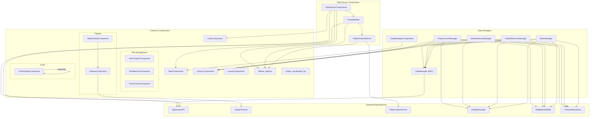
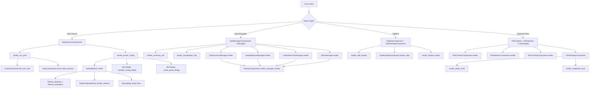

# Step 09: Web Components Common Analysis

## 1. Executive Summary

The RING-5 Unified Engine v2 web layer organises its Streamlit UI into three
component packages -- `common`, `data_source`, and `data_managers` -- totalling
21 source files and over 2 400 lines of presentation code.  Every component
follows a strict **stateless-render** pattern: each class or function receives
data (usually via `ApplicationAPI` or direct parameters), renders Streamlit
widgets, and returns user-intent signals (button clicks, selected values) to its
caller without mutating application state directly.  This separation enables the
controller layer to remain the single place where side-effects occur.

Key architectural observations:

| Concern | Implementation |
|---|---|
| **Reusable atoms** | `CardComponents`, `DataComponents`, `LayoutComponents`, `HistoryComponents` |
| **Filtered large-list widgets** | `filtered_selectbox`, `filtered_multiselect` with server-side search and session-state persistence |
| **Reorderable lists** | `render_reorderable_list` with up/down buttons, optional inline rename, session-state ordering |
| **Pipeline editing** | `PipelineComponent` (add/reorder/delete/finalize) + `PipelineStepComponent` (per-step expander with preview) |
| **Chart display** | `ChartDisplayComponent` with dual-engine (Plotly/Matplotlib) rendering, refresh controls, download wiring |
| **Plot management** | `PlotCreationComponent`, `PlotSelectorComponent`, `PlotControlsComponent` |
| **Data source ingestion** | `DataSourceComponents` (CSV pool, parser config, scan, parse dialogs), `VariableEditor`, `PatternIndexSelector` |
| **Data managers** | ABC `DataManager` with four concrete managers (`PreprocessorManager`, `SeedsReducerManager`, `OutlierRemoverManager`, `MixerManager`) sharing a preview-confirm-history workflow |
| **Widget key management** | `WidgetKeyBuilder.manager_key(prefix, suffix)` ensures unique Streamlit keys across managers |

All components interact with `ApplicationAPI` exclusively through its public
facade methods -- never reaching into repositories or services directly.

---

## 2. Common Components Catalog

### 2.1 CardComponents

**File:** `src/web/components/common/card_components.py`
**Class:** `CardComponents` (line 13)

Stateless class with two `@staticmethod` methods rendering information cards
inside `st.expander` widgets.

#### `file_info_card` (line 17)

```
Parameters:
    file_info : CsvPoolEntry   -- typed dict with keys: name, size, modified, path
    index     : int             -- unique card index (first card auto-expanded)

Returns:
    tuple[bool, bool, bool]     -- (load_clicked, preview_clicked, delete_clicked)
```

| Widget | Key pattern | Description |
|---|---|---|
| `st.expander` | -- | Title: `"{name} ({size} KB)"`, expanded when `index == 0` |
| `st.text` | -- | Modified timestamp formatted `%Y-%m-%d %H:%M:%S` |
| `st.button` | `load_{index}` | "Load This File" |
| `st.button` | `preview_{index}` | "Preview" |
| `st.button` | `delete_{index}` | "Delete" |

**Layout:** 3-column row inside the expander for the three action buttons.

**ApplicationAPI interaction:** None -- pure display; the caller
(`DataSourceComponents.render_csv_pool`) handles API calls based on the returned
booleans.

#### `config_info_card` (line 49)

```
Parameters:
    config_info : SavedConfigEntry  -- typed dict with keys: name, modified, description
    index       : int

Returns:
    tuple[bool, bool]               -- (load_clicked, delete_clicked)
```

| Widget | Key pattern | Description |
|---|---|---|
| `st.expander` | -- | Title: config name, first expanded |
| `st.text` | -- | Modified timestamp and description |
| `st.button` | `load_cfg_{index}` | "Load This Configuration" |
| `st.button` | `delete_cfg_{index}` | "Delete" |

**Layout:** 2-column row for buttons.

---

### 2.2 DataComponents

**File:** `src/web/components/common/data_components.py`
**Class:** `DataComponents` (line 12)

Three `@staticmethod` methods for DataFrame preview and export.

#### `show_data_preview` (line 16)

```
Parameters:
    data  : pd.DataFrame
    title : str = "Data Preview"
    rows  : int = 20
```

| Widget | Description |
|---|---|
| `st.markdown` | Section title |
| `st.dataframe` | `data.head(rows)` with stretch width |
| `st.metric` x4 | Rows, Columns, Numeric Columns, Categorical Columns (each with `border=True`) |

**Layout:** 4-column metric row.

#### `show_column_details` (line 42)

```
Parameters:
    data : pd.DataFrame
```

Renders inside `st.expander("Column Details")`.  Builds a summary DataFrame
with columns: Column, Type, Non-Null, Null, Unique -- displayed via
`st.dataframe`.

#### `download_buttons` (line 62)

```
Parameters:
    data   : pd.DataFrame
    prefix : str = "processed_data"
```

| Widget | Key | Format |
|---|---|---|
| `st.download_button` | -- | CSV (`text/csv`) |
| `st.download_button` | -- | JSON (`application/json`) |
| `st.download_button` | -- | Excel via `openpyxl` (`application/vnd...spreadsheetml.sheet`) |

**Layout:** 3-column row.  Each button uses `width="stretch"` and
`on_click="ignore"`.

**Session state keys:** None.

---

### 2.3 HistoryComponents

**File:** `src/web/components/common/history_components.py`
**Class:** `HistoryComponents` (line 16)

Four `@staticmethod` methods that render operation-history tables with action
buttons.

#### `render_history_table` (line 20)

```
Parameters:
    records : list[OperationRecord]
    title   : str | None = None         (keyword-only)
```

Converts records to a DataFrame with columns Timestamp, Operation, Source
Columns, Dest Columns and displays via `st.dataframe`.  Records are displayed
in **reverse chronological** order.

#### `render_global_history` (line 52)

```
Parameters:
    all_records     : list[OperationRecord]
    delete_callback : Callable[[OperationRecord], None]
    key_prefix      : str = "global"     (keyword-only)
```

| Widget | Key pattern |
|---|---|
| `st.expander` | "Recent Activity (N operations)" |
| 5-column row per record | Time, Operation, Source, Destination, Delete button |
| `st.button` | `hist_{key_prefix}_del_{i}` |

Each delete button fires `delete_callback(record)` via `on_click`.

#### `render_manager_history` (line 98)

```
Parameters:
    all_records       : list[OperationRecord]
    operation_prefix  : str                      -- e.g. "Preprocessor"
    load_session_key  : str                      -- session-state key for load trigger
    delete_callback   : Callable[[OperationRecord], None]
```

Filters records by `operation_prefix`, then renders a 6-column row per record:
Time, Operation (stripped prefix), Source, Destination, Load button, Delete
button.

| Widget | Key pattern | Action |
|---|---|---|
| `st.button` (Load) | `hist_load_{prefix}_{i}` | Sets `st.session_state[load_session_key]` to the record |
| `st.button` (Delete) | `hist_del_{prefix}_{i}` | Calls `delete_callback(record)` |

**Session state keys modified:** `load_session_key` -- written by the Load
button's `on_click` lambda.

#### `render_portfolio_history` (line 157)

```
Parameters:
    records : list[OperationRecord]
```

Renders a full history page with `st.metric("Total Operations", ...)` and
delegates to `render_history_table`.

---

### 2.4 LayoutComponents

**File:** `src/web/components/common/layout_components.py`
**Class:** `LayoutComponents` (line 9)

Five `@staticmethod` utility methods.

| Method | Line | Widgets | Returns |
|---|---|---|---|
| `sidebar_info` | 13 | `st.markdown` + `st.info` | None |
| `navigation_menu` | 27 | `st.radio` with 5 page options, collapsed label | `str` page name |
| `progress_display(step, total_steps, message)` | 49 | `st.progress` + `st.text` | None |
| `add_variable_button` | 63 | `st.button("+ Add Variable")` in 2-column layout | `bool` |
| `clear_data_button` | 75 | `st.button("Clear All Data")` | `bool` |

**Navigation pages:** "Data Source", "Data Managers", "Configure Pipeline",
"Generate Plots", "Load Configuration".

---

### 2.5 filtered_selector (Module-Level Functions)

**File:** `src/web/components/common/filtered_selector.py`

#### Constants (lines 18--20)

| Constant | Value | Purpose |
|---|---|---|
| `SELECTBOX_THRESHOLD` | 200 | Below this, standard `st.selectbox` is used unchanged |
| `MULTISELECT_THRESHOLD` | 100 | Below this, standard `st.multiselect` is used unchanged |
| `MAX_DISPLAYED` | 50 | Max options rendered in the filtered dropdown |

#### `filtered_selectbox` (line 26)

```
Parameters:
    label       : str
    options     : list[str]
    key         : str             (keyword-only)
    help        : str | None
    placeholder : str = "Type to search..."

Returns:
    str | None
```

**Below threshold path:** Renders `st.selectbox` with an empty-string sentinel
prepended.

**Above threshold path:**
1. `st.text_input` with key `{key}__search` for server-side filtering.
2. Filters options by case-insensitive substring match.
3. Truncates to `MAX_DISPLAYED` entries.
4. Renders `st.selectbox` with collapsed label over the filtered list.

**Session state keys:** `{key}__search`.

#### `filtered_multiselect` (line 92)

```
Parameters:
    label   : str
    options : list[str]
    key     : str             (keyword-only)
    default : list[str] | None
    help    : str | None
    **kwargs: Any             -- forwarded to st.multiselect

Returns:
    list[str]                 -- selections in original option order
```

**Below threshold path:** Standard `st.multiselect`.

**Above threshold path:**
1. Persistent selection set stored in `st.session_state[{key}__selections]`.
2. `st.text_input` with key `{key}__search`.
3. Intersection logic merges visible and non-visible selections.
4. Bulk action buttons:
   - "Select all matching" (`{key}__sel_all`) -- adds all filtered items and
     calls `st.rerun()`.
   - "Clear all" (`{key}__clear`) -- empties persistent set and calls
     `st.rerun()`.
5. `st.caption` shows total-selected count.

**Session state keys:**
- `{key}__selections` (persistent `set[str]`)
- `{key}__search` (search query)
- `{key}` (widget default, set programmatically before render)

---

### 2.6 ReorderableList

**File:** `src/web/components/common/reorderable_list.py`

#### `render_reorderable_list` (line 12)

```
Parameters:
    label         : str
    items         : list[str]
    key_prefix    : str
    plot_id       : int
    legend_labels : dict[str, str] | None = None
    default_order : list[str] | None = None
    enable_rename : bool = False
    rename_map    : dict[str, str] | None = None

Returns:
    list[str]                              -- when enable_rename is False
    tuple[list[str], dict[str, str]]       -- when enable_rename is True
```

**Behaviour:**
1. Stores order in `st.session_state[{key_prefix}_order_{plot_id}]`.
2. Initialises via `resolve_item_order(items, default_order=...)`.
3. Syncs if item set changes (new data columns appear/disappear).
4. Per item: 3-column row -- label or `st.text_input` (if rename), Up button,
   Down button.
5. Up/Down buttons swap adjacent items and call `st.rerun()`.

**Session state keys:**
- `{key_prefix}_order_{plot_id}` -- list ordering
- `{key_prefix}_rename_{safe_item}_{plot_id}` -- per-item rename input (when
  `enable_rename`)

**Widget keys:**
- `{key_prefix}_up_{i}_{plot_id}` -- per-row up button
- `{key_prefix}_down_{i}_{plot_id}` -- per-row down button

**Dependencies:** `resolve_item_order` from
`src.core.services.visualization.plot_interaction`.

---

## 3. Chart Display & Plot Controls

### 3.1 ChartDisplayComponent

**File:** `src/web/components/common/chart_display.py`
**Class:** `ChartDisplayComponent` (line 36)

Central component for the chart rendering area.  Handles both Plotly and
Matplotlib engines, refresh logic, and download wiring.

#### `render_refresh_controls` (line 44)

```
Parameters:
    plot_id        : int
    auto_refresh   : bool
    config_changed : bool

Returns:
    dict[str, Any]  -- keys: auto_refresh, manual_refresh, should_generate
```

| Widget | Key | Type |
|---|---|---|
| `st.toggle` | `auto_t_{plot_id}` | Auto-refresh toggle |
| `st.button` | `refresh_{plot_id}` | Manual "Refresh Plot" button |

`should_generate` is `True` when the manual button is clicked **or** when
auto-refresh is on and config has changed.

**Layout:** 2-column row (1:3 ratio).

#### `render_engine_selector` (line 73)

```
Parameters:
    plot_id        : int
    current_engine : str          -- "plotly" or "matplotlib"

Returns:
    str | None
```

Renders `st.pills` with two options using Material icons:
- `:material/interactive_space:` Plotly
- `:material/description:` LaTeX (Matplotlib)

**Widget key:** `engine_selector_{plot_id}`.

#### `render_plotly_chart` (line 93)

```
Parameters:
    fig       : go.Figure
    plot_id   : int
    plot_name : str
    config    : dict[str, Any]

Returns:
    dict[str, Any] | None        -- relayout_data from interactive chart
```

Configures the Plotly chart with:
- Editable legend positioning (`legendPosition: True`)
- Disabled title/axis title editing
- Drawing tools (line, path, circle, rect, eraser)
- SVG export with dimensions from config (`height`, `width`, `export_scale`)
- Delegates rendering to `interactive_plotly_chart(fig, config, key)`
- Calls `render_download_section(plot_id, plot_name, fig)` after the chart

**Widget key:** `chart_{plot_id}`.

#### `render_matplotlib_chart` (line 137)

```
Parameters:
    plotly_fig : go.Figure
    plot_id    : int
    plot_name  : str
    config     : dict[str, Any]
    plot_type  : str
    traces     : list[TraceConfig] | None = None
```

**Pipeline:**
1. Closes previous matplotlib figure from
   `st.session_state[plot.{plot_id}.mpl_fig]` to prevent memory leaks.
2. Builds `FigureSpec` via `ConfigSpecBuilder.from_config` and
   `PlotlyFigureSpecBuilder.enrich_from_plotly`.
3. Resolves config via `resolve_config(spec)`.
4. Detects multi-heatmap case (>1 `HeatmapTraceConfig`) and delegates to
   `_render_multi_heatmap`.
5. For standard plots: creates matplotlib figure via
   `FigureSpecToMatplotlib.create_figure`, renders traces via
   `MatplotlibTraceRenderer.render`, applies styling via
   `FigureSpecToMatplotlib.apply`, displays via `st.pyplot`, stores figure in
   session state for download.

**Session state keys:**
- `plot.{plot_id}.mpl_fig` -- current matplotlib figure (read/written)

#### `_render_multi_heatmap` (line 213)

Private static method handling the multi-heatmap subplot case.  Creates N
subplots via `FigureSpecToMatplotlib.create_multi_figure`, computes shared or
per-trace colour ranges using `compute_z_extent` and `compute_nice_range`,
renders each heatmap independently, applies colorbars via
`apply_multi_heatmap_colorbars`, and displays via `st.pyplot`.

**Session state keys:** Same `plot.{plot_id}.mpl_fig` pattern.

#### `render_error` (line 209)

```
Parameters:
    error : Exception
```

Simple `st.exception(error)` display.

---

### 3.2 PlotControlsComponent

**File:** `src/web/components/common/plot_controls.py`
**Class:** `PlotControlsComponent` (line 8)

#### `render` (line 14)

```
Parameters:
    plot_id      : int
    current_name : str

Returns:
    dict[str, Any]  -- keys: new_name, delete_clicked, duplicate_clicked
```

| Widget | Key | Type |
|---|---|---|
| `st.text_input` | `rename_{plot_id}` | Rename field |
| `st.button` | `delete_plot_{plot_id}` | Delete (tertiary) |
| `st.button` | `dup_plot_{plot_id}` | Duplicate (tertiary) |

**Layout:** 3-column row.

---

## 4. Pipeline Components

### 4.1 PipelineComponent

**File:** `src/web/components/common/pipeline.py`
**Class:** `PipelineComponent` (line 10)

Renders the shaper pipeline editor UI.  Responsible for adding transformations,
reordering steps, and triggering finalization.  Does **not** modify pipeline
state or apply shapers.

#### Class attributes (lines 22--23)

| Attribute | Type | Source |
|---|---|---|
| `SHAPER_DISPLAY_MAP` | `dict[str, str]` | `ShaperFactory.get_display_name_map()` -- maps display name to shaper key |
| `REVERSE_MAP` | `dict[str, str]` | Inverted map: shaper key to display name |

#### `render_section_header` (line 26)

Renders `st.markdown("### Data Processing Pipeline")`.

#### `render_no_data_warning` (line 31)

Renders `st.warning("Please upload data first!")`.

#### `render_pipeline_label` (line 36)

Renders `st.markdown("**Current Pipeline:**")`.

#### `render_add_shaper` (line 40)

```
Parameters:
    plot_id : int

Returns:
    dict[str, Any]  -- keys: add_clicked, shaper_type
```

| Widget | Key | Description |
|---|---|---|
| `st.selectbox` | `shaper_add_{plot_id}` | Dropdown of display names from `SHAPER_DISPLAY_MAP` |
| `st.button` | `add_shaper_btn_{plot_id}` | "Add to Pipeline" |

**Layout:** 2-column row (3:1 ratio).

Returns the internal shaper type key (looked up from `SHAPER_DISPLAY_MAP`).
Falls back to `"columnSelector"` if mapping fails.

#### `render_shaper_controls` (line 69)

```
Parameters:
    plot_id     : int
    idx         : int
    shaper_type : str
    is_first    : bool
    is_last     : bool

Returns:
    dict[str, bool]  -- keys: move_up, move_down, delete
```

| Widget | Key | Condition |
|---|---|---|
| `st.button("Up")` | `up_{plot_id}_{idx}` | Hidden when `is_first` |
| `st.button("Down")` | `down_{plot_id}_{idx}` | Hidden when `is_last` |
| `st.button("Del")` | `del_{plot_id}_{idx}` | Always shown |

All buttons use `type="tertiary"`.

**Layout:** 3-column row (equal widths).

#### `render_finalize_button` (line 110)

```
Parameters:
    plot_id : int

Returns:
    bool
```

Renders `st.button("Finalize Pipeline for Plotting")` with `type="primary"` and
`width="stretch"`.

**Widget key:** `finalize_{plot_id}`.

---

### 4.2 PipelineStepComponent

**File:** `src/web/components/common/pipeline_step.py`
**Class:** `PipelineStepComponent` (line 25)

#### `PipelineStepResult` TypedDict (line 13)

```python
class PipelineStepResult(TypedDict):
    new_config   : ShaperStepConfig
    move_up      : bool
    move_down    : bool
    delete       : bool
    preview_data : pd.DataFrame | None
    preview_error: str | None
    step_output  : pd.DataFrame | None
```

#### `render_step` (line 29)

```
Parameters:
    plot_id        : int
    idx            : int
    shaper_type    : str
    shaper_id      : int
    step_input     : pd.DataFrame
    current_config : ShaperStepConfig
    is_first       : bool
    is_last        : bool
    configure_fn   : Callable[
        [str, pd.DataFrame, int, ShaperStepConfig | None, int | None],
        ShaperStepConfig,
    ]
    apply_fn       : Callable[
        [pd.DataFrame, list[ShaperStepConfig]],
        pd.DataFrame,
    ]

Returns:
    PipelineStepResult
```

**Rendering flow:**
1. Wraps everything in `st.expander(f"{idx + 1}. {display_name}", expanded=True)`.
2. 2-column layout (3:1 ratio):
   - Left (c1): Calls `configure_fn` to render shaper-specific config widgets.
   - Right (c2): Calls `PipelineComponent.render_shaper_controls` for
     up/down/delete buttons.
3. If config is non-empty, calls `apply_fn(step_input, [new_config])` to compute
   a live preview and displays via `st.dataframe`.
4. Returns the full `PipelineStepResult` with config, control actions, and
   preview data.

#### `render_finalize_result` (line 119)

```
Parameters:
    processed : pd.DataFrame
```

Shows `st.toast` with shape info and `st.dataframe(processed.head(10))`.

#### `render_finalize_error` (line 125)

```
Parameters:
    error : str
```

Wraps in `st.exception(RuntimeError(error))`.

---

## 5. Plot Creation & Selector

### 5.1 PlotCreationComponent

**File:** `src/web/components/common/plot_creation.py`
**Class:** `PlotCreationComponent` (line 8)

#### `render` (line 15)

```
Parameters:
    default_name    : str
    available_types : list[str]

Returns:
    dict[str, Any]  -- keys: name, plot_type, create_clicked
```

Renders inside `st.form("create_plot_form", clear_on_submit=False)`.  The form
batches inputs -- keystrokes do **not** trigger reruns; only the submit button
fires a rerun.

| Widget | Key | Description |
|---|---|---|
| `st.text_input` | `new_plot_name` | Plot name |
| `st.selectbox` | `new_plot_type` | Plot type from `available_types` |
| `st.form_submit_button` | -- | "Create Plot" |

**Layout:** 3-column row (2:1:1 ratio).

---

### 5.2 PlotSelectorComponent

**File:** `src/web/components/common/plot_selector.py`
**Class:** `PlotSelectorComponent` (line 6)

#### `render_no_plots_warning` (line 10)

Renders `st.warning("No plots yet. Create a plot to get started!")`.

#### `render` (line 14)

```
Parameters:
    plot_names    : list[str]
    default_index : int = 0

Returns:
    str  -- name of the selected plot
```

Renders `st.pills("Select Plot", plot_names, ...)`.

**Widget key:** `plot_selector`.

Falls back to the first plot name if nothing is selected (`selected is None`).

---

## 6. Data Source Components

### 6.1 DataSourceComponents

**File:** `src/web/components/data_source/data_source_components.py`
**Class:** `DataSourceComponents` (line 28)

The largest single component class, orchestrating the entire Data Source page.
Uses `ApplicationAPI` extensively and composes multiple sub-components.

#### `render_csv_pool` (line 32)

```
Parameters:
    api : ApplicationAPI
```

**Flow:**
1. Checks `api.state_manager.get_csv_pool()` for cached pool; falls back to
   `api.load_csv_pool()`.
2. Iterates pool entries, validates each file path exists on disk.
3. For each entry, renders `CardComponents.file_info_card(csv_info, idx)`.
4. Handles three click actions:
   - **Load:** `api.load_csv_file` -> `api.state_manager.set_data` ->
     `api.state_manager.set_csv_path` -> `api.state_manager.set_use_parser(False)` ->
     shows `DataComponents.show_data_preview` and `show_column_details`.
   - **Preview:** `api.load_csv_file` -> `st.dataframe(head(5))`.
   - **Delete:** `api.delete_from_csv_pool` -> `st.rerun()`.

**Session state keys modified (indirectly via API):**
Data, csv_path, use_parser flags.

#### `render_parser_config` (line 95)

```
Parameters:
    api : ApplicationAPI
```

**Rendering structure:**

1. **Simulator selector** -- `st.pills("Simulator", ...)` with Material icons.
   Key: `simulator_selector`.  On change: `api.state_manager.set_simulator` +
   `st.rerun()`.

2. **Parser config fragment** (lines 127--275) -- Wrapped in `@st.fragment` to
   isolate reruns from the rest of the page.
   - **File location:** 2-column row with `st.text_input` for stats path
     (key: `stats_path_input`) and file pattern (key: `stats_pattern_input`).
   - **Parsing strategy:** `st.segmented_control`
     (key: `parser_strategy_selector`).  Options sourced from the simulator
     registry.
   - **Scanner UI:** Deep-scan checkbox + "Quick Scan" button.  Scanning uses
     `api.submit_scan_async` -> `as_completed` futures -> `api.finalize_scan`.
     Results stored via `api.state_manager.set_scanned_variables`.
   - **Variable editor:** Delegates to
     `VariableEditor.render(api, variables, ...)`.
   - **Add Variable button:** Opens `variable_config_dialog`.
   - **Configuration preview:** `st.json(parse_config)`.

3. **Parse button** (line 281) -- Outside the fragment for full-page rerun.
   Calls `api.submit_parse_async` and opens `_show_parse_dialog`.

#### `variable_config_dialog` (line 310)

```
Decorator: @st.dialog("Add Variable")
Parameters:
    api : ApplicationAPI
```

Two-mode dialog using `st.pills`:
- **"Search Scanned Variables"**: Uses `filtered_selectbox` to search scanned
  variable list.
- **"Manual Entry"**: `st.text_input` + `st.selectbox` for type.

Renders type-specific config by delegating to `VariableEditor` methods
(`render_vector_config`, `render_distribution_config`,
`render_configuration_config`).

Advanced options include a repeat count `st.number_input` (key: `adv_repeat`).

On "Add to Configuration": validates name and required entries, assigns UUID
via `str(uuid.uuid4())`, appends to
`api.state_manager.get_parse_variables()`,
calls `st.rerun()`.

**Session state keys:**
- `dialog_select_var_idx`, `dialog_manual_name`, `dialog_manual_type`
- `dialog_final_name`, `adv_repeat`

#### `_show_parse_dialog` (line 444)

```
Decorator: @st.dialog("Parsing Stats", dismissible=True)
Parameters:
    api        : ApplicationAPI
    batch      : ParseBatchResult
    output_dir : str
```

Blocking progress dialog that iterates `as_completed(batch.futures)`, updates
`st.progress`, finalizes via `api.finalize_parsing`, adds to CSV pool via
`api.add_to_csv_pool`, loads data into session via `api.load_csv_file` +
`api.state_manager.set_data`, then shows success and a
"Close & Reload" button (key: `finish_parse_futures_btn`).

---

### 6.2 VariableEditor

**File:** `src/web/components/data_source/variable_editor.py`
**Class:** `VariableEditor` (line 21)

Complex component for defining and editing parser variable configurations.

#### `render` (line 24)

```
Parameters:
    api                 : ApplicationAPI
    variables           : list[ParseVariableConfig]
    available_variables : list[ScannedVariableDict] | None
    stats_path          : str | None
    stats_pattern       : str = "stats.txt"

Returns:
    list[ParseVariableConfig]   -- updated variable list
```

**Flow per variable:**
1. Ensures `_id` exists (calls `api.data_services.generate_variable_id()`).
2. Renders common fields via `_render_common_fields` (Name, Alias, Type,
   Delete).
3. Dispatches to type-specific renderer:
   - `render_vector_config`
   - `render_distribution_config`
   - `render_histogram_config`
   - `render_configuration_config`
4. For pattern variables, renders `PatternIndexSelector`.
5. Ends with `_render_add_variable_section`.

#### `_render_common_fields` (line 100)

4-column layout: Name text_input, Alias text_input, Type selectbox, Delete
button.

| Widget | Key pattern |
|---|---|
| `st.text_input` (name) | `var_name_{var_id}` |
| `st.text_input` (alias) | `var_alias_{var_id}` |
| `st.selectbox` (type) | `var_type_{var_id}` |
| `st.button` (delete) | `delete_var_{var_id}` |

Type options: `["scalar", "vector", "distribution", "histogram",
"configuration"]`.

#### `render_vector_config` (line 311)

Renders vector variable configuration with:
- Parsing mode `st.segmented_control`: "Statistics Only", "Entries Only",
  "Entries + Statistics" (key: `vec_parse_mode_{var_id}`)
- When statistics: `_render_vector_statistics_selection` -- checkbox grid for
  total, mean, gmean, samples, stdev (keys: `stat_{stat}_{var_id}`)
- When entries: pills for "Select from Discovered Entries" vs "Manual Entry
  Names" (key: `entry_mode_{var_id}`)
- Deep scan button delegates to `_handle_deep_scan` -> `_show_scan_dialog`
- Discovered selection: `filtered_multiselect`
  (key: `vector_entries_select_{var_id}`)
- Manual entry: `st.text_input` (key: `vector_entries_{var_id}`)

#### `render_distribution_config` (line 662)

Renders distribution variable configuration with:
- Parsing mode segmented control (key: `dist_parse_mode_{var_id}`)
- Statistics checkboxes: mean, stdev, samples, total, gmean, underflows,
  overflows (keys: `dist_stat_{stat}_{var_id}`)
- Bucket range inputs when entries are requested
  (keys: `dist_min_{var_id}`, `dist_max_{var_id}`)
- Deep scan for range

#### `render_histogram_config` (line 184)

Similar to distribution but with rebinning support:
- Enable rebin checkbox (key: `hist_rebin_{var_id}`)
- Target buckets and max range number inputs
  (keys: `hist_bins_{var_id}`, `hist_max_range_{var_id}`)
- Entry mode pills (key: `hist_entry_mode_{var_id}`)
- Parsing mode segmented control (key: `hist_parse_mode_{var_id}`)

#### `render_configuration_config` (line 802)

Simple: `st.text_input` for default value on empty
(key: `config_onempty_{var_id}`).

#### `_render_add_variable_section` (line 819)

2-column layout: `filtered_selectbox` for discovered variables
(key: `var_search_box`) + "Add Selected" button (key: `add_selected_var`) |
"+ Add Manual" button (key: `add_manual_var`).

#### `_handle_deep_scan` (line 403)

Renders conditional deep-scan button (key: `deep_scan_{var_id}`) that calls
`api.submit_scan_async` and opens `_show_scan_dialog`.

#### `_show_scan_dialog` (line 442)

```
Decorator: @st.dialog("Deep Scan", dismissible=True)
```

Blocking dialog with progress bar.  Aggregates results via
`api.finalize_scan`.  For distributions: computes range, stores in
`st.session_state[dist_range_result_{var_id}]`.  For vectors/histograms:
updates discovered entries via `api.data_services.update_scanned_entries`.

Releases memory with `ApplicationAPI.cancel_pending_scans()`.

---

### 6.3 PatternIndexSelector

**File:** `src/web/components/data_source/pattern_index_selector.py`
**Class:** `PatternIndexSelector` (line 14)

UI-only thin wrapper around `PatternIndexService` (Layer B).  All pure logic
is delegated to the service layer.

#### Static delegation methods

| Method | Line | Delegates to |
|---|---|---|
| `is_pattern_variable(var_name)` | 27 | `PatternIndexService.is_pattern_variable` |
| `extract_index_positions(var_name)` | 32 | `PatternIndexService.extract_index_positions` |
| `parse_entry_indices(entries)` | 37 | `PatternIndexService.parse_entry_indices` |

#### `render_selector` (line 41)

```
Parameters:
    var_name          : str
    entries           : list[str]
    var_id            : str
    current_selection : list[str] | dict[int, list[str]] | None

Returns:
    tuple[bool, list[str]]  -- (use_filter, filtered_entries)
```

**Rendering flow:**
1. Validates pattern variable via service.
2. Extracts position labels and per-position index values.
3. `st.checkbox("Select specific indices")`
   (key: `use_pattern_filter_{var_id}`).
4. Per position: 2-column layout with label and `filtered_multiselect`
   (key: `pattern_pos_{pos_idx}_{var_id}`).
5. Filters entries via `PatternIndexService.filter_entries`.
6. Shows summary with `st.success` and optional expander of formatted examples.

---

## 7. Data Manager Components

### 7.1 DataManager (Abstract Base Class)

**File:** `src/web/components/data_managers/data_manager.py`
**Class:** `DataManager(ABC)` (line 13)

Abstract base class that all concrete data managers inherit from.  Holds a
reference to `ApplicationAPI` and provides data-access convenience methods.

```python
class DataManager(ABC):
    def __init__(self, api: ApplicationAPI):
        self.api = api

    @property
    @abstractmethod
    def name(self) -> str: ...       # Display name for the tab

    @abstractmethod
    def render(self) -> None: ...    # Render the manager's UI

    def get_data(self) -> pd.DataFrame | None:
        return self.api.state_manager.get_data()

    def set_data(self, data: pd.DataFrame) -> None:
        self.api.state_manager.set_data(data)
```

**Contract enforced by the ABC:**
- Every manager must declare a `name` property (shown as the Streamlit tab
  label).
- Every manager must implement `render()` which contains all Streamlit widget
  calls.
- `get_data` / `set_data` are inherited helpers that route through
  `ApplicationAPI.state_manager`.

---

### 7.2 DataManagerComponents (Page-Level Helpers)

**File:** `src/web/components/data_managers/data_manager_components.py`
**Class:** `DataManagerComponents` (line 14)

Page-level helper components for the Data Managers page.  These are **not**
managers themselves -- they render the Summary and Visualization tabs that sit
alongside the manager tabs.

#### `render_summary_tab` (line 18)

```
Parameters:
    data : pd.DataFrame
```

| Widget | Description |
|---|---|
| `st.metric` x4 | Rows, Columns, Memory (MB), Missing Values |
| `st.dataframe` | `data.head(20)` quick preview |
| `DataComponents.show_column_details` | Delegated column info |
| `st.dataframe` | Numeric describe() |
| `st.text` | Categorical columns: unique counts + sample values |

**Layout:** 4-column metric row; 2-column statistics section (numeric left,
categorical right).

**Session state keys:** None.

#### `render_visualization_tab` (line 64)

```
Parameters:
    data : pd.DataFrame
```

A full data exploration view with search, filtering, column selection,
pagination, and download.

| Widget | Key | Description |
|---|---|---|
| `st.selectbox` | `search_col` | Search column selector ("All Columns" + column list) |
| `st.text_input` | `search_term` | Search term |
| `st.multiselect` | `display_cols` | Column display selection |
| `st.selectbox` | `rows_per_page` | Rows per page (20, 50, 100, 500, "All") |
| `st.number_input` | `page_num` | Current page number |
| `st.button` | `download_view` | "Download Current View as CSV" |
| `st.download_button` | `download_csv_btn` | CSV download |

**Session state keys:**
- `search_col`, `search_term`, `display_cols`, `rows_per_page`, `page_num`

**Search logic:** Case-insensitive substring match across all columns or a
selected column using `str.contains`.

**Pagination:** Calculates `total_pages` and slices `display_data.iloc[start:end]`.

---

### 7.3 Shared Data Manager Workflow Pattern

All four concrete managers (`PreprocessorManager`, `SeedsReducerManager`,
`OutlierRemoverManager`, `MixerManager`) follow an identical **preview-confirm-
history** workflow:

```
1. Render configuration widgets (columns, operations, parameters)
2. "Preview / Apply" button
   -> Validate inputs via api.managers.validate_*()
   -> Execute operation via api.managers.*()
   -> Show preview (st.dataframe, st.metric)
   -> Store result in PreviewRepository via api.set_preview(key, df)
3. "Confirm" button (visible only when preview exists)
   -> Retrieve from PreviewRepository via api.get_preview(key)
   -> Commit to dataset via self.set_data(confirmed_df)
   -> Clear preview via api.clear_preview(key)
   -> Record OperationRecord to history via api.add_manager_history_record()
   -> st.rerun()
4. HistoryComponents.render_manager_history() with Load / Delete buttons
5. On Load trigger: UIStateManager().manager.consume_load_trigger(name)
   -> Pre-populate widget session state keys from the loaded record
```

The two-step preview/confirm pattern prevents accidental data mutations.

---

### 7.4 PreprocessorManager

**File:** `src/web/components/data_managers/preprocessor.py`
**Class:** `PreprocessorManager(DataManager)` (line 16)
**Name property:** `"Preprocessor (Basic)"`

Creates new columns by combining two existing numeric columns using arithmetic
operations.

#### `render` (line 23)

**Widgets:**

| Widget | Key | Description |
|---|---|---|
| `st.selectbox` | `mgr_preprocessor_src1` | Source Column 1 |
| `st.selectbox` | `mgr_preprocessor_op` | Operation (from `api.managers.list_operators()`) |
| `st.selectbox` | `mgr_preprocessor_src2` | Source Column 2 |
| `st.text_input` | `mgr_preprocessor_name` | New column name (auto-generated default) |
| `st.button` | `mgr_preprocessor_preview` | "Preview Result" |
| `st.button` | `mgr_preprocessor_confirm` | "Confirm and Add Column to Dataset" (primary) |

**Layout:** 3-column row for source/operation/source, then text input, then
buttons.

**Default name generation:**
- Divide -> `{src1}_per_{src2}`
- Sum -> `{src1}_plus_{src2}`
- Subtraction -> `{src1}_minus_{src2}`
- Multiplication -> `{src1}_prod_{src2}`

**ApplicationAPI calls:**
- `api.managers.list_operators()` -- available operations
- `api.managers.apply_operation(df, operation, src1, src2, dest)` -- compute
- `api.set_preview("preprocessor", preview_data)` -- store preview
- `api.get_preview("preprocessor")` -- retrieve for confirm
- `api.clear_preview("preprocessor")` -- clean up
- `api.add_manager_history_record(record)` -- history
- `api.get_manager_history()` -- for history rendering

**Preview key:** `"preprocessor"`

**History prefix:** `"Preprocessor"` (operation format:
`"Preprocessor: {operation}"`)

**Load trigger key:** `mgr_preprocessor_load_trigger`

---

### 7.5 SeedsReducerManager

**File:** `src/web/components/data_managers/seeds_reducer.py`
**Class:** `SeedsReducerManager(DataManager)` (line 16)
**Name property:** `"Seeds Reducer"`

Aggregates data across random seeds (or similar columns), computing mean and
standard deviation for numeric columns grouped by categorical columns.

#### `render` (line 23)

**Widgets:**

| Widget | Key | Description |
|---|---|---|
| `st.selectbox` | `mgr_seeds_reducer_target_column` | Column to reduce over (candidates: <=50 unique or object dtype) |
| `st.multiselect` | `mgr_seeds_reducer_categorical` | Categorical columns for grouping (defaults: all) |
| `st.multiselect` | `mgr_seeds_reducer_numeric` | Numeric columns for statistics (defaults: all) |
| `st.button` | `mgr_seeds_reducer_apply` | "Apply Seeds Reducer" |
| `st.button` | `mgr_seeds_reducer_confirm` | "Confirm and Apply Seeds Reducer" (primary) |

**Layout:** 2-column row for categorical/numeric multiselects.

**Candidate column selection:** Columns with `<=50` unique values OR
`object` dtype are offered as reduction targets.  Defaults to
`random_seed` when present.

**ApplicationAPI calls:**
- `api.managers.validate_seeds_reducer_inputs(df, categorical_cols, statistic_cols)` -- validation
- `api.managers.reduce_seeds(df, categorical_cols, statistic_cols)` -- computation
- `api.set_preview("seeds_reduction", result_df)` -- preview store
- `api.get_preview("seeds_reduction")` / `api.clear_preview("seeds_reduction")` -- lifecycle

**Preview key:** `"seeds_reduction"`

**History operation:** `"Seeds Reduction (mean + stdev)"`

**History prefix:** `"Seeds"`

**Load trigger key:** `mgr_seeds_reducer_load_trigger`

---

### 7.6 OutlierRemoverManager

**File:** `src/web/components/data_managers/outlier_remover.py`
**Class:** `OutlierRemoverManager(DataManager)` (line 16)
**Name property:** `"Outlier Remover"`

Removes outlier rows where a numeric column exceeds Q3, grouped by
categorical columns.

#### `render` (line 23)

**Widgets:**

| Widget | Key | Description |
|---|---|---|
| `st.selectbox` | `mgr_outlier_remover_col` | Column to check for outliers |
| `st.multiselect` | `mgr_outlier_remover_groupby` | Group-by columns (intelligent default: excludes seed-like columns) |
| `st.metric` x4 | -- | Min, Q3, Max, Mean of current distribution |
| `st.button` | `mgr_outlier_remover_apply` | "Apply Outlier Remover" |
| `st.button` | `mgr_outlier_remover_confirm` | "Confirm and Apply Outlier Remover" (primary) |

**Layout:** 2-column row for target column and group-by selection; 4-column
metric row for distribution stats; 3-column metric row for before/after/removed
counts.

**Intelligent default for group-by:** Excludes columns matching patterns
`"seed"`, `"iteration"`, `"run_id"` (case-insensitive) because grouping by seed
creates single-item groups where Q3 filtering is meaningless.

**ApplicationAPI calls:**
- `api.managers.validate_outlier_inputs(df, outlier_col, group_by_cols)` -- validation
- `api.managers.remove_outliers(df, outlier_col, group_by_cols)` -- computation
- `api.set_preview("outlier_removal", filtered_df)` -- preview store

**Preview key:** `"outlier_removal"`

**History operation:** `"Outlier Removal (Q3)"`

**History prefix:** `"Outlier"`

**Load trigger key:** `mgr_outlier_remover_load_trigger`

---

### 7.7 MixerManager

**File:** `src/web/components/data_managers/mixer.py`
**Class:** `MixerManager(DataManager)` (line 16)
**Name property:** `"Mixer (Merge Columns)"`

Merges multiple columns into one using Sum, Mean, or Concatenation.  Supports
automatic error propagation for `.sd` / `_stdev` companion columns.

#### `render` (line 23)

**Widgets:**

| Widget | Key | Description |
|---|---|---|
| `st.segmented_control` | `mgr_mixer_mode` | "Numerical Operations" or "Configuration Merge" |
| `st.multiselect` | `mgr_mixer_select_cols` | Columns to merge |
| `st.selectbox` | `mgr_mixer_op` | Operation: Sum, Mean, or Concatenate |
| `st.text_input` | `mgr_mixer_sep` | Separator (visible only for Concatenate) |
| `st.text_input` | `mgr_mixer_new_name` | New column name (auto-generated) |
| `st.button` | `mgr_mixer_preview` | "Preview Merge" |
| `st.button` | `mgr_mixer_confirm` | "Confirm and Merge" (primary) |

**Layout:** Segmented control at top; 2-column row for column selection and
operation.

**Mode switching:**
- **Numerical Operations:** Available columns are numeric (excluding `.sd` /
  `_stdev` suffixes).  Operations: Sum, Mean (Average).
- **Configuration Merge:** All columns available.  Operation: Concatenate.

**Default name generation:**
- Concatenate: `concat_{sep.join(cols[:2])}`
- Others: `{operation}_{col1}_{col2}`

**ApplicationAPI calls:**
- `api.managers.validate_merge_inputs(df, columns, operation, new_column_name)` -- validation
- `api.managers.apply_mixer(df, dest_col, source_cols, operation, separator)` -- computation
- `api.set_preview("mixer", result_df)` -- preview store

**Preview key:** `"mixer"`

**History operation:** `"Mixer: {operation}"`

**History prefix:** `"Mixer"`

**Load trigger key:** `mgr_mixer_load_trigger`

---

## 8. Session State Keys Catalog

Comprehensive listing of all session state keys used across these 21 component
files.

### 8.1 Pipeline & Chart Keys

| Key pattern | Component | Purpose |
|---|---|---|
| `shaper_add_{plot_id}` | PipelineComponent | Shaper type selection |
| `add_shaper_btn_{plot_id}` | PipelineComponent | Add to pipeline button |
| `up_{plot_id}_{idx}` | PipelineComponent | Move step up |
| `down_{plot_id}_{idx}` | PipelineComponent | Move step down |
| `del_{plot_id}_{idx}` | PipelineComponent | Delete step |
| `finalize_{plot_id}` | PipelineComponent | Finalize pipeline button |
| `auto_t_{plot_id}` | ChartDisplayComponent | Auto-refresh toggle |
| `refresh_{plot_id}` | ChartDisplayComponent | Manual refresh button |
| `engine_selector_{plot_id}` | ChartDisplayComponent | Plotly/Matplotlib selector |
| `chart_{plot_id}` | ChartDisplayComponent | Interactive plotly chart |
| `plot.{plot_id}.mpl_fig` | ChartDisplayComponent | Stored matplotlib figure |
| `rename_{plot_id}` | PlotControlsComponent | Rename text input |
| `delete_plot_{plot_id}` | PlotControlsComponent | Delete button |
| `dup_plot_{plot_id}` | PlotControlsComponent | Duplicate button |
| `new_plot_name` | PlotCreationComponent | Plot name input |
| `new_plot_type` | PlotCreationComponent | Plot type selector |
| `plot_selector` | PlotSelectorComponent | Plot selection pills |

### 8.2 Reorderable List Keys

| Key pattern | Component | Purpose |
|---|---|---|
| `{prefix}_order_{plot_id}` | render_reorderable_list | Item ordering |
| `{prefix}_rename_{item}_{plot_id}` | render_reorderable_list | Inline rename |
| `{prefix}_up_{i}_{plot_id}` | render_reorderable_list | Move up button |
| `{prefix}_down_{i}_{plot_id}` | render_reorderable_list | Move down button |

### 8.3 Filtered Selector Keys

| Key pattern | Component | Purpose |
|---|---|---|
| `{key}` | filtered_selectbox / filtered_multiselect | Widget value |
| `{key}__search` | filtered_selectbox / filtered_multiselect | Search query |
| `{key}__selections` | filtered_multiselect | Persistent selection set |
| `{key}__sel_all` | filtered_multiselect | Select-all button |
| `{key}__clear` | filtered_multiselect | Clear-all button |

### 8.4 Data Source Keys

| Key pattern | Component | Purpose |
|---|---|---|
| `simulator_selector` | DataSourceComponents | Simulator pills |
| `stats_path_input` | DataSourceComponents (fragment) | Stats directory path |
| `stats_pattern_input` | DataSourceComponents (fragment) | File pattern |
| `parser_strategy_selector` | DataSourceComponents (fragment) | Strategy selection |
| `dialog_select_var_idx` | variable_config_dialog | Scanned var search |
| `dialog_manual_name` | variable_config_dialog | Manual var name |
| `dialog_manual_type` | variable_config_dialog | Manual var type |
| `dialog_final_name` | variable_config_dialog | Final var name input |
| `adv_repeat` | variable_config_dialog | Repeat count |
| `finish_parse_futures_btn` | _show_parse_dialog | Close/reload button |
| `var_name_{var_id}` | VariableEditor | Variable name |
| `var_alias_{var_id}` | VariableEditor | Variable alias |
| `var_type_{var_id}` | VariableEditor | Variable type |
| `delete_var_{var_id}` | VariableEditor | Delete variable button |
| `vec_parse_mode_{var_id}` | VariableEditor | Vector parse mode |
| `entry_mode_{var_id}` | VariableEditor | Entry selection mode |
| `vector_entries_select_{var_id}` | VariableEditor | Discovered entry multiselect |
| `vector_entries_{var_id}` | VariableEditor | Manual entry text |
| `stat_{stat}_{var_id}` | VariableEditor | Vector statistic checkboxes |
| `dist_parse_mode_{var_id}` | VariableEditor | Distribution parse mode |
| `dist_stat_{stat}_{var_id}` | VariableEditor | Distribution statistic checkboxes |
| `dist_min_{var_id}` | VariableEditor | Distribution min range |
| `dist_max_{var_id}` | VariableEditor | Distribution max range |
| `dist_range_result_{var_id}` | VariableEditor (_show_scan_dialog) | Scanned range result |
| `hist_parse_mode_{var_id}` | VariableEditor | Histogram parse mode |
| `hist_rebin_{var_id}` | VariableEditor | Rebin checkbox |
| `hist_bins_{var_id}` | VariableEditor | Target bins |
| `hist_max_range_{var_id}` | VariableEditor | Max range |
| `hist_entry_mode_{var_id}` | VariableEditor | Histogram entry mode |
| `config_onempty_{var_id}` | VariableEditor | Config default value |
| `deep_scan_{var_id}` | VariableEditor | Deep scan button |
| `var_search_box` | VariableEditor | Add variable search |
| `add_selected_var` | VariableEditor | Add selected button |
| `add_manual_var` | VariableEditor | Add manual button |
| `use_pattern_filter_{var_id}` | PatternIndexSelector | Pattern filter toggle |
| `pattern_pos_{pos}_{var_id}` | PatternIndexSelector | Position index multiselect |

### 8.5 Data Manager Keys

All manager keys use `WidgetKeyBuilder.manager_key(prefix, suffix)` producing
the pattern `mgr_{prefix}_{suffix}`.

| Key pattern | Manager | Purpose |
|---|---|---|
| `mgr_preprocessor_src1` | Preprocessor | Source column 1 |
| `mgr_preprocessor_op` | Preprocessor | Arithmetic operation |
| `mgr_preprocessor_src2` | Preprocessor | Source column 2 |
| `mgr_preprocessor_name` | Preprocessor | New column name |
| `mgr_preprocessor_preview` | Preprocessor | Preview button |
| `mgr_preprocessor_confirm` | Preprocessor | Confirm button |
| `mgr_preprocessor_load_trigger` | Preprocessor | History load trigger |
| `mgr_seeds_reducer_target_column` | SeedsReducer | Reduction target |
| `mgr_seeds_reducer_categorical` | SeedsReducer | Categorical columns |
| `mgr_seeds_reducer_numeric` | SeedsReducer | Numeric columns |
| `mgr_seeds_reducer_apply` | SeedsReducer | Apply button |
| `mgr_seeds_reducer_confirm` | SeedsReducer | Confirm button |
| `mgr_seeds_reducer_load_trigger` | SeedsReducer | History load trigger |
| `mgr_outlier_remover_col` | OutlierRemover | Target column |
| `mgr_outlier_remover_groupby` | OutlierRemover | Group-by columns |
| `mgr_outlier_remover_apply` | OutlierRemover | Apply button |
| `mgr_outlier_remover_confirm` | OutlierRemover | Confirm button |
| `mgr_outlier_remover_load_trigger` | OutlierRemover | History load trigger |
| `mgr_mixer_mode` | Mixer | Mode selector |
| `mgr_mixer_select_cols` | Mixer | Column multiselect |
| `mgr_mixer_op` | Mixer | Operation selector |
| `mgr_mixer_sep` | Mixer | Concatenation separator |
| `mgr_mixer_new_name` | Mixer | New column name |
| `mgr_mixer_preview` | Mixer | Preview button |
| `mgr_mixer_confirm` | Mixer | Confirm button |
| `mgr_mixer_load_trigger` | Mixer | History load trigger |

### 8.6 Data Visualization Tab Keys

| Key | Component | Purpose |
|---|---|---|
| `search_col` | DataManagerComponents | Search column selector |
| `search_term` | DataManagerComponents | Search query |
| `display_cols` | DataManagerComponents | Visible columns |
| `rows_per_page` | DataManagerComponents | Pagination size |
| `page_num` | DataManagerComponents | Current page |
| `download_view` | DataManagerComponents | Download button |
| `download_csv_btn` | DataManagerComponents | CSV download |

---

## 9. Component Interaction Patterns

### 9.1 Stateless Render Pattern

Every component is a **pure renderer**: it receives data through parameters,
renders Streamlit widgets, and returns user-intent signals (usually as a
`dict[str, Any]` or `tuple` of booleans).  The **caller** (typically a
controller or page function) is responsible for acting on those signals.

```
Controller                 Component
    |                          |
    |--- data, config -------->|
    |                          |-- st.selectbox, st.button, ...
    |<--- {clicked, value} ----|
    |                          |
    |--- api.do_thing() ------>|  (Controller acts on signal)
```

Exceptions to pure statelessness:
- `render_reorderable_list` directly manages `st.session_state` ordering for
  up/down swaps.
- `filtered_multiselect` persists selections across filter changes via
  `st.session_state[{key}__selections]`.
- `HistoryComponents.render_manager_history` sets `st.session_state` via
  `on_click` lambdas for the load trigger.

### 9.2 Preview-Confirm Workflow

```
                 +------------------+
                 |  User configures |
                 |  widgets         |
                 +--------+---------+
                          |
                          v
              +-----------+-----------+
              | "Preview/Apply" click |
              +-------+---------+----+
                      |         |
                  validate   error -> st.error
                      |
                      v
              +-------+--------+
              | api.managers.* |  (compute result)
              +-------+--------+
                      |
                      v
              +-------+--------+
              | Show preview   |
              | api.set_preview|  (store in PreviewRepository)
              +-------+--------+
                      |
                      v
              +-------+-----------+
              | "Confirm" visible |
              +-------+-----------+
                      |  click
                      v
              +-------+--------+
              | api.get_preview|
              | self.set_data  |  (commit to dataset)
              | api.clear_prev |
              | add_history    |
              | st.rerun()     |
              +----------------+
```

### 9.3 History Load Pattern

When a user clicks a Load button in the manager history:

1. `HistoryComponents.render_manager_history()` sets
   `st.session_state[load_session_key]` to the `OperationRecord` via
   `on_click`.
2. On the next rerun, the manager calls
   `UIStateManager().manager.consume_load_trigger(name)` which reads and clears
   the trigger key.
3. The manager pre-populates widget session state keys from the record's
   `source_columns` and `dest_columns`, validating that columns still exist in
   the current dataset.
4. Streamlit renders the pre-filled widgets on the same rerun.

### 9.4 Fragment Isolation

`DataSourceComponents.render_parser_config` wraps the parser config section in
`@st.fragment`.  This means typing in text inputs (stats path, file pattern) or
changing the strategy radio only reruns that fragment -- not the entire page.
The parse button sits **outside** the fragment so it triggers a full-page rerun,
allowing other sections (CSV pool, data preview) to react to the newly loaded
data.

### 9.5 Dialog Pattern

Two dialog patterns are used:

1. **`@st.dialog("Add Variable")`** -- Non-blocking dialog for adding a new
   variable.  Returns to the page via `st.rerun()` after successful addition.

2. **`@st.dialog("Parsing Stats", dismissible=True)`** and
   **`@st.dialog("Deep Scan", dismissible=True)`** -- Blocking progress dialogs
   that iterate over `concurrent.futures.as_completed()`, updating
   `st.progress` in real-time.  The dialog holds Streamlit's rerun until all
   futures complete, then shows results and a close button.

### 9.6 Component Composition

```
DataSourcePage
  +-- DataSourceComponents.render_parser_config(api)
  |     +-- VariableEditor.render(api, variables, ...)
  |     |     +-- _render_common_fields (per variable)
  |     |     +-- render_vector_config / render_distribution_config / ...
  |     |     |     +-- _handle_deep_scan -> _show_scan_dialog (dialog)
  |     |     |     +-- filtered_multiselect / filtered_selectbox
  |     |     +-- PatternIndexSelector.render_selector
  |     |     |     +-- filtered_multiselect (per position)
  |     |     +-- _render_add_variable_section
  |     |           +-- filtered_selectbox
  |     +-- variable_config_dialog (dialog)
  |     |     +-- filtered_selectbox
  |     |     +-- VariableEditor.render_*_config
  |     +-- _show_parse_dialog (dialog)
  +-- DataSourceComponents.render_csv_pool(api)
        +-- CardComponents.file_info_card (per entry)
        +-- DataComponents.show_data_preview
        +-- DataComponents.show_column_details

DataManagersPage
  +-- DataManagerComponents.render_summary_tab(data)
  |     +-- DataComponents.show_column_details
  +-- DataManagerComponents.render_visualization_tab(data)
  +-- PreprocessorManager.render()
  |     +-- HistoryComponents.render_manager_history
  +-- SeedsReducerManager.render()
  |     +-- HistoryComponents.render_manager_history
  +-- OutlierRemoverManager.render()
  |     +-- HistoryComponents.render_manager_history
  +-- MixerManager.render()
  |     +-- HistoryComponents.render_manager_history
  +-- HistoryComponents.render_global_history (all records)

PipelinePage
  +-- PipelineComponent.render_section_header
  +-- PipelineComponent.render_add_shaper
  +-- PipelineStepComponent.render_step (per step)
  |     +-- PipelineComponent.render_shaper_controls
  +-- PipelineComponent.render_finalize_button

PlotPage
  +-- PlotCreationComponent.render
  +-- PlotSelectorComponent.render
  +-- PlotControlsComponent.render
  +-- ChartDisplayComponent.render_refresh_controls
  +-- ChartDisplayComponent.render_engine_selector
  +-- ChartDisplayComponent.render_plotly_chart / render_matplotlib_chart
```

---

## 10. Mermaid Component Hierarchy Diagram





---

*Analysis generated from source code review of 21 files across
`src/web/components/common/`, `src/web/components/data_source/`, and
`src/web/components/data_managers/`.*
