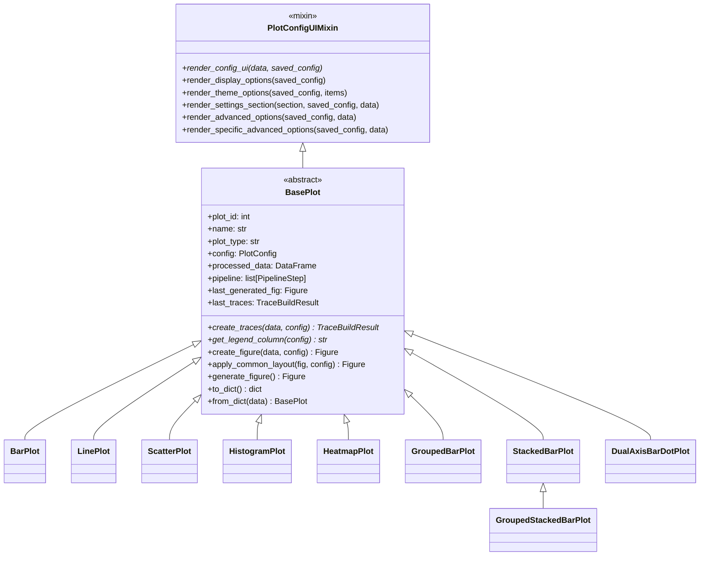
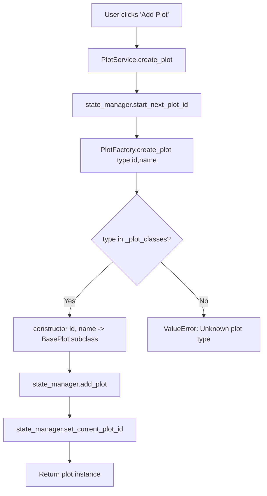
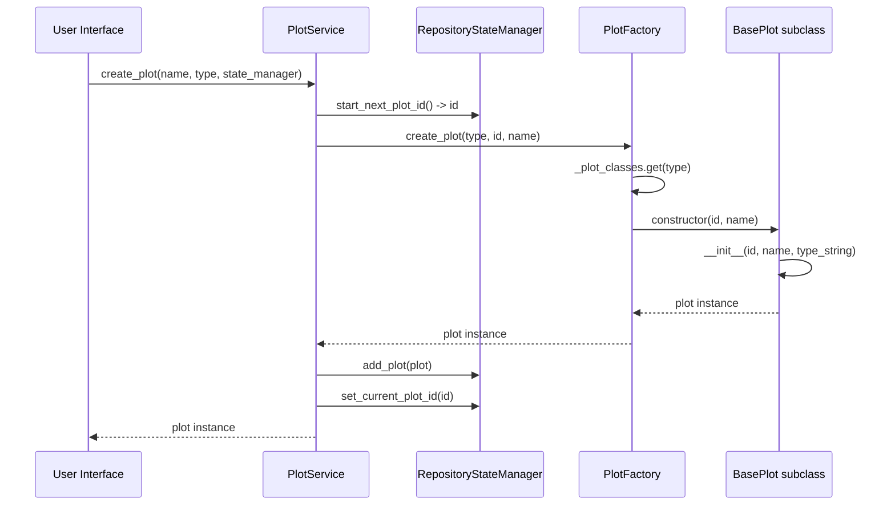
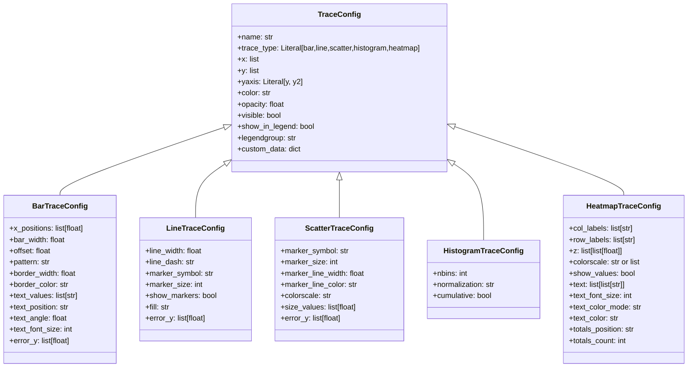
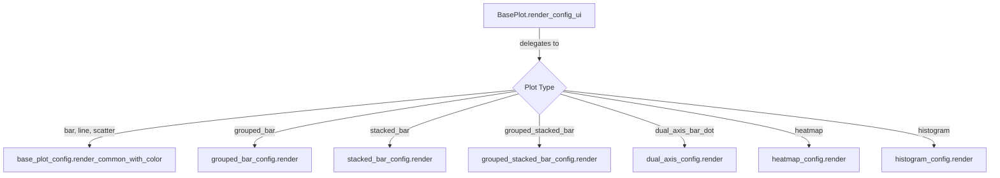
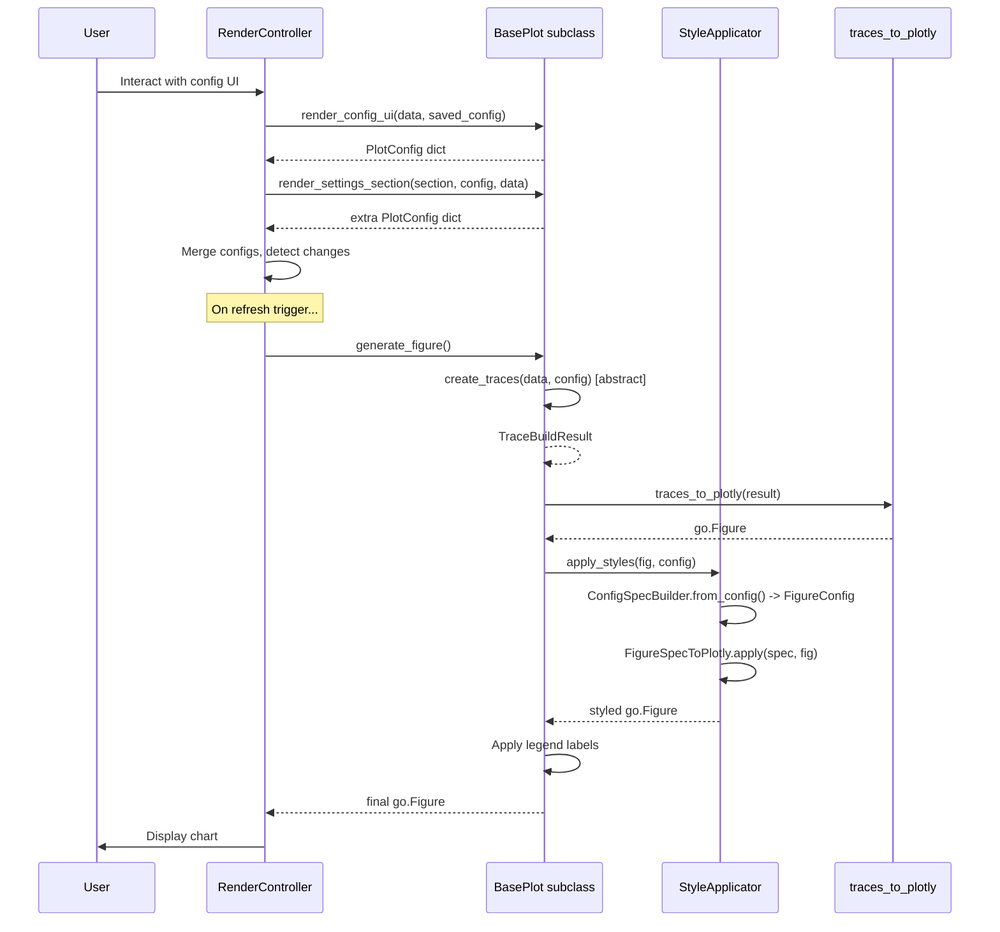

# Step 10 -- Plotting System, Types & Factory Analysis

> **Objective**: Document the complete plotting subsystem -- the plot factory, base plot
> pattern, every plot type implementation, the plot renderer, and the relationship
> between plot types and their configuration/rendering.

---

## 1. Executive Summary

The RING-5 Unified Engine v2 plotting system is a **three-tier architecture** that
translates user-selected plot types into engine-agnostic trace specifications,
which are then rendered by downstream connectors (Plotly, Matplotlib):

| Tier | Role | Key Module |
|------|------|------------|
| **Plot Factory** | Class-level registry mapping string keys to constructors; runtime extensibility | `plot_factory.py` |
| **Base Plot (ABC)** | Abstract base providing lifecycle, serialization, and config UI mixin; two abstract methods | `base_plot.py` + `plot_config_ui.py` |
| **Concrete Plot Types** | 9 implementations producing `TraceBuildResult` from data + config | `types/*.py` |

The data flow is:

```
User selects plot type
  -> PlotFactory.create_plot(type, id, name) -> BasePlot subclass
  -> plot.render_config_ui(data, saved_config) -> PlotConfig dict
  -> plot.create_traces(data, config) -> TraceBuildResult
  -> traces_to_plotly(result) -> go.Figure
  -> plot.apply_common_layout(fig, config) -> styled go.Figure
  -> chart_display renders the figure
```

The system provides **9 registered plot types** across 3 categories, **6 trace config
dataclasses**, a **TraceBuildResult** aggregator dataclass, **4 protocol contracts**
(PlotProtocol, PlotHandle, ConfigRenderer, RenderablePlot), and a **StyleApplicator**
that bridges flat config dicts to the engine-agnostic FigureConfig model.

---

## 2. Architecture Overview

### 2.1 Class Hierarchy



Key inheritance details:
- **GroupedStackedBarPlot** extends **StackedBarPlot** (not BasePlot directly), inheriting
  stacked trace building, totals annotations, and hover templates.
- All other concrete types extend **BasePlot** directly.
- **BasePlot** itself inherits from both **PlotConfigUIMixin** (for UI rendering) and
  **ABC** (for abstract method enforcement).

### 2.2 Protocol Contracts

The system defines four protocol layers to decouple controllers from concrete implementations:

| Protocol | File | Purpose |
|----------|------|---------|
| `PlotProtocol` | `src/core/models/plot_protocol.py:18` | Core-layer contract; data attributes only; no rendering methods |
| `PlotHandle` | `src/web/models/plot_protocols.py:37` | Web-layer contract for lifecycle controllers; data attributes |
| `ConfigRenderer` | `src/web/models/plot_protocols.py:58` | Config UI rendering facet; render_config_ui, render_display_options, etc. |
| `RenderablePlot` | `src/web/models/plot_protocols.py:87` | Combined PlotHandle + ConfigRenderer; adds create_figure, apply_common_layout |

**PlotProtocol** lives in the core layer and includes `to_dict()` for serialization.
The web-layer protocols (`PlotHandle`, `ConfigRenderer`, `RenderablePlot`) add rendering
concerns while staying decoupled from concrete `BasePlot`.

### 2.3 Factory Flow



---

## 3. File Inventory

### 3.1 Plot Factory & Core Infrastructure

| File | Lines | Purpose |
|------|-------|---------|
| `src/web/pages/ui/plotting/plot_factory.py` | 153 | `PlotFactory` class with `_plot_classes` registry, `create_plot()`, `register_plot_type()`, `PlotTypeMetadata` TypedDict |
| `src/web/pages/ui/plotting/base_plot.py` | 223 | `BasePlot` ABC: lifecycle, serialization, figure generation, style application |
| `src/web/pages/ui/plotting/plot_config_ui.py` | 420 | `PlotConfigUIMixin`: pills dispatcher, advanced options, ordering, shapes, reference lines |
| `src/web/pages/ui/plotting/plot_renderer.py` | 88 | `PlotRenderer`: cache-key computation utilities (rendering delegated to controllers) |
| `src/web/pages/ui/plotting/plot_service.py` | 153 | `PlotService`: create, delete, duplicate, change_type, export_plot_to_file |

### 3.2 Plot Type Implementations

| File | Class | Extends | Lines |
|------|-------|---------|-------|
| `src/web/pages/ui/plotting/types/__init__.py` | (re-exports) | -- | 24 |
| `src/web/pages/ui/plotting/types/bar_plot.py` | `BarPlot` | `BasePlot` | 69 |
| `src/web/pages/ui/plotting/types/line_plot.py` | `LinePlot` | `BasePlot` | 75 |
| `src/web/pages/ui/plotting/types/scatter_plot.py` | `ScatterPlot` | `BasePlot` | 52 |
| `src/web/pages/ui/plotting/types/histogram_plot.py` | `HistogramPlot` | `BasePlot` | 299 |
| `src/web/pages/ui/plotting/types/heatmap_plot.py` | `HeatmapPlot` | `BasePlot` | 307 |
| `src/web/pages/ui/plotting/types/grouped_bar_plot.py` | `GroupedBarPlot` | `BasePlot` | 214 |
| `src/web/pages/ui/plotting/types/stacked_bar_plot.py` | `StackedBarPlot` | `BasePlot` | 208 |
| `src/web/pages/ui/plotting/types/grouped_stacked_bar_plot.py` | `GroupedStackedBarPlot` | `StackedBarPlot` | 519 |
| `src/web/pages/ui/plotting/types/dual_axis_bar_dot_plot.py` | `DualAxisBarDotPlot` | `BasePlot` | 402 |
| `src/web/pages/ui/plotting/types/_trace_helpers.py` | (functions) | -- | 75 |

### 3.3 Trace Configuration Models

| File | Classes | Lines |
|------|---------|-------|
| `src/core/models/visualization/trace_config.py` | `TraceConfig`, `BarTraceConfig`, `LineTraceConfig`, `ScatterTraceConfig`, `HistogramTraceConfig`, `HeatmapTraceConfig` | 151 |
| `src/core/models/visualization/trace_build_result.py` | `TraceBuildResult` | 44 |

### 3.4 Plot Models & Protocols

| File | Key Types | Lines |
|------|-----------|-------|
| `src/core/models/plot_config.py` | `ShapeConfig` TypedDict | 27 |
| `src/core/models/plot_protocol.py` | `PlotProtocol`, `PlotDeserializer` | 42 |
| `src/web/models/plot_models.py` | `PlotConfig`, `PlotDisplayConfig`, `SeriesStyleConfig`, `AnnotationShapeConfig`, `ShaperStep`, `MarginsConfig`, `TypographyConfig`, `RelayoutEventData` | 298 |
| `src/web/models/plot_protocols.py` | `PlotHandle`, `ConfigRenderer`, `RenderablePlot`, `PlotLifecycleService`, `PlotTypeRegistry`, `PipelineExecutor` | 168 |

### 3.5 Plot Configuration Components

| File | Purpose |
|------|---------|
| `src/web/components/plotting/config/base_plot_config.py` | `render_common_with_color()` -- shared X/Y/Color column selectors |
| `src/web/components/plotting/config/plot_config_components.py` | Reusable config widget helpers |
| `src/web/components/plotting/config/grouped_bar_config.py` | X/Y/Group/Color column selectors + filter multiselects |
| `src/web/components/plotting/config/stacked_bar_config.py` | X + multi-Y column selectors + totals options |
| `src/web/components/plotting/config/grouped_stacked_bar_config.py` | X/Group + multi-Y + dual-axis right columns + stack totals |
| `src/web/components/plotting/config/dual_axis_config.py` | X/Y-bar/Y-dot/Color selectors for dual-axis |
| `src/web/components/plotting/config/heatmap_config.py` | X/metrics/facet selectors + aggregation |
| `src/web/components/plotting/config/histogram_config.py` | Histogram variable/group/normalization/binning |
| `src/web/components/plotting/config/dual_axis_settings.py` | Grid, typography, legend, dot settings for dual-axis mode |
| `src/web/components/plotting/config/grouped_stacked_bar_theme.py` | Stack total theme options, grouped-theme extras |

### 3.6 Style System

| File | Class | Lines |
|------|-------|-------|
| `src/web/pages/ui/plotting/styles/__init__.py` | Re-exports | 6 |
| `src/web/pages/ui/plotting/styles/factory.py` | `StyleUIFactory` | 27 |
| `src/web/pages/ui/plotting/styles/applicator.py` | `StyleApplicator` | 57 |
| `src/web/pages/ui/plotting/styles/base_ui.py` | `BaseStyleUI` | -- |
| `src/web/pages/ui/plotting/styles/bar_ui.py` | `BarStyleUI` | -- |
| `src/web/pages/ui/plotting/styles/line_ui.py` | `LineStyleUI`, `ScatterStyleUI` | -- |
| `src/web/pages/ui/plotting/styles/colors.py` | `to_hex()` color utility | -- |

### 3.7 Utility Helpers

| File | Class/Functions | Lines |
|------|-----------------|-------|
| `src/web/pages/ui/plotting/utils/__init__.py` | Re-exports `GroupedBarUtils` | -- |
| `src/web/pages/ui/plotting/utils/grouped_bar_utils.py` | `GroupedBarUtils` with coordinate calculation, shape builders | 260 |
| `src/web/pages/ui/plotting/utils/grouped_stacked_bar_helpers.py` | `get_ordered_categories_and_groups`, `apply_renames`, `apply_numbered_xaxis`, `build_category_annotations`, `apply_dual_axis_titles`, `apply_separate_legends`, `build_right_axis_traces` | -- |

---

## 4. Plot Factory Documentation

### 4.1 PlotFactory Class

- **File**: `src/web/pages/ui/plotting/plot_factory.py:32`
- **Pattern**: Class-level registry with classmethod API
- **Extensibility**: `register_plot_type()` allows runtime registration

**Registry (`_plot_classes`)**:

```python
_plot_classes: dict[str, Callable[[int, str], BasePlot]] = {
    "bar":                  BarPlot,
    "dual_axis_bar_dot":    DualAxisBarDotPlot,
    "grouped_bar":          GroupedBarPlot,
    "heatmap":              HeatmapPlot,
    "stacked_bar":          StackedBarPlot,
    "grouped_stacked_bar":  GroupedStackedBarPlot,
    "histogram":            HistogramPlot,
    "line":                 LinePlot,
    "scatter":              ScatterPlot,
}
```

Each constructor has the uniform signature `(plot_id: int, name: str) -> BasePlot`.

### 4.2 PlotTypeMetadata

The factory also maintains a `_plot_metadata` dictionary mapping each plot type key to
a `PlotTypeMetadata` TypedDict:

```python
class PlotTypeMetadata(TypedDict):
    display_name: str   # e.g., "Bar Chart", "Grouped Stacked Bar"
    icon: str           # Material icon name for UI
    category: str       # "basic", "comparison", "distribution"
```

**Category distribution**:

| Category | Plot Types |
|----------|-----------|
| `basic` | `bar`, `line`, `scatter` |
| `comparison` | `grouped_bar`, `stacked_bar`, `grouped_stacked_bar`, `dual_axis_bar_dot` |
| `distribution` | `heatmap`, `histogram` |

### 4.3 Factory Methods

| Method | Signature | Purpose |
|--------|-----------|---------|
| `create_plot` | `(plot_type, plot_id, name) -> BasePlot` | Looks up constructor, calls it; raises `ValueError` on unknown type |
| `get_available_plot_types` | `() -> list[str]` | Returns registry keys |
| `get_plot_metadata` | `() -> dict[str, PlotTypeMetadata]` | Returns metadata copy for UI presentation |
| `register_plot_type` | `(plot_type, plot_class, metadata)` | Registers new type at runtime; validates `issubclass(plot_class, BasePlot)` |

### 4.4 Factory Flow



---

## 5. Base Plot Pattern

### 5.1 BasePlot ABC

- **File**: `src/web/pages/ui/plotting/base_plot.py:20`
- **Inherits**: `PlotConfigUIMixin`, `ABC`
- **Abstract Methods**: `create_traces()`, `get_legend_column()`, `render_config_ui()` (from mixin)

**Instance Attributes** (set in `__init__`):

| Attribute | Type | Purpose |
|-----------|------|---------|
| `plot_id` | `int` | Unique identifier |
| `name` | `str` | Display name |
| `plot_type` | `str` | Type key (matches factory registry) |
| `config` | `PlotConfig` (dict) | Current configuration |
| `processed_data` | `DataFrame | None` | Shaped data ready for plotting |
| `last_generated_fig` | `go.Figure | None` | Cached Plotly figure |
| `last_traces` | `TraceBuildResult | None` | Cached trace build output |
| `pipeline` | `list[PipelineStep]` | Data shaping pipeline |
| `pipeline_counter` | `int` | Next pipeline step ID |
| `legend_mappings_by_column` | `dict[str, dict[str, str]]` | Per-column legend label overrides |
| `legend_mappings` | `dict[str, str]` | Global legend label overrides |
| `_style_ui` | `BaseStyleUI` | Style UI strategy (from StyleUIFactory) |
| `_applicator` | `StyleApplicator` | Style application engine |

### 5.2 Abstract Methods

Every concrete plot type must implement:

```python
@abstractmethod
def create_traces(self, data: pd.DataFrame, config: PlotConfig) -> TraceBuildResult:
    """Produce engine-agnostic trace data from data and config."""

@abstractmethod
def get_legend_column(self, config: PlotConfig) -> str | None:
    """Get the column name used for legend/color coding."""

@abstractmethod
def render_config_ui(self, data: pd.DataFrame, saved_config: PlotConfig) -> PlotConfig:
    """Render the configuration UI for this plot type."""
```

### 5.3 Figure Generation Pipeline

The `generate_figure()` method orchestrates the full rendering pipeline:

```python
def generate_figure(self) -> go.Figure:
    fig = self.create_figure(self.processed_data, self.config)
    fig = self.apply_common_layout(fig, self.config)
    # Apply legend labels if defined
    if legend_labels := self.config.get("legend_labels"):
        fig.for_each_trace(lambda t: t.update(name=legend_labels.get(t.name, t.name)))
    self.last_generated_fig = fig
    return fig
```

Where `create_figure()` delegates to:

```python
def create_figure(self, data, config) -> go.Figure:
    result = self.create_traces(data, config)  # abstract -> concrete
    self.last_traces = result
    fig = traces_to_plotly(result)              # connector
    return fig
```

And `apply_common_layout()` delegates to StyleApplicator:

```python
def apply_common_layout(self, fig, config) -> go.Figure:
    return self._applicator.apply_styles(fig, config)
```

### 5.4 Serialization

`to_dict()` serializes the plot state (excluding `go.Figure` objects):

| Serialized Field | Value |
|------------------|-------|
| `id` | `plot_id` |
| `name` | Display name |
| `plot_type` | Type key |
| `config` | Full config dict |
| `processed_data` | CSV string via `to_csv()` or `None` |
| `pipeline` | Pipeline steps list |
| `pipeline_counter` | Counter int |
| `legend_mappings_by_column` | Per-column mappings |
| `legend_mappings` | Global mappings |

`from_dict()` reconstructs by calling `PlotFactory.create_plot()` and restoring state.

### 5.5 PlotConfigUIMixin Dispatcher

The mixin provides `render_settings_section(section, saved_config, data)` which acts
as a router for the pills-based settings navigation:

| Section Key | Component Instantiated | Notes |
|-------------|----------------------|-------|
| `"layout"` | `LayoutSettingsComponent` | Always available |
| `"typography"` | `TypographySettingsComponent` | Key prefix "theme_" |
| `"legends"` | `LegendSettingsComponent` | Checks dual-axis, secondary, tertiary support |
| `"axes"` | `AxesSettingsComponent` | Injects `render_specific_fn`, `render_ordering_fn` |
| `"data_labels"` | `DataLabelsSettingsComponent` | Key prefix "theme_" |
| `"colors"` | `ColorsSettingsComponent` | Passes data for series discovery |
| `"advanced"` | `AdvancedSettingsComponent` | Injects reference line, shapes, engine callbacks |

### 5.6 Hookable Advanced Options

The mixin defines `render_specific_advanced_options()` as a hook for subclasses:

- **Default**: Renders bar gap slider if `"bar"` is in `plot_type`, plus `bargroupgap` for
  grouped types and `bar_border_width` for stacked types.
- **LinePlot** overrides to add line shape selector (`linear`, `spline`, `hv`, `vh`, `hvh`, `vhv`).
- **DualAxisBarDotPlot** overrides to add dot symbol, size, line width, bar gap,
  and isolation controls.
- **GroupedStackedBarPlot** overrides the entire `render_advanced_options()` to add
  stack configuration, major/minor group ordering, dual-axis settings, reference lines, shapes.

---

## 6. Trace Configuration Model

### 6.1 TraceConfig Hierarchy



**Design principle**: Trace configs are engine-agnostic dataclasses. They carry
pre-computed positioning data (e.g., `x_positions`, `bar_width`) so that connectors
(Plotly, Matplotlib) do not need to reimplement grouping/bar-spacing math.

### 6.2 TraceBuildResult

- **File**: `src/core/models/visualization/trace_build_result.py:22`
- **Type**: `@dataclass`

| Field | Type | Default | Purpose |
|-------|------|---------|---------|
| `traces` | `Sequence[TraceConfig]` | `[]` | Engine-agnostic trace list |
| `annotations` | `list[AnnotationConfig]` | `[]` | Structured text annotations (group labels, legends) |
| `layout_annotations` | `list[dict]` | `[]` | Raw annotation dicts passed to layout |
| `shapes` | `list[ShapeConfig]` | `[]` | Plotly-format shape dicts (separators, shading) |
| `barmode` | `str` | `"group"` | `"group"`, `"stack"`, `"overlay"`, `"relative"` |
| `custom_x_ticks` | `dict | None` | `None` | Override x-axis: `{"vals": [...], "text": [...], "hide_ticks": [...]}` |
| `secondary_y` | `bool` | `False` | Whether secondary Y-axis is used |

---

## 7. Plot Type Catalog

### 7.1 BarPlot

- **File**: `src/web/pages/ui/plotting/types/bar_plot.py:15`
- **Class**: `BarPlot`
- **Extends**: `BasePlot`
- **Registry Key**: `"bar"`
- **Category**: basic
- **Trace Type**: `BarTraceConfig`

**Required Config Keys**:

| Key | Type | Description |
|-----|------|-------------|
| `x` | `str` | X-axis column name |
| `y` | `str` | Y-axis column name |
| `color` | `str | None` | Optional color-grouping column |

**Config Component**: `base_plot_config.render_common_with_color()` -- shared X/Y/Color selectors.

**Trace Building Logic**:
1. Casts x column to string for categorical plotting.
2. Determines x-axis ordering from `config["xaxis_order"]` or sorted unique values.
3. Uses `build_color_grouped_traces()` helper to split by optional color column.
4. For each group, creates a `BarTraceConfig` with sorted x values and optional error bars.

**Barmode**: `"group"` (default from TraceBuildResult).

**Legend Column**: `config.get("color")`.

**Style UI**: `BarStyleUI` (adds per-series pattern selector).

---

### 7.2 LinePlot

- **File**: `src/web/pages/ui/plotting/types/line_plot.py:16`
- **Class**: `LinePlot`
- **Extends**: `BasePlot`
- **Registry Key**: `"line"`
- **Category**: basic
- **Trace Type**: `LineTraceConfig`

**Required Config Keys**:

| Key | Type | Description |
|-----|------|-------------|
| `x` | `str` | X-axis column name |
| `y` | `str` | Y-axis column name |
| `color` | `str | None` | Optional color-grouping column |
| `line_shape` | `str` | Line interpolation: `linear`, `spline`, `hv`, `vh`, `hvh`, `vhv` |

**Config Component**: `base_plot_config.render_common_with_color()`.

**Trace Building Logic**:
1. Sorts data by x column for correct line drawing order.
2. Uses `build_color_grouped_traces()` to split by color.
3. Creates `LineTraceConfig` with `show_markers=True`.

**Unique Settings**: `render_specific_advanced_options()` overrides to provide line shape
selector (`st.selectbox` with 6 interpolation modes).

**Legend Column**: `config.get("color")`.

**Style UI**: `LineStyleUI` (adds per-series marker symbol, marker size, line width).

---

### 7.3 ScatterPlot

- **File**: `src/web/pages/ui/plotting/types/scatter_plot.py:15`
- **Class**: `ScatterPlot`
- **Extends**: `BasePlot`
- **Registry Key**: `"scatter"`
- **Category**: basic
- **Trace Type**: `ScatterTraceConfig`

**Required Config Keys**:

| Key | Type | Description |
|-----|------|-------------|
| `x` | `str` | X-axis column name |
| `y` | `str` | Y-axis column name |
| `color` | `str | None` | Optional color-grouping column |

**Config Component**: `base_plot_config.render_common_with_color()`.

**Trace Building Logic**: Identical pattern to BarPlot/LinePlot using
`build_color_grouped_traces()`. Creates `ScatterTraceConfig` per group.

**Legend Column**: `config.get("color")`.

**Style UI**: `ScatterStyleUI` (inherits from LineStyleUI; same marker/line controls).

---

### 7.4 HistogramPlot

- **File**: `src/web/pages/ui/plotting/types/histogram_plot.py:14`
- **Class**: `HistogramPlot`
- **Extends**: `BasePlot`
- **Registry Key**: `"histogram"`
- **Category**: distribution
- **Trace Type**: `BarTraceConfig` (pre-binned histogram rendered as bars)

**Required Config Keys**:

| Key | Type | Description |
|-----|------|-------------|
| `histogram_variable` | `str` | Base variable name (columns follow `var..low-high` naming) |
| `group_by` | `str | None` | Categorical column for grouped histograms |
| `normalization` | `str` | `"count"`, `"probability"`, `"percent"`, `"density"` |
| `cumulative` | `bool` | Whether to show cumulative distribution |
| `bucket_size` | `float` | Bin width for density normalization |

**Config Component**: `histogram_config.render()` -- histogram variable selector,
group-by column, normalization mode, bin size.

**Trace Building Logic** (unique among all types):
1. Detects histogram columns via naming convention: `{variable}..{low}-{high}`.
2. Parses bucket ranges from column names.
3. Extracts bin values (summing per bucket column).
4. Applies normalization (probability, percent, density).
5. Optionally applies cumulative summation.
6. Uses bin centers as x positions.

**Barmode**: `"overlay"` (grouped) or `"relative"` (single).

**Legend Column**: `config.get("group_by")`.

**Style UI**: `BaseStyleUI` (no type-specific additions; heatmap/histogram fallback).

---

### 7.5 HeatmapPlot

- **File**: `src/web/pages/ui/plotting/types/heatmap_plot.py:82`
- **Class**: `HeatmapPlot`
- **Extends**: `BasePlot`
- **Registry Key**: `"heatmap"`
- **Category**: distribution
- **Trace Type**: `HeatmapTraceConfig`

**Required Config Keys**:

| Key | Type | Description |
|-----|------|-------------|
| `x` | `str` | X-axis column (configurations) |
| `metric_columns` | `list[str]` | Numeric columns to display as rows |
| `facet_col` | `str | None` | Column for faceted sub-heatmaps |
| `aggregation` | `str` | `"mean"`, `"sum"`, `"min"`, `"max"`, `"median"`, `"first"` |
| `color_palette` | `str` | Palette name (converted to Plotly colorscale) |
| `reverse_colorscale` | `bool` | Reverse color gradient |
| `show_values` | `bool` | Show cell values as text |
| `text_format` | `str` | Format spec for cell values |
| `text_display_logic` | `str` | `"all"`, `"above_threshold"`, `"below_threshold"` |
| `text_threshold` | `float` | Threshold for conditional text display |

**Config Component**: `heatmap_config.render()`.

**Trace Building Logic**:
1. Resolves colorscale from palette or legacy config.
2. Applies x and facet filters.
3. Determines x-axis order (custom or sorted).
4. Applies renames for x-labels and metric labels.
5. For each facet group, builds a z-matrix: rows = metrics, columns = x values.
6. Aggregates cell values using configured function.
7. Optionally appends totals row/column (position: `"right"` or `"top"`).
8. Creates `HeatmapTraceConfig` with z-values, text, colorscale.

**Layout Override**: `apply_common_layout()` overrides the base to restrict
`xaxis.categoryarray` to only the col_labels present in the trace (prevents
empty categories from appearing when ordering settings include filtered-out values).

**Legend Column**: `None` (color is the z-value, not a legend column).

**Style UI**: `BaseStyleUI`.

---

### 7.6 GroupedBarPlot

- **File**: `src/web/pages/ui/plotting/types/grouped_bar_plot.py:16`
- **Class**: `GroupedBarPlot`
- **Extends**: `BasePlot`
- **Registry Key**: `"grouped_bar"`
- **Category**: comparison
- **Trace Type**: `BarTraceConfig`

**Required Config Keys**:

| Key | Type | Description |
|-----|------|-------------|
| `x` | `str` | X-axis column (outer category) |
| `y` | `str` | Y-axis value column |
| `group` | `str | None` | Inner grouping column |
| `show_separators` | `bool` | Vertical separator lines between categories |
| `shade_alternate` | `bool` | Shading for alternating categories |
| `isolate_last_group` | `bool` | Extra gap before last category |
| `isolation_gap` | `float` | Size of isolation gap |

**Config Component**: `grouped_bar_config.render()`.

**Trace Building Logic**:
1. Applies x and group filters.
2. Determines x-axis and group ordering (custom or sorted).
3. Calls `GroupedBarUtils.calculate_grouped_coordinates()` to compute:
   - `coord_map`: Maps each category to a numeric x-coordinate.
   - `tick_vals`/`tick_text`: Custom tick positions and labels.
   - `shapes`: Separator lines, shading rectangles, isolation separators.
   - `bar_width`: Bar width from gap settings.
4. Creates one `BarTraceConfig` per group (or single trace if no grouping).
5. Returns `TraceBuildResult` with `barmode="group"`, shapes, and `custom_x_ticks`.

**Theme Overrides**: `render_theme_options()` adds Visual Distinction (separators, shading)
and Summary Group Isolation controls.

**Advanced Overrides**: `render_advanced_options()` applies x/group filters before
delegating to the base implementation.

**Legend Column**: `config.get("group")`.

**Style UI**: `BarStyleUI`.

---

### 7.7 StackedBarPlot

- **File**: `src/web/pages/ui/plotting/types/stacked_bar_plot.py:14`
- **Class**: `StackedBarPlot`
- **Extends**: `BasePlot`
- **Registry Key**: `"stacked_bar"`
- **Category**: comparison
- **Trace Type**: `BarTraceConfig`

**Required Config Keys**:

| Key | Type | Description |
|-----|------|-------------|
| `x` | `str` | X-axis column |
| `y_columns` | `list[str]` | Multiple numeric columns to stack |
| `x_filter` | `list[str] | None` | Filter x values |
| `show_totals` | `bool` | Show total annotations above stacks |
| `net_total_format` | `str` | Format spec for totals |
| `total_font_size` | `int` | Font size for total labels |
| `total_position` | `str` | `"Outside"` or `"Inside"` |
| `total_anchor` | `str` | `"End"`, `"Middle"`, `"Start"` |
| `total_offset` | `float` | Y-shift for total annotations |
| `total_rotation` | `float` | Rotation angle for total text |
| `total_threshold` | `float` | Minimum value to show total |

**Config Component**: `stacked_bar_config.render()`.

**Trace Building Logic** (key methods):

1. **`_prepare_data()`**: Copies data, casts x to string, applies x filter,
   calculates `__total` column by summing all y columns per row.

2. **`_create_stacked_traces()`**: Iterates over y columns, creates one
   `BarTraceConfig` per column via `_build_bar_trace()`.

3. **`_build_bar_trace()`**: For each stacked series:
   - Checks for `.sd` error bar column.
   - Reads `series_styles` for custom name, color (only if `use_color` is true), pattern.
   - Detects pre-computed numeric coordinates (`__x_coord`) for grouped variants.
   - Attaches `customdata` with `__total` values and hover template.

4. **`_build_totals_annotations()`**: Builds layout annotations for stack totals
   with configurable format, font, position, offset, rotation, and threshold.

**Barmode**: `"stack"`.

**Hover Template**:
```
<b>%{x}</b><br>Value: %{y:.4f}<br><b>Total: %{customdata:.4f}</b><extra></extra>
```

**Legend Column**: `None` (legend entries are the y_columns, not a data column).

**Style UI**: `BarStyleUI`.

---

### 7.8 GroupedStackedBarPlot

- **File**: `src/web/pages/ui/plotting/types/grouped_stacked_bar_plot.py:17`
- **Class**: `GroupedStackedBarPlot`
- **Extends**: `StackedBarPlot` (not BasePlot)
- **Registry Key**: `"grouped_stacked_bar"`
- **Category**: comparison
- **Trace Type**: `BarTraceConfig` (left axis), `BarTraceConfig`/`LineTraceConfig`/`ScatterTraceConfig` (right axis)

This is the **most complex plot type** in the system, combining stacked bars with
major/minor grouping, coordinate mapping, dual-axis support, numbered X-axis labeling,
and separate legend management.

**Required Config Keys** (superset of StackedBarPlot):

| Key | Type | Description |
|-----|------|-------------|
| `x` | `str` | Major group column (outer category) |
| `group` | `str` | Minor group column (inner sub-groups) |
| `y_columns` | `list[str]` | Columns to stack on left Y-axis |
| `dual_axis` | `bool` | Enable secondary Y-axis |
| `y_columns_right` | `list[str]` | Columns for right Y-axis |
| `right_axis_type` | `str` | `"bars"` or `"dots"` for right axis traces |
| `group_filter` | `list[str] | None` | Filter minor groups |
| `xaxis_order` | `list[str]` | Custom major group order |
| `group_order` | `list[str]` | Custom minor group order |
| `xaxis_labels` | `dict[str, str]` | Rename map for major groups |
| `group_renames` | `dict[str, str]` | Rename map for minor groups |
| `numbered_xaxis_modes` | `list[str]` | `[]`, `["Numbers"]`, `["Labels"]`, `["Number legend"]` |
| `unified_legend` | `bool` | Unify left/right axis legends |

**Config Component**: `grouped_stacked_bar_config.render()`.

**Trace Building Logic**:

1. If no `group` column, delegates to `super().create_traces()` (StackedBarPlot).
2. Prepares data including right-axis columns in total calculation.
3. Calls `_create_grouped_traces()` which:
   a. Copies data, makes group column string.
   b. Filters by `group_filter`.
   c. Gets ordered categories and groups via helper.
   d. Applies renames to data and ordered lists.
   e. Calls `GroupedBarUtils.calculate_grouped_coordinates()` for coordinate mapping.
   f. Maps coordinates to data (`__x_coord` column).
   g. Builds left-axis stacked bar traces (inherits `_build_bar_trace()`).
   h. If dual-axis, builds right-axis traces via `_build_right_axis_traces()`.
   i. Applies numbered X-axis labeling.
   j. Builds custom x-ticks, shapes, category annotations, and totals.

**Secondary/Tertiary Legend Support**:

```python
def _supports_secondary_legend(self) -> bool:
    return True  # Always supports secondary legend

def _supports_tertiary_legend(self) -> bool:
    return True  # Supports tertiary when dual-axis + numbered X-axis
```

**Dual-Axis Features**:
- `_build_right_axis_traces()`: Builds bar or dot/line traces for secondary Y-axis.
- `_apply_dual_axis_titles()`: Symmetrical Y-axis title annotations.
- `_apply_separate_legends()`: Splits left/right axis traces into separate legend groups.
- Grid lines per axis: primary ON by default, secondary OFF.

**Layout Override**: `apply_common_layout()` enforces hover template on all traces,
applies dual-axis titles, grid settings, and legend separation.

**Theme Overrides**: `render_theme_options()` passes stacked y_columns as items to
parent, then adds grouped-theme extras (stack-specific styling).

**Advanced Overrides**: Completely overrides `render_advanced_options()` with 7 sections:
general settings, bar settings, right-axis dot settings, dual-axis display settings,
right-axis series configuration, stack/legend configuration, major/minor group
configuration, reference line, and shapes.

**Barmode**: `"stack"`.

**Legend Column**: `None`.

**Style UI**: `BarStyleUI`.

---

### 7.9 DualAxisBarDotPlot

- **File**: `src/web/pages/ui/plotting/types/dual_axis_bar_dot_plot.py:25`
- **Class**: `DualAxisBarDotPlot`
- **Extends**: `BasePlot`
- **Registry Key**: `"dual_axis_bar_dot"`
- **Category**: comparison
- **Trace Type**: `BarTraceConfig` (primary Y), `LineTraceConfig`/`ScatterTraceConfig` (secondary Y)

**Required Config Keys**:

| Key | Type | Description |
|-----|------|-------------|
| `x` | `str` | X-axis column |
| `y_bar` | `str` | Primary Y-axis statistic (bars) |
| `y_dot` | `str` | Secondary Y-axis statistic (dots) |
| `color` | `str | None` | Color grouping column |
| `show_lines` | `bool` | Connect dots with lines (default `True`) |
| `dot_size` | `int` | Dot marker size (default 10) |
| `dot_symbol` | `str` | Marker symbol (default `"circle"`) |
| `dot_color` | `str | None` | Dot color (when no color grouping) |
| `line_width` | `int` | Line width (default 2) |
| `isolate_last_group` | `bool` | Remove connecting line to last x-category |
| `xaxis_order` | `list[str]` | Custom x-axis category order |
| `legend_order` | `list[str]` | Custom legend order |

**Config Component**: `dual_axis_config.render()`.

**Trace Building Logic**:

The `create_traces()` method handles two main branches:

**With color grouping** (`color_col` is set):
- For each color group, creates:
  - A `BarTraceConfig` on `yaxis="y"` for the bar statistic.
  - Either a `LineTraceConfig` (if `show_lines`) or `ScatterTraceConfig` (markers only) on `yaxis="y2"`.
  - Uses `legendgroup=grp` to link bar + dot traces in the legend.

**Without color grouping**:
- Creates a single `BarTraceConfig` and a single `LineTraceConfig`/`ScatterTraceConfig`.
- Uses `dot_color` for explicit dot coloring.

**Isolation Feature**: When `isolate_last_group` is active and lines are shown, the last
x-category is split into its own markers-only `ScatterTraceConfig` (with
`show_in_legend=False`) while the main data gets a `LineTraceConfig`. This visually
disconnects the summary category from the trend line.

**Advanced Options**: Overrides `render_specific_advanced_options()` to provide:
- Bar gap slider.
- Show lines checkbox.
- Dot symbol/size selectors.
- Line width input.
- Dot color picker (when no color grouping).
- Isolate last category checkbox.

**Barmode**: `"group"`.

**Secondary Y**: Always `True`.

**Legend Column**: `config.get("color")`.

**Style UI**: `BaseStyleUI` (dual-axis combines bar + scatter; uses base style).

---

## 8. Trace Helpers

### 8.1 _trace_helpers.py

- **File**: `src/web/pages/ui/plotting/types/_trace_helpers.py`
- **Functions**: `extract_error_bars()`, `build_color_grouped_traces()`

These helpers eliminate duplicated grouping/error-bar logic across BarPlot, LinePlot,
and ScatterPlot (the three "simple" plot types).

**`extract_error_bars(data, y_col, config)`**:
Returns the standard deviation column name `"{y_col}.sd"` if error bars are enabled
and the column exists; otherwise `None`.

**`build_color_grouped_traces(data, config, trace_factory)`**:
1. Extracts error bar column via `extract_error_bars()`.
2. If `config["color"]` is set:
   - Casts color column to string.
   - Determines group order from `config["legend_order"]` or sorted unique values.
   - For each group, filters data and calls `trace_factory(grp_data, grp_name, sd_col)`.
3. If no color column:
   - Calls `trace_factory(data, None, sd_col)` once.
4. Returns list of traces.

**Users**: BarPlot, LinePlot, ScatterPlot all define a `_make_trace()` closure and pass
it to `build_color_grouped_traces()`.

---

## 9. Plot Configuration Components

### 9.1 Config Component Architecture

Each plot type delegates its column selection UI to a dedicated config component
in `src/web/components/plotting/config/`. These components render Streamlit widgets
(selectboxes, multiselects, checkboxes) and return a `PlotConfig` dict.



### 9.2 Base Plot Config (`render_common_with_color`)

Used by: BarPlot, LinePlot, ScatterPlot.

Renders:
- X column selectbox (from categorical + numeric columns)
- Y column selectbox (from numeric columns)
- Color-by column selectbox (optional, from categorical columns)
- Title, X label, Y label text inputs

### 9.3 Config Component Summary

| Config Component | Plot Type(s) | Key Selection Widgets |
|-----------------|-------------|----------------------|
| `base_plot_config` | bar, line, scatter | X, Y, Color column selectors |
| `grouped_bar_config` | grouped_bar | X, Y, Group, Color + X/Group filters |
| `stacked_bar_config` | stacked_bar | X + Multi-Y + X filter + totals toggle |
| `grouped_stacked_bar_config` | grouped_stacked_bar | X, Group + Multi-Y + dual-axis + right columns |
| `dual_axis_config` | dual_axis_bar_dot | X, Y-bar, Y-dot, Color selectors |
| `heatmap_config` | heatmap | X, Metric columns, Facet column, Aggregation |
| `histogram_config` | histogram | Variable, Group-by, Normalization, Bin size |

---

## 10. Style System

### 10.1 StyleUIFactory

- **File**: `src/web/pages/ui/plotting/styles/factory.py:13`
- **Pattern**: Static factory method dispatching to per-type style UI managers

```python
class StyleUIFactory:
    @staticmethod
    def get_strategy(plot_id: int, plot_type: str) -> BaseStyleUI:
        if plot_type == "dual_axis_bar_dot": return BaseStyleUI(...)
        elif "line" in plot_type:            return LineStyleUI(...)
        elif "scatter" in plot_type:         return ScatterStyleUI(...)
        elif "bar" in plot_type:             return BarStyleUI(...)
        else:                                return BaseStyleUI(...)
```

**Dispatch Table**:

| Plot Type | Style UI Class | Extra Per-Series Controls |
|-----------|---------------|--------------------------|
| `dual_axis_bar_dot` | `BaseStyleUI` | Color override only |
| `line` | `LineStyleUI` | Marker symbol, marker size, line width |
| `scatter` | `ScatterStyleUI` | Marker symbol, marker size, line width |
| `bar`, `grouped_bar`, `stacked_bar`, `grouped_stacked_bar` | `BarStyleUI` | Pattern hatch selector |
| `heatmap`, `histogram` | `BaseStyleUI` | Color override only |

### 10.2 StyleApplicator

- **File**: `src/web/pages/ui/plotting/styles/applicator.py:20`
- **Purpose**: Bridges flat config dict to `FigureConfig` model

```
config dict -> ConfigSpecBuilder.from_config() -> FigureConfig
            -> resolve_config()                 -> FigureConfig (sentinels resolved)
            -> FigureSpecToPlotly.apply()        -> go.Figure mutations
```

Also applies raw Plotly shapes directly (not part of FigureConfig model).

Stores `self.last_spec` for downstream consumers (e.g., LaTeX export pipeline).

### 10.3 Style UI Hierarchy

```
BaseStyleUI           <- base: renders per-series color overrides
  +-- BarStyleUI      <- adds pattern hatch selector
  +-- LineStyleUI     <- adds marker symbol, marker size, line width
      +-- ScatterStyleUI  <- inherits from LineStyleUI
```

Style UIs are instantiated once per plot in `BasePlot.__init__()` via
`StyleUIFactory.get_strategy()`. They render within the Colors settings pill
when `ColorsSettingsComponent` delegates per-series visuals.

---

## 11. Utility Helpers

### 11.1 GroupedBarUtils

- **File**: `src/web/pages/ui/plotting/utils/grouped_bar_utils.py:6`
- **Used by**: `GroupedBarPlot`, `GroupedStackedBarPlot`

**Core Method**: `calculate_grouped_coordinates(categories, groups, config)`:

Computes manual x-axis coordinates for grouped bar layouts:

| Output | Type | Description |
|--------|------|-------------|
| `coord_map` | `dict[(cat, grp), float]` | Maps (category, group) pairs to x-coordinates |
| `tick_vals` | `list[float]` | X positions for tick marks |
| `tick_text` | `list[str]` | Labels for tick marks |
| `cat_centers` | `list[(float, str)]` | Center position + label for major category annotations |
| `shapes` | `list[dict]` | Separator lines, shading rectangles, isolation separators |
| `bar_width` | `float` | Computed bar width (1.0 - bargap) |

**Shape Builders** (static methods):
- `create_shade_shape(x0, x1, color, opacity)` -- alternating category shading rectangles
- `create_separator_shape(sep_x, color, dash, width)` -- dashed separators between categories
- `create_isolation_separator(sep_x)` -- thick solid separators for isolation gaps
- `build_category_annotations(cat_centers, font_size, color, offset, stagger)` -- major group labels

### 11.2 Grouped Stacked Bar Helpers

- **File**: `src/web/pages/ui/plotting/utils/grouped_stacked_bar_helpers.py`
- **Used by**: `GroupedStackedBarPlot` exclusively

| Function | Purpose |
|----------|---------|
| `get_ordered_categories_and_groups` | Resolves ordered category and group lists from data + config |
| `apply_renames` | Renames data, category, and group values per config maps |
| `apply_numbered_xaxis` | Replaces tick labels with numbered indices; builds legend annotation |
| `build_category_annotations` | Major group label annotations below the plot |
| `apply_dual_axis_titles` | Symmetrical Y-axis title annotations |
| `apply_separate_legends` | Splits traces into separate legends for left/right axis |
| `build_right_axis_traces` | Builds bar or dot/line traces for secondary Y-axis |

---

## 12. PlotConfig Model

### 12.1 Runtime Type

```python
PlotConfig = dict[str, Any]
```

`PlotConfig` is a **type alias** -- it signals "this dictionary follows the
`PlotDisplayConfig` schema but may contain extra keys." Using it in function signatures
documents intent without breaking code that writes arbitrary keys.

### 12.2 Canonical Schema (PlotDisplayConfig)

`PlotDisplayConfig` is a `TypedDict(total=False)` with approximately 100+ fields organized
into sections:

| Section | Key Examples | Count |
|---------|-------------|-------|
| Identity & Axes | `x`, `y`, `title`, `xlabel`, `ylabel`, `legend_title` | 6 |
| Grouping | `color`, `group` | 2 |
| Column Metadata | `numeric_cols`, `categorical_cols` | 2 |
| Dimensions & Layout | `width`, `height`, `margins`, `template` | 4 |
| Typography | `font_size`, `title_font_size`, `xaxis_title_font_size`, etc. | 10+ |
| Colors & Background | `paper_bgcolor`, `plot_bgcolor`, `show_grid`, `grid_color` | 5 |
| Axis Configuration | `xaxis_tickangle`, `xaxis_dtick`, `yaxis_dtick`, `xaxis_labels` | 4 |
| Ordering | `xaxis_order`, `group_order`, `legend_order` | 3 |
| Interactive State | `range_x`, `range_y`, `legend_x`, `legend_y` | 6 |
| Series Styling | `series_styles: dict[str, SeriesStyleConfig]` | 1 |
| Annotations | `shapes: list[AnnotationShapeConfig]` | 1 |
| Error Bars | `show_error_bars` | 1 |
| Bar-specific | `bargap`, `bargroupgap`, `bar_border_width` | 3 |
| Export | `download_format`, `export_scale` | 2 |
| Legend Styling | `legend_orientation`, `legend_font_color`, `legend_ncols`, etc. | 15+ |
| Data Labels | `show_values`, `text_format`, `text_position`, etc. | 10+ |
| Color Palette | `color_palette`, `enable_stripes` | 2 |
| Reference Line | `reference_line_enabled`, `reference_line_y`, etc. | 5 |
| Filters | `x_filter`, `group_filter` | 2 |

### 12.3 SeriesStyleConfig

```python
class SeriesStyleConfig(TypedDict, total=False):
    name: str           # Custom display name
    color: str          # Hex color code
    marker_symbol: str  # For scatter plots
    pattern: str        # For bar charts (/, \\, x, -, |, +, .)
```

Stored in `config["series_styles"]` as `dict[str, SeriesStyleConfig]` keyed by
original series value.

### 12.4 ShapeConfig

```python
class ShapeConfig(TypedDict, total=False):
    type: Required[str]          # "line", "circle", "rect"
    x0: Required[float | str]
    y0: Required[float | str]
    x1: Required[float | str]
    y1: Required[float | str]
    line: dict[str, str | float | int]  # color, width
```

---

## 13. Plot Service Layer

### 13.1 PlotService

- **File**: `src/web/pages/ui/plotting/plot_service.py:24`
- **Pattern**: Static methods wrapping factory + state management

| Method | Purpose | Key Operations |
|--------|---------|---------------|
| `create_plot` | Creates new plot | `start_next_plot_id()` -> `PlotFactory.create_plot()` -> `add_plot()` |
| `delete_plot` | Removes plot by ID | Filters plots list; resets current plot if deleted |
| `duplicate_plot` | Deep copies plot | `copy.deepcopy()`, new ID, clears cached figure |
| `change_plot_type` | Changes type | Creates new plot via factory, preserves pipeline + data, resets config |
| `export_plot_to_file` | File export | Supports HTML, PDF, PNG, SVG; uses Kaleido for vector/raster |

### 13.2 PlotRenderer

- **File**: `src/web/pages/ui/plotting/plot_renderer.py:16`
- **Purpose**: Cache-key computation only (all rendering delegated to controllers)

| Method | Purpose |
|--------|---------|
| `_compute_figure_cache_key` | Stable key from config hash + data hash (ignores zoom state) |
| `_compute_data_hash` | Fast DataFrame fingerprint: shape + columns + first/last row |

---

## 14. Plot Lifecycle Flow



### 14.1 Step-by-Step Lifecycle

1. **Type Selection**: User selects a plot type from the UI dropdown.
2. **Factory Creation**: `PlotService.create_plot()` -> `PlotFactory.create_plot()` -> concrete instance stored in session state.
3. **Config UI**: `RenderController` calls `plot.render_config_ui(data, saved_config)` to render column selectors and type-specific options.
4. **Settings Section**: `plot.render_settings_section(section, saved_config, data)` renders the pill-selected settings panel.
5. **Config Merge**: Controller merges config from config UI + settings section + theme options.
6. **Data Shaping**: Pipeline shapers transform raw data into `plot.processed_data`.
7. **Trace Building**: `plot.create_traces(data, config)` produces `TraceBuildResult`.
8. **Figure Conversion**: `traces_to_plotly(result)` converts traces to `go.Figure`.
9. **Style Application**: `plot.apply_common_layout(fig, config)` runs `StyleApplicator` to apply layout settings.
10. **Legend Labels**: Custom legend label overrides applied via `for_each_trace()`.
11. **Display**: Controller passes final figure to `ChartDisplayComponent` for rendering.
12. **Relayout**: Client-side zoom/pan events call `plot.update_from_relayout()` to persist state.

---

## 15. Extension Guide: Adding a New Plot Type

### Step 1: Create the TraceConfig (if needed)

If the new plot type uses a novel trace type not covered by existing configs,
add a new subclass to `src/core/models/visualization/trace_config.py`:

```python
@dataclass
class MyNewTraceConfig(TraceConfig):
    trace_type: Literal["bar","line","scatter","histogram","heatmap"] = "scatter"
    # Add type-specific fields...
```

Update the `Literal` union if a new discriminator value is needed.

### Step 2: Create the Plot Type Class

Create `src/web/pages/ui/plotting/types/my_new_plot.py`:

```python
class MyNewPlot(BasePlot):
    def __init__(self, plot_id: int, name: str):
        super().__init__(plot_id, name, "my_new_type")

    @override
    def render_config_ui(self, data, saved_config) -> PlotConfig:
        return my_new_config.render(data, saved_config, self.plot_id)

    @override
    def create_traces(self, data, config) -> TraceBuildResult:
        # Build traces from data and config
        return TraceBuildResult(traces=[...])

    @override
    def get_legend_column(self, config) -> str | None:
        return config.get("color")
```

### Step 3: Create the Config Component

Create `src/web/components/plotting/config/my_new_config.py` with a `render()`
function that returns a `PlotConfig` dict with the type's column selectors.

### Step 4: Register in the Factory

Add to `PlotFactory._plot_classes` in `plot_factory.py`:

```python
_plot_classes: dict[str, Callable[[int, str], BasePlot]] = {
    # ... existing entries ...
    "my_new_type": MyNewPlot,
}
```

Add metadata:

```python
_plot_metadata: dict[str, PlotTypeMetadata] = {
    # ... existing entries ...
    "my_new_type": {"display_name": "My New Plot", "icon": "auto_graph", "category": "basic"},
}
```

### Step 5: Export from types/__init__.py

Add to `src/web/pages/ui/plotting/types/__init__.py`:

```python
from .my_new_plot import MyNewPlot
```

### Step 6: Add to traces_to_plotly Connector

Update the connector to handle the new trace type if it uses a new TraceConfig subclass.

### Step 7: Add Style UI (Optional)

If the new type needs per-series controls beyond color:

1. Create a new `BaseStyleUI` subclass in `src/web/pages/ui/plotting/styles/`.
2. Override `_render_specific_series_visuals()`.
3. Update `StyleUIFactory.get_strategy()` to dispatch to your new class.

### Step 8: Override Hooks (Optional)

- `render_specific_advanced_options()` for type-specific advanced settings.
- `render_theme_options()` for type-specific theme controls.
- `render_advanced_options()` for complete advanced panel override.
- `apply_common_layout()` for type-specific layout post-processing.
- `_supports_secondary_legend()` / `_supports_tertiary_legend()` for multi-legend support.

---

## 16. Downstream Dependencies

### 16.1 Cross-Step Dependencies

| Upstream | This Step | Downstream |
|----------|-----------|------------|
| Step 04 (State) | Plot objects stored in session state via `RepositoryStateManager` | Serialization via `to_dict()`/`from_dict()` |
| Step 06 (Shapers) | Data pipeline shapes `processed_data` | Plot types receive shaped data |
| Step 07 (FigureConfig) | `TraceBuildResult` + `PlotConfig` | `ConfigSpecBuilder` maps config to FigureConfig |
| Step 08 (Navigation) | Plot page hosts the plotting subsystem | Settings pills render within plot page |
| Step 11 (Rendering) | `TraceBuildResult` is consumed by connectors | `traces_to_plotly()`, `FigureSpecToPlotly` |
| Step 12 (Settings) | Settings pills produce PlotConfig dicts | Merged into `plot.config` by controller |
| Step 13 (Controllers) | `PlotRenderController` orchestrates lifecycle | Calls `generate_figure()`, caching, display |
| Step 14 (Export) | `PlotService.export_plot_to_file()` | Export uses `generate_figure()` |
| Step 19 (Extension) | `PlotFactory.register_plot_type()` | Extension point for new plot types |

### 16.2 Config Flow Summary

```
User Widget Interaction
  -> Settings Component returns PlotConfig dict
  -> RenderController merges into current_config
  -> BasePlot.config = current_config
  -> BasePlot.generate_figure()
     -> create_traces(data, config)
        -> TraceBuildResult (traces + layout metadata)
     -> traces_to_plotly(result)
        -> go.Figure
     -> apply_common_layout(fig, config)
        -> StyleApplicator.apply_styles()
           -> ConfigSpecBuilder.from_config(config) -> FigureConfig
           -> FigureSpecToPlotly.apply(spec, fig)
     -> apply legend labels
  -> Final go.Figure displayed by ChartDisplayComponent
```

### 16.3 This Analysis Feeds Into

- Developer Guide: `visualization/plotting-system.md`, `visualization/adding-a-new-plot.md`
- AI Knowledge Base: `development/adding-a-plot.md`
- User Guide: `plots/*` (all plot type guides)
- Step 11 (rendering) -- rendering consumes plot traces
- Step 18 (data flow) -- plot is the visualization step in the data pipeline
- Step 19 (extension points) -- plot factory is a key extension point

---

## 17. Plot Type Quick-Reference Table

| Plot Type | Registry Key | Class | Extends | Trace Config | Barmode | Config Component | Legend Column | Secondary Y |
|-----------|-------------|-------|---------|-------------|---------|-----------------|---------------|-------------|
| Bar | `bar` | `BarPlot` | `BasePlot` | `BarTraceConfig` | `group` | `base_plot_config` | `color` | No |
| Line | `line` | `LinePlot` | `BasePlot` | `LineTraceConfig` | `group` | `base_plot_config` | `color` | No |
| Scatter | `scatter` | `ScatterPlot` | `BasePlot` | `ScatterTraceConfig` | `group` | `base_plot_config` | `color` | No |
| Histogram | `histogram` | `HistogramPlot` | `BasePlot` | `BarTraceConfig` | `overlay`/`relative` | `histogram_config` | `group_by` | No |
| Heatmap | `heatmap` | `HeatmapPlot` | `BasePlot` | `HeatmapTraceConfig` | `group` | `heatmap_config` | `None` | No |
| Grouped Bar | `grouped_bar` | `GroupedBarPlot` | `BasePlot` | `BarTraceConfig` | `group` | `grouped_bar_config` | `group` | No |
| Stacked Bar | `stacked_bar` | `StackedBarPlot` | `BasePlot` | `BarTraceConfig` | `stack` | `stacked_bar_config` | `None` | No |
| Grouped Stacked | `grouped_stacked_bar` | `GroupedStackedBarPlot` | `StackedBarPlot` | `BarTraceConfig`+ | `stack` | `grouped_stacked_bar_config` | `None` | Optional |
| Dual Axis | `dual_axis_bar_dot` | `DualAxisBarDotPlot` | `BasePlot` | `BarTraceConfig`+`LineTraceConfig`/`ScatterTraceConfig` | `group` | `dual_axis_config` | `color` | Yes |
