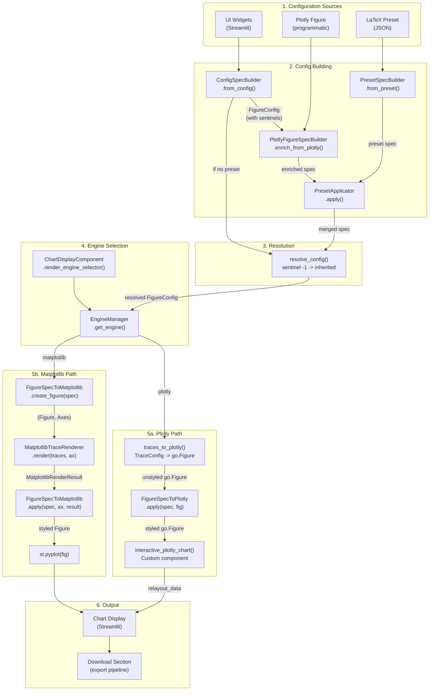

# Step 11: Rendering Engines & Connectors Analysis

## 1. Executive Summary

The RING-5 Unified Engine v2 rendering layer implements a **dual-engine architecture** that translates an engine-agnostic `FigureConfig` model into either Plotly interactive figures or Matplotlib publication-quality figures. The system enforces a strict pipeline ordering defined in `STYLING_PIPELINE_ORDER` (16 steps) and uses three builder classes to construct `FigureConfig` from different sources: UI widget dictionaries, existing Plotly figures, or LaTeX presets.

### Key Design Principles

1. **Single source of truth** -- `FigureConfig` (a dataclass tree) is the only styling specification consumed by both connectors. No engine-specific logic leaks into controllers or UI components.
2. **Stateless connectors** -- Both `FigureSpecToPlotly` and `FigureSpecToMatplotlib` expose only `@staticmethod` methods. No instance state exists; the `FigureConfig` carries all context.
3. **Forward-direction trace rendering** -- Plot types produce `TraceBuildResult` (engine-agnostic `TraceConfig` lists), which are converted to engine-specific artists by `traces_to_plotly()` and `MatplotlibTraceRenderer.render()`. This eliminates the old reverse-extraction pattern (Plotly figure -> trace extraction -> Matplotlib replay).
4. **Sentinel resolution** -- The `resolve_config()` service (in `config_resolver.py`) replaces all `-1` sentinels with inherited parent values before any connector reads the spec. Connectors NEVER see `-1`.
5. **Declarative widget system** -- `WidgetDef` subclasses define UI controls as frozen dataclasses, rendered by `WidgetRenderer` into Streamlit widgets. Each widget carries a `spec_path` field mapping it to the FigureConfig field it controls.

### File Inventory

| File | Role | Lines |
|------|------|-------|
| `_connector_protocol.py` | Pipeline order contract | 29 |
| `_render_result.py` | Matplotlib render result dataclass | 17 |
| `engine_manager.py` | Engine state in Streamlit session | 85 |
| `plotly_connector.py` | `FigureConfig` -> Plotly `go.Figure` | 890 |
| `matplotlib_connector.py` | `FigureConfig` -> matplotlib Axes/Figure | 1078 |
| `trace_to_plotly.py` | `TraceConfig` -> Plotly traces | 492 |
| `matplotlib_trace_renderer.py` | `TraceConfig` -> matplotlib artists | 506 |
| `config_builder.py` | Three builders: Config/Plotly/Preset -> `FigureConfig` | 926 |
| `preset_applicator.py` | Overlay preset onto existing `FigureConfig` | 194 |
| `_heatmap_utils.py` | Shared heatmap contrast/range utilities | 112 |
| `widgets/widget_def.py` | Declarative widget definition hierarchy | 741 |
| `widgets/widget_renderer.py` | Widget definition -> Streamlit widget -> config dict | 205 |
| `chart_display.py` | Chart area rendering component | 293 |
| `interactive_plot.py` | Custom Plotly component with relayout capture | 49 |

---

## 2. Connector Protocol & STYLING_PIPELINE_ORDER

**Source**: `/home/vnicolas/workspace/repos/RING-5-unified-engine-v2/src/web/rendering/_connector_protocol.py`

The `STYLING_PIPELINE_ORDER` tuple defines the canonical ordering of styling operations. Both connectors MUST apply styles in this order to guarantee visual consistency across engines.

```python
STYLING_PIPELINE_ORDER: tuple[str, ...] = (
    "backgrounds",       # Step 1: paper_bgcolor, plot_bgcolor
    "font_family",       # Step 2: global font family (rcParams / layout.font)
    "color_palette",     # Step 3: colorway / prop_cycle assignment
    "title",             # Step 4: figure title with typography
    "axis_labels",       # Step 5: X, Y, Y2 axis label text + font
    "axis_ticks",        # Step 6: tick positioning, rotation, padding
    "axis_ranges",       # Step 7: xlim/ylim, log scale, margin
    "axis_colors",       # Step 8: tick/line colors, spine visibility
    "grids",             # Step 9: grid lines, color, dash style
    "legends",           # Step 10: legend position, spacing, multi-legend
    "reference_lines",   # Step 11: horizontal/vertical reference lines
    "data_labels",       # Step 12: bar/point value annotations
    "annotations",       # Step 13: freeform text annotations
    "separators",        # Step 14: group separator vertical lines
    "hatching",          # Step 15: bar hatching patterns
    "margins",           # Step 16: figure margins (subplots_adjust / layout.margin)
)
```

### Protocol Compliance

The Plotly connector's `apply()` method calls 18 private methods in a slightly different but semantically equivalent order (it combines some axis operations and adds heatmap colorbar handling). The Matplotlib connector's `apply()` method calls exactly 16 private methods that map one-to-one to the pipeline steps above.

| Pipeline Step | Plotly Method | Matplotlib Method |
|--------------|---------------|-------------------|
| dimensions | `_apply_dimensions()` | (via `create_figure()`) |
| backgrounds | `_apply_backgrounds()` | `_apply_backgrounds()` |
| font_family | `_apply_font_family()` | `_apply_font_family()` |
| color_palette | `_apply_color_palette()` | `_apply_color_palette()` |
| title | `_apply_title()` | `_apply_title()` |
| axis_labels | `_apply_xaxis()` / `_apply_yaxis()` / `_apply_y2axis()` | `_apply_axis_labels()` |
| axis_ticks | (within axis methods) | `_apply_axis_ticks()` |
| axis_ranges | (within axis methods) | `_apply_axis_ranges()` |
| axis_colors | `_apply_axis_colors()` | `_apply_axis_colors()` |
| grids | (within axis methods) | `_apply_grids()` |
| legends | `_apply_legends()` | `_apply_legends()` |
| reference_lines | `_apply_reference_lines()` | `_apply_reference_lines()` |
| data_labels | `_apply_data_labels()` | `_apply_data_labels()` |
| annotations | (via trace_to_plotly) | `_apply_annotations()` |
| separators | `_apply_separator_lines()` | `_apply_separators()` |
| hatching | `_apply_stripes()` | `_apply_hatching()` |
| margins | `_apply_dimensions()` | `_apply_margins()` |

### Render Result Type

**Source**: `/home/vnicolas/workspace/repos/RING-5-unified-engine-v2/src/web/rendering/_render_result.py`

```python
@dataclass
class MatplotlibRenderResult:
    """Result from rendering traces onto matplotlib axes."""
    trace_count: int = 0
    heatmap_col_labels: list[str] | None = None
    heatmap_row_labels: list[str] | None = None
    heatmap_image: Any = None  # matplotlib mappable for colorbar creation
```

This dataclass bridges trace rendering and style application: `MatplotlibTraceRenderer.render()` populates it, and `FigureSpecToMatplotlib.apply()` consumes it for heatmap tick placement and colorbar creation.

---

## 3. Engine Manager (Engine Selection, Per-Plot vs Global)

**Source**: `/home/vnicolas/workspace/repos/RING-5-unified-engine-v2/src/web/rendering/engine_manager.py`

### Type Definition

```python
EngineMode = Literal["plotly", "matplotlib"]
```

### Class: `EngineManager`

A **fully static** class that mediates all engine state via Streamlit session state. No instance state exists.

| Attribute | Type | Value |
|-----------|------|-------|
| `STATE_KEY` | `str` | `"ring5_engine_mode"` |
| `DEFAULT_MODE` | `EngineMode` | `"plotly"` |

| Method | Signature | Description |
|--------|-----------|-------------|
| `get_engine()` | `() -> EngineMode` | Returns current mode, defaults to `"plotly"` if unset or invalid |
| `set_engine()` | `(mode: EngineMode) -> None` | Idempotent setter; only writes when value changes. Raises `ValueError` for invalid modes |
| `is_plotly()` | `() -> bool` | Convenience: `get_engine() == "plotly"` |
| `is_matplotlib()` | `() -> bool` | Convenience: `get_engine() == "matplotlib"` |

### Design Decisions

1. **Namespaced key** (`ring5_engine_mode`) avoids collisions with other Streamlit widgets.
2. **Idempotent `set_engine()`** prevents unnecessary Streamlit reruns by only writing when the value actually changes.
3. **Validation via `frozenset`** (`_VALID_MODES`) guards against typos at both read and write time.
4. **Static API** -- The class never needs instantiation, keeping the calling pattern identical everywhere.

### Engine Selection Flow

The `ChartDisplayComponent.render_engine_selector()` method (in `chart_display.py`) renders a Streamlit `st.pills()` widget with two options (`"plotly"` and `"matplotlib"`). The selected engine is passed to the controller, which branches on the value to call either `render_plotly_chart()` or `render_matplotlib_chart()`.

The engine selection is **per-plot** (keyed by `plot_id` in the widget key `f"engine_selector_{plot_id}"`), not global. Each plot instance can use a different engine simultaneously.

---

## 4. Plotly Connector (FigureConfig -> Plotly Figure Mapping)

**Source**: `/home/vnicolas/workspace/repos/RING-5-unified-engine-v2/src/web/rendering/plotly_connector.py`

### Class: `FigureSpecToPlotly`

Stateless translator. All methods are `@staticmethod`. The `FigureConfig` must be **resolved** (no -1 sentinels) before calling.

### Public API

```python
@staticmethod
def apply(spec: FigureConfig, fig: go.Figure) -> go.Figure
```

Applies the full `FigureConfig` to a Plotly figure **in place** and returns it.

### Pipeline Execution Order (18 steps)

```
1.  _apply_dimensions(spec, fig)
2.  _apply_backgrounds(spec, fig)
3.  _apply_title(spec, fig)
4.  _apply_xaxis(spec, fig)
5.  _apply_yaxis(spec, fig)
6.  _apply_y2axis(spec, fig)
7.  _apply_legends(spec, fig)
8.  _apply_heatmap_colorbars(spec, fig)
9.  _apply_color_palette(spec, fig)
10. _apply_hovermode(spec, fig)
11. _apply_font_family(spec, fig)
12. _apply_reference_lines(spec, fig)
13. _apply_data_labels(spec, fig)
14. _apply_series_styling(spec, fig)
15. _apply_trace_overrides(spec, fig)
16. _apply_separator_lines(spec, fig)
17. _apply_stripes(spec, fig)
18. _apply_axis_colors(spec, fig)
```

### Detailed Method Mapping

#### `_apply_dimensions(spec, fig)`
Converts `DimensionConfig` inches to pixels: `width_px = int(dims.width * dpi)`. Sets `fig.update_layout(width, height, margin, bargap, bargroupgap)`. Margin fields: `t` (top), `b` (bottom), `l` (left), `r` (right), `pad`.

#### `_apply_backgrounds(spec, fig)`
Maps `paper_bgcolor` and `plot_bgcolor` directly to `fig.update_layout(paper_bgcolor=..., plot_bgcolor=...)`.

#### `_apply_title(spec, fig)`
Reads `spec.title` and `spec.typography.font_size_title`. Sets `fig.update_layout(title=dict(text=..., font=dict(size=...)))`. Raises `ValueError` if typography is None.

#### `_apply_xaxis(spec, fig)` / `_apply_yaxis(spec, fig)` / `_apply_y2axis(spec, fig)`
Each axis method builds an `update: dict[str, Any]` and calls `fig.update_xaxes(**update)` or `fig.update_yaxes(**update)`. Key mappings:

| FigureConfig Field | Plotly Layout Key |
|-------------------|-------------------|
| `axis.label` | `title.text` |
| `axis.tick_angle` | `tickangle` |
| `axis.range` | `range` |
| `axis.scale` | `type` (if not "linear") |
| `axis.dtick` | `dtick` |
| `axis.show_grid` | `showgrid` |
| `axis.grid_color` | `gridcolor` |
| `axis.grid_width` | `gridwidth` |
| `axis.tick_dash` | `griddash` |
| `axis.show_tick_labels` | `showticklabels` |
| `axis.show_ticks` | `ticks` ("outside" or "") |
| `axis.automargin` | `automargin` |
| `axis.category_order` | `categoryorder="array"` + `categoryarray` |
| `axis.label_aliases` | `tickmode="array"` + `tickvals` + `ticktext` |
| `axis.label_standoff` | `title.standoff` |
| `axis.tick_pad` | `ticklabelstandoff` (skipped if default 5.0) |
| `axis.tick_side` | `side` (if not default) |

The Y primary axis uses `selector=dict(overlaying=None)` to target only the primary axis. The Y2 axis additionally sets `overlaying="y"` and `side="right"` and applies via `fig.update_layout(yaxis2=update)`.

#### `_apply_legends(spec, fig)`
Processes `spec.legends` list. The first legend maps to `fig.update_layout(legend=...)`. Subsequent visible legends map to `fig.update_layout(legend2=..., legend3=...)`.

The `_build_legend_dict()` helper constructs the full legend configuration dictionary:

| LegendConfig Field | Plotly Legend Key |
|-------------------|-------------------|
| `font_size` | `font.size` |
| `font_color` | `font.color` |
| `font_family` | `font.family` |
| `orientation` ("horizontal") | `orientation` ("h") |
| `ncol` (multi-column) | `entrywidth` + `entrywidthmode` ("fraction") |
| `position_x`, `position_y` | `x`, `y` |
| `anchor_x`, `anchor_y` | `xanchor`, `yanchor` |
| `bgcolor` | `bgcolor` |
| `border_width`, `border_color` | `borderwidth`, `bordercolor` |
| `tracegroupgap` | `tracegroupgap` |
| `valign` | `valign` |
| `order` ("reversed") | `traceorder` ("reversed") |
| `itemsizing` | `itemsizing` |
| `itemwidth` | `itemwidth` (min 30) |
| `indentation` | `indentation` |
| `title` | `title.text` + `title.font` |

Multi-column layout: when `ncol > 1` and no explicit `entrywidth`, uses `entrywidthmode="fraction"` with `entrywidth = round(1.0 / ncol, 4)`. When `ncol == 1`, forces `entrywidth=1.0` to prevent auto-wrapping.

#### `_apply_heatmap_colorbars(spec, fig)`
Configures colorbar(s) on `go.Heatmap` traces. Reads `ColorbarConfig` from primary legend:
- **Z-range determination**: if `range_mode == "manual"`, uses `cbar.zmin`/`cbar.zmax`; else auto-computes via `compute_z_extent()` + `compute_nice_range()`.
- **Shared mode**: all heatmap traces get identical `zmin`/`zmax`; only the last trace shows colorbar (`showscale=True`).
- **Individual mode**: each trace computes its own nice range and displays its own colorbar.
- Colorbar dict: `title` (with `<br>` line breaks), `nticks`, `tickformat` (`f".{tick_decimals}f"`), optional `tickangle`, `ticklabelposition`, position (`x`, `y`), orientation (`"h"`).

#### `_apply_color_palette(spec, fig)`
Sets `fig.update_layout(colorway=spec.color_palette)` for future traces. For existing traces, assigns `marker.color` and `line.color` from the palette using modular indexing, UNLESS:
- The trace is a heatmap (skipped entirely)
- The trace already has an explicit `marker.color` (set by factory `use_color=True`)

#### `_apply_hovermode(spec, fig)`
Sets `fig.update_layout(hovermode=spec.hovermode)`. Default value: `"x unified"`.

#### `_apply_font_family(spec, fig)`
Sets `fig.update_layout(font=dict(family=spec.font_family))` when non-empty.

#### `_apply_reference_lines(spec, fig)`
Iterates `spec.reference_lines`. For `axis="y"`, calls `fig.add_hline()`; for `axis="x"`, calls `fig.add_vline()`. Each line receives `line_dash`, `line_color`, `line_width`, and optional `annotation_text`.

#### `_apply_data_labels(spec, fig)`
Configures per-trace text annotations. Key behavior:
- Font size clamped to 6-100; rotation clamped to -360 to 360.
- `texttemplate`: if format contains `%{`, used verbatim; else wrapped as `%{y:FORMAT}`.
- Skips `go.Heatmap` traces (cell labels are layout annotations).
- `size_constraint="inside"` activates `constraintext="inside"` and `uniformtext` layout.
- `insidetextanchor` set for inside-positioned labels ("top", "middle", "bottom").

#### `_apply_series_styling(spec, fig)`
Applies per-trace `opacity`, `line.width`, `marker.size`, and `marker.line` (bar borders) from `spec.series_styles` using modular indexing. Skips `go.Bar` for marker size.

#### `_apply_trace_overrides(spec, fig)`
Maps `spec.trace_overrides` (keyed by original trace name) to per-trace updates:
- `display_name` -> `trace.name` (rename)
- `color` -> `marker.color` + `line.color` (skips heatmaps)
- `symbol` -> `marker.symbol`
- `marker_size` -> `marker.size`
- `line_width` -> `line.width` (scatter types only)
- `hatching_pattern` -> `marker.pattern.shape`

#### `_apply_separator_lines(spec, fig)`
Draws vertical `fig.add_shape()` lines at half-integer positions between bar categories when `spec.separator.enabled` is True. Uses `yref="paper"` to span the full axis height.

#### `_apply_stripes(spec, fig)`
Applies hatching patterns from `spec.hatching_sequence` to `go.Bar` and `go.Histogram` traces via `marker.pattern=dict(shape=pattern, fillmode="replace")`.

#### `_apply_axis_colors(spec, fig)`
Handles tick font colors, axis line visibility/width/color, and mirror/shape lines for top/right axes:
- Bottom X: `showline`, `linewidth`, `linecolor`; top via `mirror=True` or shape fallback
- Left Y: same pattern; right via mirror (when no Y2) or shape fallback
- Y2 axis line: independent `showline`/`linewidth`/`linecolor` via `fig.update_layout(yaxis2=...)`

### Helper Functions

```python
def _fig_traces(fig: go.Figure) -> tuple[Any, ...]
```
Wrapper around `fig.data` to work around Plotly 6.x typing issues where `Figure.data` elements are inferred as string literals.

```python
@staticmethod
def _apply_label_aliases(axis: AxisConfig, fig: go.Figure, update: dict) -> None
```
Converts `axis.label_aliases` mapping to `tickmode="array"` + `tickvals` + `ticktext`. Order comes from `category_order` if set, else sorted unique trace x-values.

```python
@staticmethod
def _add_axis_line_shape(fig, axis: str, color: str, width: float) -> None
```
Adds a paper-referenced line shape for top or right axis lines when Plotly mirror is insufficient (primary axis line hidden).

---

## 5. Matplotlib Connector (FigureConfig -> Matplotlib Figure Mapping)

**Source**: `/home/vnicolas/workspace/repos/RING-5-unified-engine-v2/src/web/rendering/matplotlib_connector.py`

### Class: `FigureSpecToMatplotlib`

Stateless translator like its Plotly counterpart. All methods are `@staticmethod`. Matplotlib is imported lazily inside methods.

### Public API

```python
@staticmethod
def apply(
    spec: FigureConfig,
    ax: Axes,
    render_result: MatplotlibRenderResult | None = None,
) -> None

@staticmethod
def create_figure(spec: FigureConfig) -> tuple[Figure, Axes]

@staticmethod
def create_multi_figure(spec: FigureConfig, nrows: int) -> tuple[Figure, list[Axes]]

@staticmethod
def apply_multi_heatmap_colorbars(
    spec: FigureConfig,
    fig: Figure,
    axes_list: list[Axes],
    render_results: list[MatplotlibRenderResult],
) -> None
```

### Pipeline Execution Order (16 steps + conditional colorbar)

```python
_apply_backgrounds(spec, ax)        # Step 1
_apply_font_family(spec, ax)        # Step 2
_apply_color_palette(spec, ax)      # Step 3
_apply_title(spec, ax)              # Step 4
_apply_axis_labels(spec, ax)        # Step 5
_apply_axis_ticks(spec, ax, rr)     # Step 6
_apply_axis_ranges(spec, ax)        # Step 7
_apply_axis_colors(spec, ax)        # Step 8
_apply_grids(spec, ax)              # Step 9
_apply_legends(spec, ax)            # Step 10
_apply_reference_lines(spec, ax)    # Step 11
_apply_data_labels(spec, ax)        # Step 12
_apply_annotations(spec, ax)        # Step 13
_apply_separators(spec, ax)         # Step 14
_apply_hatching(spec, ax)           # Step 15
_apply_margins(spec, ax)            # Step 16
# Conditional -- only when heatmap render result has an image:
_apply_colorbar(spec, ax, image)
```

### Detailed Method Implementations

#### `_apply_backgrounds(spec, ax)`
- `fig.patch.set_facecolor(spec.paper_bgcolor)` -- outer figure background
- `ax.set_facecolor(spec.plot_bgcolor)` -- plot area background

#### `_apply_font_family(spec, ax)`
Sets `mpl.rcParams["font.family"] = spec.font_family`. This is a global setting affecting the entire matplotlib session.

#### `_apply_color_palette(spec, ax)`
Calls `_css_rgb_to_hex()` on each palette color (Plotly CSS `rgb(r,g,b)` to hex), then `ax.set_prop_cycle(color=hex_colors)`.

#### `_apply_title(spec, ax)`
Sets title via `ax.set_title()` with `fontsize`, `fontweight=("bold" if bold_title else "normal")`. Special characters are escaped via `_escape_latex()`.

#### `_apply_axis_labels(spec, ax)`
- X label: `ax.set_xlabel()` with `fontsize`, `fontweight`, `labelpad`
- Y label: `ax.set_ylabel()` with `labelpad` from `label_standoff` (if >= 0) or `label_pad`
- Y label vertical positioning: `ax.yaxis.set_label_coords()` using `title_vshift` (fractional offset) or `label_position`
- Y2 label: searches twin axes via `ax.figure.get_axes()` and sets label on the twin

#### `_apply_axis_ticks(spec, ax, render_result)`
- Heatmap special handling: overrides tick values with cell-centre positions (`i + 0.5`) from `render_result`
- X ticks: `ax.tick_params(axis="x", labelsize, pad, bottom/top, labelbottom/labeltop)`
- Explicit tick values/text: `ax.set_xticks(positions)` + `ax.set_xticklabels(escaped, rotation, ha, fontsize, fontweight)`
- Horizontal tick offset via `matplotlib.transforms.ScaledTranslation`
- Y ticks: similar pattern with `labelsize=font_size_yticks`
- Tick positions from strings: tries `float(v)` conversion, falls back to integer indices

#### `_apply_axis_ranges(spec, ax)`
- `ax.set_xlim()` / `ax.set_ylim()` for explicit ranges
- `ax.set_xscale("log")` / `ax.set_yscale("log")` for log scale
- `ax.margins(x=margin)` for x-axis margin

#### `_apply_axis_colors(spec, ax)`
Uses matplotlib spines system:
- `ax.spines["bottom"].set_color()`, `.set_linewidth()`, `.set_visible()`
- Same for `"top"`, `"left"`, `"right"` spines
- Tick font color via `ax.tick_params(axis, colors=...)`

#### `_apply_grids(spec, ax)`
- X grid: `ax.xaxis.grid(True/False, color, linewidth, linestyle)` -- only passes line properties when enabling, to avoid matplotlib override bugs
- Y grid: `ax.yaxis.grid(True/False, color, linewidth, linestyle)`
- Dash style mapping via `_map_dash_style()`: "solid" -> "-", "dot" -> ":", "dash" -> "--", "dashdot" -> "-."

#### `_apply_legends(spec, ax)`
Legend dispatch by role:
- **"primary"**: `handles, labels = ax.get_legend_handles_labels()`, then `ax.legend(**kwargs)`. Supports bold text, title color.
- **"secondary"**: finds twin axis in `ax.figure.get_axes()`, calls `child_ax.legend(**kwargs)`
- **"tertiary"**: no-op (`pass`); content comes from annotations pipeline

Legend kwargs construction:
- `fontsize`, `ncol`, `columnspacing`, `handletextpad`, `labelspacing`, `handlelength`, `handleheight`, `borderpad`, `borderaxespad` from `LegendSpacingConfig`
- Font family via `FontProperties` object
- Horizontal orientation: forces `ncol=999` (matplotlib clamps to actual count)
- Custom position: `loc` from `_anchor_to_mpl_loc()` + `bbox_to_anchor=(x, y)`
- Background: `facecolor`, `edgecolor`
- Title: `title` + `title_fontsize`

#### `_anchor_to_mpl_loc(anchor_x, anchor_y) -> str`
Maps anchor values to matplotlib loc strings:
- `v_map = {"top": "upper", "bottom": "lower", "middle": "center", "auto": "upper"}`
- `h_map = {"left": "left", "right": "right", "center": "center", "auto": "left"}`
- Returns `f"{v} {h}"` or `"center"` when both are center

#### `_apply_reference_lines(spec, ax)`
- Y-axis: `ax.axhline(y=value, color, linewidth, linestyle, zorder=5, label)`
- X-axis: `ax.axvline(x=value, color, linewidth, linestyle, zorder=5, label)`

#### `_apply_data_labels(spec, ax)`
Uses `ax.bar_label()` (matplotlib 3.4+) for `BarContainer` instances:
- Format: `f"{{:{format_string}}}"` or `"{:.2f}"` default
- Position: `label_type="edge"` (outside) or `"center"` (inside)
- Catches `AttributeError`/`TypeError` for older matplotlib versions

#### `_apply_annotations(spec, ax)`
Full annotation rendering with coordinate system support:
- **paper/paper**: `transform = ax.transAxes`
- **paper/data**: `blended_transform_factory(ax.transAxes, ax.transData)`
- **data/paper**: `blended_transform_factory(ax.transData, ax.transAxes)`
- **data/data**: `transform = ax.transData`
- String data-coordinates resolved via `ax.xaxis.convert_units()` / `ax.yaxis.convert_units()`
- HTML `<br>` converted to newlines; remaining HTML tags stripped
- Box styling via `bbox` dict with `boxstyle`, `facecolor`, `edgecolor`, `linewidth`
- `annotation_clip=False` ensures annotations outside the axes are visible

#### `_apply_separators(spec, ax)`
Draws vertical lines at midpoints between tick positions using blended transform (data x, axes y):
- `ax.plot([mid, mid], [0, 1], transform=blended, linestyle, color, linewidth=0.8, alpha=0.6, clip_on=False)`

#### `_apply_hatching(spec, ax)`
Iterates `ax.containers` and applies `patch.set_hatch(pattern)` from `spec.hatching_sequence` using modular indexing.

#### `_apply_margins(spec, ax)`
Converts pixel margins to figure fractions:
- `left = margins.left / dims.width`, `right = 1.0 - margins.right / dims.width`
- Clamped to [0, 1] with minimum 0.01 separation
- Applied via `ax.figure.subplots_adjust(left, right, top, bottom)`

### CSS RGB Conversion

```python
_CSS_RGB_RE = re.compile(r"^rgb\(\s*(\d+)\s*,\s*(\d+)\s*,\s*(\d+)\s*\)$", re.IGNORECASE)

def _css_rgb_to_hex(color: str) -> str
```

Plotly qualitative palettes return CSS `rgb(r,g,b)` strings that Matplotlib cannot parse. This utility normalizes them to `#rrggbb` hex.

### LaTeX Character Escaping

```python
@staticmethod
def _escape_latex(text: str) -> str
```

Escapes special LaTeX characters (`&`, `%`, `$`, `#`, `_`, `{`, `}`) but preserves existing LaTeX commands (`\textbf`, `\texttt`, `\textit`, `\mathrm`).

### Figure Creation

`create_figure(spec)` handles the `dpi=1` pixel-passthrough convention:
- When `dpi <= 1`: width/height are raw pixel counts, divided by 96 to get inches (`render_dpi = 96`)
- When `dpi > 1`: width/height are already in inches, dpi passed through

This prevents `MemoryError` from passing raw pixel values as matplotlib inches.

`create_multi_figure(spec, nrows)` creates vertically stacked subplot rows. Total height scales by `nrows`, `hspace=0.4`, returns `(Figure, list[Axes])`.

### Colorbar Handling

#### Single Heatmap: `_apply_colorbar(spec, ax, mappable)`
- Creates via `ax.figure.colorbar(mappable, ax, orientation)`
- Title on top: `cbar.ax.set_title(text, fontsize, color)` (NOT `set_label`)
- Tick count: `MaxNLocator(nbins=nticks)`
- Tick format: `FormatStrFormatter(f"%.{tick_decimals}f")` on xaxis (horizontal) or yaxis (vertical)
- Tick styling: `_style_colorbar_ticks()` for rotation and side selection
- Repositioning: `_reposition_colorbar()` moves colorbar axes to match Plotly (x, y) positioning

#### Multi-Heatmap: `apply_multi_heatmap_colorbars(spec, fig, axes_list, render_results)`
- **Shared mode**: `fig.colorbar(last_image, ax=axes_list, shrink=0.8)` -- one colorbar for all
- **Individual mode**: per-axes `fig.colorbar(rr.heatmap_image, ax=ax_item)` iteration

---

## 6. Trace Rendering

### 6.1 Plotly Trace Converter

**Source**: `/home/vnicolas/workspace/repos/RING-5-unified-engine-v2/src/web/rendering/trace_to_plotly.py`

#### Main Function

```python
def traces_to_plotly(result: TraceBuildResult) -> go.Figure
```

Converts a `TraceBuildResult` (engine-agnostic) into an unstyled Plotly `go.Figure`. Handles three layout modes:
1. **Multi-heatmap**: All traces are `HeatmapTraceConfig` (>1) -> `make_subplots(rows=N, cols=1)` with vertical spacing 0.08 and subplot titles from trace names
2. **Secondary Y**: At least one trace has `yaxis="y2"` -> `make_subplots(specs=[[{"secondary_y": True}]])`
3. **Standard**: Plain `go.Figure()`

Layout updates applied after trace addition: `barmode`, `custom_x_ticks` (tickmode/tickvals/ticktext), `shapes`, merged `annotations` + `layout_annotations`.

Then calls `_add_heatmap_annotations()` and `_add_heatmap_separator_lines()`.

#### Trace Dispatch

```python
def _convert_trace(trace: TraceConfig) -> go.BaseTraceType
```

| TraceConfig Subclass | Plotly Trace Type | Converter Function |
|---------------------|-------------------|--------------------|
| `BarTraceConfig` | `go.Bar` | `_bar_trace()` |
| `LineTraceConfig` | `go.Scatter` (mode="lines"/"lines+markers") | `_line_trace()` |
| `ScatterTraceConfig` | `go.Scatter` (mode="markers") | `_scatter_trace()` |
| `HistogramTraceConfig` | `go.Histogram` | `_histogram_trace()` |
| `HeatmapTraceConfig` | `go.Heatmap` | `_heatmap_trace()` |
| `TraceConfig` (base) | `go.Bar` (fallback) | `_bar_trace_from_base()` |

#### `_bar_trace(trace: BarTraceConfig) -> go.Bar`
- Uses `x_positions` (manually positioned) or `x` (categorical)
- `marker`: color, pattern (shape), border (line.width + line.color)
- `offset` for grouped bar positioning
- `text_values` with `textposition`, `textangle`, `textfont`
- `error_y` via `_error_y_dict()`: `{"type": "data", "array": ..., "visible": True}`
- `customdata` + `hovertemplate` from `custom_data` dict

#### `_line_trace(trace: LineTraceConfig) -> go.Scatter`
- Mode: `"lines+markers"` if `show_markers` else `"lines"`
- `line`: width, dash, color
- `marker`: symbol, size, color (only when show_markers)
- `fill` for area charts
- `error_y` support

#### `_scatter_trace(trace: ScatterTraceConfig) -> go.Scatter`
- Mode: `"markers"`
- `marker`: symbol, size (or `size_values` for bubble), color, line border, colorscale
- `error_y` support

#### `_histogram_trace(trace: HistogramTraceConfig) -> go.Histogram`
- `nbinsx`, `marker.color`, `histnorm` (normalization), `cumulative.enabled`

#### `_heatmap_trace(trace: HeatmapTraceConfig) -> go.Heatmap`
- `x=col_labels`, `y=row_labels`, `z=z_matrix`, `colorscale`
- `showlegend=False`, `hoverongaps=False`
- Cell text handled via separate annotation layer

#### `_add_heatmap_annotations(fig, traces_list, heatmap_only)`
Per-cell layout annotations with auto-contrast:
- Dark cell detection via `is_dark_cell()` -> white text; light -> black text
- `text_color_mode == "custom"` overrides auto-contrast
- Correct subplot references: row 0 uses `"x"/"y"`, row N uses `f"x{idx+1}"`/`f"y{idx+1}"`

#### `_add_heatmap_separator_lines(fig, traces_list, heatmap_only)`
- `totals_position == "right"`: vertical line at `x = n_cols - 1.5`
- `totals_position == "top"`: horizontal line at `y = 0.5`

#### `_convert_annotations(annotations) -> list[dict]`
Maps `AnnotationConfig` to Plotly dicts: text, x/y, xref/yref, xanchor/yanchor, showarrow, font (size/color/weight), bgcolor, bordercolor, borderwidth, borderpad, arrowhead, textangle.

### 6.2 Matplotlib Trace Renderer

**Source**: `/home/vnicolas/workspace/repos/RING-5-unified-engine-v2/src/web/rendering/matplotlib_trace_renderer.py`

#### Class: `MatplotlibTraceRenderer`

Stateless renderer. No Plotly dependency. Only draws data; layout/style handled by connector.

#### Main Method

```python
@staticmethod
def render(
    traces: Sequence[TraceConfig],
    ax: Axes,
    barmode: str = "group",
    palette_colors: Sequence[str] | None = None,
    bargap: float = 0.2,
    bargroupgap: float = 0.0,
    bar_border_width: float = 0.0,
    heatmap_vmin: float | None = None,
    heatmap_vmax: float | None = None,
) -> MatplotlibRenderResult
```

#### Secondary Y-Axis
When any trace has `yaxis="y2"`, creates twin axis: `ax2 = ax.twinx()`, stored as `cast(Any, ax)._ring5_twin = ax2`.

#### Drawing Methods

| Method | matplotlib Call | Key Details |
|--------|----------------|-------------|
| `_draw_bar(spec, ax, ...)` | `ax.bar(x_pos, y_clean, ...)` | Categorical positioning, stacking via `_stack_bottom()`, width/edgecolor/linewidth |
| `_draw_line(spec, ax, ...)` | `ax.plot(x, y_clean, ...)` | Dash mapping, y-value NaN sanitization |
| `_draw_scatter(spec, ax, ...)` | `ax.scatter(x, y_clean, ...)` | `s` = marker size, NaN sanitization |
| `_draw_histogram(spec, ax, ...)` | `ax.hist(x_clean, bins=nbins, ...)` | NaN sanitization per x value |
| `_draw_heatmap(spec, ax, result, ...)` | `ax.pcolormesh(...)` | Vector graphics (PGF-safe), inverted y-axis, cell text at (j+0.5, i+0.5) |

#### Bar Position Computation

```python
def _compute_categorical_positions(spec, bar_idx, bar_specs, barmode, bargap, bargroupgap)
    -> tuple[list[float], float]
```

- **Stacked**: all traces at integer positions, `group_width = max(0.05, 1.0 - bargap)`
- **Grouped**: offset around integer ticks:
  - `bar_w = group_width / n_traces * (1.0 - bargroupgap)`, minimum 0.01
  - `step = group_width / n_traces`
  - `start_offset = -(n_traces - 1) * step / 2`
  - `offset = start_offset + bar_idx * step`

#### Stack Bottom Computation

```python
def _stack_bottom(bar_idx, bar_specs) -> list[float]        # Categorical
def _stack_bottom_numeric(bar_idx, bar_specs, x_positions) -> list[float]  # Numeric
```

Categorical: sums y-values from all previous bar specs at each position index.
Numeric: matches x-positions (within 1e-6 tolerance) across previous specs.

#### Colorscale Mapping (`_COLORSCALE_MAP`)

22 entries mapping Plotly lowercase names to Matplotlib equivalents:
```
"viridis" -> "viridis", "blues" -> "Blues", "rdbu" -> "RdBu",
"ylgnbu" -> "YlGnBu", "ylorrd" -> "YlOrRd", "rdylgn" -> "RdYlGn", ...
```

List-based colorscales (`[[pos, hex], ...]`) create `LinearSegmentedColormap.from_list("custom_palette", hex_colors)`.

#### Heatmap Rendering

Uses `ax.pcolormesh()` (NOT `ax.imshow()`) for **pure vector graphics** compatible with PGF/TikZ LaTeX export. Cell edges: `np.arange(n_cols + 1)`, `np.arange(n_rows + 1)`, shading "flat". Y-axis inverted (`ax.invert_yaxis()`) for matrix convention (row 0 at top). Cell text placed at `(j + 0.5, i + 0.5)` with auto-contrast via `is_dark_cell()`. Totals separators drawn as `axvline`/`axhline`.

---

## 7. Config Builder (ConfigSpecBuilder, PlotlyFigureSpecBuilder, PresetSpecBuilder)

**Source**: `/home/vnicolas/workspace/repos/RING-5-unified-engine-v2/src/web/rendering/config_builder.py`

Three builder classes construct `FigureConfig` from different sources, replacing legacy scattered methods.

### 7.1 ConfigSpecBuilder (UI Widgets -> FigureConfig)

```python
class ConfigSpecBuilder:
    @staticmethod
    def from_config(config: dict[str, Any], plot_type: str = "") -> FigureConfig
```

The primary builder for the interactive UI path. Reads flat `config` dict (produced by Streamlit widgets) and produces a typed `FigureConfig`.

**Key design**: `dpi=1` pixel-passthrough convention. Width/height in the config dict are pixel values (e.g., `800`). By setting `dpi=1`, the values pass through `FigureConfig` without conversion: `800 / 1 = 800` inches conceptually, but the connectors handle this correctly.

Sections built from config keys:

| Section | Config Keys | FigureConfig Field |
|---------|------------|-------------------|
| Dimensions | `width`, `height`, `margin_*`, `bargap`, `bargroupgap` | `dimensions: DimensionConfig` |
| Typography | `title_font_size`, `xaxis_title_font_size`, `yaxis_title_font_size`, `xaxis_tickfont_size`, `yaxis_tickfont_size`, `legend_font_size`, `text_font_size` | `typography: TypographyConfig` |
| X-Axis | `xlabel`/`xaxis_title`, `xaxis_tickangle`, `range_x`, `xaxis_order`, `xaxis_labels`, `show_x_grid`, `grid_color`, `show_xtick_marks`, `xaxis_tick_side`, `axis_color`, `x_axis_line_*` | `axes.x: AxisConfig` |
| Y-Axis | `ylabel`/`yaxis_title`, `yaxis_tickangle`, `range_y`, `yaxis_dtick`, `show_y_grid`, `yaxis_title_standoff`, `yaxis_title_vshift`, `show_ytick_marks`, `y_axis_line_*` | `axes.y: AxisConfig` |
| Axes Extra | `group_label_*`, `top_axis_line_*`, `right_axis_line_*` | `axes: AxesConfig` |
| Primary Legend | `legend_*` prefixed keys | `legends[0]: LegendConfig` |
| Secondary Legend | `legend2_*` (conditional) | `legends[1]: LegendConfig` |
| Tertiary Legend | `legend3_*` (conditional) | `legends[2]: LegendConfig` |
| Data Labels | `show_values`, `text_*` keys | `data_labels: DataLabelConfig` |
| Reference Lines | `reference_line_*` keys | `reference_lines: list[ReferenceLineConfig]` |
| Series Styles | `bar_border_width`, `marker_size`, `line_width` | `series_styles: list[SeriesStyleConfig]` |
| Trace Overrides | `series_styles` dict in config | `trace_overrides: dict[str, SeriesStyleConfig]` |
| Color Palette | `color_palette` | `color_palette: list[str]` (via `resolve_palette()`) |
| Feature Flags | `show_error_bars`, `enable_stripes`, `hovermode`, `barmode` | Direct fields |

#### Numbered X-Axis Logic

Special handling for the `numbered_xaxis_modes` multiselect:
- When `"Numbers"` or `"Labels"` in modes: `show_x_tick_labels = True`
- When only `"Number legend"`: `show_x_tick_labels = False`
- When `"Numbers"` active: forces tick angle to 0 for readability

#### Legend Builder Helper

```python
def _build_legend_from_config(config: dict, prefix: str, role: str) -> LegendConfig
```

Builds legend from prefixed config keys. Key conversions:
- `tracegroupgap` (Plotly px) -> `labelspacing` (Matplotlib font-size multiples): `max(0.0, px / max(font_size, 1))`
- `itemwidth` (px) -> `handlelength` (font-size multiples): `px / max(font_size, 1)` or 1.0
- Colorbar settings: `range_mode`, `zmin`, `zmax`, `nticks`, `tick_decimals`, `shared`, `tick_angle`, `tick_side`
- Anchor auto-derivation: `LegendConfig.derive_anchors(pos_x, pos_y)` when both anchors are "auto"

### 7.2 PlotlyFigureSpecBuilder (Plotly Figure -> FigureConfig)

```python
class PlotlyFigureSpecBuilder:
    @staticmethod
    def from_plotly(fig: go.Figure, config: dict[str, Any]) -> FigureConfig

    @staticmethod
    def enrich_from_plotly(spec: FigureConfig, fig: go.Figure) -> None
```

`from_plotly()` extracts state from an existing Plotly figure for round-tripping. Pixel dimensions converted to inches via `_px_to_inches(px, dpi=96)`.

`enrich_from_plotly()` merges computed layout data into an existing spec (modifies **in place**):
- Tick positions/labels from `xaxis.tickvals` / `xaxis.ticktext`
- Y-axis tick positions/labels similarly
- Annotations (only if spec has none, to avoid duplication)
- `barmode` from `layout.barmode`
- `legend3` (tertiary legend) position from `layout.legend3` attributes

Helper functions:
- `_px_to_inches(px, dpi=96)` -- converts pixels to inches, defaults to 7.0 if None
- `_extract_margins(layout)` -- reads `layout.margin.t/b/l/r/pad` into `MarginsConfig`
- `_extract_typography(layout, config)` -- reads font sizes from config dict
- `_extract_axes(layout, config)` -- reads axis labels, ranges from layout + config
- `_extract_legends(layout, config)` -- reads legend positions and anchors
- `_extract_annotations(layout)` -- reads layout annotations into `AnnotationConfig` list
- `_get_axis_title(axis)` -- extracts `axis.title.text`
- `_get_range(axis)` -- extracts `axis.range` as `[float, float]`

### 7.3 PresetSpecBuilder (LaTeX Preset -> FigureConfig)

```python
class PresetSpecBuilder:
    @staticmethod
    def from_preset(preset: dict[str, Any]) -> FigureConfig
```

Builds FigureConfig from a `LaTeXPreset` dictionary with full publication settings:
- `DimensionConfig`: width_inches, height_inches, dpi, bar_width_scale
- `TypographyConfig`: 22 fields covering all font sizes and bold flags
- `AxesConfig`: tick rotation/padding/HA/offset, margin, group label settings
- Three `LegendConfig` objects with full `LegendSpacingConfig` for primary, secondary, tertiary
- `SeparatorConfig`: group_separator, style, color
- `font_family` and `latex_extra_preamble`

---

## 8. Preset Applicator (13 Presets, Venue-Specific)

**Source**: `/home/vnicolas/workspace/repos/RING-5-unified-engine-v2/src/web/rendering/preset_applicator.py`

### Class: `PresetApplicator`

Stateless service that overlays publication-quality preset settings onto an existing `FigureConfig`.

### Merge Semantics

| Category | Behavior |
|----------|----------|
| **Overridden by preset** | dimensions, typography, axes, legends, separator, font_family, latex_extra_preamble |
| **Kept from config spec** | title, paper_bgcolor, plot_bgcolor, data_labels, series_styles, trace_overrides, color_palette, hatching_sequence, reference_lines, hovermode, enable_stripes, show_error_bars, annotations, metadata |

### Methods

#### `apply(spec, preset_info) -> FigureConfig`

Full overlay using `dataclasses.replace()`:

```python
preset_spec = PresetSpecBuilder.from_preset(preset_info)
return dataclasses.replace(
    spec,
    dimensions=preset_spec.dimensions,
    typography=preset_spec.typography,
    axes=preset_spec.axes,
    legends=preset_spec.legends,
    separator=preset_spec.separator,
    font_family=preset_spec.font_family,
    latex_extra_preamble=preset_spec.latex_extra_preamble,
)
```

#### `apply_partial(spec, preset_info) -> FigureConfig`

Selective overlay: only overrides fields whose keys are actually present in `preset_info`. Uses key-set intersection against 5 key groups:

| Key Group | Fields | Count |
|-----------|--------|-------|
| `_DIMENSION_KEYS` | width_inches, height_inches, dpi, bar_width_scale | 4 |
| `_TYPO_KEYS` | All font_size_* and bold_* keys | 22 |
| `_AXES_KEYS` | xtick_rotation, xtick_pad, xtick_ha, xtick_offset, xaxis_margin, ylabel_pad, ylabel_y_position, ytick_pad, group_label_* | 11 |
| `_LEGEND_KEYS` | All legend*_spacing and legend*_ncol keys | 19 |
| `_SEPARATOR_KEYS` | group_separator, group_separator_style, group_separator_color | 3 |

Plus individual keys: `font_family`, `latex_extra_preamble`.

### Available Presets (13 venue-specific)

Loaded from `/home/vnicolas/workspace/repos/RING-5-unified-engine-v2/src/web/pages/ui/plotting/export/presets/latex_presets.json` via `PresetManager`:

| Preset | Description | Width | Height | Font |
|--------|-------------|-------|--------|------|
| `single_column` | Standard IEEE/ACM single column | 3.5" | 1.97" | serif |
| `double_column` | Full width for two-column papers | 7.0" | 5.25" | serif |
| `micro` | MICRO conference style | 3.5" | 2.50" | serif |
| `isca` | ISCA conference style | 3.5" | 2.50" | serif |
| `asplos` | ASPLOS conference style | 3.5" | 2.50" | serif |
| `hpca` | HPCA conference style | 3.5" | 2.50" | serif |
| `taco` | ACM TACO journal style | 3.5" | 2.50" | serif |
| `nature` | Nature journal style | 3.5" | 2.50" | serif |
| `science` | Science journal style | 3.5" | 2.50" | serif |
| `ieee_single` | IEEE single column | 3.5" | 2.50" | serif |
| `acm` | ACM conference style | 3.5" | 2.50" | serif |
| `poster` | Poster format (large) | 3.5" | 2.50" | serif |
| `slides` | Presentation slides | 3.5" | 2.50" | serif |

Each preset defines 40+ configuration keys: dimensions, all typography sizes, all bold flags, all legend spacing parameters, tick positioning, separator styling, and `latex_extra_preamble` (e.g., `\usepackage[varqu,scaled=0.95]{zi4}`).

The `PresetManager` class (`preset_manager.py`) loads presets from JSON, validates required fields, and caches results. Validation checks: all 19 required fields present, dimensions positive, font sizes positive, line_width/marker_size/dpi positive.

---

## 9. Render Result Types

**Source**: `/home/vnicolas/workspace/repos/RING-5-unified-engine-v2/src/web/rendering/_render_result.py`

### `MatplotlibRenderResult`

```python
@dataclass
class MatplotlibRenderResult:
    trace_count: int = 0
    heatmap_col_labels: list[str] | None = None
    heatmap_row_labels: list[str] | None = None
    heatmap_image: Any = None
```

**Purpose**: Bridges the gap between trace rendering (data drawing) and style application (layout styling) for Matplotlib. The Plotly connector does not need an equivalent because Plotly traces and layout are applied to the same `go.Figure` object directly.

**Data flow**:
1. `MatplotlibTraceRenderer.render()` creates and populates this dataclass
2. `trace_count` tracks how many traces were successfully drawn
3. `heatmap_col_labels` / `heatmap_row_labels` carry label strings for tick placement in `_apply_axis_ticks()`
4. `heatmap_image` stores the pcolormesh mappable object, consumed by `_apply_colorbar()` to create the colorbar

For the Plotly engine, there is no separate render result type. The `go.Figure` object itself serves as both the render target and the styling target.

---

## 10. Heatmap Utilities

**Source**: `/home/vnicolas/workspace/repos/RING-5-unified-engine-v2/src/web/rendering/_heatmap_utils.py`

Shared utilities consumed by both Plotly and Matplotlib rendering paths.

### `is_dark_cell(z, row, col) -> bool`

Determines whether a heatmap cell is in the "dark" half of the value range, used for auto-contrast text coloring (white text on dark cells, black text on light cells).

```python
def is_dark_cell(
    z: Sequence[Sequence[float | None]],
    row: int,
    col: int,
) -> bool
```

Algorithm:
1. Extract cell value; return `False` for None/NaN
2. Flatten all z-values, skip None/NaN
3. Compute min/max range
4. Return `True` when `(value - min) / (max - min) > 0.5`

Works with both nested Python lists (Plotly) and numpy arrays (Matplotlib) via duck typing.

### `compute_z_extent(traces) -> tuple[float, float]`

Computes global (min, max) across all heatmap traces' z-matrices:

```python
def compute_z_extent(traces: Sequence[Any]) -> tuple[float, float]
```

- Iterates all traces' `.z` attributes, flattens, skips None/NaN
- Falls back to `(0.0, 1.0)` if no finite values found
- Used by both Plotly colorbar (`_apply_heatmap_colorbars`) and Matplotlib multi-heatmap rendering

### `compute_nice_range(data_min, data_max, nticks=5) -> tuple[float, float, float]`

Computes aesthetically rounded range boundaries for evenly-spaced ticks:

```python
def compute_nice_range(data_min, data_max, nticks=5) -> tuple[float, float, float]
```

Algorithm:
1. Compute raw step: `raw_range / (nticks - 1)`
2. Find magnitude: `10^floor(log10(abs(raw_step)))`
3. Select nice step: `1x`, `2x`, `5x`, or `10x` magnitude based on residual
4. Floor min and ceil max to nice step multiples
5. Extend if original range not covered
6. Returns `(nice_min, nice_max, tick_step)`

Special case: when `data_max == data_min`, returns `(min - 1.0, max + 1.0, 1.0)`.

---

## 11. Widget Definition System

**Source**: `/home/vnicolas/workspace/repos/RING-5-unified-engine-v2/src/web/rendering/widgets/widget_def.py`

### Class Hierarchy

```
WidgetDef (frozen dataclass)
    key: str              -- flat-config key and Streamlit widget key suffix
    label: str            -- human-readable label
    default: Any          -- default value
    help_text: str = ""   -- tooltip text
    spec_path: str = ""   -- mapping to FigureConfig field path
    |
    +-- NumberWidgetDef   -- st.number_input
    |     min_value, max_value, step, format_str, as_int
    |
    +-- SliderWidgetDef   -- st.slider
    |     min_value, max_value, step
    |
    +-- SelectWidgetDef   -- st.selectbox
    |     options: tuple[str, ...]
    |
    +-- CheckboxWidgetDef -- st.checkbox
    |     default: bool = False
    |
    +-- ColorWidgetDef    -- st.color_picker
    |     default: str = "#000000"
    |
    +-- TextWidgetDef     -- st.text_input
          default: str = ""
          max_chars: int | None
```

### `WidgetSection` (frozen dataclass)

Groups related widgets under a collapsible expander:

```python
@dataclass(frozen=True)
class WidgetSection:
    id: str                              -- unique section identifier
    label: str                           -- display label
    widgets: tuple[WidgetDef, ...] = ()  -- ordered widget definitions
    icon: str = ""                       -- Material icon name
    collapsed: bool = True               -- initial collapse state
```

Methods:
- `keys() -> list[str]` -- returns all config keys in this section
- `defaults() -> PlotConfig` -- returns `{key: default}` dict
- `find(key) -> WidgetDef | None` -- finds widget by key

### Pre-defined Standard Sections

| Section Constant | ID | Widget Count | Key Widgets |
|------------------|----|-------------|-------------|
| `LAYOUT_DIMENSIONS` | `dimensions` | 2 | width (400-1600), height (300-1200) |
| `LAYOUT_MARGINS` | `margins` | 6 | margin_l/r/t/b (0-1000), margin_pad, automargin |
| `TYPOGRAPHY` | `typography` | 10 | title/xlabel/ylabel/xtick/ytick font sizes, tick colors, standoff, vshift |
| `BACKGROUNDS` | `backgrounds` | 3 | transparent_bg, plot_bgcolor, paper_bgcolor |
| `AXIS_COLORS` | `axis_colors` | 2 | grid_color, axis_color |
| `LEGEND_POSITION` | `legend_position` | 4 | orientation (v/h), ncols (0-10), col_width, valign |
| `LEGEND_APPEARANCE` | `legend_appearance` | 8 | transparent, bgcolor, border_color/width, font_color/size, title_color/size |
| `LEGEND_SIZING` | `legend_sizing` | 3 | itemsizing (constant/trace), itemwidth, tracegroupgap |
| `DATA_LABELS` | `data_labels` | 11 | show_values, color_mode, color, font_size, rotation, position, anchor, format, display_logic, threshold, constraint |
| `LEGEND` | `legend` | 15 | Union of POSITION + APPEARANCE + SIZING |

### Extended Sections (for pills navigation)

| Section Constant | ID | Widget Count | Key Widgets |
|------------------|----|-------------|-------------|
| `AXIS_X` | `axis_x` | 1 | xaxis_tickangle (-90 to 90) |
| `AXIS_Y` | `axis_y` | 1 | yaxis_dtick (step size) |
| `AXIS_Y2` | `axis_y2` | 1 | y2axis_dtick |
| `COLORS_PALETTE` | `colors_palette` | 1 | color_palette (12 named palettes) |
| `REFERENCE_LINES` | `reference_lines` | 5 | enabled, y_position, color, width, style |
| `ADVANCED_SECTION` | `advanced` | 4 | error_bars, editable mode, download_format, export_scale |

### Collection Constants

- `STANDARD_SECTIONS`: 9 sections (granular, no duplicates)
- `ALL_SECTIONS`: 15 sections (STANDARD + extended)

### Color Palette Options

The `COLORS_PALETTE` section offers 12 named palettes: Plotly, G10, T10, Alphabet, Dark24, Light24, Pastel, Set1, Set2, Set3, Tableau, Safe, Vivid.

---

## 12. Widget Renderer

**Source**: `/home/vnicolas/workspace/repos/RING-5-unified-engine-v2/src/web/rendering/widgets/widget_renderer.py`

### Class: `WidgetRenderer`

Renders `WidgetSection` definitions into actual Streamlit widgets and collects their values.

```python
class WidgetRenderer:
    def __init__(self, key_prefix: str = "") -> None
    def render_section(self, section: WidgetSection, saved_config: PlotConfig, use_expander: bool = True) -> dict[str, Any]
    def render_sections(self, sections: Sequence[WidgetSection], saved_config: PlotConfig) -> dict[str, Any]
```

**Key prefix**: `self._prefix` is prepended to each widget key (e.g., `"p3_"`) to avoid Streamlit `DuplicateWidgetID` errors when multiple plots exist.

**Widget dispatch** in `_render_widget()`:

| WidgetDef Subclass | Streamlit Widget | Key Parameters |
|--------------------|-----------------|----------------|
| `NumberWidgetDef` | `st.number_input()` | value (int/float), min_value, max_value, step |
| `SliderWidgetDef` | `st.slider()` | value, min_value, max_value, step |
| `SelectWidgetDef` | `st.selectbox()` | options list, index from saved value |
| `CheckboxWidgetDef` | `st.checkbox()` | value (bool) |
| `ColorWidgetDef` | `st.color_picker()` | value (hex string) |
| `TextWidgetDef` | `st.text_input()` | value (string), max_chars |

**Default resolution**: `saved_config.get(widget_def.key, widget_def.default)` -- uses saved config value if present, falls back to widget definition default.

**Expander wrapping**: When `use_expander=True`, wraps widgets in `st.expander(label, expanded=not section.collapsed)`. The label includes the section icon if present.

**Lazy import**: `import streamlit as st` is inside each method, allowing the module to be imported and tested without a running Streamlit server.

---

## 13. Chart Display Integration

**Source**: `/home/vnicolas/workspace/repos/RING-5-unified-engine-v2/src/web/components/common/chart_display.py`

### Class: `ChartDisplayComponent`

Centralizes all Streamlit rendering for the chart area. All methods are `@staticmethod`.

#### `render_refresh_controls(plot_id, auto_refresh, config_changed) -> dict`

Renders two-column layout:
- Column 1: `st.toggle("Auto-refresh", ...)` keyed by `f"auto_t_{plot_id}"`
- Column 2: `st.button("Refresh Plot", ...)` keyed by `f"refresh_{plot_id}"`
- Returns `{"auto_refresh": bool, "manual_refresh": bool, "should_generate": bool}`
- Generation triggered when: manual button pressed OR (auto-refresh enabled AND config changed)

#### `render_engine_selector(plot_id, current_engine) -> str | None`

Renders `st.pills("Engine", options=["plotly", "matplotlib"], ...)` with Material icons:
- Plotly: `:material/interactive_space: Plotly`
- Matplotlib: `:material/description: LaTeX (Matplotlib)`

#### `render_plotly_chart(fig, plot_id, plot_name, config) -> dict | None`

Renders interactive Plotly chart with custom component:
1. Builds Plotly config dict with:
   - `responsive: False`, `editable: True`
   - Editable legend position, non-editable title/axis text
   - Drawing tools: line, path, circle, rect, eraser
   - Image export options: SVG format, configurable dimensions/scale
2. Calls `interactive_plotly_chart(fig, config, key)` -- custom component
3. Calls `render_download_section()` for export buttons
4. Returns `relayout_data` from user interactions

#### `render_matplotlib_chart(plotly_fig, plot_id, plot_name, config, plot_type, traces)`

Full Matplotlib rendering pipeline:
1. **Memory management**: closes previous figure from session state (`plt.close(old_fig)`)
2. **Config build**: `ConfigSpecBuilder.from_config(config, plot_type)`
3. **Enrichment**: `PlotlyFigureSpecBuilder.enrich_from_plotly(spec, plotly_fig)` -- merges tick positions and annotations from the Plotly figure
4. **Resolution**: `resolve_config(spec)` -- replaces all -1 sentinels
5. **Multi-heatmap detection**: if >1 heatmap traces, delegates to `_render_multi_heatmap()`
6. **Figure creation**: `FigureSpecToMatplotlib.create_figure(spec)`
7. **Trace rendering**: `MatplotlibTraceRenderer.render(traces, ax, barmode, palette_colors, bargap, ...)`
8. **Style application**: `FigureSpecToMatplotlib.apply(spec, ax, render_result)`
9. **Display**: `st.pyplot(mpl_fig)`
10. **State storage**: `st.session_state[mpl_state_key] = mpl_fig` for download
11. **Download section**: `render_download_section(plot_id, plot_name, plotly_fig)`
12. **Error safety**: `try/except` with `plt.close(mpl_fig)` on failure

#### `_render_multi_heatmap(...)` (private)

Specialized renderer for multiple heatmap traces:
1. Creates multi-row figure: `FigureSpecToMatplotlib.create_multi_figure(spec, n)`
2. Computes shared/individual vmin/vmax from `ColorbarConfig`
3. Renders each heatmap on its own axes row: `MatplotlibTraceRenderer.render([trace], ax, ...)`
4. Applies styling per-axes (without colorbar)
5. Applies colorbars: `FigureSpecToMatplotlib.apply_multi_heatmap_colorbars(spec, fig, axes_list, results)`

#### `render_error(error)`

Displays exception via `st.exception(error)`.

---

## 14. Interactive Plot Features

**Source**: `/home/vnicolas/workspace/repos/RING-5-unified-engine-v2/src/web/components/plotting/interactive_plot.py`

### Custom Streamlit Component

```python
component_path = os.path.abspath(os.path.join(os.path.dirname(__file__), "custom_plotly"))
_component_func = components.declare_component("interactive_plotly", path=component_path)
```

A custom HTML/JS Streamlit component that wraps Plotly with event handling. The component lives at `src/web/components/plotting/custom_plotly/`.

### Function: `interactive_plotly_chart`

```python
def interactive_plotly_chart(
    fig: go.Figure,
    config: dict[str, Any] | None = None,
    key: str | None = None,
) -> dict[str, Any] | None
```

1. Serializes figure to JSON: `fig.to_json()`
2. Serializes config to JSON: `json.dumps(config)`
3. Passes both to the custom component via `_component_func(spec=fig_json, config=config_json, key=key)`
4. Returns `component_value` -- a dictionary containing `relayoutData` if a user interaction occurred, `None` otherwise

**Interaction types captured**:
- Zoom/pan events
- Legend click/toggle
- Drawing tool actions (line, shape, rect)
- Any Plotly relayout event

The relayout data is consumed by the controller to update plot configuration (e.g., persisting legend repositioning).

---

## 15. Engine Comparison Matrix (Feature Parity Table)

| Feature | Plotly (`FigureSpecToPlotly`) | Matplotlib (`FigureSpecToMatplotlib`) |
|---------|------------------------------|---------------------------------------|
| **Rendering** | | |
| Interactive zoom/pan | Yes (native) | No (static image) |
| Hover tooltips | Yes (hovermode) | No |
| Editable legends | Yes (drag position) | No |
| Drawing tools | Yes (shapes overlay) | No |
| **Output Formats** | | |
| HTML interactive | Yes | No |
| PNG raster | Yes (via Plotly export) | Yes (via st.pyplot / savefig) |
| SVG vector | Yes | Yes |
| PDF vector | Yes (via Plotly) | Yes (via savefig) |
| PGF/TikZ LaTeX | No | Yes (via pcolormesh + pgf backend) |
| EPS | No | Yes |
| **Typography** | | |
| Bold title/labels | Limited (no fontweight) | Yes (fontweight parameter) |
| LaTeX math mode | No | Yes (via escape_latex + rcParams) |
| Custom font family | Yes (CSS fonts) | Yes (rcParams, FontProperties) |
| Y-label vertical shift | No (standoff only) | Yes (set_label_coords) |
| **Chart Features** | | |
| Bar charts | go.Bar | ax.bar() |
| Line charts | go.Scatter (lines mode) | ax.plot() |
| Scatter plots | go.Scatter (markers mode) | ax.scatter() |
| Histograms | go.Histogram | ax.hist() |
| Heatmaps | go.Heatmap | ax.pcolormesh() (vector) |
| Multi-heatmap subplots | make_subplots(rows=N) | create_multi_figure(nrows) |
| Secondary Y-axis | secondary_y=True | ax.twinx() |
| Error bars | error_y dict | Not implemented in renderer |
| Fill/area charts | trace.fill | Not implemented |
| Cumulative histograms | cumulative.enabled | Not implemented |
| **Styling** | | |
| Color palette | colorway + per-trace | set_prop_cycle + per-trace |
| Hatching patterns | marker.pattern.shape | patch.set_hatch() |
| Data labels | texttemplate + textposition | ax.bar_label() |
| Annotations | Layout annotations | ax.annotate() with transforms |
| Reference lines | add_hline/add_vline | axhline/axvline |
| Separator lines | add_shape (line) | ax.plot with blended transform |
| Grid styling | gridcolor/gridwidth/griddash | xaxis.grid(color/linewidth/linestyle) |
| Axis line visibility | showline + mirror | spine visibility |
| **Legend** | | |
| Multi-column | entrywidth fraction mode | ncol parameter |
| Multi-legend (1-3) | legend/legend2/legend3 | primary/secondary (twin axis)/tertiary (annotation) |
| Custom positioning | x/y + xanchor/yanchor | bbox_to_anchor + loc |
| Colorbar controls | Full (title, ticks, orientation, position) | Full (title, ticks, orientation, position) |
| **Colorbar** | | |
| Shared mode | showscale on last trace only | Single colorbar for all axes |
| Individual mode | Per-trace colorbar | Per-axes colorbar |
| Nice range rounding | compute_nice_range() | compute_nice_range() |
| Tick formatting | tickformat (d3-format) | FormatStrFormatter |
| **Memory** | | |
| Figure cleanup | Garbage collected | Explicit plt.close() required |
| State storage | Not stored (Plotly JS client) | Session state for download |

---

## 16. Complete Rendering Pipeline Flow (Mermaid)



### Detailed Step-by-Step Flow

1. **Widget Collection**: `WidgetRenderer.render_sections()` renders `WidgetSection` definitions into Streamlit widgets, collecting values into a flat `dict[str, Any]`.

2. **Config Building**: `ConfigSpecBuilder.from_config(config, plot_type)` constructs a `FigureConfig` from the widget values. The config uses `dpi=1` for pixel passthrough.

3. **Plotly Enrichment**: `PlotlyFigureSpecBuilder.enrich_from_plotly(spec, fig)` merges computed layout data (tick positions, annotations, barmode, legend3) from the Plotly figure into the spec.

4. **Preset Application** (optional): If a LaTeX export preset is selected, `PresetApplicator.apply(spec, preset_dict)` overlays publication-quality dimensions, typography, axes, legends, and separator settings while preserving data-derived fields.

5. **Sentinel Resolution**: `resolve_config(spec)` replaces all `-1` sentinel values with inherited parent values using the documented inheritance chains (typography, legend spacing, axis properties).

6. **Engine Selection**: `ChartDisplayComponent.render_engine_selector()` renders pills UI. The controller reads the selection and branches.

7. **Plotly Path**:
   - `traces_to_plotly(result)` converts `TraceBuildResult` into an unstyled `go.Figure` with all traces, shapes, and annotations.
   - `FigureSpecToPlotly.apply(spec, fig)` applies the 18-step styling pipeline.
   - `interactive_plotly_chart(fig, config)` renders the custom Plotly component with event handling.

8. **Matplotlib Path**:
   - `FigureSpecToMatplotlib.create_figure(spec)` creates a properly-sized blank figure.
   - `MatplotlibTraceRenderer.render(traces, ax, ...)` draws all traces onto the axes, returning a `MatplotlibRenderResult`.
   - `FigureSpecToMatplotlib.apply(spec, ax, render_result)` applies the 16-step styling pipeline + conditional colorbar.
   - `st.pyplot(fig)` renders the static matplotlib figure in Streamlit.

9. **Download**: `render_download_section()` provides export buttons for the rendered figure.

---

## Downstream Dependencies

This analysis feeds into:
- `DEVELOPER_GUIDE_PLAN.md` -> `visualization/rendering-engines.md`
- `AI_KNOWLEDGE_BASE_PLAN.md` -> `architecture/visualization-pipeline.md`
- Step 14 (export) -- export uses rendering output
- Step 18 (data flow) -- rendering is the final visualization step
- Step 19 (extension points) -- connector protocol for new engines
