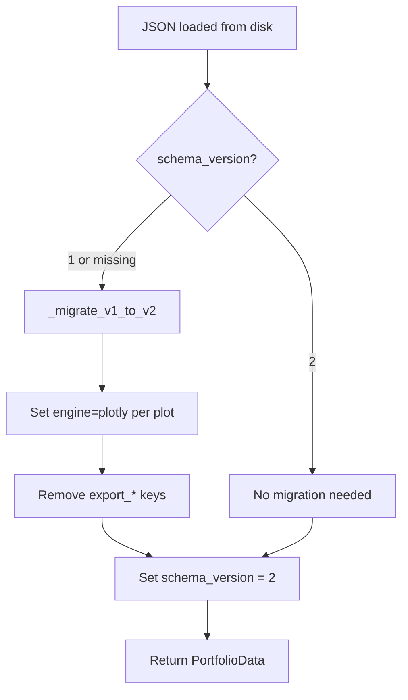
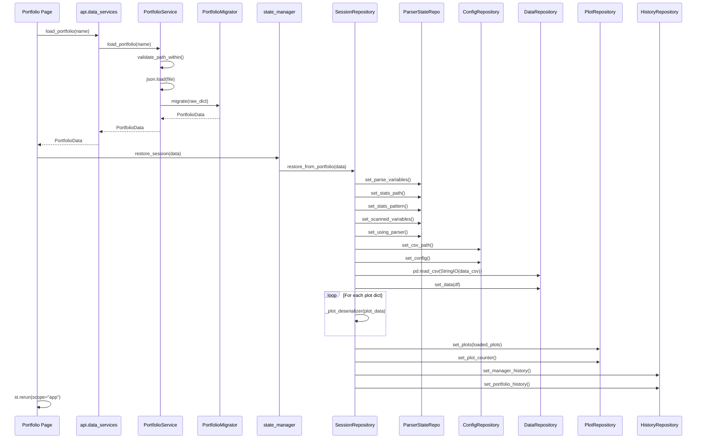
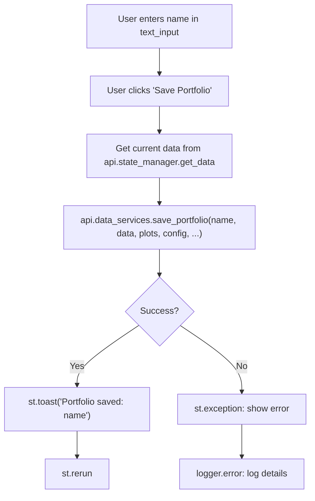
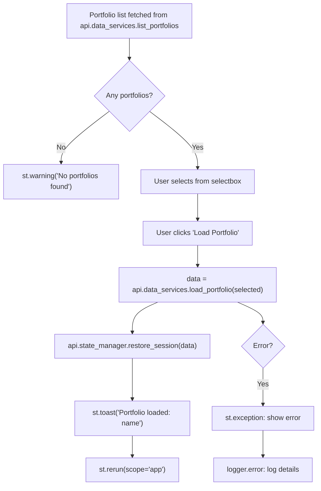
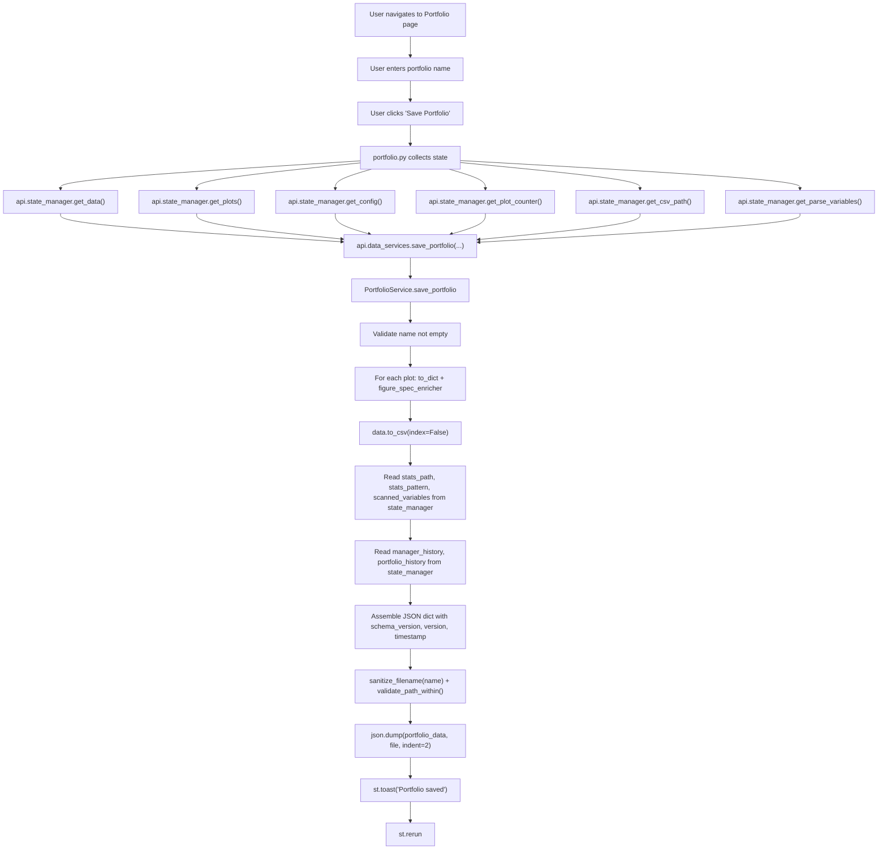
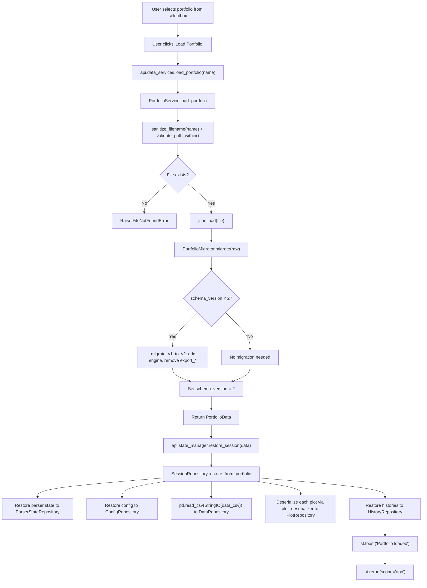
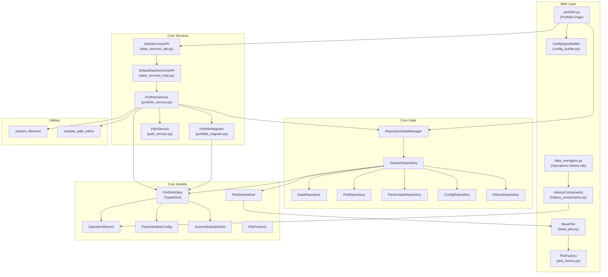

# Step 15 -- Portfolio System Analysis

> **Objective**: Document the complete portfolio system -- models, service, persistence,
> migration, save/load lifecycle, and schema evolution.

---

## 1. Executive Summary

The portfolio system implements the **Memento design pattern** for the RING-5 Unified
Engine v2 application, enabling users to capture a complete snapshot of their working
session -- data, plots, configurations, parser state, and operation history -- into a
single JSON file and restore it later. This provides session persistence across
application restarts, sharing between users, and reproducible analysis workflows.

### Architecture at a Glance

The portfolio system is layered across three tiers:

1. **Core Models** (`portfolio_models.py`) -- The `PortfolioData` TypedDict defines the
   canonical serialization schema carrying 13 fields.
2. **Core Services** (`portfolio_service.py`, `portfolio_migrator.py`) -- The
   `PortfolioService` handles serialization, file I/O, and state collection; the
   `PortfolioMigrator` provides forward-compatible schema evolution.
3. **Web Layer** (`portfolio.py`) -- The Streamlit page provides the user interface
   for save, load, and management operations.

State restoration is handled by `SessionRepository.restore_from_portfolio()`, which
distributes portfolio data across all seven in-memory repositories. A
`PlotDeserializer` callable is dependency-injected at bootstrap so the core layer
never imports web-layer classes.

### Key Quantities

| Metric | Value |
|--------|-------|
| PortfolioData fields | 13 (+ 3 envelope fields) |
| Schema versions | 2 (V1 original, V2 current) |
| File format | JSON with embedded CSV |
| Storage location | `<project_root>/.ring5/portfolios/*.json` |
| PortfolioService methods | 4 (save, load, list, delete) |
| Migration paths | 1 (V1 -> V2) |
| Repositories restored on load | 5 (parser, config, data, plot, history) |
| Test files covering portfolio | 8 (3 unit, 3 integration, 1 E2E AppTest, 1 visual POM) |

---

## 2. PortfolioData TypedDict -- Complete Schema

### 2.1 Definition

**File**: `src/core/models/portfolio_models.py`

```python
class PortfolioData(TypedDict, total=False):
    parse_variables: list[ParseVariableConfig]
    stats_path: str
    stats_pattern: str
    csv_path: str
    use_parser: bool
    scanned_variables: list[ScannedVariableDict]
    data_csv: str
    plots: list[dict[str, Any]]
    plot_counter: int
    config: dict[str, Any]
    shapers: list[ShaperStepConfig]
    manager_history: list[OperationRecord]
    portfolio_history: list[OperationRecord]
```

The `total=False` declaration makes all fields optional, enabling backward
compatibility -- older portfolios missing newer fields load without errors
because `dict.get()` returns sensible defaults.

### 2.2 Field-by-Field Documentation

| # | Field | Type | Source Repository | Purpose |
|---|-------|------|-------------------|---------|
| 1 | `parse_variables` | `list[ParseVariableConfig]` | `ParserStateRepository` | List of simulator variable configurations (name, type, _id, optional entries/statistics/range). Defines which variables to extract from stats files. |
| 2 | `stats_path` | `str` | `ParserStateRepository` | Base filesystem path to simulator statistics directory (e.g., `/path/to/gem5/stats`). |
| 3 | `stats_pattern` | `str` | `ParserStateRepository` | Glob filename pattern for locating stats files within the path (e.g., `"stats.txt"`, `"*.log"`). |
| 4 | `csv_path` | `str` | `ConfigRepository` | Path to the original CSV data file. May be `null` for config-only portfolios or parser-generated data. |
| 5 | `use_parser` | `bool` | `ParserStateRepository` | Whether parser mode was enabled when the portfolio was saved. Controls restoration of parser-specific UI state. |
| 6 | `scanned_variables` | `list[ScannedVariableDict]` | `ParserStateRepository` | Variables auto-discovered by the scanner (name, type, entries, optional min/max/pattern_indices/count). Avoids needing to re-scan on load. |
| 7 | `data_csv` | `str` | `DataRepository` | The complete dataset serialized as a CSV string via `DataFrame.to_csv(index=False)`. Empty string for config-only portfolios. |
| 8 | `plots` | `list[dict[str, Any]]` | `PlotRepository` | Serialized plot objects from `BasePlot.to_dict()`. Each dict contains: `id`, `name`, `plot_type`, `config`, `processed_data` (CSV string), `pipeline`, `pipeline_counter`, `legend_mappings_by_column`, `legend_mappings`, and optionally `figure_spec`. |
| 9 | `plot_counter` | `int` | `PlotRepository` | Monotonic counter for generating unique plot IDs. Restored so that new plots created after loading do not collide with existing IDs. |
| 10 | `config` | `dict[str, Any]` | `ConfigRepository` | Generic application configuration dictionary. Stores global settings that are not plot-specific. |
| 11 | `shapers` | `list[ShaperStepConfig]` | (Not currently populated) | Reserved for global shaper pipeline steps. Field is defined in the TypedDict but not written during save (individual plot pipelines carry their own shaper steps). |
| 12 | `manager_history` | `list[OperationRecord]` | `HistoryRepository` | Rolling list of recent data manager operations (FIFO capped at 10 in the repository, but all records present at save time are serialized). |
| 13 | `portfolio_history` | `list[OperationRecord]` | `HistoryRepository` | Unbounded complete audit trail of every data transformation operation performed during the session. |

### 2.3 Envelope Fields (Not in TypedDict)

The `PortfolioService.save_portfolio()` method adds three additional envelope fields
to the JSON file that are not part of the `PortfolioData` TypedDict:

| Field | Type | Written By | Purpose |
|-------|------|-----------|---------|
| `schema_version` | `int` | `PortfolioService` | Schema version for migration (currently `2`). |
| `version` | `str` | `PortfolioService` | Human-readable format version (`"2.0"`). |
| `timestamp` | `str` | `PortfolioService` | ISO-8601 timestamp of when the portfolio was saved. |

### 2.4 OperationRecord Structure

Each history entry follows the `OperationRecord` TypedDict:

```python
class OperationRecord(TypedDict):
    source_columns: list[str]    # Input column(s)
    dest_columns: list[str]      # Output column(s) produced/affected
    operation: str               # Human-readable operation name
    timestamp: str               # ISO-8601 timestamp
```

**File**: `src/core/models/history_models.py`

### 2.5 ParseVariableConfig Structure

Each parse variable follows this TypedDict (with `total=False` for optional fields):

| Field | Type | Required | Description |
|-------|------|----------|-------------|
| `name` | `str` | Yes | Variable name (e.g., `"simTicks"`, `"system.cpu.ipc"`) |
| `type` | `str` | Yes | Variable type: `"scalar"`, `"vector"`, `"configuration"`, `"distribution"`, `"histogram"` |
| `_id` | `str` | Yes | UUID for unique identification |
| `alias` | `str` | No | Alternative name for the variable |
| `vectorEntries` | `list[str] \| str` | No | Specific entries to extract from vectors |
| `statistics` | `list[str]` | No | Distribution/histogram statistics to compute |
| `minimum` / `maximum` | `float` | No | Distribution range bounds |
| `enableRebin` | `bool` | No | Whether to rebin histograms |
| `bins` | `int` | No | Number of bins for rebinning |
| `onEmpty` | `str` | No | Behavior when variable is missing |
| `repeat` | `str` | No | Repeat count for Perl parser |
| `patternSelection` | `list[str]` | No | Pattern index selections |
| `keepIndices` | `bool` | No | Whether to keep pattern indices in output |

**File**: `src/core/models/data_models.py`

### 2.6 ScannedVariableDict Structure

| Field | Type | Required | Description |
|-------|------|----------|-------------|
| `name` | `str` | Yes | Variable name discovered in stats files |
| `type` | `str` | Yes | Detected variable type |
| `entries` | `list[str]` | Yes | Discrete entries/values found |
| `minimum` | `float` | No | Minimum value observed |
| `maximum` | `float` | No | Maximum value observed |
| `pattern_indices` | `list[str]` | No | Pattern indices found |
| `count` | `int` | No | Number of occurrences |

**File**: `src/core/models/data_models.py`

---

## 3. Portfolio Service

### 3.1 Class Overview

**File**: `src/core/services/data_services/portfolio_service.py`

```python
class PortfolioService:
    def __init__(self, state_manager: StateManager) -> None: ...
    def list_portfolios(self) -> list[str]: ...
    def save_portfolio(self, name, data, plots, config, plot_counter, csv_path, parse_variables, figure_spec_enricher) -> None: ...
    def load_portfolio(self, name: str) -> PortfolioData: ...
    def delete_portfolio(self, name: str) -> None: ...
```

The `PortfolioService` is instantiated inside `DefaultDataServicesAPI.__init__()`,
receiving the `StateManager` so it can read parser state and history during save.

### 3.2 Method Detail

#### `list_portfolios() -> list[str]`

- Reads `PathService.get_portfolios_dir()` (`.ring5/portfolios/`).
- Globs for `*.json` files.
- Returns list of stem names (without `.json` extension).
- Returns empty list if directory does not exist.

#### `save_portfolio(...) -> None`

**Parameters**:

| Parameter | Type | Required | Description |
|-----------|------|----------|-------------|
| `name` | `str` | Yes | Portfolio name (becomes filename) |
| `data` | `DataFrame \| None` | Yes | Current working DataFrame |
| `plots` | `list[PlotProtocol]` | Yes | Active plot objects |
| `config` | `dict[str, Any]` | Yes | Global application config |
| `plot_counter` | `int` | Yes | Current plot ID counter |
| `csv_path` | `str \| None` | No | Original CSV file path |
| `parse_variables` | `list[str] \| None` | No | Parser variable names |
| `figure_spec_enricher` | `Callable \| None` | No | Web-layer callback for building FigureConfig dicts |

**Flow**:

1. **Validate** -- Raises `ValueError` if `name` is empty.
2. **Serialize plots** -- For each plot, calls `plot.to_dict()` to produce a serializable dict. If `figure_spec_enricher` is provided, calls it with the plot's config dict and plot_type to build a `FigureConfig` dict, which is attached as `plot_dict["figure_spec"]`. Exceptions are caught and logged (the plot is still saved without the spec).
3. **Serialize data** -- Calls `data.to_csv(index=False)` if data is non-None and non-empty; otherwise stores `""`.
4. **Read state** -- Pulls `stats_path`, `stats_pattern`, `scanned_variables`, `manager_history`, and `portfolio_history` from the injected `state_manager`.
5. **Assemble envelope** -- Adds `schema_version`, `version`, `timestamp`.
6. **Write file** -- Constructs `<portfolios_dir>/<sanitize_filename(name)>.json` path, validates it with `validate_path_within()`, and writes via `json.dump(portfolio_data, f, indent=2)`.

#### `load_portfolio(name: str) -> PortfolioData`

**Flow**:

1. **Construct path** -- `<portfolios_dir>/<sanitize_filename(name)>.json`.
2. **Validate path** -- `validate_path_within()` ensures no path traversal.
3. **Check existence** -- Raises `FileNotFoundError` if file does not exist.
4. **Read JSON** -- `json.load(f)` produces a raw dict.
5. **Migrate** -- `PortfolioMigrator.migrate(raw)` upgrades schema if needed.
6. **Return** -- Cast to `PortfolioData` and return.

#### `delete_portfolio(name: str) -> None`

1. Constructs and validates the path.
2. Calls `path.unlink()` if the file exists.
3. No-op if file does not exist (no error raised).

### 3.3 Service Wiring

```
ApplicationAPI.__init__()
    |
    +-- self._services = DefaultServicesAPI(self.state_manager)
              |
              +-- DefaultDataServicesAPI.__init__(state_manager)
                      |
                      +-- self._portfolio_service = PortfolioService(state_manager)
```

The web layer accesses portfolio operations via `api.data_services.save_portfolio()`,
`api.data_services.load_portfolio()`, etc. The `DataServicesAPI` protocol defines
the contract; `DefaultDataServicesAPI` delegates to `PortfolioService`.

### 3.4 Figure Spec Enrichment

The `figure_spec_enricher` callback bridges the **core -> web** dependency gap. In
production, the portfolio page passes `_build_figure_spec`:

```python
def _build_figure_spec(config: dict[str, Any], plot_type: str) -> dict[str, Any] | None:
    spec = ConfigSpecBuilder.from_config(config, plot_type)
    return spec.to_dict()
```

**File**: `src/web/pages/portfolio.py` (line 20-23)

This converts each plot's flat config dict into a full `FigureConfig` dataclass
(via `ConfigSpecBuilder.from_config()`), then serializes it back to a dict
(`spec.to_dict()`). The resulting dict is stored as `plot_dict["figure_spec"]` in
the portfolio JSON, providing a snapshot of the complete rendering specification
that can be used for cross-engine compatibility (Plotly <-> Matplotlib).

---

## 4. Portfolio Migrator

### 4.1 Class Overview

**File**: `src/core/services/portfolio_migrator.py`

```python
class PortfolioMigrator:
    CURRENT_VERSION: int = 2

    @staticmethod
    def migrate(portfolio_data: dict[str, Any]) -> dict[str, Any]: ...

    @staticmethod
    def _migrate_v1_to_v2(data: dict[str, Any]) -> dict[str, Any]: ...
```

### 4.2 Schema Versions

| Version | Description | Key Characteristics |
|---------|-------------|---------------------|
| V1 (original) | Flat config dicts, LaTeX `export_*` keys | No `engine` field per plot, `export_format`, `export_dpi`, `export_path` keys in plot configs. No `schema_version` field (inferred as 1). |
| V2 (current) | Engine field per plot, no export keys | `schema_version: 2`, each plot config has `engine` field, all `export_*` keys removed, download handled separately. |

### 4.3 Migration Flow

```
PortfolioMigrator.migrate(raw)
    |
    +-- Read version: int(raw.get("schema_version", 1))
    |
    +-- if version < 2:
    |       _migrate_v1_to_v2(raw)
    |
    +-- Set raw["schema_version"] = CURRENT_VERSION (2)
    |
    +-- Return migrated dict
```

### 4.4 V1 -> V2 Migration Details

**Method**: `_migrate_v1_to_v2(data)`

1. **Deep copy** the entire portfolio dict to avoid mutating the caller's data.
2. For each plot in `data["plots"]`:
   - Access the `config` sub-dict.
   - Call `config.setdefault("engine", "plotly")` -- adds `engine` only if absent, preserving explicit values like `"matplotlib"`.
   - Collect all keys starting with `"export_"`.
   - Delete each `export_*` key from the config.
3. Return the modified copy.

### 4.5 Migration Properties

- **Idempotent**: Migrating an already V2 portfolio is a safe no-op. Running `migrate()` twice produces identical output.
- **Forward-compatible**: Unknown keys are preserved. Custom user keys in plot configs survive migration untouched.
- **Non-destructive**: Uses `copy.deepcopy()` to avoid modifying the original dict.
- **Graceful with missing data**: Empty `plots` lists, missing `config` dicts, and missing `plots` keys are all handled without errors.

### 4.6 Migration Architecture Diagram



---

## 5. Session Restoration -- `restore_from_portfolio()`

### 5.1 Method Location

**File**: `src/core/state/repositories/session_repository.py`

**Called by**: `RepositoryStateManager.restore_session()` which delegates to
`SessionRepository.restore_from_portfolio()`.

### 5.2 Restoration Sequence

```python
def restore_from_portfolio(self, portfolio_data: PortfolioData) -> None:
```

The method restores state in a specific order across five repository domains:

#### Step 1: Clear Widget State

```python
self.clear_widget_state()  # No-op placeholder (domain repos are UI-agnostic)
```

#### Step 2: Restore Parser State

```python
self.parser_repo.set_parse_variables(portfolio_data.get("parse_variables", []))
self.parser_repo.set_stats_path(portfolio_data.get("stats_path", ""))
self.parser_repo.set_stats_pattern(portfolio_data.get("stats_pattern", "stats.txt"))
self.parser_repo.set_scanned_variables(portfolio_data.get("scanned_variables", []))
self.parser_repo.set_using_parser(bool(portfolio_data.get("use_parser", False)))
```

Defaults are provided for every field, ensuring older portfolios without these fields
load correctly.

#### Step 3: Restore Config State

```python
self.config_repo.set_csv_path(portfolio_data.get("csv_path", ""))
self.config_repo.set_config(portfolio_data.get("config", {}))
```

#### Step 4: Restore Data

```python
data_csv = portfolio_data.get("data_csv", "")
if data_csv:
    df = pd.read_csv(io.StringIO(data_csv))
    self.data_repo.set_data(df)
```

The CSV string is deserialized via `pd.read_csv(io.StringIO(data_csv))`. If the
string is empty (config-only portfolio), data is left as-is and an info log is emitted.

**Error handling**: If `pd.read_csv()` fails (corrupted CSV), the exception is caught
and logged. The session continues without data rather than crashing.

#### Step 5: Restore Plots

```python
loaded_plots: list[PlotProtocol] = []
if self._plot_deserializer is not None:
    for plot_data in portfolio_data.get("plots", []):
        try:
            plot = self._plot_deserializer(plot_data)
            if plot is not None:
                loaded_plots.append(plot)
        except Exception as e:
            logger.error(f"SESSION_REPO: Failed to restore plot: {e}")

self.plot_repo.set_plots(loaded_plots)
self.plot_repo.set_plot_counter(portfolio_data.get("plot_counter", len(loaded_plots)))
```

Plots are deserialized one at a time via the injected `PlotDeserializer` callable
(`BasePlot.from_dict` in production). Failed plots are logged and skipped, not
terminating the load. The plot counter defaults to the number of successfully loaded
plots if absent from the portfolio.

If no `_plot_deserializer` was injected (e.g., in a test scenario), all plots are
skipped with a warning log.

#### Step 6: Restore History

```python
self.history_repo.set_manager_history(portfolio_data.get("manager_history", []))
self.history_repo.set_portfolio_history(portfolio_data.get("portfolio_history", []))
```

### 5.3 Restoration Flow Diagram



---

## 6. Portfolio Page UI

### 6.1 Page Entry Point

**File**: `src/web/pages/portfolio.py`

```python
def show_portfolio_page(api: ApplicationAPI) -> None:
```

The page is navigated to via the sidebar as "Save/Load Portfolio". The main content
is rendered inside a Streamlit fragment (`st.fragment`) to enable partial reruns
without reloading the entire page.

### 6.2 Page Layout

```
+---------------------------+---------------------------+
|    SAVE PORTFOLIO (col1)  |    LOAD PORTFOLIO (col2)  |
|                           |                           |
|  "### Save Portfolio"     |  "### Load Portfolio"     |
|  Description text         |  Description text         |
|                           |                           |
|  [Portfolio Name: ____]   |  [Select Portfolio: v]    |
|  (text_input, default     |  (selectbox from          |
|   "my_portfolio")         |   list_portfolios())      |
|                           |                           |
|  [Save Portfolio]         |  [Load Portfolio]         |
|  (primary button)         |  (primary button)         |
+---------------------------+---------------------------+
|                                                       |
|  --- Horizontal Rule ---                              |
|                                                       |
|  "### Manage Saved Portfolios"                        |
|                                                       |
|  > portfolio_name_1                                   |
|    [Delete]                                           |
|  > portfolio_name_2                                   |
|    [Delete]                                           |
|  ...                                                  |
+-------------------------------------------------------+
```

### 6.3 Session State Keys

| Key | Type | Widget | Purpose |
|-----|------|--------|---------|
| `portfolio_save_name` | `str` | `st.text_input` | Portfolio name for saving |
| `portfolio_load_select` | `str` | `st.selectbox` | Selected portfolio for loading |
| `del_portfolio_{name}` | -- | `st.button` | Delete button per portfolio (dynamic key) |

### 6.4 Save Flow (UI)



The save operation collects seven pieces of state from the API:

1. `api.state_manager.get_data()` -- Current DataFrame
2. `api.state_manager.get_plots()` -- All active plot objects
3. `api.state_manager.get_config()` -- Global configuration
4. `api.state_manager.get_plot_counter()` -- Plot ID counter
5. `api.state_manager.get_csv_path()` -- Original CSV path
6. `api.state_manager.get_parse_variables()` -- Parser variable configs
7. `_build_figure_spec` -- Injected as `figure_spec_enricher`

### 6.5 Load Flow (UI)



Note: The load calls `st.rerun(scope="app")` with app scope to force a complete
re-render across all pages, ensuring the restored state is reflected everywhere.

### 6.6 Delete Flow (UI)

The management section lists all portfolios as expandable sections. Each contains
a "Delete" button with `on_click` callback:

```python
def _delete_portfolio(name: str = pname) -> None:
    api.data_services.delete_portfolio(name)
    st.toast(f"Deleted {name}", icon="...")
```

The `on_click` binding captures the `pname` via default argument to avoid the
Python closure variable capture issue in loops.

### 6.7 Fragment Architecture

The core UI logic lives inside `_portfolio_fragment(api)`, which is wrapped with
`st.fragment()`:

```python
st.fragment(_portfolio_fragment)(api)
```

This means:
- The fragment can rerun independently during button clicks without reloading the
  outer page shell.
- Portfolio list queries (`list_portfolios()`) only execute when the fragment reruns,
  not on every full-page rerun.
- The `portfolios` variable is fetched once at the top of the fragment and reused
  for both the load section and the management section, avoiding double disk I/O.

---

## 7. File System Layout

### 7.1 PathService

**File**: `src/core/services/data_services/path_service.py`

```python
class PathService:
    @staticmethod
    def get_root_dir() -> Path:       # Project root (5 levels up from this file)
    @staticmethod
    def get_data_dir() -> Path:       # <root>/.ring5/ (mkdir on first access)
    @staticmethod
    def get_portfolios_dir() -> Path: # <root>/.ring5/portfolios/ (mkdir on first access)
    @staticmethod
    def get_pipelines_dir() -> Path:  # <root>/.ring5/pipelines/ (mkdir on first access)
```

Directory creation is lazy and cached -- `mkdir(parents=True, exist_ok=True)` is
called only on the first access, then the `Path` object is cached in a class variable.

### 7.2 Directory Structure

```
<project_root>/
  .ring5/
    portfolios/
      my_portfolio.json
      ipc_analysis.json
      ...
    pipelines/
      ...
```

### 7.3 File Naming

Portfolio filenames are derived from the user-provided name via `sanitize_filename()`:

```python
def sanitize_filename(name: str) -> str:
    name = name.replace("/", "_").replace("\\", "_")
    name = name.replace("..", "_")
    name = name.lstrip(".")
    return name if name else "unnamed"
```

This prevents:
- Path traversal via `/` or `\` characters
- Parent directory escape via `..`
- Hidden files via leading dots
- Empty filenames (falls back to `"unnamed"`)

### 7.4 Path Validation

All file operations go through `validate_path_within()`:

```python
def validate_path_within(path: Path, allowed_base: Path) -> Path:
```

This function:
1. Normalizes both paths with `os.path.normpath()`.
2. Resolves to absolute paths with `os.path.abspath()`.
3. Uses `os.path.commonpath()` to verify containment.
4. Raises `ValueError` if the path escapes the allowed base directory.

This prevents path traversal attacks even if `sanitize_filename()` is bypassed.

### 7.5 Sample Portfolio JSON

From `.ring5/portfolios/my_portfolio.json`:

```json
{
  "schema_version": 2,
  "version": "2.0",
  "timestamp": "2026-03-03T00:02:06.797468",
  "data_csv": "",
  "csv_path": null,
  "plots": [],
  "plot_counter": 0,
  "config": {},
  "parse_variables": [],
  "stats_path": "/path/to/stats",
  "stats_pattern": "stats.txt",
  "scanned_variables": [],
  "manager_history": [],
  "portfolio_history": []
}
```

This is a minimal config-only portfolio with no data, no plots, and default parser
state.

---

## 8. Plot Serialization and Deserialization

### 8.1 BasePlot.to_dict()

**File**: `src/web/pages/ui/plotting/base_plot.py`

```python
def to_dict(self) -> dict[str, Any]:
    return {
        "id": self.plot_id,
        "name": self.name,
        "plot_type": self.plot_type,
        "config": self.config,
        "processed_data": (
            self.processed_data.to_csv(index=False)
            if isinstance(self.processed_data, pd.DataFrame)
            else None
        ),
        "pipeline": self.pipeline,
        "pipeline_counter": self.pipeline_counter,
        "legend_mappings_by_column": self.legend_mappings_by_column,
        "legend_mappings": self.legend_mappings,
    }
```

Key serialization details:
- `processed_data` is serialized as a CSV string (same approach as the main `data_csv`).
- `pipeline` is a list of `PipelineStep` TypedDicts (already JSON-serializable).
- `config` is a flat dict of widget values (already JSON-serializable).
- `last_generated_fig` is NOT serialized (Plotly Figure objects are regenerated on render).
- `last_traces` is NOT serialized (trace build results are regenerated).

### 8.2 BasePlot.from_dict()

```python
@classmethod
def from_dict(cls, data: dict[str, Any]) -> "BasePlot":
    from .plot_factory import PlotFactory

    plot = PlotFactory.create_plot(
        plot_type=data["plot_type"], plot_id=data["id"], name=data["name"]
    )
    plot.config = data.get("config", {})
    plot.pipeline = data.get("pipeline", [])
    plot.pipeline_counter = data.get("pipeline_counter", 0)
    plot.legend_mappings_by_column = data.get("legend_mappings_by_column", {})
    plot.legend_mappings = data.get("legend_mappings", {})

    if data.get("processed_data"):
        plot.processed_data = pd.read_csv(StringIO(data["processed_data"]))

    return plot
```

Deserialization uses `PlotFactory.create_plot()` to instantiate the correct subclass
(BarPlot, LinePlot, ScatterPlot, etc.) based on `plot_type`, then restores all
serialized attributes.

### 8.3 PlotDeserializer Injection

The `BasePlot.from_dict` classmethod is passed as the `plot_deserializer` argument
during application bootstrap:

```python
# In app.py:
api = ApplicationAPI(plot_deserializer=BasePlot.from_dict)
```

This value flows through:
```
ApplicationAPI.__init__(plot_deserializer)
    -> RepositoryStateManager.__init__(plot_deserializer)
        -> SessionRepository.__init__(plot_deserializer)
            -> self._plot_deserializer = plot_deserializer
```

During restoration, `SessionRepository.restore_from_portfolio()` calls
`self._plot_deserializer(plot_data)` for each plot dict, converting it back into
a `BasePlot` subclass instance without the core layer ever importing web-layer code.

### 8.4 Serialized Plot Schema

Based on `BasePlot.to_dict()` and the JSON schema (`portfolio_schema.json`):

```json
{
  "id": 1,
  "name": "IPC Analysis",
  "plot_type": "grouped_bar",
  "config": {
    "x": "benchmark_name",
    "y": "system.cpu.ipc",
    "group": "config_description",
    "title": "Performance Comparison",
    "width": 800,
    "height": 500,
    "engine": "plotly",
    "legend_labels": { "baseline": "Baseline", "optimized": "Opt" }
  },
  "processed_data": "benchmark_name,system.cpu.ipc,config_description\nmcf,1.23,baseline\n...",
  "pipeline": [
    {
      "id": 0,
      "type": "columnSelector",
      "config": { "columns": ["benchmark_name", "system.cpu.ipc", "config_description"] }
    }
  ],
  "pipeline_counter": 1,
  "legend_mappings_by_column": {},
  "legend_mappings": { "baseline": "Baseline", "optimized": "Opt" },
  "figure_spec": { "dimensions": { "width": 800.0, "height": 500.0 }, ... }
}
```

---

## 9. Cross-Page Portfolio State Sharing

### 9.1 Portfolio History on Data Managers Page

The portfolio history is displayed on the Data Managers page in a dedicated tab:

**File**: `src/web/pages/data_managers.py` (line 112)

```python
with tab7:
    HistoryComponents.render_portfolio_history(api.get_portfolio_history())
```

This renders the complete unbounded audit trail of all data transformation operations,
providing users with a comprehensive view of everything that happened during the
session (or was restored from a portfolio).

### 9.2 History Dual-Write Pattern

When any data manager confirms an operation, `ApplicationAPI.add_manager_history_record()`
writes the record to **both** history lists simultaneously:

```python
def add_manager_history_record(self, record: OperationRecord) -> None:
    self.state_manager.add_manager_history_record(record)    # Rolling cap at 10
    self.state_manager.add_portfolio_history_record(record)  # Unbounded
```

This ensures the portfolio history is always a superset of the manager history and
provides a complete audit trail when the portfolio is saved.

### 9.3 State Access Pattern Across Pages

| Page | Reads Portfolio State | Writes Portfolio State |
|------|----------------------|----------------------|
| `portfolio.py` | data, plots, config, plot_counter, csv_path, parse_variables, history | Full session restore via `restore_session()` |
| `data_managers.py` | portfolio_history (for Operations History tab) | Indirectly via add_manager_history_record |
| `manage_plots.py` | plots (restored from portfolio) | -- |
| `data_source.py` | parser config, csv_path (restored from portfolio) | -- |

### 9.4 State Continuity After Load

When a portfolio is loaded:
1. `restore_session()` populates all repositories.
2. `st.rerun(scope="app")` forces a full page re-render.
3. All pages re-read their state from the repositories and display the restored values.
4. The user can continue working from exactly where the portfolio was saved.

Specifically:
- **Data Source page**: Parser configuration, stats path, and pattern are restored.
  The scanned variables list is available without needing to re-scan.
- **Data Managers page**: The loaded DataFrame is available for transformations.
  The portfolio history tab shows all operations from the saved session.
- **Manage Plots page**: All plots with their configs, pipelines, and processed data
  are restored. Figures are regenerated on first render (not serialized).

---

## 10. Complete Save/Load Lifecycle

### 10.1 Save Lifecycle



### 10.2 Load Lifecycle



### 10.3 What IS Serialized

| Data Category | Serialization Method | Storage Format |
|---------------|---------------------|----------------|
| Primary DataFrame | `df.to_csv(index=False)` | CSV string in `data_csv` |
| Per-plot processed data | `df.to_csv(index=False)` | CSV string in `plot.processed_data` |
| Plot configurations | `plot.to_dict()` | Nested JSON dict |
| Plot pipelines | Direct serialization | List of `PipelineStep` dicts |
| Legend mappings | Direct serialization | Dict of `str -> str` |
| Parser variables | Direct serialization | List of `ParseVariableConfig` dicts |
| Scanned variables | Direct serialization | List of `ScannedVariableDict` dicts |
| Operation history | Direct serialization | List of `OperationRecord` dicts |
| Figure specs | `ConfigSpecBuilder.from_config().to_dict()` | Nested `FigureConfig` dict |

### 10.4 What is NOT Serialized

| Data Category | Reason | Rebuilt How |
|---------------|--------|-------------|
| Plotly `Figure` objects (`last_generated_fig`) | Not JSON-serializable; stateful graphics objects | Regenerated by `create_figure()` on first render |
| `TraceBuildResult` (`last_traces`) | Engine-specific trace data | Regenerated by `create_traces()` |
| Preview DataFrames (PreviewRepository) | Temporary try-before-confirm data | User must re-preview if needed |
| Visualization configs (VisualizationRepository) | Per-plot `FigureConfig` objects | Rebuilt from plot config on render |
| Processed data (DataRepository._processed_data) | Derived from primary data + pipeline | Rebuilt by running the pipeline |
| UI state (auto_refresh, dialog flags, widget keys) | Transient presentation state | Reset to defaults on page load |
| Plot figure cache (`SimpleCache`) | Performance optimization, not state | Regenerated on demand (TTL: 5 min) |
| Temp directory path (ConfigRepository._temp_dir) | Session-specific filesystem artifact | Created anew if parsing is needed |
| CSV pool (ConfigRepository._csv_pool) | Loaded from disk on demand | Re-loaded via `CsvPoolService.load_pool()` |
| Saved configs list (ConfigRepository._saved_configs) | Loaded from disk on demand | Re-loaded via `ConfigService.load_saved_configs()` |

---

## 11. Error Handling and Validation

### 11.1 Save-Side Validation

| Error Condition | Handler | Behavior |
|-----------------|---------|----------|
| Empty portfolio name | `PortfolioService.save_portfolio()` | Raises `ValueError("Portfolio name cannot be empty")` |
| Path traversal in name | `sanitize_filename()` + `validate_path_within()` | Sanitizes slashes, dots; validates resolved path is within portfolios dir |
| `figure_spec_enricher` fails | `try/except` in save loop | Logs debug message, saves plot without `figure_spec` |
| `data.to_csv()` fails | Not explicitly caught | Would propagate to UI, caught by `st.exception()` |
| `json.dump()` fails (disk full, permissions) | Not explicitly caught | Would propagate to UI, caught by `st.exception()` |

### 11.2 Load-Side Validation

| Error Condition | Handler | Behavior |
|-----------------|---------|----------|
| Portfolio file does not exist | `PortfolioService.load_portfolio()` | Raises `FileNotFoundError(f"Portfolio '{name}' not found")` |
| Path traversal in name | `sanitize_filename()` + `validate_path_within()` | Raises `ValueError` |
| Corrupted JSON | `json.load()` | Raises `json.JSONDecodeError`, caught by UI |
| Corrupted CSV data | `pd.read_csv()` in `restore_from_portfolio()` | Caught: logs error, continues without data |
| Invalid plot data | `_plot_deserializer()` in `restore_from_portfolio()` | Caught: logs error, skips that plot |
| Missing optional fields | `.get(key, default)` throughout | All fields have defaults, never raises `KeyError` |
| No plot deserializer injected | Check `self._plot_deserializer is not None` | Logs warning, skips all plots |

### 11.3 UI-Level Error Handling

Both the save and load code paths in `portfolio.py` wrap their operations in
`try/except Exception`:

```python
# Save
try:
    api.data_services.save_portfolio(...)
    st.toast(f"Portfolio saved: {portfolio_name}")
    st.rerun()
except Exception as e:
    st.exception(e)
    logger.error("PORTFOLIO: Failed to save portfolio %r: %s", ...)

# Load
try:
    data = api.data_services.load_portfolio(selected_portfolio)
    api.state_manager.restore_session(data)
    st.toast(f"Portfolio loaded: {selected_portfolio}")
    st.rerun(scope="app")
except Exception as e:
    st.exception(e)
    logger.error("PORTFOLIO: Failed to load portfolio '%s': %s", ...)
```

`st.exception(e)` renders the full traceback in the UI for debugging.
`logger.error(...)` logs with `exc_info=True` for server-side diagnostics.

### 11.4 Security Measures

1. **Filename sanitization** (`sanitize_filename`): Replaces `/`, `\` with `_`;
   replaces `..` with `_`; strips leading dots; falls back to `"unnamed"`.
2. **Path containment** (`validate_path_within`): Uses `os.path.commonpath` after
   `normpath` + `abspath` to prevent sibling-path bypasses
   (e.g., `/allowed/base_evil` matching `/allowed/base`).
3. **Log injection prevention** (`sanitize_log_value`): Used in log messages to
   strip newlines and control characters from user-provided portfolio names.

---

## 12. Data Services API Integration

### 12.1 Protocol Definition

**File**: `src/core/services/data_services/data_services_api.py`

The `DataServicesAPI` protocol defines four portfolio-related methods:

```python
@runtime_checkable
class DataServicesAPI(Protocol):
    def list_portfolios(self) -> list[str]: ...
    def save_portfolio(self, name, data, plots, config, plot_counter, csv_path, parse_variables, figure_spec_enricher) -> None: ...
    def load_portfolio(self, name: str) -> PortfolioData: ...
    def delete_portfolio(self, name: str) -> None: ...
```

### 12.2 Implementation Delegation

**File**: `src/core/services/data_services/data_services_impl.py`

```python
class DefaultDataServicesAPI:
    def __init__(self, state_manager: StateManager) -> None:
        self._portfolio_service = PortfolioService(state_manager)

    def list_portfolios(self) -> list[str]:
        return self._portfolio_service.list_portfolios()

    def save_portfolio(self, ...) -> None:
        self._portfolio_service.save_portfolio(...)

    def load_portfolio(self, name: str) -> PortfolioData:
        return self._portfolio_service.load_portfolio(name)

    def delete_portfolio(self, name: str) -> None:
        self._portfolio_service.delete_portfolio(name)
```

All portfolio operations are pure delegation to `PortfolioService`. The
`DefaultDataServicesAPI` also hosts CSV pool, configuration, and variable services
but those are separate concerns.

### 12.3 StateManager Protocol for Portfolio

**File**: `src/core/state/state_manager.py`

The `StateManager` protocol defines two session-level methods used by the portfolio
system:

```python
class StateManager(Protocol):
    def clear_all(self) -> None: ...
    def restore_session(self, portfolio_data: PortfolioData) -> None: ...
```

Plus all the getters used by `PortfolioService.save_portfolio()`:
- `get_stats_path()`, `get_stats_pattern()`, `get_scanned_variables()`
- `get_manager_history()`, `get_portfolio_history()`

---

## 13. Complete Dependency Graph



---

## 14. JSON Schema

### 14.1 Formal Schema

**File**: `src/core/models/config/schemas/portfolio_schema.json`

```json
{
  "$schema": "http://json-schema.org/draft-07/schema#",
  "title": "RING-5 Portfolio",
  "description": "Schema for complete portfolio snapshots including data and plots.",
  "type": "object",
  "properties": {
    "version": { "type": "string" },
    "timestamp": { "type": "string", "format": "date-time" },
    "data_csv": { "type": "string" },
    "csv_path": { "type": ["string", "null"] },
    "plots": {
      "type": "array",
      "items": {
        "type": "object",
        "properties": {
          "id": { "type": "integer" },
          "name": { "type": "string" },
          "plot_type": { "type": "string" },
          "config": { "type": "object", "additionalProperties": true },
          "processed_data": { "type": ["string", "null"] },
          "pipeline": { "type": "array", "items": { "type": "object" } },
          "pipeline_counter": { "type": "integer" },
          "legend_mappings_by_column": { "type": "object" },
          "legend_mappings": { "type": "object" }
        },
        "required": ["id", "name", "plot_type"]
      }
    },
    "plot_counter": { "type": "integer" },
    "config": { "type": "object", "additionalProperties": true }
  },
  "required": ["version", "data_csv", "plots"]
}
```

Note: This schema covers the V1/V2 common subset. Fields added by V2
(`schema_version`, `parse_variables`, `stats_path`, `stats_pattern`,
`scanned_variables`, `manager_history`, `portfolio_history`) are not yet
in the formal schema but are always present in V2 saved files.

### 14.2 Effective V2 Schema

The complete V2 portfolio JSON has this structure:

```
{
  "schema_version": 2,                    // int - migration version
  "version": "2.0",                       // string - human-readable version
  "timestamp": "ISO-8601",                // string - save timestamp
  "data_csv": "col1,col2\n1,2\n...",      // string - CSV data
  "csv_path": "/path/to/file.csv",        // string|null - original source
  "plots": [                              // array - serialized plots
    {
      "id": 1,                            // int - plot ID
      "name": "Plot Name",               // string - display name
      "plot_type": "grouped_bar",         // string - type discriminator
      "config": { ... },                  // object - widget config
      "processed_data": "CSV string",     // string|null - per-plot data
      "pipeline": [                       // array - shaper steps
        { "id": 0, "type": "columnSelector", "config": { ... } }
      ],
      "pipeline_counter": 1,             // int - step ID counter
      "legend_mappings_by_column": {},    // object - column-scoped mappings
      "legend_mappings": {},              // object - global mappings
      "figure_spec": { ... }             // object - FigureConfig dict (optional)
    }
  ],
  "plot_counter": 2,                      // int - global plot ID counter
  "config": {},                           // object - global app config
  "parse_variables": [                    // array - parser configs
    { "name": "simTicks", "type": "scalar", "_id": "uuid" }
  ],
  "stats_path": "/path/to/stats",        // string - stats dir
  "stats_pattern": "stats.txt",          // string - filename pattern
  "scanned_variables": [                  // array - discovered vars
    { "name": "ipc", "type": "scalar", "entries": [] }
  ],
  "manager_history": [                    // array - rolling history
    { "source_columns": [...], "dest_columns": [...], "operation": "...", "timestamp": "..." }
  ],
  "portfolio_history": [                  // array - full audit trail
    { "source_columns": [...], "dest_columns": [...], "operation": "...", "timestamp": "..." }
  ]
}
```

---

## 15. Testing Coverage

### 15.1 Test File Inventory

| Test File | Type | Coverage Area |
|-----------|------|---------------|
| `tests/unit/test_portfolio_migrator.py` | Unit | V1->V2 migration, idempotency, edge cases, unknown key preservation |
| `tests/unit/test_portfolio_config.py` | Unit | Plot config serialization round-trip, legend mappings, processed data |
| `tests/unit/test_portfolio_page_coverage.py` | Unit | Portfolio page UI: save (success, no-data, error), load (success, error), delete, no-portfolios warning |
| `tests/integration/test_portfolio_persistence.py` | Integration | Stats config persistence: save -> clear -> load -> verify (stats_path, stats_pattern, scanned_variables) |
| `tests/integration/test_portfolio_service_integration.py` | Integration | Full save/load round-trip with data, plots, config. List, delete, empty name, nonexistent load errors. |
| `tests/integration/test_portfolio_round_trip.py` | Integration | CSV pool cycle, configuration round-trip, multi-plot consistency, plot type switching |
| `tests/integration/test_portfolio_migration.py` | Integration | V1 load and migrate, V2 passthrough, spec round-trip, mixed plot types |
| `tests/integration/test_portfolio_fix.py` | Integration | PortfolioData type availability, no NameError on page render |
| `tests/ui/test_e2e_portfolio.py` | E2E (AppTest) | Page rendering, save via API, load restores data, delete, empty name raises, UI button clicks |
| `tests/visual/pages/portfolio_page.py` | Visual (POM) | Playwright Page Object Model for visual regression tests |

### 15.2 Key Test Scenarios

#### Unit: Migrator Tests (`test_portfolio_migrator.py`)

- `TestV1Migration.test_adds_engine_field` -- V1 plots get `engine='plotly'`.
- `TestV1Migration.test_removes_export_keys` -- All `export_*` keys removed.
- `TestV1Migration.test_sets_schema_version_2` -- Output has `schema_version=2`.
- `TestUnknownKeysPreserved.test_custom_key_preserved` -- Custom keys survive migration.
- `TestIdempotent.test_already_v2_no_change` -- V2 portfolio passes through unchanged.
- `TestIdempotent.test_double_migration_identical` -- Applying migration twice is safe.
- `TestEdgeCases.test_empty_plots_list` -- Empty plots list is acceptable.
- `TestEdgeCases.test_missing_plots_key` -- Missing `plots` key is acceptable.
- `TestEdgeCases.test_plot_without_config` -- Plot without `config` is acceptable.
- `TestEdgeCases.test_preserves_engine_if_already_set` -- Explicit `engine` is kept.

#### Integration: Service Tests (`test_portfolio_service_integration.py`)

- `test_save_and_load_portfolio` -- Full round-trip: create data + plot -> save -> load -> verify all fields (version, csv_path, plot_counter, config, parse_variables, data integrity, plot attributes).
- `test_list_portfolios` -- Lists only `.json` files, ignores `.txt` files.
- `test_delete_portfolio` -- File removed from disk.
- `test_save_portfolio_empty_name` -- `ValueError` raised for empty name.
- `test_load_nonexistent_portfolio` -- `FileNotFoundError` raised.

#### Integration: Persistence Tests (`test_portfolio_persistence.py`)

- `test_stats_config_persistence` -- Full cycle: set stats_path/pattern/scanned_variables -> save -> clear -> load -> restore -> verify exact values match.

#### E2E: AppTest (`test_e2e_portfolio.py`)

- `TestPortfolioPageRendering` -- Page renders without errors (with and without data), UI elements present (save name input, save button), no-portfolios warning shown.
- `TestPortfolioSaveLoad` -- Save via API, load restores data with correct row count, delete removes from list, empty name raises, nonexistent raises.
- `TestPortfolioSaveViaUI` -- Save button click with data succeeds (at least one portfolio after), save without data creates config-only portfolio (no error).
- `TestPortfolioPipelineTemplates` -- Page stable across multiple reruns.

### 15.3 Test Isolation Strategy

All integration tests use `tmp_path` (pytest fixture) and patch `PathService` methods
to redirect portfolio storage to a temporary directory:

```python
@pytest.fixture
def mock_portfolios_dir(tmp_path):
    portfolios_dir = tmp_path / "portfolios"
    portfolios_dir.mkdir()
    with patch(
        "src.core.services.data_services.path_service.PathService.get_portfolios_dir",
        return_value=portfolios_dir,
    ):
        yield portfolios_dir
```

This ensures tests never touch real user data in `.ring5/portfolios/`.

E2E tests follow a safety rule (documented in test file):
> Tests must NEVER delete or modify real user portfolios. Only e2e-prefixed
> portfolios (created by the test itself) may be cleaned up. To simulate an
> empty portfolio state, mock `list_portfolios` -- never call `delete_portfolio`
> in a loop over all portfolios.

---

## 16. Performance Characteristics

### 16.1 Save Performance

| Component | Complexity | Typical Time | Notes |
|-----------|-----------|--------------|-------|
| `DataFrame.to_csv()` | O(rows * cols) | 50-200ms for 10k rows | Dominates save time for large datasets |
| Plot serialization | O(plots * pipeline_steps) | <10ms for 5 plots | Dict construction is cheap |
| `figure_spec_enricher` | O(plots) | ~5ms per plot | `ConfigSpecBuilder.from_config()` is lightweight |
| `json.dump()` | O(total_json_size) | 10-50ms | File I/O; `indent=2` adds overhead |
| **Total** | | **100-500ms** for 10k rows + 5 plots | |

### 16.2 Load Performance

| Component | Complexity | Typical Time | Notes |
|-----------|-----------|--------------|-------|
| `json.load()` | O(file_size) | 10-50ms | Parsing JSON string |
| `PortfolioMigrator.migrate()` | O(plots) | <5ms | Deep copy + key iteration |
| `pd.read_csv(StringIO(...))` | O(rows * cols) | 50-200ms for 10k rows | Main data deserialization |
| Plot deserialization | O(plots) | ~10ms per plot | `PlotFactory.create_plot()` + `pd.read_csv()` per processed_data |
| Repository restoration | O(1) per field | <5ms | Simple attribute assignments |
| **Total** | | **100-500ms** for 10k rows + 5 plots | |

### 16.3 Storage Size

- ~1 MB per 10,000 rows of data (CSV in JSON, with `indent=2`)
- Per-plot processed data adds proportional overhead
- JSON overhead (keys, whitespace from `indent=2`) is ~10-20% of CSV data size

---

## 17. Architectural Findings

### 17.1 Design Strengths

1. **Clean layer separation**: The core layer (`PortfolioService`, `PortfolioMigrator`,
   `SessionRepository`) has zero Streamlit dependency. The web layer only provides
   the UI and injects the `figure_spec_enricher` callback.

2. **Dependency inversion**: `PlotDeserializer` is injected at bootstrap, so the
   core layer can restore plots without importing `BasePlot`. This prevents circular
   imports and keeps the dependency arrow pointing inward.

3. **Forward compatibility**: `PortfolioData(TypedDict, total=False)` with `.get(key, default)`
   throughout ensures portfolios from older versions load without errors even when
   new fields are added.

4. **Idempotent migration**: `PortfolioMigrator` can be safely applied multiple times
   to the same portfolio. Unknown keys are preserved for forward compatibility.

5. **Security-in-depth**: Both `sanitize_filename()` and `validate_path_within()`
   are applied on every save/load/delete path. Even if filename sanitization fails,
   path containment validation prevents directory escape.

6. **Graceful degradation**: Individual plot deserialization failures are caught and
   logged, not escalated. A portfolio with one corrupted plot still restores all other
   data successfully.

### 17.2 Design Observations

1. **`shapers` field unused**: The `PortfolioData.shapers` field is defined in the
   TypedDict but never populated during save. Individual plot pipelines carry their
   own shaper steps instead. This field appears to be reserved for a potential
   global pipeline feature.

2. **No config-only detection**: The system handles config-only portfolios (empty
   `data_csv`) gracefully, but there is no explicit flag to distinguish between
   "intentionally no data" and "failed to serialize data."

3. **CSV as serialization format**: DataFrames are serialized to CSV strings inside
   JSON. This is simple and human-readable but has limitations: type information is
   lost (all columns become strings on load, requiring type inference by `pd.read_csv`),
   and CSV encoding adds overhead for large datasets.

4. **No incremental save**: Every save writes the entire portfolio from scratch.
   There is no diff-based or incremental update mechanism. For large datasets, this
   means every save reserializes the full DataFrame.

5. **Visualization state not round-tripped**: The `VisualizationRepository` (per-plot
   `FigureConfig` objects) is not restored from portfolios. While `figure_spec` is
   saved in plot dicts, the restoration code does not read it back into the
   visualization repository. Rendering rebuilds the spec on demand from the flat
   config dict.

---

## 18. Downstream Dependencies

This analysis feeds into:

| Downstream Document | What It Needs From This Analysis |
|---|---|
| `DEVELOPER_GUIDE_PLAN.md` -> `portfolio/portfolio-system.md` | Complete schema, service API, migration system |
| `USER_GUIDE_PLAN.md` -> `webapp/portfolios.md` | UI flow (save/load/delete), page layout, error handling |
| Step 04 (State Management) | Section 8 of that analysis already references portfolio; this step provides the definitive details |
| Step 18 (Data Flow) | Portfolio is the serialization/restoration step in the data lifecycle |
| Step 08 (Web Pages) | Portfolio page navigation, cross-page state sharing |
