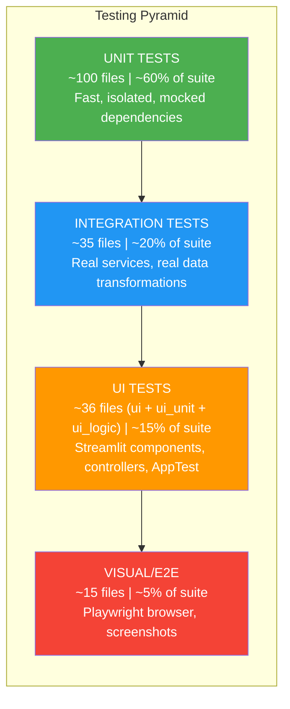
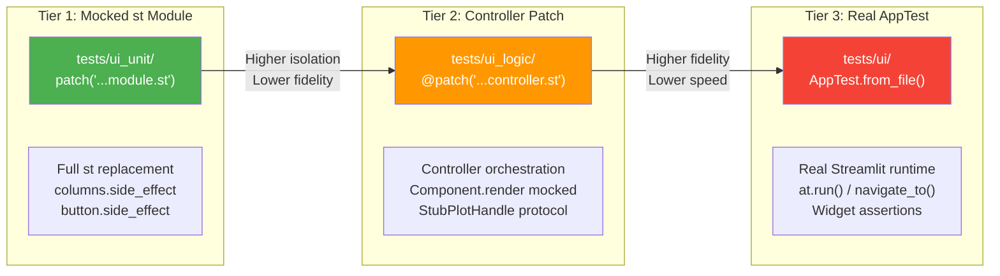

# Step 16: Testing Architecture Analysis

## 1. Executive Summary

The RING-5 Unified Engine v2 project maintains a comprehensive, multi-layered testing architecture built on **pytest** with parallel execution via **pytest-xdist**. The test suite spans approximately **170+ test files** organized across **8 distinct test directories**, each targeting a specific testing concern: pure unit tests, UI unit tests (mocked Streamlit), UI logic/controller tests, integration tests, end-to-end AppTest tests, Playwright-based visual/browser tests, performance regression tests, and TDD principle compliance demonstrations.

### Key Architectural Characteristics

- **Framework**: pytest >= 9.0.2 with parallel execution (`-n 3 --dist loadgroup`) as default
- **Fixture Hierarchy**: Root `conftest.py` provides shared `mock_api`, `sample_data`, and `mock_state_manager` fixtures; sub-directory conftest files add context-specific fixtures
- **Plugin System**: gem5 synthetic data fixtures registered via `pytest_plugins` for cross-directory availability
- **Streamlit Testing**: Three complementary strategies -- mocked `st` module (ui_unit), controller-level `@patch` (ui_logic), and Streamlit's `AppTest` framework (ui/)
- **Visual/E2E**: Playwright-based browser tests with Page Object Model, auto-screenshot on failure, and GIF generation for documentation
- **Performance**: Dedicated benchmark suite with `BenchmarkSuite`/`BenchmarkResult` classes, timing thresholds, and cache effectiveness validation
- **Test Isolation**: Session-scoped PerlWorkerPool cleanup, autouse service cache resets in integration tests, `xdist_group` markers for sequential-sensitive tests
- **Excluded from Default Runs**: `tests_principle_compliance/`, `tests/manual/`, `tests/data/`, and `tests/visual/` directories are excluded via `norecursedirs`
- **Coverage**: `pytest-cov >= 7.0.0` configured with specific omissions for WIP features

---

## 2. Test Directory Structure

```
tests/
|-- __init__.py
|-- conftest.py                         # Root conftest: shared fixtures, pytest_plugins
|
|-- helpers/                            # Shared test utilities (NOT test files)
|   |-- __init__.py
|   |-- benchmark.py                    # BenchmarkSuite, BenchmarkResult, timer()
|   |-- gem5_fixtures.py               # Synthetic gem5 data path fixtures
|   |-- sample_figures.py              # Plotly figure factory functions
|
|-- data/                               # Test data (excluded from test discovery)
|   |-- __init__.py
|   |-- synthetic/                      # Synthetic gem5 stats files
|   |   |-- single/stats.txt           # Single-benchmark scalar+vector stats
|   |   |-- multi_cpu/stats.txt        # Multi-CPU patterns for aggregation
|   |   |-- histogram/stats.txt        # Histogram data with bins
|   |   |-- multi_dump/stats.txt       # Multiple Begin/End dump blocks
|   |   |-- benchmarks/                # Multi-benchmark directory structure
|   |       |-- mcf/baseline/{0,1}/stats.txt
|   |       |-- omnetpp/baseline/0/stats.txt
|   |       |-- xalancbmk/baseline/0/stats.txt
|   |-- mock/                           # Mock data for configurer tests
|   |   |-- config_files/json_components/config/
|   |   |-- expects/csv/configurer/
|   |   |-- inputs/csv/configurer/
|   |-- results-micro26-sens/          # Real gem5 data (test_gem5_parsing)
|
|-- unit/                               # ~100+ pure unit test files
|   |-- __init__.py
|   |-- conftest.py                     # Minimal (docstring only)
|   |-- core/                           # Core visualization unit tests
|   |   |-- visualization/
|   |       |-- test_axis_spec.py
|   |       |-- test_config_spec_builder.py
|   |       |-- test_connectors.py
|   |       |-- test_figure_spec.py
|   |       |-- test_legend_spec.py
|   |       |-- test_matplotlib_connector.py
|   |       |-- test_resolvers.py
|   |       |-- test_series_style_spec.py
|   |       |-- test_widget_renderer.py
|   |       |-- test_widgets.py
|   |       |-- ... (14 files total)
|   |-- export/                         # Export/preset unit tests
|   |   |-- conftest.py                 # LaTeX availability check
|   |   |-- test_preset_manager.py
|   |   |-- test_preset_schema.py
|   |-- test_application_api.py         # ApplicationAPI orchestration
|   |-- test_plot_factory.py            # PlotFactory registration
|   |-- test_perl_worker_pool.py        # Perl worker pool (xdist_group)
|   |-- test_state_repositories.py      # State management
|   |-- test_shapers_extended.py        # Shaper transformations
|   |-- test_parsing_services.py        # Parser service layer
|   |-- ... (~95 more test files)
|
|-- integration/                        # ~35 integration test files
|   |-- __init__.py
|   |-- conftest.py                     # Real ApplicationAPI, state_manager, cache resets
|   |-- test_data_pipeline.py           # Service-level pipeline tests
|   |-- test_gem5_parsing.py            # Full gem5 scan/parse workflow
|   |-- test_full_pipeline_e2e.py       # End-to-end data pipeline
|   |-- test_render_pipeline.py         # Data -> figure rendering
|   |-- test_portfolio_persistence.py   # Portfolio save/load round-trip
|   |-- test_web_architecture.py        # Web layer integration
|   |-- test_worker_pool_integration.py # PerlWorkerPool integration
|   |-- ... (~28 more test files)
|
|-- ui/                                 # ~10 Streamlit AppTest-based e2e tests
|   |-- __init__.py
|   |-- conftest.py                     # Streamlit ButtonGroup monkey-patch
|   |-- helpers.py                      # create_app(), create_app_with_data(), navigate_to()
|   |-- test_e2e_full_chain.py          # Data -> transform -> render chain
|   |-- test_e2e_workspace.py           # Multi-plot workspace workflows
|   |-- test_e2e_data_managers.py       # Data manager e2e
|   |-- test_e2e_portfolio.py           # Portfolio round-trip e2e
|   |-- test_e2e_manage_plots.py        # Plot management e2e
|   |-- test_e2e_error_recovery.py      # Error recovery scenarios
|   |-- test_pages.py                   # Basic page rendering
|   |-- test_workflows.py              # Cross-page workflows
|   |-- test_ui_sanity.py              # Sanity checks
|
|-- ui_unit/                            # ~14 Streamlit UI component unit tests
|   |-- __init__.py
|   |-- conftest.py                     # Minimal (docstring only)
|   |-- test_data_manager_logic.py      # Data manager widgets (mocked st)
|   |-- test_data_source_dialog_logic.py
|   |-- test_shaper_config_logic.py
|   |-- test_layout_components.py
|   |-- test_variable_editor.py
|   |-- ... (~9 more files)
|
|-- ui_logic/                           # ~12 UI controller/orchestration tests
|   |-- __init__.py
|   |-- conftest.py                     # StubPlotHandle, mock_lifecycle, mock_registry
|   |-- test_creation_controller.py     # PlotCreationController
|   |-- test_render_controller.py       # RenderController
|   |-- test_manage_plots_page.py       # ManagePlotsPage orchestration
|   |-- test_settings_pills.py         # Settings pill UI logic
|   |-- test_engine_toggle.py          # Engine toggle logic
|   |-- test_interactive_plot.py       # Interactive plot controls
|   |-- ... (~6 more files)
|
|-- visual/                             # Playwright browser tests (excluded from default)
|   |-- __init__.py
|   |-- conftest.py                     # Server lifecycle, browser config, failure capture
|   |-- pages/                          # Page Object Model classes
|   |   |-- base_page.py               # BasePage: navigation, sync, screenshot, GIF
|   |   |-- data_source_page.py
|   |   |-- data_managers_page.py
|   |   |-- manage_plots_page.py
|   |   |-- portfolio_page.py
|   |-- test_navigation.py             # Cross-page navigation
|   |-- test_comprehensive_e2e.py      # Full workflow with xdist_group
|   |-- test_ds_rendering.py           # Data Source page rendering
|   |-- test_e2e_parse_workflow.py     # Parsing through browser
|   |-- ... (~10 more files)
|
|-- performance/                        # Performance regression tests
|   |-- __init__.py
|   |-- conftest.py                     # Minimal (docstring only)
|   |-- test_performance_regression.py  # Plot/shaper/CSV timing thresholds
|   |-- test_worker_pool_performance.py # Worker pool benchmarks
|
|-- manual/                             # Manual/visual inspection tests (excluded)
|   |-- __init__.py
|   |-- test_histogram_visual.py
|
|-- tests_principle_compliance/         # TDD/architecture compliance demos (excluded)
    |-- test_tdd_ch1_compliance.py      # Solitary vs Sociable tests
    |-- test_tdd_ch2_compliance.py      # Test Double patterns
    |-- test_tdd_ch3_compliance.py      # Test structure patterns
    |-- test_tdd_ch4_compliance.py      # Property-based testing
    |-- test_tdd_ch5_compliance.py      # Testing boundaries
    |-- test_tdd_ch6_compliance.py      # Integration test patterns
    |-- test_tdd_ch8_compliance.py      # Architecture compliance
    |-- test_tdd_ch9_compliance.py      # Legacy code testing
    |-- test_tdd_ch10_compliance.py     # Test organization
    |-- test_tdd_ch11_compliance.py     # Test maintenance
    |-- test_no_export_ui_strings.py    # Architecture boundary enforcement
```

### File Count Summary

| Directory                    | Test Files | Purpose                                  |
|------------------------------|-----------|------------------------------------------|
| `tests/unit/`                | ~100      | Pure unit tests, mocked dependencies     |
| `tests/integration/`        | ~35       | Multi-component integration              |
| `tests/ui/`                 | ~10       | Streamlit AppTest e2e                    |
| `tests/ui_unit/`            | ~14       | UI components with mocked Streamlit      |
| `tests/ui_logic/`           | ~12       | Controller/orchestration tests           |
| `tests/visual/`             | ~15       | Playwright browser tests                 |
| `tests/performance/`        | 2         | Performance regression thresholds        |
| `tests/manual/`             | 1         | Manual visual inspection                 |
| `tests/tests_principle_compliance/` | 11 | TDD principle demonstrations        |
| **Total**                    | **~200**  |                                          |

---

## 3. Test Framework Configuration

### pytest Configuration (`pyproject.toml`)

```toml
[tool.pytest.ini_options]
testpaths = ["tests"]
norecursedirs = [
    "tests/tests_principle_compliance",
    "tests/manual",
    "tests/data",
    "tests/visual",
]
pythonpath = ["."]
python_files = "test_*.py"
python_classes = "Test*"
python_functions = "test_*"
addopts = "-v --tb=short --strict-markers -n 3 --dist loadgroup"
xfail_strict = true
markers = [
    "requires_latex: Tests that require LaTeX installation",
    "requires_browser: Tests that require a running browser/server",
    "benchmark: marks tests as performance benchmarks",
    "smoke: Quick smoke tests",
    "data_value: Inject data value into fixtures",
    "slow: Marks tests as slow",
    "xdist_group: Group tests to run on the same xdist worker",
]
```

### Key Configuration Decisions

| Setting | Value | Rationale |
|---------|-------|-----------|
| `-n 3` | 3 xdist workers | Parallel test execution; balances speed vs. resource usage |
| `--dist loadgroup` | Load-based distribution with grouping | Tests marked `xdist_group` run on same worker (for shared state like PerlWorkerPool) |
| `--strict-markers` | Enabled | Prevents typos in marker names from silently passing |
| `xfail_strict = true` | Strict xfail | Tests marked `xfail` that unexpectedly pass will fail the suite |
| `--tb=short` | Short tracebacks | Clean output; full traceback available via `--tb=long` |
| `norecursedirs` | 4 directories excluded | Compliance demos, manual tests, data files, and Playwright tests excluded from default runs |

### Installed Test Plugins

From `pyproject.toml` dependencies:

| Plugin | Version | Purpose |
|--------|---------|---------|
| `pytest` | >= 9.0.2 | Core test framework |
| `pytest-cov` | >= 7.0.0 | Coverage reporting |
| `pytest-xdist` | >= 3.6.1 | Parallel test execution |
| `pytest-randomly` | >= 3.16.0 | Random test ordering (detects order-dependent tests) |
| `pytest-timeout` | >= 2.2.0 | CI timeout protection (optional `ci` extra) |
| `pytest-playwright` | >= 0.7.0 | Playwright browser integration (optional `e2e` extra) |
| `pytest-base-url` | >= 2.1.0 | Base URL fixture for e2e (optional `e2e` extra) |

### Coverage Configuration

```toml
[tool.coverage.run]
omit = [
    "src/web/pages/ui/plotting/types/dual_axis_bar_dot_plot.py",
]
```

The only coverage omission is a WIP feature (`dual_axis_bar_dot_plot.py`), which is also excluded from test collection via `-k "not dual_axis and not dual"`.

---

## 4. Fixture Architecture

### Conftest Hierarchy

The project uses a **layered conftest hierarchy** where each level provides progressively more specialized fixtures. The root `conftest.py` is the foundation, with sub-directory conftest files adding domain-specific fixtures.

```
tests/conftest.py                    (root: shared across ALL tests)
  |-- tests/unit/conftest.py         (minimal: docstring only)
  |   |-- tests/unit/export/conftest.py  (LaTeX availability markers)
  |-- tests/integration/conftest.py  (real API, state_manager, service cache resets)
  |-- tests/ui/conftest.py          (Streamlit ButtonGroup monkey-patch)
  |-- tests/ui_unit/conftest.py     (minimal: docstring only)
  |-- tests/ui_logic/conftest.py    (StubPlotHandle, mock_lifecycle, mock_registry)
  |-- tests/visual/conftest.py      (Playwright server, browser, screenshot, GIF)
  |-- tests/performance/conftest.py (minimal: docstring only)
```

### Root conftest.py Fixtures

The root conftest provides foundational fixtures available to all tests:

**`mock_api`** (function scope) -- Basic `MagicMock` ApplicationAPI with `state_manager` attribute. Used by approximately 90% of UI tests as the default API dependency. Returns a simple mock without real implementations.

```python
@pytest.fixture
def mock_api() -> MagicMock:
    api = MagicMock()
    api.state_manager = MagicMock()
    return api
```

**`sample_data`** (function scope) -- Minimal 6-row DataFrame mimicking parsed gem5 CSV output with `benchmark_name`, `config_description`, `simTicks`, and `system.cpu.ipc` columns. Used as the universal test data fixture across unit and UI tests.

**`sample_data_extended`** (function scope) -- Extension of `sample_data` with additional numeric columns (`system.cpu.numCycles`, `system.cpu.committedInsts`). Composes on the `sample_data` fixture.

**`sample_pipeline_config`** (function scope) -- Valid shaper pipeline config list exercising `columnSelector`, `normalize`, and `sort` shaper types.

**`mock_state_manager`** (function scope) -- MagicMock `RepositoryStateManager` with all getter methods wired to return empty/None defaults. Provides the minimal structure expected by services with StateManager dependencies.

**`e2e_sample_data`** (function scope) -- Rich 18-row x 8-column DataFrame with multiple benchmarks (mcf, omnetpp, xalancbmk), configs (baseline, optimized, aggressive), seeds (0, 1), and numeric metrics (ipc, numCycles, simTicks, dcache.overall_miss_rate, committedInsts). Delegates to `tests.ui.helpers.make_e2e_sample_data()`.

**`_cleanup_perl_worker_pool`** (session scope, autouse) -- Shuts down the global `PerlWorkerPool` after the test session completes. Prevents `ResourceWarning` about orphaned subprocesses.

### Shared Helper Function

**`columns_side_effect`** -- A non-fixture helper function that mocks `st.columns()` behavior, returning a list of `MagicMock` column objects based on either an int (count) or list/tuple (relative widths) argument.

### Plugin-Registered Fixtures

```python
pytest_plugins = ["tests.helpers.gem5_fixtures"]
```

This registers the `tests/helpers/gem5_fixtures.py` module as a fixture plugin, making its fixtures available to all tests without explicit imports:

- **`synthetic_stats_root`** -- Root path to `tests/data/synthetic/`
- **`synthetic_single_stats`** -- Path to single-benchmark stats directory
- **`synthetic_multi_cpu_stats`** -- Path to multi-CPU pattern stats
- **`synthetic_histogram_stats`** -- Path to histogram data with bins
- **`synthetic_multi_dump_stats`** -- Path to multi-dump block stats (simpoint simulation)
- **`synthetic_benchmarks_dir`** -- Multi-benchmark directory tree: `{bench}/{config}/{seed}/stats.txt`

### Integration conftest.py Fixtures

The integration conftest provides **real** (not mocked) instances:

- **`_reset_service_caches`** (function scope, autouse) -- Resets `PathService`, `CsvPoolService`, and `ConfigService` caches before and after each test. Critical for test isolation with class-level caches.
- **`facade`** (function scope) -- Fresh `ApplicationAPI()` instance (real, not mocked)
- **`state_manager`** (function scope) -- Fresh `RepositoryStateManager()` with `clear_all()` called
- **`integration_output_dir`** (function scope) -- Temporary directory for parse results via `tmp_path`
- **`rich_sample_data`** (function scope) -- 9-row DataFrame with 3 benchmarks x 3 configs x 3 numeric metrics
- **`loaded_facade`** (function scope) -- `ApplicationAPI` with data pre-loaded: `set_data()` and `set_processed_data()` called with `rich_sample_data`
- **`bar_config`**, **`grouped_bar_config`**, **`line_config`**, **`scatter_config`** (function scope) -- Minimal plot configuration dicts for each plot type

### UI Logic conftest.py Fixtures

Provides purpose-built stubs for testing controller orchestration without real Streamlit:

- **`StubPlotHandle`** -- Lightweight concrete class satisfying the `PlotHandle` protocol without real plot logic. Implements `render_config_ui`, `render_settings_section`, `create_figure`, `apply_common_layout`, `update_from_relayout`, and other protocol methods as no-ops or MagicMock-returning stubs.
- **`stub_plot`** / **`stub_plot_with_data`** / **`stub_plot_with_pipeline`** -- Pre-configured instances of `StubPlotHandle`
- **`mock_ui_state`** -- Mock `UIStateManager` with `.get()` returning None
- **`mock_lifecycle`** -- Mock `PlotLifecycleService` with `create_plot`, `duplicate_plot`, `change_plot_type` returning StubPlotHandle instances
- **`mock_registry`** -- Mock `PlotTypeRegistry` returning 8 available plot types
- **`mock_pipeline_executor`** -- Mock `PipelineExecutor` that returns `sample_data` from `apply_shapers()`

### Visual/Playwright conftest.py Fixtures

Session-scoped server lifecycle management for browser-based visual tests:

- **`_streamlit_port`** (session scope) -- Ephemeral TCP port chosen once per session via `socket.bind(("", 0))`
- **`live_server_url`** (session scope) -- Starts a real Streamlit server subprocess (`python -m streamlit run app.py`), waits for TCP readiness with 30s timeout, yields `http://localhost:<port>`, tears down with SIGTERM then SIGKILL
- **`browser_context_args`** (session scope) -- Viewport 1280x720, locale en-US, dark color scheme
- **`browser_type_launch_args`** (session scope) -- Honors `HEADED=1` and `SLOW_MO=<ms>` env vars for debugging
- **`shared_page`** (class scope) -- Single browser tab shared across all tests in a class, reducing setup overhead
- **`screenshot_dir`** (function scope) / **`shared_screenshot_dir`** (class scope) -- Per-test or per-class screenshot directories under `tests/visual/screenshots/`
- **`_capture_failure_artifacts`** (function scope, autouse) -- Auto-detects `shared_page` or `page` fixtures; captures screenshot and optional Playwright trace on test failure to `tests/visual/artifacts/`

### Export conftest.py

```python
has_xelatex = shutil.which("xelatex") is not None
requires_xelatex = pytest.mark.skipif(not has_xelatex, reason="XeLaTeX not found")
```

Export-module-level marker for conditionally skipping LaTeX rendering tests.

---

## 5. Unit Test Patterns

### 5.1 Service/Model Tests (Pure Logic)

Unit tests in `tests/unit/` test individual classes and functions in isolation, using `unittest.mock.MagicMock` and `@patch` extensively. Over **100 files** with diverse coverage targets.

**Pattern: Arrange-Act-Assert (AAA)**

All unit tests follow the explicit AAA pattern, often with inline comments marking each phase:

```python
# File: tests/unit/test_application_api.py
def test_load_data_success(self, application_api: Any) -> None:
    # Arrange
    path = "/test/data.csv"
    df = pd.DataFrame({"col": [1, 2]})
    mock_data = cast(Any, application_api)._mock_services.data_services
    mock_data.load_csv_file.return_value = df

    # Act
    application_api.load_data(path)

    # Assert
    mock_data.load_csv_file.assert_called_once_with(path)
    application_api.state_manager.set_data.assert_called_once_with(df)
```

**Pattern: Test Class Grouping**

Related tests are grouped into `Test*` classes for organization:

```python
class TestPlotFactoryRegistration:
    def test_all_nine_plot_types_registered(self) -> None: ...
    def test_register_plot_type_rejects_non_baseplot_class(self) -> None: ...

class TestPlotFactoryMetadata:
    def test_metadata_present_for_all_types(self) -> None: ...
    def test_each_metadata_entry_has_required_keys(self) -> None: ...
```

**Pattern: Fixture-per-Test with Class Cleanup**

Some unit tests register test data in global registries and clean up in `finally` blocks:

```python
def test_register_plot_type_with_metadata(self) -> None:
    try:
        PlotFactory.register_plot_type("test_custom", BarPlot, metadata=test_metadata)
        result = PlotFactory.get_plot_metadata()
        assert "test_custom" in result
    finally:
        PlotFactory._plot_classes.pop("test_custom", None)
        PlotFactory._plot_metadata.pop("test_custom", None)
```

### 5.2 ApplicationAPI Testing

The `ApplicationAPI` is tested with its dependencies (`RepositoryStateManager`, `DefaultServicesAPI`) fully mocked using context-manager patching. This pattern verifies orchestration logic without testing service implementations:

```python
@pytest.fixture
def application_api() -> Generator[ApplicationAPI, None, None]:
    with patch("src.core.application_api.RepositoryStateManager") as mock_sm_cls:
        with patch("src.core.application_api.DefaultServicesAPI") as mock_svc_cls:
            api = ApplicationAPI()
            api.state_manager = mock_sm_cls.return_value
            cast(Any, api)._mock_services = mock_svc_cls.return_value
            yield api
```

Tests verify: initialization creates state_manager, `load_data()` delegates to data_services and updates state, `get_current_view()` assembles view dict from state, `reset_session()` clears all state.

### 5.3 Perl Worker Pool Testing

The `PerlWorkerPool` tests are marked with `xdist_group` to ensure they run on a single worker (preventing race conditions with shared subprocess resources):

```python
pytestmark = pytest.mark.xdist_group("perl_pool")
```

Tests are organized into four classes:
- **`TestPerlWorker`** -- Individual worker: startup, health check, file parsing, restart
- **`TestPerlWorkerPool`** -- Pool management: initialization, file distribution, failure recovery, statistics, graceful shutdown
- **`TestWorkerPoolIntegration`** -- Singleton pattern, performance comparison (with autouse `_reset_singleton` fixture)
- **`TestErrorHandling`** -- Invalid files, timeouts, no-available-workers scenarios

### 5.4 Plot Type Testing

Each plot type has dedicated test files covering figure creation, configuration, and edge cases:

- `test_bar_line_create_figure.py` -- Bar and line plot figure creation
- `test_grouped_bar_plot.py` / `test_grouped_bar_create_figure.py` / `test_grouped_bar_utils.py` -- Grouped bar specifics
- `test_grouped_stacked_bar_create_figure.py` / `test_grouped_stacked_bar_plot_config.py` -- Grouped stacked bars
- `test_heatmap_plot.py` -- Heatmap rendering
- `test_histogram_plot.py` / `test_histogram.py` / `test_histogram_rebinning.py` -- Histogram types
- `test_scatter_plot_coverage.py` -- Scatter plot coverage
- `test_dual_axis_bar_dot_plot.py` / `test_dual_axis_branches.py` -- Dual axis types

### 5.5 Test Naming Conventions

- Test files: `test_<module_or_feature>.py`
- Test classes: `Test<ComponentOrFeature>`
- Test methods: `test_<behavior_under_test>`
- Coverage-targeted files: `test_<module>_coverage.py` (e.g., `test_coverage_boost.py`, `test_mixer_coverage.py`)
- Branch coverage files: `test_<module>_branches.py` (e.g., `test_dual_axis_branches.py`, `test_normalize_branches.py`)
- Comprehensive test files: `test_<module>_comprehensive.py` (e.g., `test_application_api_comprehensive.py`, `test_scanner_comprehensive.py`)

---

## 6. Integration Test Patterns

### 6.1 Real Service Integration

Integration tests in `tests/integration/` use **real** `ApplicationAPI` and `RepositoryStateManager` instances (via fixtures from the integration conftest). Unlike unit tests, they exercise actual service implementations with real data transformations:

```python
# File: tests/integration/conftest.py
@pytest.fixture
def facade() -> ApplicationAPI:
    return ApplicationAPI()

@pytest.fixture
def loaded_facade(facade: ApplicationAPI, rich_sample_data: pd.DataFrame) -> ApplicationAPI:
    facade.state_manager.set_data(rich_sample_data)
    facade.state_manager.set_processed_data(rich_sample_data.copy())
    return facade
```

### 6.2 Service Cache Isolation

All integration tests use an autouse fixture that resets class-level service caches before and after each test:

```python
@pytest.fixture(autouse=True)
def _reset_service_caches() -> Any:
    PathService.reset_caches()
    CsvPoolService.clear_caches()
    ConfigService.reset_caches()
    yield
    PathService.reset_caches()
    CsvPoolService.clear_caches()
    ConfigService.reset_caches()
```

This is critical because `PathService`, `CsvPoolService`, and `ConfigService` use class-level (not instance-level) caches that would otherwise leak state between tests.

### 6.3 Data Pipeline Integration

The `TestDataPipeline` class tests real service-level operations:

```python
def test_seeds_reduction(self, sample_data: Any) -> None:
    df = sample_data.copy()
    df["random_seed"] = [1, 2, 1, 2, 1, 2]
    reduced = ReductionService.reduce_seeds(
        df, categorical_cols=["group"], statistic_cols=["value"]
    )
    assert len(reduced) == 3
    assert "value.sd" in reduced.columns

def test_shaper_pipeline_execution(self, sample_data: Any) -> None:
    col_selector = ShaperFactory.create_shaper("columnSelector", {"columns": [...]})
    df_cols = col_selector(sample_data)
    assert "noise" not in df_cols.columns
```

**Key integration test files and their scope:**

| File | Tests | Scope |
|------|-------|-------|
| `test_data_pipeline.py` | Seeds reduction, outlier removal, shaper factory, mixer operations | Service-level data transformations |
| `test_gem5_parsing.py` | Scan variables, full parse workflow, histogram parsing | Parser integration with real/synthetic data |
| `test_full_pipeline_e2e.py` | Complete pipeline from data load to figure generation | Full backend pipeline |
| `test_render_pipeline.py` | Data -> plot rendering for all plot types | Visualization pipeline |
| `test_portfolio_persistence.py` / `test_portfolio_round_trip.py` | Save/load/restore cycles | State serialization roundtrip |
| `test_web_architecture.py` | Web layer component wiring | Architecture verification |
| `test_state_management.py` | Multi-repository state coordination | State layer integration |
| `test_worker_pool_integration.py` | Pool with real Perl subprocess parsing | Perl/Python bridge |

### 6.4 Gem5 Parsing Integration

The `TestGem5Parsing` class exercises the full scan-parse-CSV workflow in three phases:

**Phase 1: Scan** -- `facade.submit_scan_async()` returns futures, `facade.finalize_scan()` aggregates variables.

**Phase 2: Parse** -- `facade.submit_parse_async()` with selected variables, wait for futures, `facade.finalize_parsing()` produces a CSV path.

**Phase 3: Verify** -- Read CSV with pandas, check columns match selected variables, verify data values.

Tests use both real data from `tests/data/results-micro26-sens/` (with `pytest.skip` if missing) and synthetic data via `tmp_path` (always available):

```python
def test_histogram_parsing(self, tmp_path: Any) -> None:
    stats_dir = tmp_path / "stats"
    output_dir = tmp_path / "output"
    os.makedirs(stats_dir, exist_ok=True)

    hist_content = """
---------- Begin Simulation Statistics ----------
system.mem.ctrl::0-1023                       5      50.00%
system.mem.ctrl::1024-2047                    5      50.00%
"""
    with open(stats_dir / "stats.txt", "w") as f:
        f.write(hist_content)

    facade = ApplicationAPI()
    # ... scan, parse, verify CSV columns and values
```

### 6.5 Integration Test Coverage Breadth

The integration test directory covers extensive cross-cutting concerns:

- **Portfolio lifecycle**: `test_portfolio_fix.py`, `test_portfolio_migration.py`, `test_portfolio_persistence.py`, `test_portfolio_round_trip.py`, `test_portfolio_service_integration.py`
- **Parser pipeline**: `test_full_parser_workflow.py`, `test_parser_integration.py`, `test_gem5_parsing.py`, `test_scanner_fix.py`, `test_scanner_functional.py`
- **Plot rendering**: `test_histogram_plot_integration.py`, `test_histogram_with_stats.py`, `test_matplotlib_rendering.py`, `test_plot_lifecycle.py`, `test_phase3_figure_engine.py`
- **State management**: `test_state_management.py`, `test_data_manager_api_flow.py`, `test_service_managers.py`
- **Error scenarios**: `test_edge_cases.py`, `test_error_recovery.py`
- **Architecture**: `test_web_architecture.py`, `test_controller_presenter.py`, `test_facade_reduction.py`

---

## 7. E2E Test Patterns

The project implements end-to-end testing at **three distinct levels**, each progressively closer to real user interaction:

### 7.1 Streamlit AppTest E2E (`tests/ui/`)

Streamlit's `AppTest` framework runs the actual `app.py` script in a headless testing mode, providing access to rendered widgets without a browser. This is the **primary E2E strategy** for the default test suite.

**Core Helper Functions** (`tests/ui/helpers.py`):

```python
def create_app() -> AppTest:
    """Boot AppTest from app.py, reset session state for isolation."""
    at = AppTest.from_file(_APP_PATH, default_timeout=10)
    at.run()
    api = at.session_state["api"]
    api.reset_session()
    at.run()
    return at

def create_app_with_data(df=None) -> AppTest:
    """Boot AppTest with pre-loaded data injected into API state."""
    at = create_app()
    api = at.session_state["api"]
    api.state_manager.set_data(df or make_e2e_sample_data())
    api.state_manager.set_processed_data(df.copy() if df else make_e2e_sample_data())
    return at

def navigate_to(at: AppTest, page_name: str) -> AppTest:
    """Navigate to a specific page via session_state."""
    at.session_state["_nav_page"] = page_name
    at.run()
    return at
```

**Data Injection Pattern**: `AppTest.from_file("app.py")` creates a `@st.cache_resource` singleton. After the first `.run()`, the `ApplicationAPI` is accessible via `at.session_state["api"]`. Since `RepositoryStateManager` uses pure Python repositories (not `st.session_state`), mutations via `api.state_manager.set_data(...)` persist across subsequent `.run()` calls.

**Test Isolation**: Each test calls `api.reset_session()` before injecting data, preventing cross-test contamination within the same xdist worker process.

**Full Chain Tests** (`test_e2e_full_chain.py`):

```python
class TestDataTransformRenderChain:
    def test_bar_plot_full_chain(self) -> None:
        """Bar plot: load -> column select -> sort -> create figure."""
        at = create_app_with_data()
        api = get_api(at)
        plot = _create_plot_and_finalize(api, "Bar Chain", "bar", pipeline)
        fig = plot.create_figure(plot.processed_data, config)
        fig = plot.apply_common_layout(fig, config)
        assert isinstance(fig, go.Figure)
        assert len(list(fig.data)) > 0
```

**Cross-Page State Tests** (`test_e2e_workspace.py`):

```python
class TestCrossPageConsistency:
    def test_data_persists_across_pages(self) -> None:
        at = create_app_with_data()
        api = get_api(at)
        navigate_to(at, "Data Managers")
        assert api.state_manager.has_data()
        navigate_to(at, "Manage Plots")
        assert api.state_manager.has_data()
```

**Streamlit ButtonGroup Monkey-Patch** (`tests/ui/conftest.py`):

The UI conftest patches a bug in Streamlit 1.53.1's `ButtonGroup.indices` property that iterates over string characters in single-selection mode instead of treating the value as a single item:

```python
def _patched_indices(self):
    vals = self.value
    if isinstance(vals, str):
        vals = [vals]
    return [self.options.index(self.format_func(v)) for v in vals]

ButtonGroup.indices = property(_patched_indices)
```

### 7.2 Playwright Visual E2E (`tests/visual/`)

Browser-based tests using Playwright, excluded from default `pytest` runs (via `norecursedirs`). Run explicitly with:

```bash
pytest tests/visual/ -m requires_browser
```

**Page Object Model**: All visual tests use page objects from `tests/visual/pages/`:

```python
# File: tests/visual/pages/base_page.py
class BasePage:
    RENDER_TIMEOUT = 15_000

    def __init__(self, page: Page) -> None:
        self.page = page

    def navigate_to(self, page_name: str) -> None:
        btn = self.sidebar.get_by_role("button", name=page_name)
        btn.click()
        self.wait_for_streamlit()

    def wait_for_streamlit(self, *, timeout=None) -> None:
        try:
            self.page.wait_for_load_state("networkidle", timeout=5_000)
        except Exception:
            pass
        running = self.page.locator("[data-testid='stStatusWidget']")
        running.wait_for(state="hidden", timeout=effective_timeout)
```

Page objects available: `BasePage`, `DataSourcePage`, `DataManagersPage`, `ManagePlotsPage`, `PortfolioPage`.

**Streamlit Synchronization Strategy**:
1. Attempt `networkidle` with a 5-second timeout (may not complete due to custom component iframes)
2. Wait for `[data-testid='stStatusWidget']` (the "Running..." indicator) to become hidden as the authoritative signal

**Screenshot and GIF Generation**:

```python
def test_generate_navigation_gif(self, shared_page, live_server_url, shared_screenshot_dir):
    bp = BasePage(shared_page)
    bp.goto_and_wait(live_server_url)
    frames = []
    for idx, page_name in enumerate(page_names, start=1):
        bp.navigate_to(page_name)
        bp.screenshot(frame_path)
        frames.append(frame_path)
    BasePage.create_gif(frames, gif_path, duration_ms=1200)
```

**Ordered Test Classes**: Comprehensive E2E tests use `@pytest.mark.order()` and `@pytest.mark.xdist_group()` to ensure sequential execution within a shared browser session:

```python
@pytest.mark.xdist_group("comprehensive_e2e")
class TestComprehensiveE2E:
    @pytest.mark.order(1)
    def test_data_source_page(self, shared_page, live_server_url): ...
    @pytest.mark.order(2)
    def test_data_managers_page(self, shared_page, live_server_url): ...
```

**Failure Artifact Capture**: The autouse `_capture_failure_artifacts` fixture captures full-page screenshots and optional Playwright traces (when `TRACING=1`) on test failure:

```python
if rep_call is not None and rep_call.failed:
    active_page.screenshot(path=f"{test_name}_failure.png", full_page=True)
    if tracing:
        context.tracing.stop(path=f"{test_name}_trace.zip")
```

### 7.3 UI Controller/Logic E2E (`tests/ui_logic/`)

A middle ground between unit tests and full AppTest E2E. Tests controllers and page-level orchestration using @patch on Streamlit and component modules, with `StubPlotHandle` and mock services:

```python
class TestRenderCreateSection:
    @patch("src.web.controllers.plot.creation_controller.st")
    @patch("src.web.controllers.plot.creation_controller.PlotCreationComponent.render")
    def test_create_clicked_delegates_to_lifecycle(
        self, mock_render, mock_st
    ) -> None:
        mock_render.return_value = {
            "name": "My Plot", "plot_type": "bar", "create_clicked": True,
        }
        lifecycle = MagicMock()
        ctrl = _make_controller(api=api, lifecycle=lifecycle)
        ctrl.render_create_section()
        lifecycle.create_plot.assert_called_once_with("My Plot", "bar", api.state_manager)
        mock_st.rerun.assert_called_once()
```

---

## 8. Mock & Patch Strategies

### 8.1 Mock Usage Distribution

The project uses `unittest.mock` extensively, with **102 files** importing from the module and **733+ `@patch` decorator usages** across the codebase.

### 8.2 Three-Tier Streamlit Mocking Strategy

The project employs three distinct strategies for testing Streamlit-dependent code, each at a different level of fidelity:

**Tier 1: Full Module Patch (`tests/ui_unit/`)**

Patches the `st` module at the import location of the component being tested. The `st.columns`, `st.button`, `st.selectbox`, etc. are all replaced with `MagicMock` instances:

```python
# File: tests/ui_unit/test_data_manager_logic.py
@pytest.fixture
def mock_streamlit() -> Generator:
    with (
        patch("src.web.components.data_managers.seeds_reducer.st") as mock_st_seeds,
        patch("src.web.components.data_managers.outlier_remover.st") as mock_st_outlier,
        patch("src.web.components.data_managers.seeds_reducer.UIStateManager") as mock_ui_seeds,
        patch("src.web.components.data_managers.outlier_remover.UIStateManager") as mock_ui_outlier,
    ):
        mock_st_seeds.session_state = {}
        mock_st_seeds.columns.side_effect = columns_side_effect
        yield (mock_st_seeds, mock_st_outlier)
```

**Tier 2: Controller-Level Patch (`tests/ui_logic/`)**

Patches only the `st` module and Component `render()` methods at the controller level:

```python
@patch("src.web.controllers.plot.creation_controller.st")
@patch("src.web.controllers.plot.creation_controller.PlotCreationComponent.render")
def test_render_calls_presenter_with_counter(self, mock_render, mock_st):
    mock_render.return_value = {"name": "Plot 4", "plot_type": None, "create_clicked": False}
    ctrl = _make_controller()
    ctrl.render_create_section()
    mock_render.assert_called_once_with(default_name="Plot 4", available_types=[...])
```

**Tier 3: Real Streamlit Runtime (`tests/ui/`)**

Uses `AppTest.from_file()` which runs the actual Streamlit script. No mocking at all -- interactions are through the AppTest API:

```python
at = AppTest.from_file(_APP_PATH, default_timeout=10)
at.run()
api = at.session_state["api"]
```

### 8.3 ApplicationAPI Mock Patterns

**Full mock (root conftest)** -- `mock_api` fixture returns a MagicMock with no wiring. Tests must explicitly configure `return_value` for any method they need.

**Partially-mocked** -- Some unit tests patch only the dependencies of ApplicationAPI, keeping the API itself real:

```python
with patch("src.core.application_api.RepositoryStateManager") as mock_sm_cls:
    with patch("src.core.application_api.DefaultServicesAPI") as mock_svc_cls:
        api = ApplicationAPI()
```

**Real instances (integration)** -- Integration tests use `ApplicationAPI()` with no patches.

### 8.4 Button/Widget Interaction Mocking

For tests with mocked Streamlit, widget interactions are simulated using `side_effect` keyed on widget keys:

```python
apply_key = WidgetKeyBuilder.manager_key("seeds_reducer", "apply")
mock_st.button.side_effect = lambda label, key=None, **kwargs: key == apply_key
```

This ensures only the intended button returns True, while all other buttons return False.

### 8.5 Pandas DataFrame Assertion Patterns

The project uses both standard assert statements and pandas-specific assertions:

```python
# Exact DataFrame equality
pd.testing.assert_frame_equal(result1, result2)

# Column existence
assert "value.sd" in reduced.columns

# Row count
assert len(cleaned) == 9

# Value checks
assert 1000 not in cleaned["value"].values
assert all(after_filter["config_description"] == "baseline")

# Numpy close check for floating point
assert np.isclose(result["mixed.sd"].iloc[0], expected_sd)
```

---

## 9. Test Data Management

### 9.1 Data Sources

The project uses four distinct data sources for testing:

**Programmatic DataFrames** (most common):
- `sample_data` -- 6-row minimal DataFrame (root conftest)
- `sample_data_extended` -- 6-row extended DataFrame
- `rich_sample_data` -- 9-row 3x3 grid (integration conftest)
- `e2e_sample_data` -- 18-row comprehensive DataFrame (ui helpers)
- Per-test inline DataFrames for specific scenarios

**Synthetic gem5 Stats Files** (`tests/data/synthetic/`):
- Crafted `.txt` files that mimic real gem5 output format
- 5 fixture variants: single, multi_cpu, histogram, multi_dump, benchmarks
- Always available; no external data dependency
- Registered globally via `pytest_plugins`

**Real gem5 Data** (`tests/data/results-micro26-sens/`):
- Actual output from gem5 simulations with PARSEC benchmarks
- Used by `test_gem5_parsing.py` for parsing integration tests
- Tests skip gracefully with `pytest.skip("Test data not found")` when absent

**Mock Configuration Files** (`tests/data/mock/`):
- JSON configuration files for configurer tests
- Expected CSV outputs for golden-file comparisons
- Input CSV files for data loading tests

### 9.2 Plotly Figure Factories (`tests/helpers/sample_figures.py`)

Pre-built figure factories for export and download testing:

| Factory Function | Description |
|-----------------|-------------|
| `create_simple_bar_figure()` | Basic 3-category bar chart |
| `create_grouped_bar_figure()` | Two-series grouped bar |
| `create_line_figure()` | Single-series line (y=x^2) |
| `create_scatter_figure()` | 6-point scatter |
| `create_figure_with_custom_legend()` | Custom legend positioning |
| `create_figure_with_zoom()` | Pre-zoomed axis ranges |
| `create_figure_with_log_scale()` | Log-scaled axes |
| `create_multi_series_line_figure()` | Two-series line with dash styles |

### 9.3 Benchmark Utilities (`tests/helpers/benchmark.py`)

**`BenchmarkResult`** -- Container holding operation name, total duration (ms), iteration count, and average duration per iteration.

**`BenchmarkSuite`** -- Collects multiple `BenchmarkResult` instances with:
- `measure(name)` -- Context manager for timing operations
- `benchmark(func, *args, iterations=1, name=None)` -- Function-call timing
- `summary()` -> DataFrame of all results
- `print_summary()` -- Formatted logging output

**`benchmark_decorator`** -- Decorator for benchmarking functions with configurable iterations.

**`timer(name)`** -- Simple context manager for one-off timing with logging output.

### 9.4 Test Data Patterns

**In-line construction** (most common for unit tests):

```python
df = pd.DataFrame({
    "group": ["A"] * 10,
    "value": [10, 10, 10, 10, 10, 10, 10, 10, 10, 1000],
})
```

**Fixture composition** (sample_data_extended builds on sample_data):

```python
@pytest.fixture
def sample_data_extended(sample_data: pd.DataFrame) -> pd.DataFrame:
    df = sample_data.copy()
    df["system.cpu.numCycles"] = [321000, 289000, ...]
    return df
```

**File-based synthetic data** (tmp_path with inline content):

```python
def test_histogram_parsing(self, tmp_path):
    stats_dir = tmp_path / "stats"
    stats_dir.mkdir()
    (stats_dir / "stats.txt").write_text(hist_content)
```

---

## 10. Coverage Analysis

### 10.1 Coverage Configuration

The project uses `pytest-cov >= 7.0.0` for coverage reporting with minimal omissions:

```toml
[tool.coverage.run]
omit = [
    "src/web/pages/ui/plotting/types/dual_axis_bar_dot_plot.py",
]
```

Only one file is omitted -- the WIP `dual_axis_bar_dot_plot.py` feature.

### 10.2 Coverage-Targeted Test Files

Several test files exist specifically to increase branch/line coverage:

| File | Target |
|------|--------|
| `test_coverage_boost.py` | General coverage gaps (81 `@patch` usages) |
| `test_mixer_coverage.py` | Mixer service edge cases |
| `test_seeds_reducer_coverage.py` | Seeds reducer branches |
| `test_outlier_remover_coverage.py` | Outlier remover branches |
| `test_preprocessor_coverage.py` | Preprocessor edge cases |
| `test_scatter_plot_coverage.py` | Scatter plot branches |
| `test_simple_plots_coverage.py` | Simple plot type branches |
| `test_sort_config_coverage.py` | Sort configuration branches |
| `test_plot_service_coverage.py` | PlotService edge cases |
| `test_condition_selector_coverage.py` | ConditionSelector branches |
| `test_pattern_index_selector_coverage.py` | PatternIndexSelector branches |
| `test_upload_shaper_pipeline_coverage.py` | Upload/shaper pipeline branches |
| `test_stacked_histogram_extras_coverage.py` | Stacked histogram edge cases |
| `test_grouped_dual_config_coverage.py` | Grouped dual config branches |
| `test_preset_manager_coverage.py` | Preset manager branches |
| `test_pipeline_controller_coverage.py` | Pipeline controller branches |
| `test_history_components_coverage.py` | History components branches |
| `test_portfolio_page_coverage.py` | Portfolio page branches |
| `test_factory_ui_export_coverage.py` | Factory/UI/export branches |
| `test_outlier_service_coverage.py` | Outlier service branches |

This pattern indicates a mature project where developers systematically identify and fill coverage gaps.

### 10.3 Performance Test Thresholds

Performance regression tests enforce timing thresholds:

| Operation | Threshold | Iterations |
|-----------|-----------|------------|
| Bar plot generation | < 500ms | 5 |
| Grouped bar plot generation | < 800ms | 3 |
| Normalize shaper (2000 rows) | < 200ms | 5 |
| Full pipeline (normalize + plot) | < 1000ms | 1 |
| DataFrame creation (10k rows) | < 100ms | 3 |
| GroupBy (3000 rows) | < 50ms | 5 |
| CSV metadata caching | >= 5x speedup | - |
| CSV loading cache | >= 2x speedup | - |
| Normalize caching | >= 1.5x speedup | - |

---

## 11. Testing Gaps & Recommendations

### 11.1 Identified Gaps

**No dedicated security testing**: While `bandit` is configured for static analysis, there are no test files specifically validating input sanitization, path traversal prevention, or subprocess injection resistance.

**Limited negative-path coverage for Perl integration**: The `TestErrorHandling` class has a placeholder test (`test_worker_timeout` with `pass`), and timeout scenarios with the Perl subprocess are not fully tested.

**No snapshot/golden-file testing**: While `tests/data/mock/expects/` exists with expected CSV outputs, the golden-file comparison pattern is used sparingly. There is no systematic snapshot testing for Plotly figures or HTML output.

**Visual regression without baseline comparison**: Playwright tests capture screenshots for documentation but do not perform pixel-level comparisons against baseline images. The `tests/visual/` directory focuses on functional browser testing rather than visual regression.

**Dual axis plot coverage gap**: The `dual_axis_bar_dot_plot.py` module is explicitly omitted from coverage, with no tests exercising its implementation in the default suite (filtered via `-k "not dual_axis"`).

**Missing `__init__.py` in compliance tests**: The `tests/tests_principle_compliance/` directory lacks an `__init__.py`, though this is a non-issue since the directory is excluded from `norecursedirs`.

### 11.2 Strengths

**Comprehensive fixture hierarchy**: The layered conftest system provides clean separation of concerns with minimal fixture scope leakage.

**Three-tier Streamlit testing**: The mocked-st / patched-controller / real-AppTest progression provides thorough coverage at each abstraction level.

**Test isolation mechanisms**: Autouse cache resets, singleton teardown, xdist grouping, and session-scoped cleanup prevent flaky tests from shared state.

**Performance regression gates**: Explicit timing thresholds catch performance regressions before they reach production.

**Synthetic data strategy**: Always-available synthetic gem5 data ensures integration tests never skip due to missing external data.

**TDD compliance demonstrations**: The `tests_principle_compliance/` directory documents testing principles and serves as educational material.

### 11.3 Recommendations

1. **Complete the worker timeout test**: Replace the `pass` in `test_worker_timeout` with a proper timeout scenario test using a crafted stats file that triggers slow parsing.

2. **Add Plotly figure snapshot testing**: Use `pytest-snapshot` or a custom golden-file mechanism to capture and compare `fig.to_json()` output for regression detection on plot generation.

3. **Implement visual baseline comparisons**: Extend the Playwright visual tests with `toMatchSnapshot()` or `pixelmatch` comparisons against stored baseline screenshots.

4. **Add dual axis plot tests**: Complete the WIP dual axis feature and add coverage, or document it as explicitly out-of-scope until the feature is ready.

5. **Add property-based testing**: The compliance tests reference property-based testing (ch4), but this pattern is not applied to production code. Consider using `hypothesis` for shaper and data transformation testing.

---

## 12. Mermaid Test Architecture Diagram

```mermaid
graph TB
    subgraph "Test Framework"
        PYTEST["pytest >= 9.0.2"]
        XDIST["pytest-xdist (3 workers)"]
        COV["pytest-cov"]
        RANDOMLY["pytest-randomly"]
        PLAYWRIGHT_PLUGIN["pytest-playwright"]
    end

    subgraph "Root Fixtures (tests/conftest.py)"
        MOCK_API["mock_api<br/>(MagicMock API)"]
        SAMPLE_DATA["sample_data<br/>(6-row DataFrame)"]
        MOCK_SM["mock_state_manager<br/>(MagicMock RSM)"]
        E2E_DATA["e2e_sample_data<br/>(18-row DataFrame)"]
        CLEANUP["_cleanup_perl_worker_pool<br/>(session autouse)"]
        GEM5_FIX["gem5_fixtures plugin<br/>(synthetic data paths)"]
    end

    subgraph "Unit Tests (~100 files)"
        UT_API["test_application_api.py<br/>@patch(RSM, ServicesAPI)"]
        UT_PLOT["test_plot_factory.py<br/>test_plot_types.py"]
        UT_PERL["test_perl_worker_pool.py<br/>xdist_group: perl_pool"]
        UT_SHAPER["test_shapers_extended.py<br/>test_normalize_branches.py"]
        UT_VIZ["core/visualization/<br/>(14 spec/connector tests)"]
        UT_COV["*_coverage.py<br/>(~20 coverage-targeted)"]
        UT_EXPORT["export/<br/>(preset, LaTeX)"]
    end

    subgraph "Integration Tests (~35 files)"
        INT_CONF["conftest.py<br/>(real API, cache resets)"]
        INT_PIPE["test_data_pipeline.py<br/>(ReductionService, ShaperFactory)"]
        INT_GEM5["test_gem5_parsing.py<br/>(scan/parse/CSV workflow)"]
        INT_PORT["test_portfolio_*.py<br/>(save/load round-trip)"]
        INT_RENDER["test_render_pipeline.py<br/>(data->figure chain)"]
    end

    subgraph "UI E2E Tests (~10 files)"
        UI_CONF["conftest.py<br/>(ButtonGroup patch)"]
        UI_HELP["helpers.py<br/>(create_app_with_data)"]
        UI_CHAIN["test_e2e_full_chain.py<br/>(data->transform->render)"]
        UI_WORK["test_e2e_workspace.py<br/>(cross-page state)"]
        UI_PORT["test_e2e_portfolio.py<br/>(portfolio round-trip)"]
    end

    subgraph "UI Unit Tests (~14 files)"
        UU_DM["test_data_manager_logic.py<br/>(mocked st module)"]
        UU_SHAP["test_shaper_config_logic.py"]
        UU_COMP["test_layout_components.py"]
    end

    subgraph "UI Logic Tests (~12 files)"
        UL_CONF["conftest.py<br/>(StubPlotHandle, mocks)"]
        UL_CREATE["test_creation_controller.py<br/>(@patch st + Component)"]
        UL_RENDER["test_render_controller.py"]
        UL_PILLS["test_settings_pills.py"]
    end

    subgraph "Visual/Playwright Tests (~15 files)"
        VIS_CONF["conftest.py<br/>(server, browser, failure capture)"]
        VIS_POM["pages/<br/>(Page Object Model)"]
        VIS_NAV["test_navigation.py"]
        VIS_E2E["test_comprehensive_e2e.py<br/>(xdist_group, ordered)"]
    end

    subgraph "Performance Tests (2 files)"
        PERF_REG["test_performance_regression.py<br/>(timing thresholds)"]
        PERF_POOL["test_worker_pool_performance.py"]
    end

    subgraph "Test Data"
        DATA_SYNTH["tests/data/synthetic/<br/>(5 fixture variants)"]
        DATA_REAL["tests/data/results-micro26-sens/<br/>(real gem5 stats)"]
        DATA_MOCK["tests/data/mock/<br/>(config, expects, inputs)"]
        DATA_HELP["tests/helpers/<br/>(benchmark, figures)"]
    end

    subgraph "Excluded from Default"
        TDD["tests_principle_compliance/<br/>(11 TDD demos)"]
        MANUAL["tests/manual/<br/>(visual inspection)"]
    end

    %% Framework connections
    PYTEST --> XDIST
    PYTEST --> COV
    PYTEST --> RANDOMLY

    %% Fixture flow
    MOCK_API --> UT_API
    MOCK_API --> UU_DM
    SAMPLE_DATA --> UT_SHAPER
    SAMPLE_DATA --> INT_PIPE
    E2E_DATA --> UI_CHAIN
    GEM5_FIX --> INT_GEM5

    %% Data flow
    DATA_SYNTH --> GEM5_FIX
    DATA_REAL --> INT_GEM5
    DATA_HELP --> PERF_REG

    %% Conftest hierarchy
    INT_CONF --> INT_PIPE
    INT_CONF --> INT_GEM5
    UI_CONF --> UI_CHAIN
    UL_CONF --> UL_CREATE
    VIS_CONF --> VIS_NAV

    %% Playwright
    PLAYWRIGHT_PLUGIN --> VIS_CONF
    VIS_POM --> VIS_NAV
    VIS_POM --> VIS_E2E

    style PYTEST fill:#2196F3,color:white
    style XDIST fill:#4CAF50,color:white
    style COV fill:#FF9800,color:white
    style CLEANUP fill:#f44336,color:white
    style TDD fill:#9E9E9E,color:white
    style MANUAL fill:#9E9E9E,color:white
```



### Test Pyramid Distribution



### Streamlit Three-Tier Testing Strategy



---

## Downstream Dependencies

This analysis feeds into:
- `DEVELOPER_GUIDE_PLAN.md` -> `testing/testing-architecture.md`, `testing/writing-tests.md`
- `AI_KNOWLEDGE_BASE_PLAN.md` -> `reference/test-catalog.md`, `standards/testing-standards.md`
- Step 17 (CI/CD) -- test execution in CI
