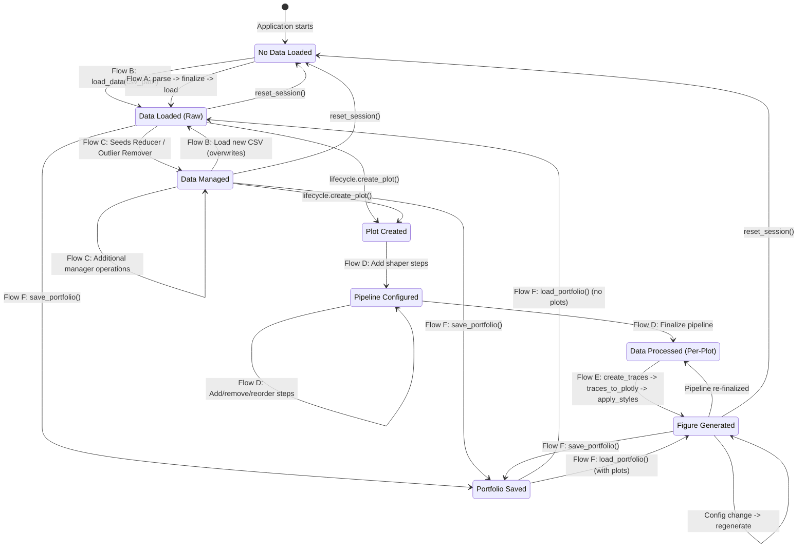
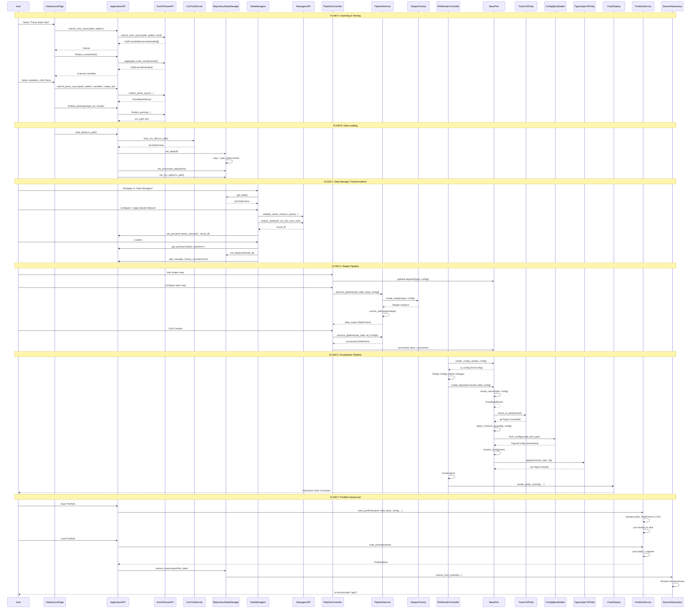

# Step 18: End-to-End Data Flow Analysis

## Table of Contents
1. [Executive Summary](#1-executive-summary)
2. [Flow A: Scanning & Parsing Pipeline](#2-flow-a-scanning--parsing-pipeline)
3. [Flow B: Data Loading & Session Persistence](#3-flow-b-data-loading--session-persistence)
4. [Flow C: Data Manager Transformations](#4-flow-c-data-manager-transformations)
5. [Flow D: Shaper Pipeline Execution](#5-flow-d-shaper-pipeline-execution)
6. [Flow E: Visualization Pipeline](#6-flow-e-visualization-pipeline)
7. [Flow F: Portfolio Save/Load Round-Trip](#7-flow-f-portfolio-saveload-round-trip)
8. [State Transitions Diagram](#8-state-transitions-diagram)
9. [Data Type Transformations Table](#9-data-type-transformations-table)
10. [Complete End-to-End Sequence Diagram](#10-complete-end-to-end-sequence-diagram)
11. [Cross-Cutting Concerns](#11-cross-cutting-concerns)

---

## 1. Executive Summary

The RING-5 Unified Engine v2 implements a complete data analysis pipeline from raw simulator output files to interactive, publication-quality visualizations. The system is built on a clean architecture with strict layer boundaries:

- **Presentation Layer (Layer A)**: Streamlit-based web UI, controllers, components
- **Application Layer (Layer B)**: `ApplicationAPI` facade, orchestration, state management
- **Domain Layer (Layer C)**: Services (shapers, managers, data services), models
- **Infrastructure Layer**: Parsing subsystem (gem5 scanner/parser), file I/O, caching

Data flows through six major pipelines identified in this analysis:

| Flow | Description | Input Type | Output Type | Key Boundary Crossings |
|------|-------------|------------|-------------|------------------------|
| A | Scanning & Parsing | `stats.txt` files | Per-variable CSV files | Infrastructure -> Domain |
| B | Data Loading | CSV file path / upload | `pd.DataFrame` in session | Domain -> State |
| C | Data Managers | `pd.DataFrame` | Transformed `pd.DataFrame` | State -> Service -> State |
| D | Shaper Pipeline | `pd.DataFrame` + `ShaperStepConfig[]` | Shaped `pd.DataFrame` | State -> Factory -> State |
| E | Visualization | Shaped DataFrame + `PlotConfig` | Rendered Plotly/Matplotlib figure | State -> Traces -> Config -> Render |
| F | Portfolio Round-Trip | Session state | JSON file -> Restored session | State -> JSON -> State |

The central data artifact throughout the system is the **pandas DataFrame**. Every transformation -- from raw parsing output through manager operations, shaper pipelines, and visualization -- preserves or transforms DataFrames. The system maintains at minimum two DataFrame slots in state: `raw_data` (the currently loaded baseline) and `processed_data` (the per-plot pipeline output).

**Key Architectural Invariants:**
- The `ApplicationAPI` is the sole gateway between presentation and domain layers
- `RepositoryStateManager` is the single source of truth for all application state
- All state mutations flow through the repository layer (never direct `st.session_state`)
- The parsing subsystem operates in a multiprocessing pool, completely decoupled from the UI
- Plot deserialization uses dependency injection to avoid core-to-web imports

---

## 2. Flow A: Scanning & Parsing Pipeline

### 2.1 Overview

Flow A converts raw simulator output (gem5 `stats.txt` files) into structured CSV data. This is the primary data ingestion pathway for users who have not yet parsed their simulation results. The flow involves two phases: **scanning** (discovering available variables in stats files) and **parsing** (extracting variable values across all experiments into a CSV).

### 2.2 Entry Point: Data Source Page

The flow begins on the **Data Source** page (`src/web/pages/data_source.py`) where the `DataSourcePage.render()` method presents three options via a segmented control:

1. **Parse Stats Files** (triggers Flow A)
2. **I already have CSV data** (skips to Flow B)
3. **Load from Recent** (CSV pool, also Flow B variant)

When the user selects "Parse Stats Files", the UI delegates to:
```python
DataSourceComponents.render_parser_config(self.api)
```

This component collects the scanner/parser configuration:
- `stats_path`: Root directory containing simulation output folders
- `stats_pattern`: Glob pattern for stats files (default: `stats.txt`)
- `strategy_type`: Parsing strategy (`"simple"` or `"config_aware"`)
- `simulator`: Which simulator backend to use (default: `"gem5"`)

### 2.3 Scanning Phase

**Purpose**: Discover what variables (statistics) exist in the stats files before parsing.

**Call Chain**:
```
DataSourcePage -> DataSourceComponents.render_parser_config()
    -> api.submit_scan_async(stats_path, stats_pattern, limit)
        -> self._parser.submit_scan_async(...)
            -> Gem5ParserAPI.submit_scan_async(...)
                -> Gem5Scanner.submit_scan_async(stats_path, stats_pattern, limit)
```

**Detailed Steps**:

1. **File Discovery**: The `ApplicationAPI.find_stats_files()` method uses `Path.rglob()` with sanitized patterns to find all matching stats files within the search directory.

2. **Async Submission**: `Gem5Scanner.submit_scan_async()` submits scanning work items to a `ScanWorkPool` (a `concurrent.futures.ProcessPoolExecutor` wrapper). Each work item processes a limited number of stats files (controlled by the `limit` parameter, default 5).

3. **Perl Backend Execution**: The actual scanner is `Gem5StatsScanner` (`src/parsing/gem5/impl/scanning/scanner.py`), which wraps a Perl script (`perl/statsScanner.pl`). The scanner:
   - Validates that Perl is available in PATH
   - Invokes the Perl script via `subprocess.run()`
   - Parses the JSON output from the Perl script

4. **Variable Discovery**: Each stats file scan produces a list of `ScannedVariable` objects, each containing:
   - `name`: The variable identifier (e.g., `system.cpu.ipc`)
   - `type`: The variable type (scalar, vector, distribution, histogram, configuration)
   - `entries`: Sub-entries for compound types (vectors, distributions)

5. **Result Aggregation**: `api.finalize_scan()` calls `Gem5Scanner.aggregate_scan_results()`, which uses `PatternAggregator` to merge results from multiple files, detecting regex patterns and deduplicating variables.

**Type Transformations in Scanning**:
```
[Path]                                  -- file discovery (rglob)
  -> [str]                              -- file paths
    -> Future[list[ScannedVariable]]    -- async scan work
      -> list[ScannedVariable]          -- aggregated results
        -> list[ScannedVariableDict]    -- stored in parser_repo
```

### 2.4 Parsing Phase

**Purpose**: Extract actual data values from all stats files for selected variables.

**Call Chain**:
```
DataSourceComponents -> api.submit_parse_async(...)
    -> self._parser.submit_parse_async(...)
        -> Gem5ParserAPI.submit_parse_async(...)
            -> Gem5Parser.submit_parse_async(...)
```

**Detailed Steps**:

1. **Variable Configuration**: The UI presents scanned variables to the user, who selects which variables to parse. Each selection creates a `ParseVariableConfig` dict that `ApplicationAPI.submit_parse_async()` normalizes into `StatConfig` objects. The normalization handles:
   - Dict-to-StatConfig conversion
   - Alias resolution (legacy compatibility)
   - Repeat count expansion
   - Regex pattern detection (`r"\d+"` in name triggers `is_regex=True`)

2. **Strategy Selection**: A parsing strategy is chosen via `StrategyFactory`:
   - `"simple"`: Parses each file independently using line-matching
   - `"config_aware"`: Groups experiments by gem5 configuration parameters

3. **Parallel Parsing**: The `Gem5Parser` dispatches work items to `ParseWorkPool` (another `ProcessPoolExecutor`). Each worker:
   - Opens one stats file
   - Applies the strategy-specific extraction logic
   - Returns a `dict[str, Any]` with extracted values per variable

4. **Results Collection**: `ParseBatchResult` contains:
   - `futures`: List of `Future[dict]` objects
   - `total`: Total number of files being parsed
   - `output_dir`: Temporary directory for intermediate results

5. **Finalization**: `api.finalize_parsing()` calls `Gem5Parser.finalize_parsing()` which:
   - Collects all future results
   - Merges per-file dictionaries into a unified table
   - Writes the combined CSV to `output_dir`
   - Returns the CSV file path (or `None` on failure)

**Type Transformations in Parsing**:
```
list[ParseVariableConfig | StatConfig]  -- user selections
  -> list[StatConfig]                    -- normalized configs
    -> ParseBatchResult                  -- async batch with futures
      -> list[dict[str, Any]]            -- per-file results
        -> str (CSV path)                -- finalized output file
```

### 2.5 Transition to Flow B

Once parsing completes and produces a CSV file path, the system transitions to Flow B (Data Loading). The CSV path is handed to `api.load_data(csv_path)` or added to the CSV pool via `api.add_to_csv_pool(csv_path)` for future quick loading.

---

## 3. Flow B: Data Loading & Session Persistence

### 3.1 Overview

Flow B loads structured tabular data (CSV files) into the application's in-memory state as pandas DataFrames. This is the critical boundary where external data enters the system and becomes the "source of truth" for all downstream operations.

### 3.2 Entry Points

There are three entry points for loading data:

**3.2.1 Direct CSV Upload**
```
DataSourcePage -> "I already have CSV data"
    -> Streamlit st.file_uploader()
        -> api.load_data(csv_path)
```

**3.2.2 CSV Pool Loading**
```
DataSourcePage -> "Load from Recent"
    -> DataSourceComponents.render_csv_pool(api)
        -> api.load_from_pool(selected_csv_path)
            -> api.load_data(csv_path)
```

**3.2.3 Post-Parse Loading**
```
api.finalize_parsing() -> csv_path
    -> api.add_to_csv_pool(csv_path)
    -> api.load_data(csv_path)
```

### 3.3 The `load_data()` Orchestration

File: `src/core/application_api.py` -- `ApplicationAPI.load_data()`

This method is the canonical data loading orchestrator. It performs three critical steps in sequence:

```python
def load_data(self, csv_path: str) -> None:
    # 1. Operation: Load via data services
    df = self._services.data_services.load_csv_file(csv_path)

    # 2. Persistence: Save to state
    self.state_manager.set_data(df)
    self.state_manager.set_processed_data(None)  # Reset derived state
    self.state_manager.set_csv_path(csv_path)
```

**Step 1 -- Service Call**: `DefaultDataServicesAPI.load_csv_file()` delegates to `CsvPoolService.load_csv_file()`. The CSV pool service:
- Validates the file path using `validate_path_within()` (security boundary)
- Reads the CSV using `pd.read_csv()` with the standard CSV sniffer for dialect detection
- Applies the metadata cache for subsequent loads (100-entry LRU with 10-minute TTL)

**Step 2 -- State Persistence**: `RepositoryStateManager.set_data()` performs critical processing:
- **Identity check**: If the incoming DataFrame is the exact same object already stored, the method returns immediately (avoids re-typing on every Streamlit rerun)
- **Defensive copy**: `data = data.copy()` prevents external mutations from propagating to stored state
- **Type enforcement**: Reads the `parse_variables` from `parser_repo` and casts any columns marked as `"configuration"` type to `str`. This ensures that configuration parameters (which may look numeric, e.g., cache sizes `"32768"`) are treated as categorical in downstream operations
- **Repository delegation**: `self._session_repo.data_repo.set_data(data, on_change)` stores the DataFrame and optionally fires a change callback

**Step 3 -- Derived State Reset**: Setting `processed_data` to `None` invalidates any previously computed pipeline results. This ensures that when a new dataset is loaded, the user must re-run their shaper pipelines.

### 3.4 State Storage Architecture

The state storage follows a repository pattern with `SessionRepository` as the aggregate root:

```
RepositoryStateManager
    -> SessionRepository (aggregate root)
        -> DataRepository           : raw_data, processed_data
        -> PlotRepository           : plots[], plot_counter, current_plot_id
        -> ConfigRepository         : config{}, csv_path, temp_dir, csv_pool
        -> ParserStateRepository    : parse_variables, stats_path, scanned_vars
        -> PreviewRepository        : operation_name -> DataFrame previews
        -> HistoryRepository        : manager_history, portfolio_history
        -> VisualizationRepository  : plot_id -> FigureConfig
```

All repositories are pure Python in-memory stores (no `st.session_state` dependency). The `ApplicationAPI` singleton is cached via `@st.cache_resource`, ensuring a single instance survives across Streamlit reruns.

### 3.5 Data View Assembly

The `ApplicationAPI.get_current_view()` method assembles the complete data state for UI consumption:

```python
def get_current_view(self) -> dict[str, Any]:
    return {
        "raw_data": self.state_manager.get_data(),
        "processed_data": self.state_manager.get_processed_data(),
        "config": self.state_manager.get_config(),
    }
```

This view is consumed by the data preview fragment in `app.py` to display row count, column count, and source file metrics at the top of every page.

### 3.6 Column Info Extraction

For the UI to present column-level information (e.g., in shaper configuration dropdowns), `ApplicationAPI.get_column_info()` produces a `ColumnInfoResult`:

```python
ColumnInfoResult(
    total_columns=len(df.columns),
    total_rows=len(df),
    numeric_columns=df.select_dtypes(include=[np.number]).columns.tolist(),
    categorical_columns=df.select_dtypes(exclude=[np.number]).columns.tolist(),
    columns=df.columns.tolist(),
)
```

This is a boundary object -- a typed dataclass that the UI layer can safely consume without needing direct DataFrame access for basic metadata queries.

---

## 4. Flow C: Data Manager Transformations

### 4.1 Overview

Flow C applies user-driven, destructive transformations to the **global** raw dataset. Unlike the per-plot shaper pipeline (Flow D), data manager operations permanently modify the shared `raw_data` stored in `DataRepository`. These operations include seed reduction, outlier removal, preprocessing, and data mixing.

### 4.2 Architecture

The Data Managers page (`src/web/pages/data_managers.py`) organizes managers into tabs:

| Tab | Manager Class | Service Delegation | Operation Type |
|-----|---------------|-------------------|----------------|
| Summary | `DataManagerComponents.render_summary_tab()` | None (read-only) | Display |
| Data Visualization | `DataManagerComponents.render_visualization_tab()` | None (read-only) | Display |
| Seeds Reducer | `SeedsReducerManager` | `api.managers.reduce_seeds()` | Aggregation |
| Outlier Remover | `OutlierRemoverManager` | `api.managers.remove_outliers()` | Filtering |
| Preprocessor | `PreprocessorManager` | `api.managers.*` | Arithmetic/Transform |
| Mixer | `MixerManager` | `api.managers.*` | Combination |
| Operations History | `HistoryComponents` | None (read-only) | Display |

Each manager tab is wrapped in `@st.fragment` to isolate its Streamlit rerun scope. This means interacting with one manager tab does not re-execute the others.

### 4.3 Manager Base Class Pattern

All data managers inherit from `DataManager` (`src/web/components/data_managers/data_manager.py`):

```python
class DataManager(ABC):
    def __init__(self, api: ApplicationAPI):
        self.api = api

    def get_data(self) -> pd.DataFrame | None:
        return self.api.state_manager.get_data()

    def set_data(self, data: pd.DataFrame) -> None:
        self.api.state_manager.set_data(data)
```

This establishes the critical pattern: managers **read** data from state, **transform** it via service calls, and **write** the result back to state. They never hold their own copy of the data.

### 4.4 Seeds Reducer Flow (Detailed)

File: `src/web/components/data_managers/seeds_reducer.py`

**Purpose**: Groups data by categorical columns and computes mean + standard deviation across a seed/iteration column, reducing multiple experimental runs to a single aggregated row per configuration.

**Complete Data Flow**:

```
1. SeedsReducerManager.render()
   -> self.get_data()                              # Read from DataRepository
   -> Identify categorical_cols, numeric_cols       # dtype-based partitioning
   -> User selects reduce_col, categorical, numeric # UI interaction

2. User clicks "Apply Seeds Reducer"
   -> api.managers.validate_seeds_reducer_inputs()  # Input validation
   -> api.managers.reduce_seeds(
        df=data,
        categorical_cols=selected_categorical,
        statistic_cols=selected_numeric
      )                                             # Service call
   -> result_df                                     # Transformed DataFrame
   -> api.set_preview("seeds_reduction", result_df) # Store in PreviewRepository

3. User clicks "Confirm and Apply"
   -> api.get_preview("seeds_reduction")            # Retrieve from PreviewRepository
   -> self.set_data(confirmed_df)                   # Write to DataRepository
   -> api.clear_preview("seeds_reduction")          # Clean up preview
   -> api.add_manager_history_record(record)        # Record in HistoryRepository
```

**Key Design Pattern -- Two-Phase Commit**:
The manager implements a preview-then-confirm pattern:
- Phase 1: The transformation is computed and stored in `PreviewRepository` as a temporary result
- Phase 2: The user explicitly confirms, promoting the preview to the active dataset in `DataRepository`

This prevents accidental data loss from one-click destructive operations.

**Type Transformation**:
```
pd.DataFrame (N rows, M columns)
    -> pd.DataFrame (N/k rows, M+S columns)
       where k = unique values in reduce_col
             S = number of .sd (standard deviation) columns added
```

### 4.5 Outlier Remover Flow (Detailed)

File: `src/web/components/data_managers/outlier_remover.py`

**Purpose**: Removes rows where a numeric column exceeds the third quartile (Q3), optionally grouped by categorical columns.

**Data Flow**:
```
1. OutlierRemoverManager.render()
   -> data = self.get_data()                        # Read
   -> categorical_cols, numeric_cols                 # Partition by dtype
   -> User selects outlier_column, group_by_cols     # UI

2. "Apply Outlier Remover" clicked
   -> api.managers.validate_outlier_inputs(...)      # Validation
   -> api.managers.remove_outliers(
        df=data,
        outlier_col=outlier_column,
        group_by_cols=group_by_cols
      )                                              # Service call (Q3 filter)
   -> api.set_preview("outlier_removal", filtered_df)

3. "Confirm and Apply" clicked
   -> self.set_data(confirmed_df)                    # Write to DataRepository
   -> api.add_manager_history_record(record)         # History
```

**Intelligent Defaults**: The manager excludes seed-like columns (`"seed"`, `"iteration"`, `"run_id"`) from the default group-by selection. Grouping by seed columns would create single-row groups where no outliers can be detected.

### 4.6 History Tracking

Every confirmed manager operation produces an `OperationRecord`:

```python
OperationRecord = TypedDict("OperationRecord", {
    "source_columns": list[str],
    "dest_columns": list[str],
    "operation": str,
    "timestamp": str,
})
```

Records are stored in **two** history tracks:
- **Manager History** (rolling, last 20): For the history sub-tab within Data Managers
- **Portfolio History** (full): For portfolio-level audit trail that survives save/load

The `api.add_manager_history_record()` method writes to both:
```python
def add_manager_history_record(self, record: OperationRecord) -> None:
    self.state_manager.add_manager_history_record(record)
    self.state_manager.add_portfolio_history_record(record)
```

History can be replayed: `HistoryComponents.render_manager_history()` presents "Load" buttons that restore a previous operation's column configuration via `UIStateManager().manager.consume_load_trigger()`.

---

## 5. Flow D: Shaper Pipeline Execution

### 5.1 Overview

Flow D applies a **per-plot** chain of data transformations to produce the shaped DataFrame that will be visualized. Unlike Flow C's global mutations, each plot maintains its own independent pipeline. The pipeline is configured interactively through the `PipelineController` and executed by the `PipelineService`.

### 5.2 Pipeline Architecture

The shaper system follows the **Strategy + Factory + Pipeline** patterns:

```
PipelineController (orchestrator)
    -> PipelineComponent (UI)
    -> PipelineStepComponent (per-step UI)
    -> PipelineExecutorAdapter (bridge to services)
        -> PipelineService.process_pipeline()
            -> ShaperFactory.create_shaper(type, config)
                -> Shaper subclass (Strategy)
                    -> DataFrame.pipe(shaper)
```

### 5.3 Available Shapers

The `ShaperFactory` (`src/core/services/shapers/factory.py`) maintains a registry of 10 shaper types:

| Shaper Type | Display Name | Purpose | Key Parameters |
|-------------|-------------|---------|----------------|
| `columnSelector` | Column Selector | Select/reorder columns | `columns: list[str]` |
| `conditionSelector` | Filter | Row filtering by conditions | `conditions: list[Condition]` |
| `itemSelector` | Item Selector | Select specific items by value | `column, values` |
| `sort` | Sort | Sort by one or more columns | `columns, ascending` |
| `mean` | Mean Calculator | Compute grouped means | `group_by, agg_cols` |
| `normalize` | Normalize | Divide by baseline values | `baseline: dict, columns` |
| `pivotLonger` | Pivot Longer (Melt) | Wide to long format | `id_vars, value_vars` |
| `pivotWider` | Pivot Wider | Long to wide format | `index, columns, values` |
| `splitApply` | Split-Apply (Per-Axis) | Group and apply per-group | `split_by, apply_fn` |
| `transformer` | Transformer | Arbitrary column transforms | `expression, new_col` |

Each shaper implements the `Shaper` base class, which is callable (supports `DataFrame.pipe(shaper)`).

### 5.4 Pipeline Controller Flow

File: `src/web/controllers/plot/pipeline_controller.py`

The `PipelineController.render()` method manages the complete pipeline lifecycle for a single plot:

**Step 1 -- Data Guard**:
```python
raw_data: pd.DataFrame | None = self._api.state_manager.get_data()
if raw_data is None:
    PipelineComponent.render_no_data_warning()
    return
```

**Step 2 -- Add Shaper**:
```python
add_result = PipelineComponent.render_add_shaper(plot.plot_id)
if add_result["add_clicked"]:
    plot.pipeline.append({
        "id": plot.pipeline_counter,
        "type": add_result["shaper_type"],
        "config": {},
    })
    plot.pipeline_counter += 1
    st.rerun()
```

Each pipeline step is stored as a `PipelineStep` dict with three fields: `id` (unique integer), `type` (shaper type string), and `config` (a `ShaperStepConfig` dict).

**Step 3 -- Incremental Computation**:
The `_handle_pipeline_steps()` method demonstrates a critical optimization:

```python
step_input: pd.DataFrame = raw_data
for idx, shaper in enumerate(plot.pipeline):
    result = PipelineStepComponent.render_step(
        step_input=step_input,
        current_config=shaper.get("config", {}),
        configure_fn=self._pipeline.configure_shaper,
        apply_fn=self._pipeline.apply_shapers,
    )
    step_output = result.get("step_output")
    if step_output is not None:
        step_input = step_output  # Chain output to next input
```

This is **incremental pipeline computation**: each step's output becomes the next step's input. This avoids the O(n^2) cost of re-applying all previous shapers from scratch at each step. The intermediate DataFrames are computed only when the step configuration changes.

**Step 4 -- Finalize**:
```python
def _handle_finalize(self, plot, raw_data):
    confs = [s["config"] for s in plot.pipeline if s["config"]]
    processed = self._pipeline.apply_shapers(raw_data, confs)
    plot.processed_data = processed
```

Finalization applies the complete pipeline from raw data to produce the final `processed_data` stored on the `BasePlot` instance.

### 5.5 PipelineService.process_pipeline()

File: `src/core/services/shapers/pipeline_service.py`

This is the core execution engine for shaper pipelines:

```python
@staticmethod
def process_pipeline(
    data: pd.DataFrame, pipeline_config: list[ShaperStepConfig]
) -> pd.DataFrame:
    current_data = data
    for i, shaper_config in enumerate(pipeline_config):
        shaper_type = shaper_config.get("type")
        if not shaper_type:
            continue
        shaper = ShaperFactory.create_shaper(shaper_type, shaper_config)
        current_data = current_data.pipe(shaper)
    return current_data
```

**Key Design Decisions**:
- **No initial copy**: The pipeline does not copy the input DataFrame. Each individual shaper is responsible for creating its own copy internally, preventing mutation of the original.
- **Factory dispatch**: `ShaperFactory.create_shaper()` instantiates the appropriate `Shaper` subclass based on the type string. Unknown types raise `ValueError`.
- **Pipe pattern**: Uses `DataFrame.pipe()` which passes the DataFrame as the first argument to the callable shaper. This keeps the pipeline syntax clean and chainable.
- **Performance instrumentation**: Each shaper step is individually timed via `time.perf_counter()` with per-step and total pipeline timing logged at INFO level.
- **Fail-fast**: If any shaper fails, the exception is re-raised as `ValueError(f"Failed to apply shaper {shaper_type}: {e}")` with chained cause.

### 5.6 Pipeline Persistence

Pipelines can be saved and loaded independently of plots:

**Save**: `PipelineService.save_pipeline()` serializes the pipeline configuration to a JSON file in the `pipelines/` directory. The JSON structure (`PipelineData`):
```json
{
    "name": "my_pipeline",
    "description": "Filter and normalize IPC data",
    "pipeline": [
        {"id": 0, "type": "columnSelector", "config": {"columns": ["cpu", "ipc"]}},
        {"id": 1, "type": "normalize", "config": {"baseline": {"cpu": "baseline"}, "columns": ["ipc"]}}
    ],
    "timestamp": "2026-03-03T12:00:00"
}
```

**Load**: `PipelineService.load_pipeline()` reads the JSON and returns the `PipelineData` dict. `prepare_loaded_pipeline()` then deep-copies the steps and computes the next `pipeline_counter` value from the maximum step ID.

### 5.7 Type Transformations in a Typical Pipeline

```
pd.DataFrame (raw, N rows x M cols)
    -> columnSelector:     N rows x K cols (K <= M, column subset)
    -> conditionSelector:  P rows x K cols (P <= N, row filter)
    -> sort:               P rows x K cols (reordered rows)
    -> mean:               Q rows x K cols (Q < P, aggregated)
    -> normalize:          Q rows x K cols (values divided by baseline)
    -> pivotWider:         R rows x L cols (reshaped)
= pd.DataFrame (processed, R rows x L cols)
```

Each step preserves the DataFrame contract while potentially changing both shape and content.

---

## 6. Flow E: Visualization Pipeline

### 6.1 Overview

Flow E is the most complex pipeline in the system. It transforms a shaped DataFrame and a `PlotConfig` dictionary into a fully rendered, interactive chart displayed in the browser. The flow spans five distinct phases: plot creation, trace building, figure construction, style application, and chart display.

### 6.2 Architecture: Three Controllers

The Manage Plots page (`src/web/pages/manage_plots.py`) composes three controllers with injected dependencies:

```python
creation = PlotCreationController(api, ui_state, lifecycle, registry)
pipeline = PipelineController(api, ui_state, pipeline_executor)
render   = PlotRenderController(api, ui_state, lifecycle, registry)
```

Dependencies are injected via protocol adapters created at the page level:
- `PlotLifecycleAdapter`: Wraps static `BasePlot` methods for create/delete/duplicate
- `PlotTypeRegistryAdapter`: Wraps the plot type registry for available types
- `PipelineExecutorAdapter`: Wraps `PipelineService` for shaper execution

### 6.3 Phase 1: Plot Creation

File: `src/web/controllers/plot/creation_controller.py`

**Data Flow**:
```
PlotCreationController.render_create_section()
    -> PlotCreationComponent.render(default_name, available_types)
    -> result = {"create_clicked": True, "name": "Plot 1", "plot_type": "grouped_bar"}
    -> lifecycle.create_plot(name, plot_type, state_manager)
        -> BasePlot subclass instantiated (e.g., GroupedBarPlot)
        -> state_manager.add_plot(plot_obj)
        -> state_manager.start_next_plot_id()
    -> st.rerun()
```

Each plot is a `BasePlot` subclass holding:
- `plot_id: int` -- Unique monotonically-incrementing identifier
- `name: str` -- User-editable display name
- `plot_type: str` -- Type string (e.g., `"grouped_bar"`, `"line"`, `"heatmap"`)
- `config: PlotConfig` -- Flat dictionary of all configuration key-value pairs
- `processed_data: pd.DataFrame | None` -- Per-plot pipeline output
- `pipeline: list[PipelineStep]` -- Per-plot shaper pipeline configuration
- `pipeline_counter: int` -- Next pipeline step ID
- `last_generated_fig: go.Figure | None` -- Cached Plotly figure
- `last_traces: TraceBuildResult | None` -- Cached engine-agnostic trace data

### 6.4 Phase 2: Configuration Gathering

File: `src/web/controllers/plot/render_controller.py` -- `PlotRenderController.render()`

This phase collects the complete plot configuration from UI widgets:

**Step 1 -- Plot type selector**:
```python
new_type = st.selectbox("Plot Type", options=available_types, ...)
if type_changed:
    lifecycle.change_plot_type(plot, new_type, state_manager)
    st.rerun()
```

**Step 2 -- Type-specific config** (delegated to the concrete plot):
```python
ui_config: PlotConfig = plot.render_config_ui(data, saved_config)
current_config.update(ui_config)
```
Each plot type implements `render_config_ui()` (via `PlotConfigUIMixin`), returning a dict of type-specific settings. For example, a grouped bar plot would collect `x_column`, `y_columns`, `color_column`, `barmode`, etc.

**Step 3 -- Advanced & Theme settings** (settings pills):
```python
selected_section = render_settings_pills(show_advanced=show_adv)
extra_config = plot.render_settings_section(selected_section, current_config, data)
current_config.update(extra_config)
```
The settings pills system provides UI for: dimensions (width, height, margins), typography (font sizes), axes (labels, ticks, ranges), legends (positions, columns, spacing), data labels, reference lines, color palettes, and series styles.

**Step 4 -- Change detection**:
```python
config_changed: bool = current_config != saved_config
auto_refresh: bool = self._ui.plot.get_auto_refresh(plot.plot_id)
```
Configuration changes are detected by simple dict comparison. The auto-refresh toggle determines whether figure regeneration happens automatically or requires a manual "Refresh" click.

### 6.5 Phase 3: Trace Building (Engine-Agnostic)

When figure generation is triggered, the first step converts DataFrame + config into engine-agnostic traces:

```python
# In BasePlot.create_figure():
result = self.create_traces(data, config)  # Abstract method
self.last_traces = result
fig = traces_to_plotly(result)
```

Each plot type implements `create_traces()` returning a `TraceBuildResult`:

```python
@dataclass
class TraceBuildResult:
    traces: Sequence[TraceConfig]     # Engine-agnostic trace specs
    barmode: str | None = None         # "group", "stack", etc.
    shapes: list[dict] = field(...)    # Custom shapes (separators, etc.)
    annotations: list[AnnotationConfig] = field(...)
    secondary_y: bool = False          # Dual-axis support
    x_tick_vals: list[Any] | None = None
    x_tick_text: list[str] | None = None
```

The `TraceConfig` hierarchy includes:
| Trace Type | Key Fields | Used By |
|-----------|-----------|---------|
| `BarTraceConfig` | x, y, name, color, error_y, legendgroup | Grouped bar, stacked bar |
| `LineTraceConfig` | x, y, name, color, dash, mode | Line plots |
| `ScatterTraceConfig` | x, y, name, color, symbol, size | Scatter plots |
| `HeatmapTraceConfig` | x, y, z, colorscale, name | Heatmap plots |
| `HistogramTraceConfig` | x, name, nbins | Histogram plots |

### 6.6 Phase 4: Figure Construction and Style Application

**trace_to_plotly.py** -- Converts `TraceBuildResult` to `go.Figure`:

```python
def traces_to_plotly(result: TraceBuildResult) -> go.Figure:
    # Handle subplots for multi-heatmap, dual-axis
    if heatmap_only:
        fig = make_subplots(rows=len(traces), cols=1, ...)
    elif result.secondary_y:
        fig = make_subplots(specs=[[{"secondary_y": True}]])
    else:
        fig = go.Figure()

    for index, trace in enumerate(traces_list, start=1):
        plotly_trace = _convert_trace(trace)  # TraceConfig -> go.Bar/go.Scatter/etc.
        fig.add_trace(plotly_trace, ...)

    # Apply barmode, shapes, annotations, tick overrides
```

**StyleApplicator** -- Applies visual styling to the figure:

```python
# In BasePlot.apply_common_layout():
return self._applicator.apply_styles(fig, config)

# In StyleApplicator.apply_styles():
self.last_spec = resolve_config(ConfigSpecBuilder.from_config(config, self.plot_type))
FigureSpecToPlotly.apply(self.last_spec, fig)
```

The style pipeline has three critical stages:

1. **ConfigSpecBuilder.from_config()**: Converts the flat `PlotConfig` dict into a typed `FigureConfig` dataclass hierarchy. This builder extracts values for dimensions, typography, axes, legends, data labels, reference lines, series styles, color palettes, and more. It uses `dpi=1` so pixel values pass through without conversion.

2. **resolve_config()**: Resolves sentinel values (fields set to `-1` meaning "use default") into concrete values. This is necessary because the `FigureConfig` model uses `-1` as a sentinel for "not explicitly set" across many numeric fields.

3. **FigureSpecToPlotly.apply()**: The stateless Plotly connector that translates the resolved `FigureConfig` into actual `fig.update_layout()` calls. It follows a strict pipeline order:
   ```
   dimensions -> backgrounds -> title -> xaxis -> yaxis -> y2axis
   -> legends -> heatmap_colorbars -> color_palette -> hovermode
   -> font_family -> reference_lines -> data_labels -> series_styling
   -> trace_overrides -> separator_lines -> stripes -> axis_colors
   ```

### 6.7 Phase 5: Cache, Display, and Interaction

**Figure Caching** (in `PlotRenderController._render_visualization()`):

```python
data_hash = self._compute_data_hash(plot.processed_data)
cache_key = self._compute_figure_cache_key(plot.plot_id, plot.config, data_hash)
cache = get_plot_cache()

if not should_generate and plot.last_generated_fig is None:
    cached_fig = cache.get(cache_key)
    if cached_fig is not None:
        plot.last_generated_fig = cached_fig
```

The cache key is composed of:
- `plot_id`: Unique plot identifier
- Config hash: MD5 of JSON-serialized config (ignoring transient UI state like `xaxis_range`, `yaxis_range`)
- Data hash: MD5 of DataFrame shape + first/last row + column list (fast approximation)

The `SimpleCache` (from `src/core/performance.py`) is a thread-safe LRU cache with optional TTL. The plot cache uses a max size of 128 entries.

**Engine-Specific Display**:

The system supports two rendering engines:
- **Plotly (default)**: `ChartDisplayComponent.render_plotly_chart()` -- interactive, supports zoom/pan, legend drag
- **Matplotlib**: `ChartDisplayComponent.render_matplotlib_chart()` -- static, publication-quality, uses pre-computed `TraceBuildResult` traces

Engine selection is managed by `EngineManager`:
```python
engine_choice = ChartDisplayComponent.render_engine_selector(plot.plot_id, EngineManager.get_engine())
if engine_choice is not None:
    EngineManager.set_engine(cast(EngineMode, engine_choice))
```

**Relayout Handling** (Plotly only):
```python
relayout_data = ChartDisplayComponent.render_plotly_chart(fig, plot.plot_id, ...)
if relayout_data:
    if plot.update_from_relayout(relayout_data):
        st.session_state[last_event_key] = relayout_data
        st.rerun()
```

The `update_from_relayout()` method (on `BasePlot`) delegates to `update_config_from_relayout()` -- a pure function in Layer B that maps Plotly relayout events (zoom ranges, legend positions) back to `PlotConfig` keys, closing the interactive feedback loop.

### 6.8 Complete Data Path Summary

```
pd.DataFrame (processed_data on BasePlot)
    -> plot.create_traces(data, config)
        -> TraceBuildResult (engine-agnostic)
    -> traces_to_plotly(result)
        -> go.Figure (unstyled, with traces and layout hints)
    -> plot.apply_common_layout(fig, config)
        -> ConfigSpecBuilder.from_config(config)
            -> FigureConfig (typed, with sentinels)
        -> resolve_config(spec)
            -> FigureConfig (resolved, all values concrete)
        -> FigureSpecToPlotly.apply(spec, fig)
            -> go.Figure (fully styled)
    -> Legend label application
        -> go.Figure (final)
    -> cache.set(key, fig)
    -> ChartDisplayComponent.render_plotly_chart(fig, ...)
        -> Browser renders interactive chart
```

---

## 7. Flow F: Portfolio Save/Load Round-Trip

### 7.1 Overview

Flow F enables complete session persistence: saving all application state (data, plots, configurations, history) to a JSON file and restoring it later. This implements the **Memento Pattern** at the application level.

### 7.2 Portfolio Save Path

File: `src/web/pages/portfolio.py`

**Entry Point**: User navigates to "Save/Load Portfolio" page and clicks "Save Portfolio".

**Complete Save Flow**:
```
1. _portfolio_fragment(api)
   -> portfolio_name = st.text_input(...)
   -> "Save Portfolio" button clicked

2. Collect state:
   -> current_data = api.state_manager.get_data()
   -> plots = api.state_manager.get_plots()
   -> config = api.state_manager.get_config()
   -> plot_counter = api.state_manager.get_plot_counter()
   -> csv_path = api.state_manager.get_csv_path()
   -> parse_variables = api.state_manager.get_parse_variables()

3. Delegate to service:
   -> api.data_services.save_portfolio(
        name=portfolio_name,
        data=current_data,
        plots=plots,
        config=config,
        plot_counter=plot_counter,
        csv_path=csv_path,
        parse_variables=parse_variables,
        figure_spec_enricher=_build_figure_spec,  # Injected callback
      )

4. PortfolioService.save_portfolio():
   -> Serialize each plot via plot.to_dict()
   -> Optionally enrich with FigureConfig via figure_spec_enricher callback
   -> Convert DataFrame to CSV string: data.to_csv(index=False)
   -> Collect parser state: stats_path, stats_pattern, scanned_variables
   -> Collect history: manager_history, portfolio_history
   -> Build portfolio_data dict
   -> json.dump() to portfolios/<name>.json
```

**Portfolio JSON Schema** (version 2.0):
```json
{
    "schema_version": 3,
    "version": "2.0",
    "timestamp": "2026-03-03T12:00:00",
    "data_csv": "col1,col2\n1,2\n3,4",
    "csv_path": "/path/to/original.csv",
    "plots": [
        {
            "id": 1,
            "name": "IPC Comparison",
            "plot_type": "grouped_bar",
            "config": { ... },
            "pipeline": [ ... ],
            "pipeline_counter": 5,
            "processed_data_csv": "...",
            "figure_spec": { ... }
        }
    ],
    "plot_counter": 3,
    "config": { ... },
    "parse_variables": [ ... ],
    "stats_path": "/path/to/stats",
    "stats_pattern": "stats.txt",
    "scanned_variables": [ ... ],
    "manager_history": [ ... ],
    "portfolio_history": [ ... ]
}
```

**Key Design Decision -- Dependency Injection for FigureConfig**:
The portfolio save path receives a `figure_spec_enricher` callback:
```python
def _build_figure_spec(config: dict[str, Any], plot_type: str) -> dict[str, Any] | None:
    spec = ConfigSpecBuilder.from_config(config, plot_type)
    return spec.to_dict()
```
This callback lives in the web layer (`portfolio.py`) and is passed to the core layer (`PortfolioService`). This preserves the layer boundary: the core layer never imports `ConfigSpecBuilder` directly.

### 7.3 Portfolio Load Path

**Complete Load Flow**:
```
1. _portfolio_fragment(api)
   -> portfolios = api.data_services.list_portfolios()
   -> selected_portfolio = st.selectbox(...)
   -> "Load Portfolio" button clicked

2. Load from disk:
   -> data = api.data_services.load_portfolio(selected_portfolio)
   -> PortfolioService.load_portfolio(name)
        -> json.load() from portfolios/<name>.json
        -> PortfolioMigrator.migrate(raw)  # Schema migration
        -> return PortfolioData

3. Restore state:
   -> api.state_manager.restore_session(data)
   -> SessionRepository.restore_from_portfolio(portfolio_data):

4. Restoration steps (SessionRepository):
   a. Clear widget state
   b. Restore parser state:
      -> parser_repo.set_parse_variables(...)
      -> parser_repo.set_stats_path(...)
      -> parser_repo.set_stats_pattern(...)
      -> parser_repo.set_scanned_variables(...)
      -> parser_repo.set_using_parser(...)
   c. Restore config:
      -> config_repo.set_csv_path(...)
      -> config_repo.set_config(...)
   d. Restore data:
      -> pd.read_csv(io.StringIO(data_csv))
      -> data_repo.set_data(df)
   e. Restore plots via injected deserializer:
      -> for plot_data in plots:
           plot = self._plot_deserializer(plot_data)  # BasePlot.from_dict()
           loaded_plots.append(plot)
      -> plot_repo.set_plots(loaded_plots)
      -> plot_repo.set_plot_counter(...)
   f. Restore history:
      -> history_repo.set_manager_history(...)
      -> history_repo.set_portfolio_history(...)

5. st.rerun(scope="app")  # Full app rerun to reflect restored state
```

**Plot Deserialization -- Dependency Injection**:
The `BasePlot.from_dict()` classmethod is injected as `plot_deserializer` during `ApplicationAPI.__init__()`:
```python
# In app.py:
api = ApplicationAPI(plot_deserializer=BasePlot.from_dict)

# In ApplicationAPI.__init__():
self.state_manager = RepositoryStateManager(plot_deserializer=plot_deserializer)

# In SessionRepository.__init__():
self._plot_deserializer = plot_deserializer
```

This chain ensures the core `SessionRepository` can reconstruct `BasePlot` instances without importing any web-layer code, maintaining the architecture boundary.

### 7.4 Schema Migration

`PortfolioMigrator.migrate()` handles backward compatibility when loading portfolios saved by older versions. The migrator applies transformations sequentially to bring older schemas up to the current `CURRENT_VERSION`. This is critical for long-lived portfolios across application updates.

### 7.5 Round-Trip Fidelity

The portfolio round-trip preserves:
- Raw DataFrame (serialized as CSV string, deserialized via `pd.read_csv()`)
- All plot objects with their types, configs, and pipeline configurations
- Per-plot processed data (if available)
- Parser state for re-parsing capability
- Operation history for audit trail

Data that is **not** preserved:
- Cached Plotly figures (`last_generated_fig`) -- regenerated on demand
- Preview DataFrames -- cleared on session restore
- Widget-specific UI state in `st.session_state` -- handled by Streamlit

---

## 8. State Transitions Diagram



### State Ownership Table

| State | Repository | Set By | Read By |
|-------|-----------|--------|---------|
| `raw_data` | `DataRepository` | `ApplicationAPI.load_data()`, `DataManager.set_data()` | All pages, managers, pipeline |
| `processed_data` (global) | `DataRepository` | `ApplicationAPI.load_data()` (sets None) | `app.py` data preview |
| `processed_data` (per-plot) | `BasePlot.processed_data` | `PipelineController._handle_finalize()` | `PlotRenderController.render()` |
| `plots[]` | `PlotRepository` | `PlotLifecycleAdapter.create_plot()` | `PlotCreationController.render_selector()` |
| `current_plot_id` | `PlotRepository` | `PlotCreationController.render_selector()` | `PlotCreationController.render_selector()` |
| `config` | `ConfigRepository` | `RepositoryStateManager.set_config()` | `ApplicationAPI.get_current_view()` |
| `csv_path` | `ConfigRepository` | `ApplicationAPI.load_data()` | Portfolio save, data preview |
| `parse_variables` | `ParserStateRepository` | Data Source page | `RepositoryStateManager.set_data()` (type enforcement) |
| `preview(op)` | `PreviewRepository` | Data managers (phase 1) | Data managers (phase 2 confirm) |
| `manager_history` | `HistoryRepository` | `ApplicationAPI.add_manager_history_record()` | Data Managers history tab |
| `portfolio_history` | `HistoryRepository` | `ApplicationAPI.add_manager_history_record()` | Portfolio page |
| `viz_config(plot_id)` | `VisualizationRepository` | `ApplicationAPI.set_visualization_config()` | Export/download pipeline |

---

## 9. Data Type Transformations Table

This table documents the exact data type at every major transition point:

| Stage | Location | Data Type | Shape Example | Key Fields |
|-------|----------|-----------|--------------|------------|
| Raw stats file | Disk | Text file | N/A | Flat text with key-value pairs |
| Scanned variables | `ParserStateRepository` | `list[ScannedVariableDict]` | ~50-200 items | `name`, `type`, `entries` |
| Parse config | `ApplicationAPI` | `list[StatConfig]` | ~5-50 items | `name`, `type`, `repeat`, `params`, `is_regex` |
| Parse batch result | `Gem5Parser` | `ParseBatchResult` | N futures | `futures`, `total`, `output_dir` |
| Per-file result | Worker pool | `dict[str, Any]` | 1 per file | Variable names as keys, values as values |
| Parsed CSV | Disk | CSV file | 100-100K rows | All selected variables as columns |
| Raw DataFrame | `DataRepository` | `pd.DataFrame` | 100-100K x 10-200 | Numeric + categorical columns |
| Column info | `ApplicationAPI` | `ColumnInfoResult` | Summary | `numeric_columns`, `categorical_columns` |
| Preview (manager) | `PreviewRepository` | `pd.DataFrame` | Reduced rows | Same schema or modified |
| Managed DataFrame | `DataRepository` | `pd.DataFrame` | Fewer rows/more cols | May have `.sd` columns |
| Pipeline step config | `BasePlot.pipeline` | `list[PipelineStep]` | 0-10 items | `id`, `type`, `config` |
| Shaper instance | `ShaperFactory` | `Shaper` subclass | N/A | Callable, takes DataFrame |
| Processed DataFrame | `BasePlot.processed_data` | `pd.DataFrame` | Varies | Shaped for visualization |
| Trace build result | `BasePlot.last_traces` | `TraceBuildResult` | 1-50 traces | `traces`, `barmode`, `shapes`, `annotations` |
| Individual trace | `TraceBuildResult.traces` | `TraceConfig` subclass | Per series | `x`, `y`, `name`, `color`, type-specific |
| Unstyled figure | `traces_to_plotly()` | `go.Figure` | N traces | Plotly traces + basic layout |
| Plot config | `BasePlot.config` | `PlotConfig (dict)` | 30-150 keys | Flat key-value pairs |
| Figure spec (unresolved) | `ConfigSpecBuilder` | `FigureConfig` | Nested dataclass | `dimensions`, `typography`, `axes`, `legends` |
| Figure spec (resolved) | `resolve_config()` | `FigureConfig` | Nested dataclass | All sentinels replaced with defaults |
| Styled figure | `FigureSpecToPlotly.apply()` | `go.Figure` | N traces | Fully styled Plotly figure |
| Cache key | `PlotRenderController` | `str` | ~30 chars | `plot_{id}_{config_hash}_{data_hash}` |
| Portfolio JSON | Disk | JSON file | 1-50 MB | `data_csv`, `plots[]`, `config`, history |
| Portfolio data | `PortfolioService` | `PortfolioData (TypedDict)` | In memory | All serialized state fields |
| Operation record | `HistoryRepository` | `OperationRecord` | Per operation | `source_columns`, `dest_columns`, `operation`, `timestamp` |

---

## 10. Complete End-to-End Sequence Diagram



---

## 11. Cross-Cutting Concerns

### 11.1 Caching Strategy

The system employs a multi-level caching hierarchy:

| Cache | Implementation | Location | Scope | TTL | Max Size |
|-------|---------------|----------|-------|-----|----------|
| ApplicationAPI singleton | `@st.cache_resource` | `app.py` | Session | Infinite | 1 |
| CSV metadata | `SimpleCache` | `CsvPoolService` | Global | 10 min | 100 |
| DataFrame (CSV load) | `SimpleCache` | `CsvPoolService` | Global | 5 min | 10 |
| Plot figure | `SimpleCache` | `PlotRenderController` | Session | None | 128 |
| Per-plot last_generated_fig | Instance attribute | `BasePlot` | Plot lifetime | None | 1 per plot |

**Cache Invalidation**:
- CSV metadata: TTL-based (10 minutes) + max size eviction
- DataFrame: TTL-based (5 minutes) + max size eviction
- Plot figure: Key-based (config hash + data hash); invalidated when config or data changes
- `last_generated_fig`: Set to `None` on config change, relayout event, or pipeline re-finalization

**Cache Key Strategy for Plot Figures**:
```python
cache_key = f"plot_{plot_id}_{config_hash}_{data_hash}"
```
Where:
- `config_hash`: MD5 of JSON-serialized config, excluding transient keys (`xaxis_range`, `yaxis_range`)
- `data_hash`: MD5 of `"{rows}x{cols}|{columns}|{first_row}|{last_row}"` -- a fast approximation that avoids full DataFrame hashing

### 11.2 Error Propagation

Errors follow consistent patterns across all flows:

**Layer A (Presentation)**: Errors are caught and displayed via `st.exception(e)` (full traceback) or `st.error(message)` (user-friendly). Controllers log errors at ERROR level before displaying.

**Layer B (Application)**: `ApplicationAPI` methods wrap service calls in try/except, log errors, and re-raise. Example from `load_data()`:
```python
except Exception as e:
    logger.error(f"Failed to load data from {csv_path}: {e}")
    raise
```

**Layer C (Domain)**: Services use fail-fast semantics. `PipelineService.process_pipeline()` wraps each shaper step:
```python
except Exception as e:
    raise ValueError(f"Failed to apply shaper {shaper_type}: {e}") from e
```

**Layer D (Infrastructure)**: The parsing subsystem uses `RuntimeError` for environment issues (Perl not found) and `FileNotFoundError` for missing scripts/files.

**Error Boundaries**:
- `@st.fragment` wraps: Isolate crashes to individual UI sections
- `PipelineController._handle_pipeline_steps()`: Catches per-step exceptions, logs, and continues with last-good data
- `PlotRenderController.render()`: Catches config rendering exceptions, sets `config_error=True` to block figure generation
- `ChartDisplayComponent`: Catches display exceptions via `render_error(e)`

### 11.3 Logging

The application uses Python's standard `logging` module with a hierarchical namespace:

| Logger | Prefix | Level | Purpose |
|--------|--------|-------|---------|
| `ring5.perf` | `ring5.perf` | WARNING | Slow rerun diagnostics (>0.5s) |
| `src.core.application_api` | `ApplicationAPI` | INFO | API operations |
| `src.core.state.repository_state_manager` | `STATE:` | ERROR | Type enforcement failures |
| `src.web.controllers.plot.pipeline_controller` | `PIPELINE:` | ERROR | Pipeline step crashes |
| `src.web.controllers.plot.render_controller` | `RENDER:` | ERROR | Config/render failures |
| `src.core.services.shapers.pipeline_service` | `PERF:` | INFO | Per-shaper timing |
| `src.core.state.repositories.session_repository` | `SESSION_REPO:` | INFO | Session lifecycle |
| `src.web.pages.portfolio` | `PORTFOLIO:` | ERROR | Portfolio save/load failures |

### 11.4 Security Boundaries

**Path Validation**: All user-supplied file paths pass through `validate_path_within()` to prevent directory traversal attacks. This is applied in:
- `CsvPoolService` (CSV file access)
- `PipelineService` (pipeline JSON I/O)
- `PortfolioService` (portfolio JSON I/O)
- `ConfigService` (configuration JSON I/O)

**Glob Pattern Sanitization**: `sanitize_glob_pattern()` prevents injection in file discovery patterns.

**Filename Sanitization**: `sanitize_filename()` strips dangerous characters from user-provided names before creating files on disk.

### 11.5 Performance Characteristics

| Operation | Typical Latency | Bottleneck | Mitigation |
|-----------|----------------|------------|------------|
| Stats file scan (single) | 500ms-2s | Perl subprocess | Parallel pool |
| Full parse (1000 files) | 10-60s | File I/O + regex | `ProcessPoolExecutor` |
| CSV load (10K rows) | 50-500ms | `pd.read_csv()` | Metadata cache |
| Seeds reduction | 10-100ms | GroupBy aggregation | N/A |
| Outlier removal | 5-50ms | Quantile computation | N/A |
| Pipeline (5 steps, 10K rows) | 50-500ms | Per-shaper varies | Per-step timing |
| Normalize shaper | 10-50ms | DataFrame division | Copy-on-write |
| Pivot wider | 20-200ms | Reshape operation | N/A |
| Trace building | 10-100ms | Data column mapping | N/A |
| Figure styling | 5-20ms | Plotly update_layout | N/A |
| Figure rendering (Plotly) | 100-500ms | Browser rendering | Figure caching |
| Portfolio save (10K rows, 5 plots) | 100-500ms | DataFrame.to_csv() | N/A |
| Portfolio load | 100-500ms | pd.read_csv(StringIO()) | Schema migration cached |
| Full rerun (all flows) | 200ms-2s | Streamlit rerun | `@st.fragment` isolation |

### 11.6 Data Immutability and Copy Semantics

The system carefully manages DataFrame mutability:

1. **`RepositoryStateManager.set_data()`**: Always copies incoming DataFrames (`data.copy()`)
2. **`RepositoryStateManager.set_data()` identity check**: Skips processing if the same object is passed again (prevents redundant work on Streamlit reruns)
3. **`PipelineService.process_pipeline()`**: Does NOT copy the input; relies on each shaper to copy internally
4. **`BasePlot.processed_data`**: Is a reference to a pipeline output; not defensively copied (owned by the plot)

This means mutations to `raw_data` after storage are safe (the repository holds a copy), but mutations to `processed_data` held on plots could affect the pipeline output.

### 11.7 Thread Safety

The system operates in Streamlit's single-thread model for UI processing but uses multiprocessing (not multithreading) for computationally expensive operations:

- **`ProcessPoolExecutor`**: Used for scan and parse work items. Each worker is a separate process, avoiding GIL contention.
- **`SimpleCache`**: Uses `threading.Lock` for thread-safe cache access (relevant when Streamlit serves multiple sessions sharing the same `ApplicationAPI` singleton).
- **Repository layer**: Not thread-safe. Multiple Streamlit sessions sharing the same `@st.cache_resource` `ApplicationAPI` would share state. In practice, Streamlit runs each session independently.

---

## Appendix: Key Source Files Referenced

| File Path | Role in Data Flow |
|-----------|------------------|
| `app.py` | Entry point, API initialization, page routing |
| `src/core/application_api.py` | Facade for all domain operations |
| `src/core/state/repository_state_manager.py` | State storage delegation |
| `src/core/state/repositories/session_repository.py` | Aggregate root, portfolio restoration |
| `src/core/state/repositories/data_repository.py` | Raw and processed DataFrame storage |
| `src/core/state/repositories/plot_repository.py` | Plot list and counter management |
| `src/core/state/repositories/preview_repository.py` | Manager preview storage |
| `src/core/state/repositories/history_repository.py` | Operation history storage |
| `src/core/services/shapers/pipeline_service.py` | Pipeline execution engine |
| `src/core/services/shapers/factory.py` | Shaper instantiation factory |
| `src/core/services/data_services/portfolio_service.py` | Portfolio save/load |
| `src/core/services/data_services/csv_pool_service.py` | CSV file loading with caching |
| `src/core/performance.py` | SimpleCache implementation |
| `src/parsing/gem5/impl/gem5_parser_api.py` | Gem5 parser/scanner facade |
| `src/parsing/gem5/impl/scanning/scanner.py` | Perl-backed stats scanner |
| `src/web/pages/data_source.py` | Data Source page (Flow A/B entry) |
| `src/web/pages/data_managers.py` | Data Managers page (Flow C entry) |
| `src/web/pages/manage_plots.py` | Manage Plots page (Flow D/E entry) |
| `src/web/pages/portfolio.py` | Portfolio page (Flow F entry) |
| `src/web/controllers/plot/creation_controller.py` | Plot lifecycle orchestration |
| `src/web/controllers/plot/pipeline_controller.py` | Shaper pipeline orchestration |
| `src/web/controllers/plot/render_controller.py` | Visualization orchestration with caching |
| `src/web/pages/ui/plotting/base_plot.py` | Abstract plot base class, figure generation |
| `src/web/pages/ui/plotting/styles/applicator.py` | Style application bridge |
| `src/web/rendering/config_builder.py` | Config dict to FigureConfig builders |
| `src/web/rendering/plotly_connector.py` | FigureConfig to Plotly layout translator |
| `src/web/rendering/trace_to_plotly.py` | TraceBuildResult to go.Figure converter |
| `src/web/components/data_managers/data_manager.py` | Manager base class |
| `src/web/components/data_managers/seeds_reducer.py` | Seeds reduction manager |
| `src/web/components/data_managers/outlier_remover.py` | Outlier removal manager |
