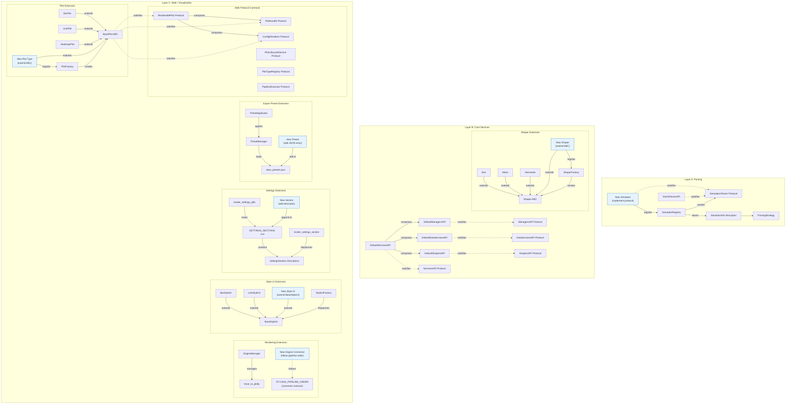

# Step 19: Extension Points & Patterns Analysis

## 1. Executive Summary

The RING-5 Unified Engine v2 architecture is designed around a set of well-defined
extension points that allow new functionality to be added without modifying existing
code. This analysis catalogs every extensibility mechanism in the system, organized
across three primary design patterns:

1. **Registry Pattern** -- Central registries that map string identifiers to factory
   callables or class references. Used for simulator backends (`SimulatorRegistry`)
   and plots (`PlotFactory`).

2. **Factory Pattern** -- Class-level dictionaries that map type identifiers to
   concrete implementation classes. Used for shapers (`ShaperFactory`), plot types
   (`PlotFactory`), and style UI strategies (`StyleUIFactory`).

3. **Protocol Pattern** -- `typing.Protocol` classes that define structural contracts
   without requiring inheritance. Used across all layer boundaries: parsing
   (`SimulationParser`), services (`ServicesAPI`, `ManagersAPI`, `DataServicesAPI`,
   `ShapersAPI`), web-layer plot contracts (`PlotHandle`, `ConfigRenderer`,
   `RenderablePlot`, `PlotLifecycleService`, `PlotTypeRegistry`, `PipelineExecutor`),
   and rendering engine connectors.

Together, these patterns enforce the **Open/Closed Principle**: the system is open
for extension (new simulators, shapers, plot types, engines) but closed for
modification (existing code need not change).

Key architectural files involved:

| File | Role |
|------|------|
| `src/parsing/registry.py` | SimulatorRegistry -- central simulator backend registry |
| `src/parsing/parser_protocol.py` | SimulationParser protocol |
| `src/core/services/shapers/factory.py` | ShaperFactory -- shaper type registry |
| `src/core/services/shapers/shaper.py` | Shaper ABC -- base for all shapers |
| `src/web/pages/ui/plotting/plot_factory.py` | PlotFactory -- plot type registry |
| `src/web/pages/ui/plotting/base_plot.py` | BasePlot ABC -- base for all plot types |
| `src/web/rendering/_connector_protocol.py` | Styling pipeline order contract |
| `src/web/rendering/engine_manager.py` | EngineManager -- rendering engine state |
| `src/web/pages/ui/plotting/styles/factory.py` | StyleUIFactory -- style UI dispatch |
| `src/core/services/services_api.py` | ServicesAPI protocol (composition root interface) |
| `src/core/services/services_impl.py` | DefaultServicesAPI (composition root) |
| `src/web/models/plot_protocols.py` | Web-layer plot protocols |

---

## 2. Extension Point Catalog

The following table catalogs every extension point in the system, ordered by
architectural layer:

| # | Extension Point | Pattern | Registration Mechanism | Key File |
|---|----------------|---------|----------------------|----------|
| 1 | New simulator backend | Registry + Protocol | `SimulatorRegistry.register(info, factory)` | `src/parsing/registry.py` |
| 2 | New parsing strategy | Data descriptor | Add `ParsingStrategy` to `SimulatorInfo.parsing_strategies` | `src/parsing/registry.py` |
| 3 | New shaper type | Factory + ABC | `ShaperFactory.register(type_id, class)` | `src/core/services/shapers/factory.py` |
| 4 | New data manager | Protocol | Implement `ManagersAPI` protocol | `src/core/services/managers/managers_api.py` |
| 5 | New data service | Protocol | Implement `DataServicesAPI` protocol | `src/core/services/data_services/data_services_api.py` |
| 6 | New shapers service | Protocol | Implement `ShapersAPI` protocol | `src/core/services/shapers/shapers_api.py` |
| 7 | New services facade | Protocol | Implement `ServicesAPI` protocol | `src/core/services/services_api.py` |
| 8 | New plot type | Factory + ABC | `PlotFactory.register_plot_type(id, class, metadata)` | `src/web/pages/ui/plotting/plot_factory.py` |
| 9 | New style UI strategy | Factory | Extend `StyleUIFactory.get_strategy()` | `src/web/pages/ui/plotting/styles/factory.py` |
| 10 | New rendering engine | Manager + Protocol | Extend `EngineManager` + implement connector | `src/web/rendering/engine_manager.py` |
| 11 | New settings panel | Data descriptor | Add `SettingsSection` to `SETTINGS_SECTIONS` list | `src/web/pages/ui/plotting/settings_pills.py` |
| 12 | New export preset | JSON config | Add entry to `latex_presets.json` | `src/web/pages/ui/plotting/export/presets/` |
| 13 | New trace config type | Dataclass | Add subclass of `TraceConfig` | `src/core/models/visualization/trace_config.py` |
| 14 | New settings component | Component class | Create class extending component pattern | `src/web/components/plotting/settings/` |
| 15 | New plot lifecycle service | Protocol | Implement `PlotLifecycleService` protocol | `src/web/models/plot_protocols.py` |
| 16 | New pipeline executor | Protocol | Implement `PipelineExecutor` protocol | `src/web/models/plot_protocols.py` |

---

## 3. Adding a New Simulator Backend

### 3.1 Overview

The simulator backend system uses the **Registry + Protocol** pattern. Any class
that satisfies the `SimulationParser` protocol can be registered with the
`SimulatorRegistry` and immediately becomes available to the entire application.

### 3.2 The SimulationParser Protocol

**File**: `src/parsing/parser_protocol.py`

```python
@runtime_checkable
class SimulationParser(Protocol):
    def submit_parse_async(
        self,
        stats_path: str,
        stats_pattern: str,
        variables: list[StatConfig],
        output_dir: str,
        strategy_type: str = "simple",
        scanned_vars: list[ScannedVariable] | None = None,
    ) -> ParseBatchResult: ...

    def finalize_parsing(
        self,
        output_dir: str,
        results: list[dict[str, Any]],
        strategy_type: str = "simple",
        var_names: list[str] | None = None,
    ) -> str | None: ...

    def submit_scan_async(
        self,
        stats_path: str,
        stats_pattern: str = "stats.txt",
        limit: int = 5,
    ) -> list[Future[list[ScannedVariable]]]: ...

    def aggregate_scan_results(
        self,
        results: list[list[ScannedVariable]],
    ) -> list[ScannedVariable]: ...
```

The protocol defines four methods that every simulator backend must implement:
- **`submit_parse_async`** -- Submit an asynchronous parsing job over simulation output files
- **`finalize_parsing`** -- Post-process and aggregate results into canonical CSV format
- **`submit_scan_async`** -- Discover potential variables across simulation files
- **`aggregate_scan_results`** -- Deduplicate and merge scan results from workers

Being a `@runtime_checkable` protocol, the system can use `isinstance()` checks
to verify compliance at runtime, not just at type-check time.

### 3.3 The Registration Mechanism

**File**: `src/parsing/registry.py`

The `SimulatorRegistry` is a class-level registry (singleton pattern) that stores
`(SimulatorInfo, factory_callable)` tuples keyed by simulator name:

```python
class SimulatorRegistry:
    _registry: dict[str, tuple[SimulatorInfo, Callable[[], SimulationParser]]] = {}
    _instances: dict[str, SimulationParser] = {}

    @classmethod
    def register(cls, info: SimulatorInfo, factory: Callable[[], SimulationParser]) -> None:
        if info.name in cls._registry:
            raise ValueError(f"Simulator '{info.name}' is already registered.")
        cls._registry[info.name] = (info, factory)
```

Key design features:
- **Lazy instantiation** via `get_parser()` -- parsers are created on first access
  and cached in `_instances`
- **Duplicate prevention** -- registering the same name twice raises `ValueError`
- **Metadata separation** -- `SimulatorInfo` carries UI metadata (display name,
  file patterns, variable types, internal stats, parsing strategies) separate from
  the parser implementation

The `SimulatorInfo` dataclass is a frozen (immutable) descriptor carrying:

| Field | Type | Purpose |
|-------|------|---------|
| `name` | `str` | Unique identifier (e.g., `"gem5"`) |
| `display_name` | `str` | Human-readable UI label |
| `description` | `str` | Brief description for tooltips |
| `file_pattern` | `str` | Default filename pattern (e.g., `"stats.txt"`) |
| `variable_types` | `list[str]` | Supported variable type labels |
| `internal_stats` | `frozenset[str]` | Internal stats to exclude from user selection |
| `parsing_strategies` | `list[ParsingStrategy]` | Ordered list of parsing strategies |

The `ParsingStrategy` dataclass within each `SimulatorInfo` defines per-strategy
metadata: `name`, `display_name`, and `description`. Every simulator must define at
least one strategy (enforced by `__post_init__` validation).

### 3.4 Step-by-Step: Adding a New Simulator

**Step 1**: Define the `SimulatorInfo` descriptor:

```python
# src/parsing/my_simulator/__init__.py
from src.parsing.registry import SimulatorInfo, ParsingStrategy

MY_SIM_INFO = SimulatorInfo(
    name="my_simulator",
    display_name="My Simulator",
    description="Custom computer architecture simulator",
    file_pattern="results.log",
    variable_types=["scalar", "vector"],
    internal_stats=frozenset({"__internal_total"}),
    parsing_strategies=[
        ParsingStrategy(
            name="default",
            display_name="Default Parser",
            description="Standard results.log parsing",
        ),
    ],
)
```

**Step 2**: Implement the `SimulationParser` protocol:

```python
# src/parsing/my_simulator/parser.py
class MySimulatorParser:
    """Implements SimulationParser protocol structurally (duck typing)."""

    def submit_parse_async(self, stats_path, stats_pattern, variables,
                           output_dir, strategy_type="default",
                           scanned_vars=None):
        # Implementation: scan filesystem, parse files in parallel
        ...

    def finalize_parsing(self, output_dir, results,
                         strategy_type="default", var_names=None):
        # Implementation: aggregate results into CSV
        ...

    def submit_scan_async(self, stats_path,
                          stats_pattern="results.log", limit=5):
        # Implementation: quick scan to discover variables
        ...

    def aggregate_scan_results(self, results):
        # Implementation: deduplicate and merge variable lists
        ...
```

**Step 3**: Create a factory function and register:

```python
# src/parsing/my_simulator/__init__.py (continued)
from src.parsing.registry import SimulatorRegistry

def _create_my_simulator_parser():
    from src.parsing.my_simulator.parser import MySimulatorParser
    return MySimulatorParser()

SimulatorRegistry.register(MY_SIM_INFO, _create_my_simulator_parser)
```

**Step 4**: Ensure the module is imported at startup (e.g., in the main entry point
or via a plugin loader).

### 3.5 Reference: gem5 Registration

The existing gem5 registration at the bottom of `src/parsing/registry.py` serves as
the canonical reference implementation:

```python
GEM5_INFO = SimulatorInfo(
    name="gem5",
    display_name="gem5",
    description="gem5 computer architecture simulator",
    file_pattern="stats.txt",
    variable_types=["scalar", "vector", "distribution", "histogram", "configuration"],
    internal_stats=frozenset({"total", "mean", "gmean", "stdev", "samples",
                              "sample_period", "min_val", "max_val", "min_bucket",
                              "max_bucket", "num_buckets", "underflows", "overflows"}),
    parsing_strategies=[
        ParsingStrategy(name="simple", display_name="Simple (stats.txt only)",
                        description="Parse stats.txt files without config metadata."),
        ParsingStrategy(name="config_aware", display_name="Config-Aware (Integrates config.ini)",
                        description="Config-Aware strategy allows extracting metadata "
                                    "from simulation config files."),
    ],
)

def _create_gem5_parser() -> SimulationParser:
    from src.parsing.gem5.impl.gem5_parser_api import Gem5ParserAPI
    return Gem5ParserAPI()

SimulatorRegistry.register(GEM5_INFO, _create_gem5_parser)
```

Note the **lazy import** pattern in the factory function -- the actual parser
implementation is only imported when first needed, avoiding circular imports and
reducing startup time.

---

## 4. Adding a New Shaper Type

### 4.1 Overview

The shaper system uses the **Factory + ABC** pattern. All shapers extend the
abstract `Shaper` base class and are registered in `ShaperFactory._registry`.

### 4.2 The Shaper ABC

**File**: `src/core/services/shapers/shaper.py`

```python
class Shaper(ABC):
    def __init__(self, params: dict[str, Any]) -> None:
        if not isinstance(params, dict):
            raise ValueError("Shaper parameters must be a dictionary.")
        self.params: dict[str, Any] = params
        self._verify_params()

    @abstractmethod
    def _verify_params(self) -> bool:
        """Verify initialization parameters are valid."""
        if self.params is None:
            raise ValueError("Shaper: parameters cannot be None.")
        return True

    def _verify_preconditions(self, data_frame: pd.DataFrame) -> bool:
        """Verify dataframe state is compatible."""
        if data_frame is None:
            raise ValueError("Shaper: Input dataframe cannot be None.")
        if data_frame.empty:
            raise ValueError("Shaper: Cannot operate on an empty dataframe.")
        return True

    def __call__(self, data_frame: pd.DataFrame) -> pd.DataFrame:
        """Execute the transformation."""
        self._verify_preconditions(data_frame)
        return data_frame
```

The `Shaper` ABC enforces a **Template Method** pattern with three lifecycle hooks:
1. **`_verify_params()`** -- Called in `__init__` to validate configuration. Abstract;
   every subclass must override.
2. **`_verify_preconditions()`** -- Called before transformation to validate input data.
   Provides sensible defaults (None check, empty check) that subclasses can extend.
3. **`__call__()`** -- Makes shapers callable. Subclasses override to perform the actual
   DataFrame transformation.

### 4.3 The ShaperFactory

**File**: `src/core/services/shapers/factory.py`

```python
class ShaperFactory:
    _registry: dict[str, type[Shaper]] = {
        "mean": Mean,
        "columnSelector": ColumnSelector,
        "conditionSelector": ConditionSelector,
        "itemSelector": ItemSelector,
        "normalize": Normalize,
        "pivotLonger": PivotLonger,
        "pivotWider": PivotWider,
        "sort": Sort,
        "splitApply": SplitApply,
        "transformer": Transformer,
    }

    _display_names: dict[str, str] = {
        "columnSelector": "Column Selector",
        "sort": "Sort",
        "mean": "Mean Calculator",
        "normalize": "Normalize",
        "pivotLonger": "Pivot Longer (Melt)",
        "pivotWider": "Pivot Wider",
        "conditionSelector": "Filter",
        "itemSelector": "Item Selector",
        "splitApply": "Split-Apply (Per-Axis)",
        "transformer": "Transformer",
    }

    @classmethod
    def register(cls, shaper_type: str, shaper_class: type[Shaper]) -> None:
        """Register a new shaper type (Open/Closed Principle)."""
        cls._registry[shaper_type] = shaper_class

    @classmethod
    def create_shaper(cls, shaper_type: str, params: ShaperStepConfig) -> Shaper:
        shaper_class = cls._registry.get(shaper_type)
        if shaper_class is None:
            raise ValueError(f"Unknown shaper type '{shaper_type}'.")
        return shaper_class(dict(params))
```

The factory maintains two parallel dictionaries:
- `_registry` -- Maps type identifiers to `Shaper` subclasses
- `_display_names` -- Maps type identifiers to human-readable names for UI dropdowns

The `get_display_name_map()` method inverts the `_display_names` dict for use in
UI selectboxes, filtering to only include types present in the registry.

### 4.4 Step-by-Step: Adding a New Shaper

**Step 1**: Create the shaper implementation extending `Shaper` (or `UniDfShaper`):

```python
# src/core/services/shapers/impl/my_shaper.py
from typing import Any, override
import pandas as pd
from src.core.services.shapers.shaper import Shaper

class MyCustomShaper(Shaper):
    def __init__(self, params: dict[str, Any]) -> None:
        self.threshold = params.get("threshold", 0.5)
        super().__init__(params)

    @override
    def _verify_params(self) -> bool:
        super()._verify_params()
        if "threshold" not in self.params:
            raise ValueError("MyCustomShaper requires 'threshold' parameter.")
        return True

    @override
    def __call__(self, data_frame: pd.DataFrame) -> pd.DataFrame:
        self._verify_preconditions(data_frame)
        return data_frame[data_frame["value"] > self.threshold].copy()
```

**Step 2**: Register with the factory:

```python
from src.core.services.shapers.factory import ShaperFactory
from src.core.services.shapers.impl.my_shaper import MyCustomShaper

ShaperFactory.register("myCustom", MyCustomShaper)
ShaperFactory._display_names["myCustom"] = "My Custom Filter"
```

**Step 3**: Create a UI configuration widget in the web components layer for the
shaper parameters (the `configure_shaper` function renders per-shaper UI).

**Step 4**: Add the shaper to the appropriate UI component that builds the
shaper configuration form.

### 4.5 Existing Shaper Implementations

The 10 built-in shapers span the full spectrum of data transformations:

| Type ID | Class | Purpose |
|---------|-------|---------|
| `mean` | `Mean` | Compute group-wise averages |
| `columnSelector` | `ColumnSelector` | Select/filter columns |
| `conditionSelector` | `ConditionSelector` | Filter rows by conditions |
| `itemSelector` | `ItemSelector` | Select specific categorical items |
| `normalize` | `Normalize` | Normalize values (ratio-to-baseline, etc.) |
| `pivotLonger` | `PivotLonger` | Melt wide format to long format |
| `pivotWider` | `PivotWider` | Pivot long format to wide format |
| `sort` | `Sort` | Custom categorical sort ordering |
| `splitApply` | `SplitApply` | Group-wise transformations (per-axis) |
| `transformer` | `Transformer` | General expression-based transforms |

### 4.6 Reference: Sort Shaper Implementation

**File**: `src/core/services/shapers/impl/sort.py`

The `Sort` shaper is a representative example. Key observations from the source:

```python
class Sort(UniDfShaper):
    def __init__(self, params: dict[str, Any]) -> None:
        config = cast(SortShaperConfig, params)
        self.order_dict: dict[str, list[str]] = config.get("order_dict", {})
        super().__init__(params)

    @override
    def _verify_params(self) -> bool:
        super()._verify_params()
        config = cast(SortShaperConfig, self.params)
        if "order_dict" not in config:
            raise ValueError("Sort requires 'order_dict' parameter.")
        order_dict = config["order_dict"]
        if not isinstance(order_dict, dict):
            raise TypeError("Sort 'order_dict' parameter must be a dictionary.")
        for col, values in order_dict.items():
            if not isinstance(col, str):
                raise TypeError(f"Sort column name '{col}' must be a string.")
            if not isinstance(values, list):
                raise TypeError(f"Sort order values for column '{col}' must be a list.")
        return True

    @override
    def _verify_preconditions(self, data_frame: pd.DataFrame) -> bool:
        super()._verify_preconditions(data_frame)
        missing = [c for c in self.order_dict.keys() if c not in data_frame.columns]
        if missing:
            raise ValueError(f"Sort: Columns not found in dataframe: {missing}")
        return True

    @override
    def __call__(self, data_frame: pd.DataFrame) -> pd.DataFrame:
        self._verify_preconditions(data_frame)
        result = data_frame.copy()
        for column, orders in self.order_dict.items():
            result[column] = pd.Categorical(result[column], categories=orders, ordered=True)
        result = result.sort_values(by=list(self.order_dict.keys()), kind="stable")
        for column in self.order_dict:
            result[column] = result[column].astype(str)
        return result
```

Notable implementation patterns:
- Extends `UniDfShaper` (a convenience subclass of `Shaper` for single-DataFrame ops)
- Uses `@override` decorator for explicit intent on overridden methods
- Validates params in `_verify_params()` and data in `_verify_preconditions()`
- Returns a new DataFrame (immutable operation, no side effects)
- Uses `cast()` for typed config access via `SortShaperConfig` TypedDict

---

## 5. Adding a New Plot Type

### 5.1 Overview

The plotting system uses the **Factory + ABC** pattern. All plot types extend
`BasePlot` and are registered in `PlotFactory._plot_classes`.

### 5.2 The BasePlot ABC

**File**: `src/web/pages/ui/plotting/base_plot.py`

```python
class BasePlot(PlotConfigUIMixin, ABC):
    def __init__(self, plot_id: int, name: str, plot_type: str) -> None:
        self.plot_id: int = plot_id
        self.name: str = name
        self.plot_type: str = plot_type
        self.config: PlotConfig = {}
        self.processed_data: pd.DataFrame | None = None
        self.last_generated_fig: go.Figure | None = None
        self.last_traces: TraceBuildResult | None = None
        self.pipeline: list[PipelineStep] = []
        self.pipeline_counter: int = 0
        self.legend_mappings_by_column: dict[str, dict[str, str]] = {}
        self.legend_mappings: dict[str, str] = {}

        # Initialize Style Manager
        self._style_ui = StyleUIFactory.get_strategy(self.plot_id, self.plot_type)
        self._applicator = StyleApplicator(self.plot_type)

    @abstractmethod
    def create_traces(self, data: pd.DataFrame, config: PlotConfig) -> TraceBuildResult:
        """Produce engine-agnostic trace data from data and config."""

    @abstractmethod
    def get_legend_column(self, config: PlotConfig) -> str | None:
        """Get the column name used for legend/color coding."""
```

`BasePlot` inherits from both `PlotConfigUIMixin` (UI rendering mixin) and `ABC`.
The three abstract methods that every plot type MUST implement are:

1. **`create_traces()`** -- Produces `TraceBuildResult` containing engine-agnostic
   `TraceConfig` objects. This is the core data-to-visual mapping.
2. **`get_legend_column()`** -- Identifies which data column drives legend grouping.
3. **`render_config_ui()`** -- Inherited from `PlotConfigUIMixin`; renders the
   Streamlit widgets for plot-type-specific data configuration (X/Y column selection,
   color grouping, etc.).

`BasePlot` provides several concrete methods inherited by all plot types:
- `create_figure()` -- Calls `create_traces()` then converts to `go.Figure` via
  `traces_to_plotly()`
- `generate_figure()` -- Full pipeline: `create_figure()` + `apply_common_layout()`
  + legend labels
- `update_from_relayout()` -- Handles client-side zoom/pan events
- `to_dict()` / `from_dict()` -- Serialization/deserialization for portfolio save/load
- `apply_common_layout()` -- Delegates to `StyleApplicator` for engine-agnostic styling
- `render_settings_section()` -- Pills-driven section dispatcher (from mixin)

### 5.3 The PlotFactory

**File**: `src/web/pages/ui/plotting/plot_factory.py`

```python
class PlotFactory:
    _plot_classes: dict[str, Callable[[int, str], BasePlot]] = {
        "bar": BarPlot,
        "dual_axis_bar_dot": DualAxisBarDotPlot,
        "grouped_bar": GroupedBarPlot,
        "heatmap": HeatmapPlot,
        "stacked_bar": StackedBarPlot,
        "grouped_stacked_bar": GroupedStackedBarPlot,
        "histogram": HistogramPlot,
        "line": LinePlot,
        "scatter": ScatterPlot,
    }

    _plot_metadata: dict[str, PlotTypeMetadata] = {
        "bar":                  {"display_name": "Bar Chart",           "icon": "bar_chart",         "category": "basic"},
        "line":                 {"display_name": "Line Chart",          "icon": "show_chart",        "category": "basic"},
        "scatter":              {"display_name": "Scatter Plot",        "icon": "scatter_plot",      "category": "basic"},
        "grouped_bar":          {"display_name": "Grouped Bar",         "icon": "bar_chart",         "category": "comparison"},
        "stacked_bar":          {"display_name": "Stacked Bar",         "icon": "stacked_bar_chart", "category": "comparison"},
        "grouped_stacked_bar":  {"display_name": "Grouped Stacked Bar", "icon": "stacked_bar_chart", "category": "comparison"},
        "dual_axis_bar_dot":    {"display_name": "Dual Axis Bar Dot",   "icon": "waterfall_chart",   "category": "comparison"},
        "heatmap":              {"display_name": "Heatmap",             "icon": "grid_on",           "category": "distribution"},
        "histogram":            {"display_name": "Histogram",           "icon": "bar_chart",         "category": "distribution"},
    }
```

The `register_plot_type()` classmethod enables runtime registration:

```python
    @classmethod
    def register_plot_type(
        cls,
        plot_type: str,
        plot_class: Callable[[int, str], BasePlot],
        metadata: PlotTypeMetadata | None = None,
    ) -> None:
        if isinstance(plot_class, type):
            from .base_plot import BasePlot
            if not issubclass(plot_class, BasePlot):
                raise ValueError(
                    f"Plot class must be a subclass of BasePlot, got {plot_class.__name__}"
                )
        cls._plot_classes[plot_type] = plot_class
        if metadata is not None:
            cls._plot_metadata[plot_type] = metadata
```

The factory validates that registered classes are `BasePlot` subclasses and supports
optional `PlotTypeMetadata` (a `TypedDict`) for UI presentation:

```python
class PlotTypeMetadata(TypedDict):
    display_name: str
    icon: str
    category: str  # "basic", "comparison", "distribution"
```

### 5.4 Step-by-Step: Adding a New Plot Type

**Step 1**: Create the plot class extending `BasePlot`:

```python
# src/web/pages/ui/plotting/types/violin_plot.py
from typing import override
import pandas as pd
from src.core.models.visualization.trace_build_result import TraceBuildResult
from src.web.models.plot_models import PlotConfig
from src.web.pages.ui.plotting.base_plot import BasePlot

class ViolinPlot(BasePlot):
    def __init__(self, plot_id: int, name: str):
        super().__init__(plot_id, name, "violin")

    @override
    def render_config_ui(self, data: pd.DataFrame, saved_config: PlotConfig) -> PlotConfig:
        # Render Streamlit widgets for violin-specific config
        ...

    @override
    def create_traces(self, data: pd.DataFrame, config: PlotConfig) -> TraceBuildResult:
        # Return TraceBuildResult with violin trace data
        ...

    @override
    def get_legend_column(self, config: PlotConfig) -> str | None:
        return str(config.get("color")) if config.get("color") else None
```

**Step 2**: If needed, create a new `TraceConfig` subclass:

```python
# src/core/models/visualization/trace_config.py (add to existing file)
@dataclass
class ViolinTraceConfig(TraceConfig):
    side: str = "both"
    meanline: bool = True
    bandwidth: float | None = None
```

**Step 3**: Add the trace converter in `trace_to_plotly.py`:

```python
# In _convert_trace() dispatcher:
elif isinstance(trace, ViolinTraceConfig):
    return _violin_trace(trace)

def _violin_trace(trace: ViolinTraceConfig) -> go.Violin:
    kwargs = {"x": trace.x, "y": trace.y, "name": trace.name, ...}
    return go.Violin(**kwargs)
```

**Step 4**: Register with the factory:

```python
from src.web.pages.ui.plotting.plot_factory import PlotFactory
from src.web.pages.ui.plotting.types.violin_plot import ViolinPlot

PlotFactory.register_plot_type(
    "violin",
    ViolinPlot,
    metadata={"display_name": "Violin Plot", "icon": "music_note", "category": "distribution"},
)
```

**Step 5**: Optionally extend `StyleUIFactory` if the new plot type needs custom
style UI behavior (see Section 9).

### 5.5 Existing Plot Types

| Type ID | Class | Category | File |
|---------|-------|----------|------|
| `bar` | `BarPlot` | basic | `types/bar_plot.py` |
| `line` | `LinePlot` | basic | `types/line_plot.py` |
| `scatter` | `ScatterPlot` | basic | `types/scatter_plot.py` |
| `grouped_bar` | `GroupedBarPlot` | comparison | `types/grouped_bar_plot.py` |
| `stacked_bar` | `StackedBarPlot` | comparison | `types/stacked_bar_plot.py` |
| `grouped_stacked_bar` | `GroupedStackedBarPlot` | comparison | `types/grouped_stacked_bar_plot.py` |
| `dual_axis_bar_dot` | `DualAxisBarDotPlot` | comparison | `types/dual_axis_bar_dot_plot.py` |
| `heatmap` | `HeatmapPlot` | distribution | `types/heatmap_plot.py` |
| `histogram` | `HistogramPlot` | distribution | `types/histogram_plot.py` |

### 5.6 Reference: BarPlot Implementation

**File**: `src/web/pages/ui/plotting/types/bar_plot.py`

```python
class BarPlot(BasePlot):
    def __init__(self, plot_id: int, name: str):
        super().__init__(plot_id, name, "bar")

    @override
    def render_config_ui(self, data: pd.DataFrame, saved_config: PlotConfig) -> PlotConfig:
        return render_common_with_color(data, saved_config, self.plot_id)

    @override
    def create_traces(self, data: pd.DataFrame, config: PlotConfig) -> TraceBuildResult:
        x_col: str = config["x"]
        y_col: str = config["y"]
        data = data.copy()
        data[x_col] = data[x_col].astype(str)
        # ... ordering and trace construction ...
        traces = build_color_grouped_traces(data, config, _make_trace)
        return TraceBuildResult(traces=traces)

    @override
    def get_legend_column(self, config: PlotConfig) -> str | None:
        result = config.get("color")
        return str(result) if result is not None else None
```

This pattern -- minimal subclass with delegated rendering and trace construction --
is the recommended approach for new plot types. The `BarPlot` is 69 lines total,
demonstrating that the ABC and factory infrastructure handles most of the
boilerplate.

---

## 6. Adding a New Rendering Engine

### 6.1 Overview

The rendering system uses a **Manager + Protocol** pattern. The `EngineManager`
tracks the active rendering engine in Streamlit session state, while each engine
implements a connector that follows the styling pipeline order defined in
`_connector_protocol.py`.

### 6.2 The EngineManager

**File**: `src/web/rendering/engine_manager.py`

```python
EngineMode = Literal["plotly", "matplotlib"]
_VALID_MODES: frozenset[str] = frozenset({"plotly", "matplotlib"})

class EngineManager:
    STATE_KEY: str = "ring5_engine_mode"
    DEFAULT_MODE: EngineMode = "plotly"

    @staticmethod
    def get_engine() -> EngineMode:
        mode = st.session_state.get(EngineManager.STATE_KEY, EngineManager.DEFAULT_MODE)
        if mode not in _VALID_MODES:
            return EngineManager.DEFAULT_MODE
        return cast(EngineMode, mode)

    @staticmethod
    def set_engine(mode: EngineMode) -> None:
        if mode not in _VALID_MODES:
            raise ValueError(f"Invalid engine mode {mode!r}.")
        current = EngineManager.get_engine()
        if current != mode:
            st.session_state[EngineManager.STATE_KEY] = mode

    @staticmethod
    def is_plotly() -> bool:
        return EngineManager.get_engine() == "plotly"

    @staticmethod
    def is_matplotlib() -> bool:
        return EngineManager.get_engine() == "matplotlib"
```

Key design decisions:
- **Literal type** -- `EngineMode` is `Literal["plotly", "matplotlib"]` so mypy
  catches invalid values at type-check time
- **Namespaced key** -- `ring5_engine_mode` avoids collisions with other Streamlit state
- **Idempotent set** -- `set_engine()` only writes when the value changes
- **Static API** -- No instance state; all methods operate on `st.session_state`

### 6.3 The Styling Pipeline Contract

**File**: `src/web/rendering/_connector_protocol.py`

```python
STYLING_PIPELINE_ORDER: tuple[str, ...] = (
    "backgrounds",
    "font_family",
    "color_palette",
    "title",
    "axis_labels",
    "axis_ticks",
    "axis_ranges",
    "axis_colors",
    "grids",
    "legends",
    "reference_lines",
    "data_labels",
    "annotations",
    "separators",
    "hatching",
    "margins",
)
```

This tuple defines the **exact ordering** of styling operations that any rendering
connector must follow. Both the Plotly connector (`FigureSpecToPlotly`) and the
Matplotlib connector (`FigureSpecToMatplotlib`) implement their `apply()` methods
in this order. Any new connector must do the same to guarantee consistent rendering.

### 6.4 Step-by-Step: Adding a New Rendering Engine

**Step 1**: Extend the `EngineMode` literal type:

```python
# src/web/rendering/engine_manager.py
EngineMode = Literal["plotly", "matplotlib", "bokeh"]
_VALID_MODES: frozenset[str] = frozenset({"plotly", "matplotlib", "bokeh"})
```

**Step 2**: Create a connector module that implements the styling pipeline:

```python
# src/web/rendering/figure_spec_to_bokeh.py
from src.web.rendering._connector_protocol import STYLING_PIPELINE_ORDER

class FigureSpecToBokeh:
    def apply(self, spec: FigureConfig) -> BokehFigure:
        fig = self._create_base_figure(spec)
        # Apply styles in STYLING_PIPELINE_ORDER
        for style_step in STYLING_PIPELINE_ORDER:
            handler = getattr(self, f"_apply_{style_step}", None)
            if handler:
                handler(fig, spec)
        return fig
```

**Step 3**: Create a trace-to-engine converter (analogous to `trace_to_plotly.py`):

```python
# src/web/rendering/trace_to_bokeh.py
def traces_to_bokeh(result: TraceBuildResult) -> BokehFigure:
    # Convert TraceBuildResult to Bokeh figure
    ...
```

**Step 4**: Update the rendering dispatch in page/controller code to check
`EngineManager.get_engine()` and route to the appropriate renderer.

**Step 5**: Add a UI toggle for the new engine in the engine settings component.

### 6.5 Trace Conversion Architecture

**File**: `src/web/rendering/trace_to_plotly.py`

The `traces_to_plotly()` function is the central conversion point. It accepts a
`TraceBuildResult` (engine-agnostic) and produces a `go.Figure` (Plotly-specific):

```python
def traces_to_plotly(result: TraceBuildResult) -> go.Figure:
    # Handle subplot layouts (heatmap, dual-axis)
    # For each trace, dispatch to type-specific converter:
    #   BarTraceConfig    -> _bar_trace()    -> go.Bar
    #   LineTraceConfig   -> _line_trace()   -> go.Scatter (lines mode)
    #   ScatterTraceConfig-> _scatter_trace() -> go.Scatter (markers mode)
    #   HistogramTraceConfig -> _histogram_trace() -> go.Histogram
    #   HeatmapTraceConfig -> _heatmap_trace() -> go.Heatmap
    # Apply layout updates (barmode, custom ticks, shapes, annotations)
    ...
```

Each new engine needs an analogous converter function.

---

## 7. Adding a New Data Manager

### 7.1 Overview

The data manager system uses the **Protocol** pattern. The three sub-API protocols
define the contract that any implementation must satisfy.

### 7.2 The Service Protocol Hierarchy

**File**: `src/core/services/services_api.py`

```python
@runtime_checkable
class ServicesAPI(Protocol):
    @property
    def managers(self) -> ManagersAPI: ...

    @property
    def data_services(self) -> DataServicesAPI: ...

    @property
    def shapers(self) -> ShapersAPI: ...
```

The `ServicesAPI` is a **hierarchical facade** that composes three domain-aligned
sub-APIs:

| Sub-API | Protocol File | Responsibilities |
|---------|--------------|------------------|
| `ManagersAPI` | `src/core/services/managers/managers_api.py` | Arithmetic, outlier removal, seed reduction |
| `DataServicesAPI` | `src/core/services/data_services/data_services_api.py` | CSV pool, configuration, variables, portfolios |
| `ShapersAPI` | `src/core/services/shapers/shapers_api.py` | Pipeline CRUD, shaper execution |

### 7.3 The ManagersAPI Protocol

**File**: `src/core/services/managers/managers_api.py`

```python
@runtime_checkable
class ManagersAPI(Protocol):
    # -- Arithmetic (Preprocessor) --
    def list_operators(self) -> list[str]: ...
    def apply_operation(self, df, operation, src1, src2, dest) -> pd.DataFrame: ...

    # -- Mixer (Multi-column merge) --
    def apply_mixer(self, df, dest_col, source_cols, operation, separator) -> pd.DataFrame: ...
    def validate_merge_inputs(self, df, columns, operation, new_column_name) -> list[str]: ...

    # -- Outlier Removal --
    def remove_outliers(self, df, outlier_col, group_by_cols) -> pd.DataFrame: ...
    def validate_outlier_inputs(self, df, outlier_col, group_by_cols) -> list[str]: ...

    # -- Seeds Reduction --
    def reduce_seeds(self, df, categorical_cols, statistic_cols) -> pd.DataFrame: ...
    def validate_seeds_reducer_inputs(self, df, categorical_cols, statistic_cols) -> list[str]: ...
```

### 7.4 Step-by-Step: Adding a New Manager Operation

**Step 1**: Add the method signature to the `ManagersAPI` protocol:

```python
# src/core/services/managers/managers_api.py
class ManagersAPI(Protocol):
    # ... existing methods ...

    def interpolate_missing(
        self,
        df: pd.DataFrame,
        columns: list[str],
        method: str = "linear",
    ) -> pd.DataFrame: ...
```

**Step 2**: Create the implementation service:

```python
# src/core/services/managers/interpolation_service.py
class InterpolationService:
    @staticmethod
    def interpolate_missing(df, columns, method="linear"):
        result = df.copy()
        for col in columns:
            result[col] = result[col].interpolate(method=method)
        return result
```

**Step 3**: Add delegation in `DefaultManagersAPI`:

```python
# src/core/services/managers/managers_impl.py
class DefaultManagersAPI:
    def interpolate_missing(self, df, columns, method="linear"):
        return InterpolationService.interpolate_missing(df, columns, method)
```

**Step 4**: The `DefaultServicesAPI` composition root automatically exposes the new
method through its `managers` property -- no changes needed there.

### 7.5 Reference: DefaultManagersAPI Implementation

**File**: `src/core/services/managers/managers_impl.py`

The `DefaultManagersAPI` class delegates to three stateless service classes:
- `ArithmeticService` -- arithmetic operations and column merging
- `OutlierService` -- statistical outlier removal
- `ReductionService` -- seed aggregation

Each service method is a simple delegation with no additional logic, keeping the
API implementation thin.

---

## 8. Adding New Settings Panels

### 8.1 Overview

The settings system uses a **data descriptor** pattern. Settings sections are
defined as `SettingsSection` dataclass instances in a flat list, and a pills
renderer dynamically builds the navigation.

### 8.2 The SettingsSection Descriptor

**File**: `src/web/pages/ui/plotting/settings_pills.py`

```python
@dataclass(frozen=True)
class SettingsSection:
    key: str          # Machine-readable identifier
    label: str        # Human-readable display name
    icon: str         # Material-icon name
    advanced: bool = False  # Progressive disclosure flag

SETTINGS_SECTIONS: list[SettingsSection] = [
    # Basic sections -- always visible
    SettingsSection("layout", "Layout", "dashboard"),
    SettingsSection("typography", "Typography", "text_fields"),
    SettingsSection("legends", "Legends", "legend_toggle"),
    # Advanced sections -- hidden by default
    SettingsSection("axes", "Axes", "straighten", advanced=True),
    SettingsSection("data_labels", "Data Labels", "label", advanced=True),
    SettingsSection("colors", "Colors", "palette", advanced=True),
    SettingsSection("advanced", "Advanced", "settings", advanced=True),
]
```

The `render_settings_pills()` function filters sections based on the `show_advanced`
flag, then renders them as Streamlit pills navigation:

```python
def render_settings_pills(show_advanced: bool = False) -> str | None:
    visible = [s for s in SETTINGS_SECTIONS if not s.advanced or show_advanced]
    options = [s.key for s in visible]
    labels = {s.key: f":material/{s.icon}: {s.label}" for s in visible}
    selected = st.pills("Settings", options=options, format_func=lambda x: labels[x], ...)
    return selected
```

### 8.3 The Section Dispatcher

**File**: `src/web/pages/ui/plotting/plot_config_ui.py` (PlotConfigUIMixin)

The `render_settings_section()` method routes the selected section key to the
appropriate settings component:

```python
def render_settings_section(self, section, saved_config, data=None):
    if section == "layout":
        return LayoutSettingsComponent(self.plot_id, self.plot_type).render(saved_config)
    if section == "typography":
        return TypographySettingsComponent(self.plot_id, self.plot_type).render(...)
    if section == "legends":
        return LegendSettingsComponent(self.plot_id, self.plot_type).render(...)
    if section == "axes":
        return AxesSettingsComponent(self.plot_id, self.plot_type).render(...)
    if section == "data_labels":
        return DataLabelsSettingsComponent(self.plot_id, self.plot_type).render(...)
    if section == "colors":
        return ColorsSettingsComponent(self.plot_id, self.plot_type).render(...)
    if section == "advanced":
        return AdvancedSettingsComponent(self.plot_id, self.plot_type).render(...)
    return {}
```

### 8.4 Step-by-Step: Adding a New Settings Panel

**Step 1**: Add the section descriptor to `SETTINGS_SECTIONS`:

```python
# src/web/pages/ui/plotting/settings_pills.py
SETTINGS_SECTIONS.append(
    SettingsSection("annotations", "Annotations", "edit_note", advanced=True),
)
```

**Step 2**: Create the settings component class:

```python
# src/web/components/plotting/settings/annotations_settings.py
class AnnotationsSettingsComponent:
    def __init__(self, plot_id: int, plot_type: str):
        self.plot_id = plot_id
        self.plot_type = plot_type

    def render(self, saved_config: PlotConfig, **kwargs) -> PlotConfig:
        config = {}
        # Render Streamlit widgets for annotations
        config["annotations_enabled"] = st.checkbox(...)
        return config
```

**Step 3**: Add the dispatch case in `render_settings_section()`:

```python
# src/web/pages/ui/plotting/plot_config_ui.py
if section == "annotations":
    return AnnotationsSettingsComponent(self.plot_id, self.plot_type).render(saved_config)
```

**Step 4**: The widget factory (`src/web/components/plotting/settings/widget_factory.py`)
provides standardized wrappers: `select_option()`, `numeric_input()`, `color_picker()`,
`toggle()`, `slider()`. Use these in the new component for consistent UX:

```python
from src.web.components.plotting.settings.widget_factory import select_option, numeric_input

class AnnotationsSettingsComponent:
    def render(self, saved_config):
        position = select_option("Position", ["top", "bottom"], saved_config, "ann_pos", self.plot_id)
        font_size = numeric_input("Font Size", saved_config, "ann_font_size", self.plot_id, default=10)
        return {"ann_pos": position, "ann_font_size": font_size}
```

### 8.5 Widget Factory API

**File**: `src/web/components/plotting/settings/widget_factory.py`

The widget factory provides five standardized wrappers:

| Function | Widget | Features |
|----------|--------|----------|
| `select_option()` | `st.selectbox` | Safe index lookup, config-based default |
| `numeric_input()` | `st.number_input` | Config-based default, type coercion |
| `color_picker()` | `st.color_picker` | Config-based default |
| `toggle()` | `st.checkbox` | Config-based default |
| `slider()` | `st.slider` | Config-based default, type coercion |

All wrappers follow the same signature pattern:
`(label, config, config_key, plot_id, *, widget_key=None, default=..., help=...)`

---

## 9. Adding Export Presets

### 9.1 Overview

The export preset system uses a **JSON configuration + TypedDict schema** pattern.
Presets define publication-quality dimensions, typography, and styling parameters for
LaTeX-compatible figure export.

### 9.2 The LaTeXPreset Schema

**File**: `src/web/pages/ui/plotting/export/presets/preset_schema.py`

The `LaTeXPreset` TypedDict defines 70+ fields organized into categories:

| Category | Example Fields |
|----------|---------------|
| Dimensions | `width_inches`, `height_inches`, `dpi` |
| Base typography | `font_family`, `font_size_base` |
| Element font sizes | `font_size_title`, `font_size_xlabel`, `font_size_ylabel`, `font_size_ticks`, `font_size_annotations` |
| Bold controls | `bold_title`, `bold_xlabel`, `bold_ylabel`, `bold_ticks`, `bold_annotations` |
| Legend spacing | `legend_columnspacing`, `legend_handletextpad`, `legend_labelspacing`, etc. |
| Dual-axis legend (legend2) | `legend2_columnspacing`, `legend2_handletextpad`, etc. |
| Tertiary legend (legend3) | `legend3_borderpad`, `legend3_labelspacing`, etc. |
| Axis positioning | `ylabel_pad`, `ylabel_y_position`, `xtick_pad`, `ytick_pad` |
| Bar/axis spacing | `xaxis_margin`, `bar_width_scale`, `xtick_rotation`, `xtick_ha` |
| Group separators | `group_separator`, `group_separator_style`, `group_separator_color` |
| Legend position | `legend_custom_pos`, `legend_x`, `legend_y` |
| LaTeX integration | `line_width`, `marker_size`, `latex_extra_preamble` |

### 9.3 The PresetManager

**File**: `src/web/pages/ui/plotting/export/presets/preset_manager.py`

```python
class PresetManager:
    _cache: dict[str, LaTeXPreset] = {}
    _presets_data: dict[str, Any] = {}
    _initialized: bool = False

    @classmethod
    def load_preset(cls, preset_name: str) -> LaTeXPreset:
        """Load, validate, and cache a preset by name."""
        if preset_name in cls._cache:
            return cls._cache[preset_name]
        cls._initialize()  # Loads JSON once
        raw_preset = cls._presets_data[preset_name]
        preset = { ... }  # Extract LaTeXPreset fields with defaults
        cls.validate_preset(preset)
        cls._cache[preset_name] = preset
        return preset

    @classmethod
    def list_presets(cls) -> list[str]:
        """Return all available preset names."""

    @classmethod
    def validate_preset(cls, preset: LaTeXPreset) -> None:
        """Validate required fields and positive values."""
```

### 9.4 The PresetApplicator

**File**: `src/web/rendering/preset_applicator.py`

```python
class PresetApplicator:
    @staticmethod
    def apply(spec: FigureConfig, preset_info: dict[str, Any]) -> FigureConfig:
        """Overlay preset values onto existing spec."""
        preset_spec = PresetSpecBuilder.from_preset(preset_info)
        return dataclasses.replace(
            spec,
            dimensions=preset_spec.dimensions,
            typography=preset_spec.typography,
            axes=preset_spec.axes,
            legends=preset_spec.legends,
            separator=preset_spec.separator,
            font_family=preset_spec.font_family,
            latex_extra_preamble=preset_spec.latex_extra_preamble,
        )

    @staticmethod
    def apply_partial(spec: FigureConfig, preset_info: dict[str, Any]) -> FigureConfig:
        """Overlay only explicitly-set preset keys onto spec."""
```

The merge semantics are clearly defined:
- **Overridden by preset**: dimensions, typography, axes, legends, separator,
  font_family, latex_extra_preamble
- **Kept from user config**: traces, annotations, data_labels, series_styles,
  color_palette, reference_lines, title, backgrounds, metadata

### 9.5 Step-by-Step: Adding a New Export Preset

**Step 1**: Add the preset entry to the JSON configuration file:

```json
// src/web/pages/ui/plotting/export/presets/latex_presets.json
{
  "presets": {
    "my_journal": {
      "description": "My Journal format",
      "typical_use": "Single column figures for My Journal",
      "width_inches": 3.5,
      "height_inches": 2.625,
      "font_family": "serif",
      "font_size_base": 9,
      "font_size_title": 10,
      "font_size_ticks": 7,
      "font_size_annotations": 6,
      "line_width": 1.0,
      "marker_size": 4,
      "dpi": 300,
      "legend_columnspacing": 2.0,
      "legend_handletextpad": 0.8,
      "legend_labelspacing": 0.5,
      "legend_handlelength": 2.0,
      "legend_handleheight": 0.7,
      "legend_borderpad": 0.4,
      "legend_borderaxespad": 0.5
    }
  }
}
```

**Step 2**: Clear the `PresetManager` cache if testing (the manager caches presets
after first load):

```python
PresetManager._cache.clear()
PresetManager._initialized = False
```

**Step 3**: The new preset automatically appears in the preset pills selector
(`render_preset_pills()`) which calls `PresetManager.list_presets()`.

**Step 4**: Validation happens automatically -- `PresetManager.validate_preset()`
checks all required fields and positive values on first load.

---

## 10. Protocol Patterns for Extensibility

### 10.1 Protocol Taxonomy

The system uses `typing.Protocol` pervasively for decoupling. All protocols are
`@runtime_checkable`, enabling both static type checking and runtime `isinstance()`
verification.

**Layer A (Parsing) Protocols:**

| Protocol | File | Purpose |
|----------|------|---------|
| `SimulationParser` | `src/parsing/parser_protocol.py` | Simulator backend contract |

**Layer B (Core Services) Protocols:**

| Protocol | File | Purpose |
|----------|------|---------|
| `ServicesAPI` | `src/core/services/services_api.py` | Unified service facade |
| `ManagersAPI` | `src/core/services/managers/managers_api.py` | Data transformation operations |
| `DataServicesAPI` | `src/core/services/data_services/data_services_api.py` | Data storage and retrieval |
| `ShapersAPI` | `src/core/services/shapers/shapers_api.py` | Pipeline and shaper operations |

**Layer C (Web) Protocols:**

| Protocol | File | Purpose |
|----------|------|---------|
| `PlotHandle` | `src/web/models/plot_protocols.py` | Plot data attributes for controllers |
| `ConfigRenderer` | `src/web/models/plot_protocols.py` | Config UI rendering facet |
| `RenderablePlot` | `src/web/models/plot_protocols.py` | Combined data + rendering contract |
| `PlotLifecycleService` | `src/web/models/plot_protocols.py` | Create/delete/duplicate/change-type |
| `PlotTypeRegistry` | `src/web/models/plot_protocols.py` | Available plot type queries |
| `PipelineExecutor` | `src/web/models/plot_protocols.py` | Apply shapers, configure shaper UI |

### 10.2 Protocol Composition Pattern

The `RenderablePlot` protocol demonstrates **protocol composition**:

```python
@runtime_checkable
class RenderablePlot(PlotHandle, ConfigRenderer, Protocol):
    """Combined protocol for plots that support both data access and config rendering."""
    last_generated_fig: go.Figure | None
    last_traces: TraceBuildResult | None

    def create_figure(self, data, config) -> go.Figure: ...
    def apply_common_layout(self, fig, config) -> go.Figure: ...
    def update_from_relayout(self, relayout_data) -> bool: ...
```

This protocol inherits from both `PlotHandle` (data attributes) and `ConfigRenderer`
(UI rendering methods), creating a combined contract that `BasePlot` satisfies
without any explicit inheritance from the protocols.

### 10.3 Protocol vs. ABC Decision Matrix

The codebase uses protocols and ABCs in complementary contexts:

| Use Case | Mechanism | Why |
|----------|-----------|-----|
| Cross-layer boundaries | Protocol | Structural typing avoids import dependencies |
| Intra-layer hierarchies | ABC | Shared implementation via inheritance |
| Service APIs | Protocol | Enables alternative implementations for testing |
| Plot types | ABC + Protocol | ABC for shared code, protocols for controller contracts |
| Shaper implementations | ABC | Template Method pattern requires shared `__init__` |

### 10.4 Structural vs. Nominal Typing

A critical feature of the protocol pattern in this codebase: **no class needs to
explicitly inherit from a protocol**. The `SimulationParser` protocol is satisfied
by `Gem5ParserAPI` via structural typing -- `Gem5ParserAPI` never imports or references
`SimulationParser`. Similarly, `BasePlot` satisfies `PlotHandle`, `ConfigRenderer`,
and `RenderablePlot` without explicitly inheriting from them.

This enables:
- **Zero coupling** between contracts and implementations
- **Testability** -- mock objects satisfy protocols without subclassing
- **Pluggability** -- new implementations can be added in separate packages

---

## 11. Factory & Registry Patterns

### 11.1 Pattern Comparison

| Aspect | SimulatorRegistry | ShaperFactory | PlotFactory | StyleUIFactory |
|--------|------------------|---------------|-------------|----------------|
| Storage | `dict[str, tuple[info, factory]]` | `dict[str, type[Shaper]]` | `dict[str, Callable]` | Conditional logic |
| Registration | `register(info, factory)` | `register(type_id, class)` | `register_plot_type(id, class, meta)` | Hardcoded branches |
| Creation | `get_parser(name)` (lazy+cached) | `create_shaper(type, params)` (new each time) | `create_plot(type, id, name)` (new each time) | `get_strategy(id, type)` (new each time) |
| Metadata | `SimulatorInfo` dataclass | `_display_names` dict | `PlotTypeMetadata` TypedDict | None |
| Validation | Duplicate name check | None | `BasePlot` subclass check | None |
| Instance caching | Yes (`_instances`) | No | No | No |
| Extensibility | Runtime `register()` | Runtime `register()` | Runtime `register_plot_type()` | Requires code change |

### 11.2 SimulatorRegistry: The Full Registry Pattern

The `SimulatorRegistry` is the most complete implementation:
- **Metadata-rich**: stores `SimulatorInfo` alongside the factory callable
- **Lazy caching**: creates parser instances on first access, reuses thereafter
- **Duplicate prevention**: rejects re-registration of the same name
- **Query API**: `available_simulators()`, `available_simulator_info()`, `get_info()`
- **Test reset**: `_reset()` clears both registry and instance cache

### 11.3 ShaperFactory: The Simple Factory Pattern

The `ShaperFactory` uses the simplest variant:
- Static class-level dict mapping type IDs to classes
- No instance caching (shapers are stateful, created per use)
- Parallel `_display_names` dict for UI labels
- `create_shaper()` instantiates with `shaper_class(dict(params))`

### 11.4 PlotFactory: Factory with Metadata

The `PlotFactory` extends the simple factory with:
- Rich metadata via `PlotTypeMetadata` (display name, icon, category)
- Subclass validation in `register_plot_type()`
- Category-based organization for UI grouping

### 11.5 StyleUIFactory: The Conditional Factory

**File**: `src/web/pages/ui/plotting/styles/factory.py`

```python
class StyleUIFactory:
    @staticmethod
    def get_strategy(plot_id: int, plot_type: str) -> BaseStyleUI:
        if plot_type == "dual_axis_bar_dot":
            return BaseStyleUI(plot_id, plot_type)
        elif "line" in plot_type:
            return LineStyleUI(plot_id, plot_type)
        elif "scatter" in plot_type:
            return ScatterStyleUI(plot_id, plot_type)
        elif "bar" in plot_type:
            return BarStyleUI(plot_id, plot_type)
        else:
            return BaseStyleUI(plot_id, plot_type)
```

This is the **least extensible** factory in the system -- it uses conditional
logic rather than a registry. Adding a new plot type with custom style needs
requires modifying this function. A potential improvement would be to convert
this to a registry-based approach matching the other factories.

The `BaseStyleUI` class provides hooks for subclass customization:
- `_render_specific_series_visuals()` -- Override for plot-type-specific series options
- `render_series_colors_ui()` -- Per-series color override rendering
- `render_data_labels_ui()` -- Data labels configuration

---

## 12. Composition Root & Dependency Injection

### 12.1 The Composition Root

**File**: `src/core/services/services_impl.py`

```python
class DefaultServicesAPI:
    def __init__(self, state_manager: StateManager) -> None:
        self._managers = DefaultManagersAPI()
        self._data_services = DefaultDataServicesAPI(state_manager)
        self._shapers = DefaultShapersAPI(PathService.get_pipelines_dir())

    @property
    def managers(self) -> DefaultManagersAPI:
        return self._managers

    @property
    def data_services(self) -> DefaultDataServicesAPI:
        return self._data_services

    @property
    def shapers(self) -> DefaultShapersAPI:
        return self._shapers
```

The `DefaultServicesAPI` is the **composition root** where all service dependencies
are assembled. Key characteristics:

1. **Single point of assembly** -- All sub-API implementations are wired here
2. **Constructor injection** -- Dependencies (`StateManager`, `pipelines_dir`) are
   injected through the constructor
3. **Cross-module resolution** -- `ShapersAPI` needs `pipelines_dir` from
   `PathService`; this dependency is resolved at the composition root
4. **Protocol satisfaction** -- `DefaultServicesAPI` satisfies the `ServicesAPI`
   protocol structurally (no explicit inheritance)

### 12.2 Replacing Sub-API Implementations

To replace any sub-API (e.g., for testing or alternative backends):

```python
class TestServicesAPI:
    def __init__(self):
        self._managers = MockManagersAPI()
        self._data_services = MockDataServicesAPI()
        self._shapers = MockShapersAPI()

    @property
    def managers(self): return self._managers

    @property
    def data_services(self): return self._data_services

    @property
    def shapers(self): return self._shapers
```

Because consumers depend on the `ServicesAPI` protocol (not `DefaultServicesAPI`),
swapping implementations requires no changes to calling code.

### 12.3 Dependency Flow

The injection hierarchy flows from the outermost composition root inward:

```
Application Entry Point
  |
  +-- DefaultServicesAPI(state_manager)
       |
       +-- DefaultManagersAPI()
       |     +-- ArithmeticService (stateless)
       |     +-- OutlierService (stateless)
       |     +-- ReductionService (stateless)
       |
       +-- DefaultDataServicesAPI(state_manager)
       |     +-- CSV pool operations
       |     +-- Configuration persistence
       |     +-- Variable management
       |     +-- Portfolio management
       |
       +-- DefaultShapersAPI(pipelines_dir)
             +-- ShaperFactory (class-level, no state)
             +-- Pipeline CRUD (filesystem-based)
```

---

## 13. Extension Points Diagram



---

## 14. Cross-Cutting Extension Checklist

When adding any new extension to the system, verify these items:

### 14.1 Naming Conventions
- [ ] Type identifiers use `camelCase` for shapers (e.g., `conditionSelector`)
- [ ] Type identifiers use `snake_case` for plots (e.g., `grouped_bar`)
- [ ] Simulator names use `lowercase` (e.g., `gem5`)
- [ ] Display names use Title Case with spaces

### 14.2 Layer Boundary Rules
- [ ] Core layer (Layer B) has NO Streamlit imports
- [ ] Parsing layer (Layer A) has NO web layer imports
- [ ] Web layer (Layer C) depends on Core but not vice versa
- [ ] Protocols live at layer boundaries; implementations live inside layers

### 14.3 Testing Requirements
- [ ] Unit tests for the new implementation (isolated)
- [ ] Integration tests with the factory/registry
- [ ] Protocol compliance verification (isinstance check)
- [ ] Edge cases: empty input, invalid params, missing columns

### 14.4 Documentation Updates
- [ ] Docstring on the new class following existing module header conventions
- [ ] Type annotations on all public methods
- [ ] Update this extension points analysis if adding a new extension category

### 14.5 Registration Timing
- [ ] Module-level registration (like gem5 in `registry.py`) for built-in extensions
- [ ] Lazy imports in factory functions to avoid circular dependencies
- [ ] Cache invalidation if replacing cached instances (PresetManager, SimulatorRegistry)

---

## 15. Summary of Extension Costs

| Extension Type | Files to Touch | Difficulty | Lines of Code (Typical) |
|---------------|---------------|------------|------------------------|
| New simulator backend | 3-4 (protocol impl + registration) | High | 200-500 |
| New shaper type | 2-3 (impl + factory registration + UI) | Medium | 50-150 |
| New plot type | 3-5 (impl + factory + trace config + converter) | Medium-High | 100-300 |
| New rendering engine | 3-4 (connector + converter + manager update) | High | 300-600 |
| New data manager operation | 2-3 (protocol + impl + delegation) | Low | 20-50 |
| New settings panel | 2-3 (descriptor + component + dispatcher) | Low | 30-80 |
| New export preset | 1 (JSON entry) | Low | 20-30 (JSON lines) |
| New style UI strategy | 1-2 (subclass + factory update) | Low-Medium | 30-100 |

The system is designed so that the most common extensions (presets, settings panels,
shapers) require the fewest files and lowest effort, while rarer extensions
(new simulators, new rendering engines) require more work but follow clearly
documented patterns.
