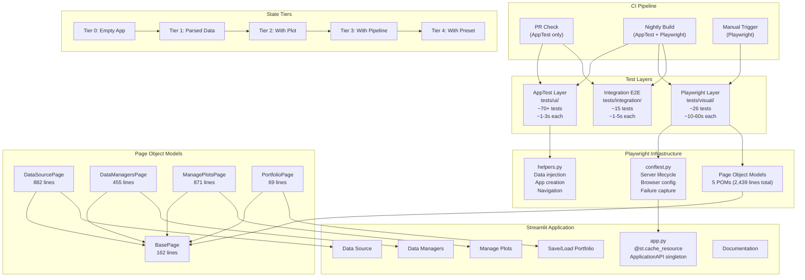
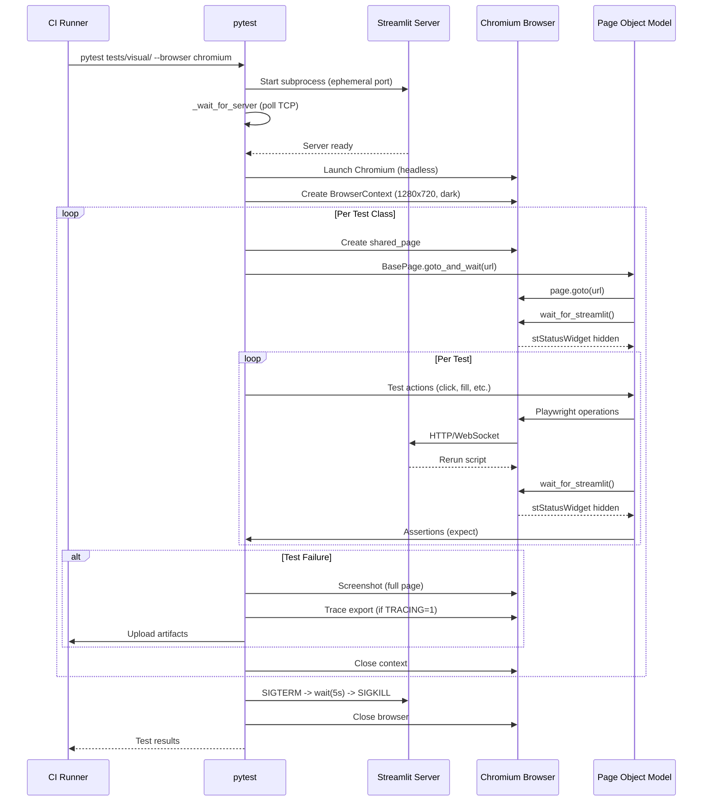
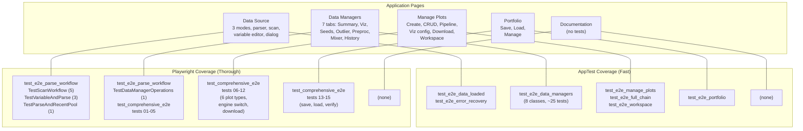

# Step 21: Playwright E2E Current State Analysis

> **Generated**: 2026-03-03
> **Scope**: End-to-end testing infrastructure, Playwright integration, AppTest e2e patterns, Page Object Models, and proposed architecture for full E2E coverage.

---

## 1. Executive Summary

The RING-5 Unified Engine v2 project has a **mature and well-structured E2E testing infrastructure** that operates across two distinct layers:

1. **Streamlit AppTest Layer** (`tests/ui/`): Headless, fast, in-process E2E tests using Streamlit's `AppTest` framework. These tests exercise the full application stack (data injection, navigation, widget interaction, API operations) without a real browser. They are included in the default `pytest` run and cover data managers, plot creation, portfolio round-trips, workspace management, and error recovery.

2. **Playwright Browser Layer** (`tests/visual/`): Real-browser E2E tests using `pytest-playwright` with a live Streamlit server. These tests exercise the actual rendered DOM, use comprehensive Page Object Models (POMs), capture screenshots, and test the full user workflow from parsing gem5 stats files through data management, plot creation, download, and portfolio save/load.

### Key Findings

| Dimension | Current State |
|---|---|
| **Playwright test files** | 2 comprehensive test modules in `tests/visual/` |
| **AppTest E2E files** | 7 test modules in `tests/ui/` + 1 in `tests/ui_logic/` + 2 in `tests/integration/` |
| **Page Object Models** | 5 POMs: `BasePage`, `DataSourcePage`, `DataManagersPage`, `ManagePlotsPage`, `PortfolioPage` |
| **Conftest infrastructure** | Session-scoped Streamlit server, auto-failure screenshots, tracing support, headed mode |
| **State Snapshot Tiers** | Partially implemented via AppTest helpers (`create_app`, `create_app_with_data`, `create_app_with_plots`) |
| **pytest markers** | `@pytest.mark.requires_browser` for Playwright tests |
| **Dependency** | `pytest-playwright>=0.7.0` in `[project.optional-dependencies.e2e]` |
| **Default exclusion** | `tests/visual/` excluded via `norecursedirs` in `[tool.pytest.ini_options]` |
| **CI integration** | Not yet configured (no GitHub Actions workflow for Playwright) |

### Coverage Gap Analysis

The **Documentation page** is the only Streamlit page without a dedicated POM or E2E test coverage. All other 4 pages (Data Source, Data Managers, Manage Plots, Save/Load Portfolio) have extensive Playwright POMs and both AppTest-level and browser-level E2E tests.

---

## 2. Current E2E Test Inventory

### 2.1 Playwright Browser Tests (`tests/visual/`)

These tests require a running Streamlit server and a real Chromium browser. They are excluded from the default `pytest` run via `norecursedirs` and gated by `@pytest.mark.requires_browser`.

#### `tests/visual/test_e2e_parse_workflow.py` (5 classes, 10 tests)

| Class | Tests | Description |
|---|---|---|
| `TestScanWorkflow` | 5 | Scan single, histogram, multi-CPU, benchmarks, and error handling with real synthetic gem5 data at `tests/data/synthetic/` |
| `TestVariableAndParse` | 3 | Variable add/configure, parse success + data managers verification, parse error scenarios |
| `TestDataManagerOperations` | 1 | Consolidated test exercising Seeds Reducer, Outlier Remover, Preprocessor, and Mixer tabs after parsing |
| `TestParseAndRecentPool` | 1 | Cross-page test: after parsing, CSV appears in "Load from Recent" |
| `TestE2EScreenshots` | 2 | Screenshot capture for documentation (scan, variables, parse dialog, data managers) |

Consolidated from 31 original individual tests to 10 workflow-style tests. Uses `shared_page` (class-scoped) to avoid redundant browser context creation.

#### `tests/visual/test_comprehensive_e2e.py` (1 class, 16 ordered tests)

| Test | Description |
|---|---|
| `test_01_verify_parsed_data` | Verify Data Managers shows rows/columns after parsing real MICRO-26 data |
| `test_02_remove_outliers` | Outlier removal on simTicks column |
| `test_03_reduce_seeds` | Seed reduction by aggregating numeric columns |
| `test_04_mix_columns` | Mix simTicks + simInsts + simOps into combined_metric |
| `test_05_verify_history` | Operations History tab shows recorded operations |
| `test_06_create_bar_plot` | Create bar plot with Sort pipeline, configure axes, render chart |
| `test_07_create_grouped_bar` | Create grouped bar with color-by grouping |
| `test_08_create_grouped_stacked_bar` | Create grouped stacked bar with major/minor grouping + Y multiselect |
| `test_09_create_dual_axis` | Create dual-axis bar-dot plot |
| `test_10_create_scatter` | Create scatter plot for numeric-vs-numeric analysis |
| `test_11_matplotlib_download` | Engine switch to matplotlib, PGF download verification |
| `test_12_plotly_download` | Plotly PDF download verification |
| `test_13_save_portfolio` | Save current session as portfolio |
| `test_14_load_portfolio` | Load portfolio and verify plots restored |
| `test_15_verify_widgets` | Widget state reflects plot configuration after portfolio load |
| `test_16_screenshots` | Final state screenshot capture for documentation |

Uses `@pytest.mark.xdist_group("comprehensive_e2e")` to guarantee sequential execution. Shares one `shared_page` across all 16 tests to simulate a real user session. Data source: `tests/data/results-micro26-sens/` (real gem5 HTM sensitivity study, 586 stats files subset to 3 configs). Parse timeout set to 180 seconds (3 minutes).

### 2.2 Streamlit AppTest E2E Tests (`tests/ui/`)

These tests run **without a browser** using Streamlit's `AppTest.from_file()` framework. They boot the real `app.py`, inject data via `api.state_manager`, and assert on widget trees.

#### `tests/ui/test_e2e_data_managers.py` (8 classes, ~25 tests)

| Class | Tests | Coverage |
|---|---|---|
| `TestSummaryTab` | 3 | Metrics count, dataframe presence, column count |
| `TestDataVisualizationTab` | 3 | Search widgets, multiselect, pagination controls |
| `TestSeedsReducerTab` | 4 | Multiselects, apply button, API-level reduction, confirm writes |
| `TestOutlierRemoverTab` | 3 | Column selectbox, Q-statistics metrics, apply button |
| `TestPreprocessorTab` | 3 | Source selectboxes, name input, preview button |
| `TestMixerTab` | 5 | Mode radio, column multiselect, operation, name input, preview |
| `TestOperationsHistoryTab` | 3 | Tab render, empty initial, records after seeds operation |
| `TestCrossTabConsistency` | 2 | All 7 tabs render, data modification persists across reruns |

#### `tests/ui/test_e2e_full_chain.py` (4 classes, ~12 tests)

| Class | Tests | Coverage |
|---|---|---|
| `TestDataTransformRenderChain` | 4 | Bar, grouped bar, line, scatter full chain (load -> shaper -> figure creation) |
| `TestPipelineModificationCycle` | 2 | Add shaper changes output, same pipeline produces consistent results |
| `TestDataToUIRendering` | 3 | Finalized plot renders on Manage page, multiple plots render, empty pipeline preserves data |
| `TestPortfolioRoundTripWithPlots` | 1 | Save/load portfolio via API with plot configs, verify persistence |

#### Other AppTest E2E Files

| File | Coverage |
|---|---|
| `tests/ui/test_e2e_portfolio.py` | Portfolio page: save, load, manage portfolios via AppTest |
| `tests/ui/test_e2e_data_loaded.py` | Data loaded state: metrics, navigation, data consistency across pages |
| `tests/ui/test_e2e_error_recovery.py` | Error recovery: missing data, invalid state, graceful degradation |
| `tests/ui/test_e2e_workspace.py` | Workspace management: export path, download all, process all |
| `tests/ui/test_e2e_manage_plots.py` | Manage plots: plot CRUD, pipeline editor, visualization section |
| `tests/ui_logic/test_settings_pills_e2e.py` | Settings pills: pill navigation, section rendering, factory integration |
| `tests/integration/test_e2e_managers_shapers.py` | Manager + shaper integration chains |
| `tests/integration/test_full_pipeline_e2e.py` | Full pipeline: parse -> transform -> plot pipeline |

### 2.3 Total E2E Test Count

| Layer | Files | Approximate Test Count |
|---|---|---|
| Playwright (browser) | 2 | ~26 |
| AppTest (headless) | 8 | ~70+ |
| Integration E2E | 2 | ~15 |
| **Total** | **12** | **~111** |

---

## 3. Testing Infrastructure Analysis

### 3.1 Playwright Fixtures (`tests/visual/conftest.py`)

The Playwright conftest at `/home/vnicolas/workspace/repos/RING-5-unified-engine-v2/tests/visual/conftest.py` provides a sophisticated fixture hierarchy:

```
Session scope:
  _streamlit_port ---------> live_server_url ---------> [Streamlit subprocess lifecycle]
  browser_type_launch_args   ---------> [HEADED, SLOW_MO env vars]
  browser_context_args       ---------> [1280x720 viewport, dark theme, en-US locale]

Class scope:
  shared_page                ---------> [Browser context + page per test class]
  shared_screenshot_dir      ---------> [Per-class screenshot directory]

Function scope:
  screenshot_dir             ---------> [Per-test screenshot directory]
  _capture_failure_artifacts ---------> [Auto screenshot + trace on failure]
```

**Key implementation details:**

- **Server lifecycle** (session-scoped): Starts Streamlit on an ephemeral port via `_free_port()` with flags `--server.headless true`, `--server.fileWatcherType none`, `--browser.gatherUsageStats false`. The Python executable is resolved to `python_venv/bin/python` relative to repo root. Graceful SIGTERM shutdown with 5-second force-kill fallback via `proc.kill()`.

- **Server readiness**: `_wait_for_server()` polls `socket.create_connection()` with 0.5-second intervals up to 30-second timeout before raising `TimeoutError`.

- **Browser context**: 1280x720 viewport, `en-US` locale, `dark` color scheme (matches RING-5 application theme for screenshot consistency).

- **Shared page** (class-scoped): `shared_page` fixture creates one `BrowserContext` + `Page` per test class, enabling state accumulation across ordered tests. This mimics a real user session and avoids the ~5-second cost of context creation per test.

- **Failure artifacts** (autouse, function-scoped): `_capture_failure_artifacts` auto-captures full-page screenshots and optional Playwright traces on test failure. Detects whether the test uses `shared_page` or `page` fixture and captures from the active one. Traces enabled via `TRACING=1` env var, saved as `.zip` files.

- **Headed mode** (session-scoped): `HEADED=1` env var enables visible browser window. `SLOW_MO=<ms>` adds artificial delay per Playwright operation for visual debugging.

### 3.2 AppTest Helpers (`tests/ui/helpers.py`)

Located at `/home/vnicolas/workspace/repos/RING-5-unified-engine-v2/tests/ui/helpers.py`, the AppTest layer provides reusable helper functions for test setup:

```python
# Boot app with clean state (reset singleton to prevent cross-test contamination)
create_app() -> AppTest

# Boot app with data pre-loaded (18 rows x 8 columns by default)
create_app_with_data(df=None) -> AppTest

# Boot app with data + pre-configured plots
create_app_with_plots(df=None, plot_configs=None) -> AppTest

# Navigate to a page via session_state["_nav_page"]
navigate_to(at, page_name) -> AppTest

# Retrieve ApplicationAPI from session state
get_api(at) -> ApplicationAPI

# Rich sample data: 18 rows x 8 columns (3 benchmarks x 3 configs x 2 seeds)
make_e2e_sample_data() -> pd.DataFrame
```

**Data injection pattern**: `AppTest.from_file("app.py")` creates a `@st.cache_resource` singleton `ApplicationAPI`. After `.run()`, the API is accessible at `at.session_state["api"]`. Since `RepositoryStateManager` uses pure Python repositories (not `st.session_state`), mutations via `api.state_manager.set_data(...)` persist across `.run()` calls. The `create_app()` function calls `api.reset_session()` after the initial run and re-runs to guarantee test isolation.

**Sample data columns**: `benchmark_name`, `config_description`, `seed`, `system.cpu.ipc`, `system.cpu.numCycles`, `simTicks`, `system.cpu.dcache.overall_miss_rate`, `system.cpu.committedInsts`.

### 3.3 Root Conftest (`tests/conftest.py`)

Provides shared fixtures available to all test directories:

| Fixture | Scope | Description |
|---|---|---|
| `sample_data` | function | 6-row DataFrame (3 benchmarks x 2 configs, 4 columns) |
| `sample_data_extended` | function | Adds `numCycles` and `committedInsts` to `sample_data` |
| `e2e_sample_data` | function | Rich 18-row DataFrame from `make_e2e_sample_data()` |
| `mock_api` | function | Mock ApplicationAPI with state_manager |
| `mock_state_manager` | function | Mock RepositoryStateManager with all sub-repositories wired |
| `sample_pipeline_config` | function | Valid 3-step pipeline (columnSelector + normalize + sort) |
| `_cleanup_perl_worker_pool` | session | Shuts down PerlWorkerPool subprocesses to prevent ResourceWarnings |

### 3.4 Dependency Configuration (`pyproject.toml`)

From `/home/vnicolas/workspace/repos/RING-5-unified-engine-v2/pyproject.toml`:

```toml
[project.optional-dependencies]
e2e = ["pytest-playwright>=0.7.0", "pytest-base-url>=2.1.0"]

[tool.pytest.ini_options]
norecursedirs = [
    "tests/tests_principle_compliance",
    "tests/manual",
    "tests/data",
    "tests/visual",           # Playwright tests excluded from default run
]
markers = [
    "requires_browser: Tests that require a running browser/server",
]
addopts = "-v --tb=short --strict-markers -n 3 --dist loadgroup"
```

The `tests/visual/` directory is excluded from default discovery. Playwright tests must be explicitly invoked:

```bash
# Install Playwright browsers first
pip install -e ".[e2e]"
playwright install chromium

# Run Playwright tests
pytest tests/visual/ -m requires_browser --browser chromium

# Run in headed mode for debugging
HEADED=1 SLOW_MO=500 pytest tests/visual/ -m requires_browser --browser chromium

# Run with tracing for failure investigation
TRACING=1 pytest tests/visual/ -m requires_browser --browser chromium
```

### 3.5 UI Conftest Monkey-Patch (`tests/ui/conftest.py`)

Patches a Streamlit 1.53.1 bug where `ButtonGroup.indices` iterates over string characters in single-selection mode instead of treating the value as a single item. Applied at import time by replacing `ButtonGroup.indices` with a corrected property.

### 3.6 Integration Conftest (`tests/integration/conftest.py`)

Provides integration-specific fixtures:

| Fixture | Description |
|---|---|
| `_reset_service_caches` | Autouse: resets `PathService`, `CsvPoolService`, `ConfigService` caches for isolation |
| `facade` | Fresh `ApplicationAPI` instance |
| `state_manager` | Fresh `RepositoryStateManager` with `clear_all()` |
| `rich_sample_data` | 9-row DataFrame (3 benchmarks x 3 configs, 5 columns) |
| `loaded_facade` | ApplicationAPI with sample data pre-loaded |
| `bar_config`, `grouped_bar_config`, `line_config`, `scatter_config` | Minimal plot configs |

---

## 4. Proposed E2E Architecture (Playwright + Streamlit)

### 4.1 Architecture Overview

The existing architecture is well-designed. The following recommendations formalize and extend the current patterns.

```
tests/
  visual/                          # Playwright browser tests
    conftest.py                    # Server lifecycle, browser config, failure capture
    pages/                         # Page Object Models
      __init__.py
      base_page.py                 # Common: sidebar, wait_for_streamlit, screenshots
      data_source_page.py          # DataSourcePage POM (882 lines)
      data_managers_page.py        # DataManagersPage POM (455 lines)
      manage_plots_page.py         # ManagePlotsPage POM (871 lines)
      portfolio_page.py            # PortfolioPage POM (69 lines)
      documentation_page.py        # [PROPOSED] DocumentationPage POM
    fixtures/                      # [PROPOSED] State snapshot fixtures
      __init__.py
      state_tiers.py               # Tier 0-4 state snapshot fixtures
    test_e2e_parse_workflow.py     # Parse workflow tests (10 tests)
    test_comprehensive_e2e.py      # Full session simulation (16 ordered tests)
    test_e2e_documentation.py      # [PROPOSED] Documentation page tests
    screenshots/                   # Per-test screenshot output (gitignored)
    artifacts/                     # Failure screenshots + traces (gitignored)
  ui/                              # Streamlit AppTest (headless) E2E tests
    conftest.py                    # ButtonGroup monkey-patch
    helpers.py                     # create_app, navigate_to, data injection
    test_e2e_data_managers.py      # Data manager tab interactions (~25 tests)
    test_e2e_full_chain.py         # data -> transform -> render chain (~12 tests)
    test_e2e_portfolio.py          # Portfolio save/load tests
    test_e2e_manage_plots.py       # Plot CRUD + pipeline editor tests
    test_e2e_workspace.py          # Workspace management tests
    test_e2e_data_loaded.py        # Data loaded state tests
    test_e2e_error_recovery.py     # Error recovery / graceful degradation tests
```

### 4.2 Dual-Layer Testing Strategy

The project effectively uses a two-layer E2E strategy:

| Layer | Technology | Speed | What It Tests | When to Use |
|---|---|---|---|---|
| **AppTest** | `streamlit.testing.v1.AppTest` | Fast (~1-3s/test) | Widget tree, session state, API calls, navigation | Default CI run, every PR |
| **Playwright** | `pytest-playwright` + Chromium | Slow (~10-60s/test) | Real DOM, CSS rendering, JS components, screenshots, visual regression | Nightly CI / manual runs |

**Recommendation**: Maintain this dual-layer approach. AppTest tests gate every PR via the default `pytest` run. Playwright tests run in a separate CI job (nightly or on-demand) with dedicated browser installation.

### 4.3 Streamlit-Specific Testing Challenges (Solved)

The existing infrastructure already addresses all key Streamlit testing challenges:

**Challenge 1: Detecting script completion**
- **Solution** (`BasePage.wait_for_streamlit()`): Two-phase strategy: (a) try `networkidle` with 5-second timeout (custom components may never reach idle), (b) wait for `stStatusWidget` to become hidden -- the authoritative signal that the Streamlit script run finished.

**Challenge 2: Segmented control toggle behavior**
- **Solution** (`DataSourcePage.ensure_parse_mode()`, etc.): Clicking an already-active segmented control option **deselects** it. `ensure_*()` methods check `data-testid` for `segmented_controlActive` attribute before clicking.

**Challenge 3: `@st.cache_resource` singleton**
- **Solution** (`DataSourcePage.add_manual_variable()`): The `ApplicationAPI` is shared across all browser sessions in the same Streamlit process. The `add_manual_variable()` method handles "already exists" warnings by closing the dialog gracefully. AppTest helpers call `api.reset_session()` for isolation.

**Challenge 4: Fragment rerender timing**
- **Solution**: Extra `wait_for_timeout(500)` stabilization after `fill()` + `press("Tab")` in text inputs that trigger `@st.fragment` rerenders. This accounts for the asynchronous fragment update cycle.

**Challenge 5: Plotly iframe rendering**
- **Solution** (`ManagePlotsPage.assert_chart_visible()`): Uses Playwright `evaluate()` with `requestAnimationFrame` polling to wait for the `stCustomComponentV1` iframe `height` attribute to become non-zero, confirming the Plotly JS has finished rendering.

**Challenge 6: Selectbox dropdown interaction**
- **Solution** (`ManagePlotsPage._select_dropdown_option()`): Streamlit renders selectbox options as `<li>` elements inside `[data-testid='stSelectboxVirtualDropdown']`. The helper waits 300ms after click for the virtual dropdown to materialize.

---

## 5. State Snapshot Tier System Design

### 5.1 Current State Management Patterns

The project already implements three tiers of state setup via the AppTest helpers:

| Current Helper | Equivalent Tier | State Description |
|---|---|---|
| `create_app()` | Tier 0 | Empty application, clean session, no data |
| `create_app_with_data(df)` | Tier 1 | Data loaded into `state_manager` (raw + processed) |
| `create_app_with_plots(df, configs)` | Tier 2 | Data + pre-configured plots with configs |

For Playwright tests, state is built up incrementally during the test session. The `TestComprehensiveE2E` class builds from parse (Tier 0 -> 1) through data management (Tier 1 -> manipulated) through plot creation (Tier 2) through pipeline (Tier 3) through download/portfolio (Tier 4) using a class-scoped `_parse_real_data` autouse fixture.

### 5.2 Proposed Formal Tier System

| Tier | Name | State | Creation Cost | Used By |
|---|---|---|---|---|
| **Tier 0** | Empty App | Fresh session, no data | ~3s (server start) | Error recovery, empty state UI, Data Source page tests |
| **Tier 1** | Parsed Data | Data loaded (18 rows x 8 cols synthetic or real gem5) | ~5s (synthetic) / ~180s (real) | Data Manager tabs, navigation, metrics |
| **Tier 2** | With Plot | Data + at least 1 configured plot | ~8s (builds on Tier 1) | Plot rendering, CRUD, pipeline editor |
| **Tier 3** | With Pipeline | Data + plot + finalized shaper pipeline + chart rendered | ~15s (builds on Tier 2) | Visualization, engine switching, settings |
| **Tier 4** | With Preset | Data + plot + pipeline + preset applied + portfolio saved | ~20s (builds on Tier 3) | Download, export, portfolio round-trip |

### 5.3 Proposed Playwright State Tier Fixtures

```python
# tests/visual/fixtures/state_tiers.py

import pytest
from pathlib import Path
from playwright.sync_api import Page, expect

from tests.visual.pages.base_page import BasePage
from tests.visual.pages.data_source_page import DataSourcePage
from tests.visual.pages.data_managers_page import DataManagersPage
from tests.visual.pages.manage_plots_page import ManagePlotsPage
from tests.visual.pages.portfolio_page import PortfolioPage

_REPO_ROOT = Path(__file__).parents[3]
_BENCHMARKS_STATS = _REPO_ROOT / "tests" / "data" / "synthetic" / "benchmarks"


@pytest.fixture(scope="class")
def tier0_page(shared_page: Page, live_server_url: str) -> Page:
    """Tier 0: Fresh application with clean state."""
    base = BasePage(shared_page)
    base.goto_and_wait(live_server_url)
    base.assert_page_loaded()
    return shared_page


@pytest.fixture(scope="class")
def tier1_page(shared_page: Page, live_server_url: str) -> Page:
    """Tier 1: Application with parsed synthetic data loaded."""
    ds = DataSourcePage(shared_page)
    ds.goto_and_wait(live_server_url)
    ds.ensure_parse_mode()
    ds.fill_stats_path(str(_BENCHMARKS_STATS))
    ds.fill_stats_pattern("stats.txt")
    ds.scan_and_wait(timeout=60_000)
    ds.add_manual_variable("system.cpu.ipc", "scalar")
    ds.add_manual_variable("simSeconds", "scalar")
    ds.parse_and_wait(timeout=120_000)
    ds.close_parse_dialog_and_reload()
    return shared_page


@pytest.fixture(scope="class")
def tier2_page(tier1_page: Page) -> Page:
    """Tier 2: Application with data + a configured bar plot."""
    mp = ManagePlotsPage(tier1_page)
    mp.navigate()
    mp.create_plot("Tier2 Bar", "bar")
    mp.assert_plot_pill_visible("Tier2 Bar")
    return tier1_page


@pytest.fixture(scope="class")
def tier3_page(tier2_page: Page) -> Page:
    """Tier 3: Application with data + plot + finalized pipeline."""
    mp = ManagePlotsPage(tier2_page)
    mp.add_shaper("Sort")
    mp.finalize_pipeline()
    # Navigate away and back to trigger render fragment
    mp.navigate_to("Data Source")
    mp.navigate()
    expect(mp.viz_x_axis_selectbox).to_be_visible(timeout=30_000)
    mp.select_x_axis("benchmark_name")
    mp.select_y_axis("system.cpu.ipc")
    mp.refresh_plot()
    mp.assert_chart_visible()
    return tier2_page


@pytest.fixture(scope="class")
def tier4_page(tier3_page: Page) -> Page:
    """Tier 4: Application with full state + portfolio saved."""
    pf = PortfolioPage(tier3_page)
    pf.navigate()
    pf.save_name_input.fill("Tier4_Portfolio")
    pf.save_button.click()
    pf.wait_for_streamlit()
    return tier3_page
```

### 5.4 Tier Usage Matrix

| Test Category | Tier 0 | Tier 1 | Tier 2 | Tier 3 | Tier 4 |
|---|---|---|---|---|---|
| Empty state rendering | X | | | | |
| Error recovery / guardrails | X | | | | |
| Data Source page (parse, scan) | X | | | | |
| Data Managers (all 7 tabs) | | X | | | |
| Plot creation / CRUD | | X | X | | |
| Pipeline editor / shapers | | | X | | |
| Visualization / chart render | | | | X | |
| Engine switching (plotly / matplotlib) | | | | X | |
| Download / export (PGF, PDF, SVG) | | | | X | X |
| Portfolio save / load | | | | | X |
| Workspace management | | | | | X |
| Screenshot comparison | | X | X | X | X |

### 5.5 Portfolio-Based Snapshot Strategy

The most efficient approach for Playwright tier management is to leverage the existing **portfolio save/load** mechanism:

1. **Session fixture** parses real data once (3 minutes)
2. **Session fixture** creates plots, pipelines, and saves as portfolio
3. **Class fixtures** load the portfolio at the start of each test class
4. This converts the 3-minute parse cost into a ~5-second portfolio load per class

```python
@pytest.fixture(scope="session")
def master_portfolio(shared_page, live_server_url):
    """Parse data and create a master portfolio (once per session)."""
    # ... parse, create plots, save as "master_e2e_portfolio" ...
    return "master_e2e_portfolio"

@pytest.fixture(scope="class")
def loaded_session(shared_page, live_server_url, master_portfolio):
    """Load the master portfolio at the start of each test class."""
    pf = PortfolioPage(shared_page)
    pf.navigate()
    pf.load_selector.click()
    # ... select and load portfolio ...
    return shared_page
```

---

## 6. Page Object Models (5 Pages)

### 6.1 POM Architecture

All Page Object Models inherit from `BasePage` (`/home/vnicolas/workspace/repos/RING-5-unified-engine-v2/tests/visual/pages/base_page.py`, 162 lines) which provides the common interface:

```python
class BasePage:
    RENDER_TIMEOUT: int = 15_000

    def __init__(self, page: Page) -> None: ...

    # Common locators
    @property sidebar -> Locator                    # [data-testid='stSidebar']
    @property main_header -> Locator                # h1.main-header

    # Navigation
    def navigate_to(page_name: str) -> None         # Click sidebar nav button

    # Streamlit sync
    def wait_for_streamlit(timeout=None) -> None     # networkidle + stStatusWidget hidden
    def goto_and_wait(url: str) -> None              # goto + wait_for_streamlit

    # Screenshots
    def screenshot(path, full_page=True) -> None     # Full page capture
    def screenshot_element(locator, path) -> None    # Element capture
    @staticmethod create_gif(frames, output, duration_ms=1500) -> None  # imageio GIF

    # Assertions
    def assert_page_loaded() -> None                 # main_header visible
    def assert_on_page(page_name: str) -> None       # Sidebar button visible
```

### 6.2 DataSourcePage POM

**File**: `/home/vnicolas/workspace/repos/RING-5-unified-engine-v2/tests/visual/pages/data_source_page.py` (882 lines)

Covers the Data Source page with all 3 modes (Parse, CSV, Recent) and the Add Variable dialog.

| Section | Locators | Actions | Assertions |
|---|---|---|---|
| **Step header + info** | `step_header`, `info_box` | -- | `assert_step_header_visible`, `assert_info_box_visible` |
| **Segmented control** | `segmented_control`, `parse_option`, `csv_option`, `recent_option` | `select_parse_mode`, `select_csv_mode`, `select_recent_mode`, `ensure_parse_mode` | `assert_segmented_control_visible`, `assert_all_mode_options_visible`, `assert_parse_mode_active`, `assert_csv_mode_active`, `assert_recent_mode_active` |
| **Simulator pills** | `simulator_pills`, `gem5_pill` | -- | -- |
| **File Location** | `file_location_header`, `stats_path_input`, `stats_pattern_input` | `fill_stats_path`, `fill_stats_pattern` | `assert_file_location_visible` |
| **Parsing Strategy** | `strategy_header`, `strategy_segmented_control`, `strategy_simple_option`, `strategy_config_aware_option` | `select_simple_strategy`, `ensure_simple_strategy`, `select_config_aware_strategy`, `ensure_config_aware_strategy` | `assert_strategy_section_visible` |
| **Variables** | `variables_header`, `variables_description`, `deep_scan_checkbox`, `quick_scan_button`, `scan_result_message`, `add_variable_button` | `toggle_deep_scan`, `click_quick_scan`, `click_add_variable`, `scan_and_wait`, `add_variable_from_scan`, `add_manual_variable` | `assert_variables_section_visible`, `assert_scan_success`, `assert_variable_exists` |
| **Config Preview** | `config_preview_header`, `config_json_view` | -- | `assert_config_preview_visible` |
| **Parse button** | `parse_button`, `parser_error_message` | `click_parse`, `parse_and_wait`, `close_parse_dialog_and_reload` | `assert_parse_button_visible`, `assert_parse_dialog_shows_errors`, `assert_parse_dialog_shows_no_results` |
| **CSV mode** | `csv_success_message`, `file_uploader` | `upload_csv` | `assert_csv_mode_message_visible`, `assert_csv_uploader_visible`, `assert_data_loaded` |
| **Recent mode** | `recent_header`, `empty_pool_warning`, `pool_file_count_info`, `pool_expanders` | `pool_card_load_button(i)`, `pool_card_preview_button(i)`, `pool_card_delete_button(i)` | `assert_recent_mode_content_visible`, `assert_recent_header_visible` |
| **Add Variable dialog** | `dialog_overlay`, `dialog_title`, `dialog_search_pill`, `dialog_manual_pill`, `dialog_search_selectbox`, `dialog_manual_name_input`, `dialog_manual_type_selectbox`, `dialog_add_button`, `dialog_close_button`, `dialog_advanced_expander`, `dialog_name_error`, `dialog_no_vars_warning`, `dialog_search_info` | `open_add_variable_dialog`, `close_dialog`, `close_dialog_with_escape`, `close_dialog_by_clicking_outside`, `switch_dialog_to_manual`, `switch_dialog_to_search`, `fill_dialog_manual_name`, `click_dialog_add` | `assert_dialog_visible`, `assert_dialog_hidden` |
| **Variable editor** | `variable_name_inputs`, `variable_search_selectbox`, `add_selected_button`, `add_manual_button` | -- | `get_variable_count`, `assert_variable_exists` |
| **Parse dialog** | `parse_dialog`, `parse_dialog_progress`, `parse_close_button` | -- | -- |

### 6.3 DataManagersPage POM

**File**: `/home/vnicolas/workspace/repos/RING-5-unified-engine-v2/tests/visual/pages/data_managers_page.py` (455 lines)

Covers all 7 tabs: Summary, Data Visualization, Seeds Reducer, Outlier Remover, Preprocessor, Mixer, Operations History.

| Tab / Section | Locators | Actions | Assertions |
|---|---|---|---|
| **Page-level** | `page_header`, `no_data_warning`, `tab_bar` | `navigate()`, `select_tab(name)`, `get_tab(name)` | `assert_page_header_visible`, `assert_no_data_warning`, `assert_tabs_visible`, `assert_tab_active`, `assert_has_data` |
| **Summary** | `summary_rows_metric`, `summary_columns_metric` | -- | `assert_summary_has_rows(expected)`, `assert_summary_has_columns` |
| **Data Visualization** | `search_input`, `dataframe_view`, `viz_search_column_selectbox`, `viz_search_term_input` | -- | `assert_dataframe_visible` |
| **Seeds Reducer** | `seeds_categorical_select`, `reducer_target_selectbox`, `seeds_apply_button`, `seeds_confirm_button`, `seeds_no_random_seed_warning`, `seeds_categorical_multiselect`, `seeds_numeric_multiselect` | `apply_seeds_reducer`, `confirm_seeds_reducer` | `assert_seeds_requires_random_seed`, `assert_reducer_ready` |
| **Outlier Remover** | `outlier_column_selectbox`, `outlier_apply_button`, `outlier_confirm_button`, `outlier_metrics` | `apply_outlier_remover`, `confirm_outlier_remover` | `assert_outlier_shows_metrics` |
| **Preprocessor** | `preproc_src1_selectbox`, `preproc_operation_selectbox`, `preproc_src2_selectbox`, `preproc_name_input`, `preproc_preview_button`, `preproc_confirm_button` | `apply_preprocessor_preview`, `confirm_preprocessor` | -- |
| **Mixer** | `mixer_mode_control`, `mixer_columns_multiselect`, `mixer_operation_selectbox`, `mixer_new_name_input`, `mixer_preview_button`, `mixer_confirm_button` | `apply_mixer_preview`, `confirm_mixer` | -- |
| **Operations History** | `history_container`, `history_no_ops_warning`, `history_total_metric` | -- | `assert_history_empty`, `assert_history_has_operations(count)` |
| **Common alerts** | -- | -- | `assert_success_message_visible`, `assert_error_message_visible`, `assert_warning_message_visible` |

**Design note**: The `_by_label(test_id, label_text)` helper method filters widgets by both `data-testid` and visible label text to disambiguate widgets across simultaneously-rendered tab panels.

### 6.4 ManagePlotsPage POM

**File**: `/home/vnicolas/workspace/repos/RING-5-unified-engine-v2/tests/visual/pages/manage_plots_page.py` (871 lines)

The largest POM, covering plot creation, selector pills, controls, pipeline editor, visualization config, download, and workspace management.

| Section | Locators | Actions | Assertions |
|---|---|---|---|
| **Create Plot form** | `plot_name_input`, `plot_type_selectbox`, `create_plot_button` | `fill_plot_name`, `create_plot(name, type)`, `select_plot_type(type)` | `assert_create_form_visible` |
| **Plot selector pills** | `plot_selector_pills`, `no_plots_warning` | `get_plot_pill(name)`, `select_plot(name)` | `assert_no_plots_warning`, `assert_plot_pill_visible(name)`, `assert_plot_pill_not_visible(name)` |
| **Controls row** | `rename_input`, `save_pipe_button`, `load_pipe_button`, `delete_button`, `duplicate_button` | `rename_plot(name)`, `delete_plot`, `duplicate_plot`, `open_save_dialog`, `open_load_dialog` | `assert_controls_visible` |
| **Save/Load dialogs** | `save_dialog_name_input`, `save_dialog_save_button`, `load_dialog_selector`, `load_dialog_load_button`, `load_dialog_no_pipelines_warning`, `load_dialog_close_button` | -- | -- |
| **Pipeline editor** | `add_transformation_selectbox`, `add_to_pipeline_button`, `pipeline_steps`, `finalize_button` | `add_shaper(name)`, `finalize_pipeline`, `delete_step(i)`, `move_step_up(i)`, `move_step_down(i)` | `assert_pipeline_editor_visible`, `assert_pipeline_step_count(n)`, `assert_finalize_button_visible` |
| **Shaper widgets** | `column_selector_multiselect`, `column_select_all_button`, `sort_column_selectbox`, `sort_order_selectbox`, `filter_column_selectbox`, `filter_operator_selectbox`, `filter_value_input`, `normalize_column_selectbox`, `normalize_method_selectbox`, `mean_group_by_multiselect`, `mean_calculate_for_multiselect`, `transformer_source_selectbox`, `transformer_transformation_selectbox`, `transformer_new_name_input` | `click_select_all_columns`, `click_clear_all_columns`, `click_numeric_only_columns` | -- |
| **Visualization config** | `viz_plot_type_selectbox`, `viz_x_axis_selectbox`, `viz_y_axis_selectbox`, `viz_color_by_selectbox`, `viz_group_by_selectbox`, `viz_stack_by_selectbox`, `viz_size_by_selectbox`, `viz_title_input`, `viz_x_label_input`, `viz_y_label_input`, `viz_auto_refresh_toggle`, `viz_refresh_button`, `viz_show_advanced_toggle`, `viz_settings_pills`, `viz_engine_pills`, `viz_preset_pills` | `select_x_axis`, `select_y_axis`, `select_color_by`, `select_group_by`, `select_stack_by`, `refresh_plot`, `toggle_auto_refresh`, `toggle_advanced_settings`, `select_engine(engine)` | `assert_visualization_section_visible`, `assert_no_processed_data_warning` |
| **Chart output** | `plotly_chart`, `matplotlib_chart`, `no_processed_data_warning` | -- | `assert_chart_visible(timeout)`, `assert_matplotlib_chart_visible` |
| **Download** | `download_expander`, `download_format_pills`, `download_button` | -- | -- |
| **Workspace** | `export_path_input`, `force_format_selectbox`, `download_all_button`, `process_all_button`, `save_workspace_button` | -- | -- |

**Constants defined in module scope:**
- `PLOT_TYPES`: bar, dual_axis_bar_dot, grouped_bar, stacked_bar, grouped_stacked_bar, histogram, line, scatter
- `SHAPER_TYPES`: Column Selector, Sort, Mean Calculator, Normalize, Filter, Split-Apply (Per-Axis), Transformer

### 6.5 PortfolioPage POM

**File**: `/home/vnicolas/workspace/repos/RING-5-unified-engine-v2/tests/visual/pages/portfolio_page.py` (69 lines)

Minimal POM covering save/load operations:

| Section | Locators | Actions | Assertions |
|---|---|---|---|
| **Save** | `page_header`, `save_name_input`, `save_button` | `navigate()` | `assert_page_header_visible` |
| **Load** | `load_selector`, `load_button` | -- | -- |

### 6.6 Missing POM: DocumentationPage

The Documentation page (`/home/vnicolas/workspace/repos/RING-5-unified-engine-v2/src/web/pages/documentation.py`) has no POM or E2E tests. A `DocumentationPage` POM should be created covering:

- Page header and navigation
- Architecture diagram sections
- Code example blocks
- Navigation links within the page
- Expand/collapse sections

### 6.7 POM Coverage Summary

| Page | POM | Lines | Locators | Actions | Assertions | E2E Tests |
|---|---|---|---|---|---|---|
| Data Source | `DataSourcePage` | 882 | ~50 | ~25 | ~25 | 10 Playwright + AppTest |
| Data Managers | `DataManagersPage` | 455 | ~30 | ~15 | ~15 | 10+ Playwright + AppTest |
| Manage Plots | `ManagePlotsPage` | 871 | ~55 | ~20 | ~18 | 16 Playwright + AppTest |
| Save/Load Portfolio | `PortfolioPage` | 69 | 4 | 1 | 1 | 3 Playwright + AppTest |
| Documentation | **MISSING** | -- | -- | -- | -- | 0 |

---

## 7. Fixture Strategy

### 7.1 Current Fixture Hierarchy

```
pytest-playwright provides:
  browser_type           (session)  -- Chromium browser type
  browser                (session)  -- Launched browser instance
  context                (session)  -- Default browser context
  page                   (function) -- Fresh page per test

tests/visual/conftest.py overrides/adds:
  _streamlit_port        (session)  -- Ephemeral TCP port
  live_server_url        (session)  -- http://localhost:<port>
  browser_context_args   (session)  -- 1280x720, dark, en-US
  browser_type_launch_args (session) -- headless/headed, slow_mo
  shared_page            (class)    -- Shared page per class
  shared_screenshot_dir  (class)    -- Per-class screenshot dir
  screenshot_dir         (function) -- Per-test screenshot dir
  _capture_failure_artifacts (function, autouse) -- Failure capture
```

### 7.2 Fixture Dependency Graph

```
                    _streamlit_port (session)
                          |
                    live_server_url (session)
                          |
    +---------------------+---------------------+
    |                     |                     |
browser_context_args  browser_type_launch_args  |
    (session)            (session)              |
    |                     |                     |
    +--------+           +--------+             |
             |                    |             |
          browser (session, from pytest-playwright)
             |
    +--------+--------+
    |                 |
shared_page        page
(class)          (function)
    |                 |
    +--------+--------+
             |
    _capture_failure_artifacts (function, autouse)
             |
    +--------+--------+
    |                 |
shared_screenshot_dir  screenshot_dir
    (class)          (function)
```

### 7.3 Proposed Tier Fixture Chain

```
live_server_url (session)
    |
    +--- tier0_page (class) -- Navigate, assert loaded
    |        |
    |   tier1_page (class) -- Parse synthetic data
    |        |
    |   tier2_page (class) -- Create plot
    |        |
    |   tier3_page (class) -- Finalize pipeline, render chart
    |        |
    |   tier4_page (class) -- Save portfolio
    |
    +--- master_portfolio (session) -- One-time setup for session-wide reuse
             |
         loaded_session (class) -- Load portfolio per class
```

### 7.4 Test Isolation Strategy

| Scope | Isolation Mechanism | Trade-off |
|---|---|---|
| **Session** | Single Streamlit server, single browser | Fastest, but state accumulates |
| **Class** | `shared_page` with class-scoped context | Fast within class, isolated between classes |
| **Function** | Default `page` from pytest-playwright | Slowest, full isolation per test |

**Recommendation**: Use `shared_page` (class-scoped) for most Playwright tests. Only use function-scoped `page` for tests that must start from pristine browser state. The `TestComprehensiveE2E` class demonstrates this pattern effectively.

---

## 8. Test Runner Configuration

### 8.1 Current Configuration

From `pyproject.toml`:

```toml
[tool.pytest.ini_options]
testpaths = ["tests"]
norecursedirs = ["tests/visual"]
addopts = "-v --tb=short --strict-markers -n 3 --dist loadgroup"
markers = [
    "requires_browser: Tests that require a running browser/server",
    "xdist_group: Group tests to run on the same xdist worker",
]
```

### 8.2 Proposed Playwright-Specific Configuration

Create a `pytest.ini` or append to `pyproject.toml` for Playwright runs:

```toml
# Proposed addition to pyproject.toml for Playwright-specific runs
# Invoked via: pytest tests/visual/ -c pyproject.toml ...

# Or use a conftest.py marker to auto-apply:
# pytest tests/visual/ --browser chromium -x --timeout 300
```

**Recommended Playwright invocation:**

```bash
# Quick smoke test (parse workflow only)
pytest tests/visual/test_e2e_parse_workflow.py \
    -m requires_browser \
    --browser chromium \
    -x \
    --timeout 300

# Full comprehensive suite (16 ordered tests)
pytest tests/visual/test_comprehensive_e2e.py \
    -m requires_browser \
    --browser chromium \
    -x \
    --timeout 600 \
    -p no:xdist

# All Playwright tests with tracing
TRACING=1 pytest tests/visual/ \
    -m requires_browser \
    --browser chromium \
    -x \
    --timeout 600 \
    -p no:xdist

# Headed debugging with slow motion
HEADED=1 SLOW_MO=500 pytest tests/visual/test_e2e_parse_workflow.py::TestScanWorkflow::test_scan_single_stats \
    -m requires_browser \
    --browser chromium \
    -x \
    -s
```

**Note**: The `-p no:xdist` flag is important for Playwright tests because the session-scoped Streamlit server shares state across all tests. Running tests in parallel with xdist would cause state conflicts. The `@pytest.mark.xdist_group` marker provides a weaker guarantee (same worker) but `-p no:xdist` is safer.

### 8.3 Test Categories and Tagging

| Marker | Meaning | When to Run |
|---|---|---|
| `@pytest.mark.requires_browser` | Needs Playwright + live server | Nightly CI / manual |
| `@pytest.mark.xdist_group("name")` | Must run on same xdist worker | Auto (xdist respects it) |
| `@pytest.mark.smoke` | Quick validation | Every PR (AppTest layer) |
| `@pytest.mark.slow` | Long-running test | Nightly CI |
| `@pytest.mark.order(n)` | Execution order within class | Auto (pytest-order) |

### 8.4 Proposed New Markers

```toml
# Additions to [tool.pytest.ini_options].markers
markers = [
    "visual_regression: Screenshot comparison tests",
    "tier(n): State snapshot tier required (0-4)",
    "real_data: Uses real gem5 data (slow parse)",
    "synthetic_data: Uses synthetic gem5 data (fast parse)",
]
```

---

## 9. CI Integration Plan

### 9.1 Current CI State

There is **no existing CI configuration** for Playwright tests. The default `pytest` run excludes `tests/visual/` via `norecursedirs`.

### 9.2 Proposed GitHub Actions Workflow

```yaml
# .github/workflows/playwright-e2e.yml

name: Playwright E2E Tests

on:
  schedule:
    - cron: '0 2 * * *'  # Nightly at 2 AM UTC
  workflow_dispatch:       # Manual trigger
  pull_request:
    paths:
      - 'src/web/**'
      - 'tests/visual/**'
      - 'app.py'

jobs:
  playwright-tests:
    runs-on: ubuntu-latest
    timeout-minutes: 30
    strategy:
      fail-fast: false

    steps:
      - uses: actions/checkout@v4
        with:
          lfs: true        # For test data files

      - name: Set up Python 3.12
        uses: actions/setup-python@v5
        with:
          python-version: '3.12'

      - name: Install dependencies
        run: |
          python -m venv python_venv
          source python_venv/bin/activate
          pip install -e ".[dev,e2e]"

      - name: Install Playwright browsers
        run: |
          source python_venv/bin/activate
          playwright install --with-deps chromium

      - name: Run Playwright E2E tests
        run: |
          source python_venv/bin/activate
          pytest tests/visual/ \
            -m requires_browser \
            --browser chromium \
            -x \
            --timeout 600 \
            -p no:xdist \
            --tracing retain-on-failure

      - name: Upload failure artifacts
        if: failure()
        uses: actions/upload-artifact@v4
        with:
          name: playwright-artifacts
          path: |
            tests/visual/artifacts/
            tests/visual/screenshots/
          retention-days: 7

      - name: Upload traces
        if: failure()
        uses: actions/upload-artifact@v4
        with:
          name: playwright-traces
          path: tests/visual/artifacts/*.zip
          retention-days: 7
```

### 9.3 CI Execution Time Budget

| Phase | Estimated Time |
|---|---|
| Checkout + Python setup | 30s |
| pip install dependencies | 60s |
| Playwright browser install | 30s |
| Streamlit server start | 5s |
| Parse workflow tests (10 tests) | 120s |
| Comprehensive E2E (16 tests with real data) | 300-600s |
| **Total** | **~10-15 minutes** |

### 9.4 Artifact Retention Strategy

| Artifact | When Created | Retention | Purpose |
|---|---|---|---|
| Failure screenshots | On test failure | 7 days | Debugging visual issues |
| Playwright traces | On test failure (with `TRACING=1` or `--tracing retain-on-failure`) | 7 days | Step-by-step replay in Trace Viewer |
| Documentation screenshots | Always (from `TestE2EScreenshots`) | PR artifact | Documentation image generation |

---

## 10. Mermaid Architecture Diagram

### 10.1 E2E Testing Architecture Overview



### 10.2 State Snapshot Tier Flow

```mermaid
graph LR
    subgraph "Tier 0: Empty App"
        T0_START["Server started<br>Browser opened<br>No data"]
    end

    subgraph "Tier 1: Parsed Data"
        T1_SCAN["Quick Scan<br>synthetic/benchmarks"]
        T1_VAR["Add Variables<br>system.cpu.ipc<br>simSeconds"]
        T1_PARSE["Parse & Close<br>Data loaded"]
    end

    subgraph "Tier 2: With Plot"
        T2_NAV["Navigate to<br>Manage Plots"]
        T2_CREATE["Create Plot<br>name + type"]
    end

    subgraph "Tier 3: With Pipeline"
        T3_SHAPER["Add Shaper<br>Sort / Filter / etc."]
        T3_FINAL["Finalize Pipeline"]
        T3_CONFIG["Configure Axes<br>X, Y, Color"]
        T3_RENDER["Refresh Plot<br>Chart visible"]
    end

    subgraph "Tier 4: With Preset"
        T4_NAV["Navigate to<br>Portfolio"]
        T4_SAVE["Save Portfolio"]
    end

    T0_START --> T1_SCAN --> T1_VAR --> T1_PARSE
    T1_PARSE --> T2_NAV --> T2_CREATE
    T2_CREATE --> T3_SHAPER --> T3_FINAL --> T3_CONFIG --> T3_RENDER
    T3_RENDER --> T4_NAV --> T4_SAVE
```



### 10.3 Playwright Test Execution Flow



### 10.4 Dual-Layer Test Coverage Map



---

## Summary of Recommendations

### Immediate (no code changes needed)

1. **Run Playwright tests in CI**: Add a GitHub Actions workflow (see Section 9.2) to run Playwright tests nightly and on PRs that modify `src/web/`, `tests/visual/`, or `app.py`.

2. **Document invocation commands**: Add a section to the project README or `CONTRIBUTING.md` with the exact commands for running Playwright tests locally (see Section 8.2).

### Short-term (minor additions)

3. **Create `DocumentationPage` POM**: The only missing POM. Should be straightforward given the page's simple structure.

4. **Formalize state tier fixtures**: Extract the tier fixtures into `tests/visual/fixtures/state_tiers.py` (see Section 5.3) so new test files can simply request `tier1_page`, `tier2_page`, etc.

5. **Add new pytest markers**: Add `visual_regression`, `tier(n)`, `real_data`, `synthetic_data` markers (see Section 8.4) for fine-grained test selection.

### Medium-term (architecture improvements)

6. **Portfolio-based snapshot caching**: Implement the master portfolio pattern (see Section 5.5) where expensive parse operations happen once per session and subsequent test classes load the saved portfolio for faster startup.

7. **Screenshot comparison baseline**: Implement `pixelmatch` or `playwright-expect` visual comparison using the existing screenshot infrastructure. The `BasePage.screenshot()` and `shared_screenshot_dir` fixtures already support this pattern.

8. **Expand PortfolioPage POM**: The current POM is minimal (69 lines). Add locators for portfolio management cards, delete functionality, pipeline template operations, and detailed assertions.

### Key Files Referenced

| File | Lines | Purpose |
|---|---|---|
| `/home/vnicolas/workspace/repos/RING-5-unified-engine-v2/tests/visual/conftest.py` | 264 | Playwright fixtures |
| `/home/vnicolas/workspace/repos/RING-5-unified-engine-v2/tests/visual/pages/base_page.py` | 162 | Base POM |
| `/home/vnicolas/workspace/repos/RING-5-unified-engine-v2/tests/visual/pages/data_source_page.py` | 882 | DataSourcePage POM |
| `/home/vnicolas/workspace/repos/RING-5-unified-engine-v2/tests/visual/pages/data_managers_page.py` | 455 | DataManagersPage POM |
| `/home/vnicolas/workspace/repos/RING-5-unified-engine-v2/tests/visual/pages/manage_plots_page.py` | 871 | ManagePlotsPage POM |
| `/home/vnicolas/workspace/repos/RING-5-unified-engine-v2/tests/visual/pages/portfolio_page.py` | 69 | PortfolioPage POM |
| `/home/vnicolas/workspace/repos/RING-5-unified-engine-v2/tests/visual/test_e2e_parse_workflow.py` | ~258 | Parse workflow Playwright tests |
| `/home/vnicolas/workspace/repos/RING-5-unified-engine-v2/tests/visual/test_comprehensive_e2e.py` | ~702 | Comprehensive E2E Playwright tests |
| `/home/vnicolas/workspace/repos/RING-5-unified-engine-v2/tests/ui/helpers.py` | 275 | AppTest helpers |
| `/home/vnicolas/workspace/repos/RING-5-unified-engine-v2/tests/ui/test_e2e_data_managers.py` | ~366 | Data manager AppTest E2E |
| `/home/vnicolas/workspace/repos/RING-5-unified-engine-v2/tests/ui/test_e2e_full_chain.py` | ~366 | Full chain AppTest E2E |
| `/home/vnicolas/workspace/repos/RING-5-unified-engine-v2/pyproject.toml` | 144 | Project config, pytest options, dependencies |
