# Plan: Full MVC Architecture — Visualization Decoupling

## TL;DR

Restructure the entire visualization pipeline to follow strict MVC. Visualization configuration becomes **typed models** in `src/core/models/visualization/`, persisted in a **repository**, accessed through **`ApplicationAPI`**. Rendering connectors move to `src/web/rendering/` (View layer). The render controller absorbs engine management with a **lazy connector map** and **delegates all `st.*` rendering to presenters** — controllers never call Streamlit directly (except `st.rerun()`). Plot types produce engine-agnostic `TraceConfig` instead of `go.Figure`. Web models are split: domain TypedDicts move to core, UI protocols stay in web. All bridges, dead code, and legacy coupling are eliminated. **Zero `go.Figure` imports in the core layer.** Zero Streamlit imports in core.

## Decision Log

| Decision | Choice | Rationale |
|---|---|---|
| Model naming | `*Config` suffix (FigureConfig, AxisConfig...) | Matches models convention |
| Connector location | `src/web/rendering/` | New top-level web package; connectors are View concerns |
| Repository granularity | One composite `FigureConfig` per plot_id | Simple; single read/write; fast |
| Palette location | `src/core/models/visualization/palettes.py` | Domain data; no UI dependency |
| Engine management | Absorbed into `PlotRenderController` via lazy connector map | No separate service; render controller owns the engine lifecycle |
| `src/web/services/` | Dissolved — `EngineManager` → controller, `PresetApplicator` → controller helper, `PortfolioMigrator` → `src/core/services/` | MVC: services folder held mixed concerns |
| Presenter role | Controllers delegate ALL `st.*` rendering to presenters; controllers only call `st.rerun()` | Strict MVC: controller = logic + coordination, presenter = view rendering |
| Web models split | Domain TypedDicts (`PlotDisplayConfig`, `MarginsConfig`, `TypographyConfig`, `ShaperStep`) → `src/core/models/`; UI protocols (`ConfigRenderer`, `ChartDisplay`, `RelayoutEventData`) stay in `src/web/models/` | Domain data belongs in core; UI contracts belong in web |
| `src/web/figures/` | Dissolved — protocols merge into `src/web/models/plot_protocols.py`, `engine.py` eliminated (replaced by render controller) | Redundant layer; protocols are web model contracts, engine logic absorbed by controller |

---

## Phase B1: Dead Code Removal

Remove everything with zero production usage before refactoring.

**Delete files:**
- `src/core/visualization/plot_data.py` — `PlotData` class, zero usage
- `src/core/visualization/shape_spec.py` — `ShapeSpec`, only used by dead `PlotData`
- `src/core/visualization/connectors/plotly_trace_renderer.py` — `PlotlyTraceRenderer`, test-only, never called in production
- `src/core/visualization/connectors/plotly_templates.py` — completely unused (0 prod, 0 test)
- `src/core/visualization/publication_validator.py` — test-only, never wired to production

**Clean up duplicates in `src/core/models/plot_config.py`:**
- Remove `SeriesStyle` and `RelayoutData` (zero production imports; duplicated in `src/web/models/plot_models.py`)
- Keep `ShapeConfig` temporarily (1 production import in `base_plot.py`)

**Delete associated test files:**
- `tests/unit/test_publication_validator.py`
- `tests/unit/test_plotly_trace_renderer.py`
- Any other tests exclusively for dead code

**Update `src/core/visualization/__init__.py`** — remove re-exports of deleted classes.

**Verification:** `make test` — all surviving tests pass. `grep -r "PlotData\|ShapeSpec\|PlotlyTraceRenderer\|plotly_templates\|publication_validator"` across `src/` returns zero hits.

---

## Phase B2: Core Visualization Models

Create `src/core/models/visualization/` subpackage — the **shared language** between UI and logic API.

**Create `src/core/models/visualization/__init__.py`** — re-exports all config classes.

**Move and rename** (old → new):

| Old Location | New Location | Old Class | New Class |
|---|---|---|---|
| `figure_spec.py` | `src/core/models/visualization/figure_config.py` | `FigureSpec` | `FigureConfig` |
| (same file) | `src/core/models/visualization/dimension_config.py` | `DimensionsSpec`, `MarginsSpec` | `DimensionConfig`, `MarginsConfig` |
| (same file) | `src/core/models/visualization/separator_config.py` | `SeparatorSpec` | `SeparatorConfig` |
| `axis_spec.py` | `src/core/models/visualization/axis_config.py` | `AxisSpec`, `AxesSpec` | `AxisConfig`, `AxesConfig` |
| `legend_spec.py` | `src/core/models/visualization/legend_config.py` | `LegendSpec`, `LegendSpacingSpec` | `LegendConfig`, `LegendSpacingConfig` |
| `typography_spec.py` | `src/core/models/visualization/typography_config.py` | `TypographySpec` | `TypographyConfig` |
| `annotation_spec.py` | `src/core/models/visualization/annotation_config.py` | `AnnotationSpec`, `ReferenceLineSpec` | `AnnotationConfig`, `ReferenceLineConfig` |
| `data_label_spec.py` | `src/core/models/visualization/data_label_config.py` | `DataLabelSpec` | `DataLabelConfig` |
| `series_style_spec.py` | `src/core/models/visualization/series_style_config.py` | `SeriesStyleSpec` | `SeriesStyleConfig` |
| `trace_spec.py` | `src/core/models/visualization/trace_config.py` | `TraceSpec`, `BarTraceSpec`, `LineTraceSpec`, `ScatterTraceSpec`, `HistogramTraceSpec` | `TraceConfig`, `BarTraceConfig`, `LineTraceConfig`, `ScatterTraceConfig`, `HistogramTraceConfig` |
| `palettes.py` | `src/core/models/visualization/palettes.py` | (functions + registry) | (same names) |
| `resolvers.py` | `src/core/models/visualization/resolvers.py` | `resolve_spec()` | `resolve_config()` |

**Key:** All old `src/core/visualization/*.py` spec files become **thin re-export shims** temporarily (Phase B1 deletes them later) OR we do a global search-and-replace of all imports in one shot. Given the user's "no legacy" requirement, **do a full import rewrite** — no shims.

**Update ALL imports** across the entire codebase — every file that imports from `src.core.visualization.{old}` rewrites to `src.core.models.visualization.{new}`.

**Update `src/core/models/__init__.py`** — add visualization subpackage re-exports.

**Verification:** `mypy src/ --strict` passes. `make test` passes. Zero imports from old locations remain.

---

## Phase B3: Visualization Repository + API

**Create `src/core/state/repositories/visualization_repository.py`:**
- `VisualizationRepository` — stores per-plot `FigureConfig`:
  - `_configs: Dict[int, FigureConfig]` — keyed by `plot_id`
  - `get_config(plot_id: int) -> Optional[FigureConfig]`
  - `set_config(plot_id: int, config: FigureConfig) -> None`
  - `remove_config(plot_id: int) -> bool`
  - `clear() -> None`
  - `get_all() -> Dict[int, FigureConfig]`

**Integrate into `session_repository.py`:**
- Add `self._visualization_repo = VisualizationRepository()` field
- Wire into `clear()`, `restore_from_portfolio()`, etc.

**Extend `repository_state_manager.py`:**
- Add `get_visualization_config(plot_id)`, `set_visualization_config(plot_id, config)`, `remove_visualization_config(plot_id)` methods
- Update `StateManager` protocol accordingly

**Extend `application_api.py` with visualization facade methods:**
- `get_visualization_config(plot_id: int) -> Optional[FigureConfig]`
- `set_visualization_config(plot_id: int, config: FigureConfig) -> None`
- `remove_visualization_config(plot_id: int) -> None`
- `get_color_palette(plot_id: int) -> List[str]` (convenience)

**Fix layer violation in `session_repository.py`:**
- Create `PlotDeserializer` protocol in `src/core/models/plot_protocol.py`:
  ```python
  class PlotDeserializer(Protocol):
      def from_dict(self, data: Dict[str, Any]) -> Optional[PlotProtocol]: ...
  ```
- `SessionRepository.__init__` accepts an optional `plot_deserializer` parameter
- Web layer injects the concrete `BasePlot.from_dict` via DI at composition root
- Remove the runtime import of `BasePlot` from core state

**Verification:** Unit tests for `VisualizationRepository`. Integration test: set config via API → get config via API → values match. No web layer imports in core.

---

## Phase B4: Move Connectors to Web Rendering Layer

**Create `src/web/rendering/` package:**

| New File | From | Purpose |
|---|---|---|
| `src/web/rendering/__init__.py` | — | Re-exports connector classes |
| `src/web/rendering/plotly_connector.py` | `connectors/plotly_connector.py` | `FigureConfig` → Plotly `go.Figure` styling |
| `src/web/rendering/matplotlib_connector.py` | `connectors/matplotlib_connector.py` | `FigureConfig` → Matplotlib figure styling |
| `src/web/rendering/matplotlib_trace_renderer.py` | `connectors/matplotlib_trace_renderer.py` | `List[TraceConfig]` → Matplotlib artists |
| `src/web/rendering/plotly_trace_extractor.py` | `connectors/plotly_trace_extractor.py` | Temporary bridge — extracts `TraceConfig` from `go.Figure` (eliminated in B7) |
| `src/web/rendering/config_builder.py` | `connectors/builders.py` | `Dict[str,Any]` → `FigureConfig` builder (eliminated in B8) |

**Move `src/core/visualization/connectors/` → `src/web/rendering/`**

**Update ALL imports** across the codebase.

**Delete `src/core/visualization/connectors/`** entirely — no shims.

**Verification:** Zero imports of `src.core.visualization.connectors.*` remain. `make test` passes.

---

## Phase B5: Move Widgets to Web Layer + Dissolve `services/` + Dissolve `figures/`

**Move widgets:**

| Old | New |
|---|---|
| `widgets/widget_def.py` | `src/web/rendering/widgets/widget_def.py` |
| `widgets/widget_renderer.py` | `src/web/rendering/widgets/widget_renderer.py` |
| `widgets/config_bridge.py` | `src/web/rendering/widgets/config_bridge.py` (bridge — eliminated in B8) |

**Dissolve `src/web/services/`:**
- `EngineManager` → absorbed into `PlotRenderController` (Phase B6)
- `PresetApplicator` → move to `src/web/rendering/preset_applicator.py` (it applies presets to `FigureConfig` for display)
- `PortfolioMigrator` → move to `src/core/services/portfolio_migrator.py` (it's domain logic, not UI)
- Delete `src/web/services/` directory

**Dissolve `src/web/figures/`:**
- `protocols.py` → merge into `src/web/models/plot_protocols.py` (these are UI-layer contracts: `ConfigRenderer`, `ChartDisplay`, etc.)
- `engine.py` (`FigureEngine`) → eliminated entirely; its orchestration role (create figure + apply styles) is replaced by the render controller's lazy connector map (Phase B6)
- Delete `src/web/figures/` directory

**Delete `src/core/visualization/widgets/`** — no shims.
**Delete `src/core/visualization/`** — should now be empty (all content moved to `models/visualization/` or `web/rendering/`). Remove the directory entirely.

**Verification:** `src/core/visualization/` no longer exists. `src/web/services/` no longer exists. `src/web/figures/` no longer exists. `make test` passes.

---

## Phase B6: Render Controller — Lazy Connector Map + Presenter Integration

Restructure `PlotRenderController` to own engine lifecycle and delegate rendering to presenters.

**Create `src/web/rendering/engine_registry.py`:**
- `EngineConnector` protocol: `render(traces: List[TraceConfig], config: FigureConfig) -> Any`
- `RenderCache` dataclass: `{ model: FigureConfig, figures: Dict[str, Any], connectors: Dict[str, EngineConnector] }`

**Refactor `render_controller.py`:**
- Remove `ChartDisplay` protocol dependency
- Add `_render_cache: Dict[int, RenderCache]` (lazily populated)
- Engine selection moves here from `PlotRenderer` (the `st.pills()` call)
- **Controller NEVER calls `st.*` directly** (except `st.rerun()`) — all rendering delegated to presenters
- Flow becomes:
  1. Read `FigureConfig` from API: `self._api.get_visualization_config(plot_id)`
  2. Get/create render cache for plot
  3. **Delegate to `ChartPresenter.render_engine_selector()`** — presenter renders `st.pills()` and returns selected engine string
  4. Lazy-load connector for selected engine
  5. If figure not cached for this engine → render via connector
  6. **Delegate to `ChartPresenter.render_chart(figure, engine)`** — presenter renders `st.plotly_chart()` or `st.pyplot()`
  7. **Delegate to `ChartPresenter.render_download_section(figure, engine)`** — presenter renders download buttons

**Enhance `ChartPresenter`** (`src/web/presenters/plot/chart_presenter.py`):
- `render_chart(figure: Any, engine: str, plot_id: int) -> None` — calls `st.plotly_chart()` or `st.pyplot()` based on engine
- `render_engine_selector(available_engines: List[str], current: str, plot_id: int) -> str` — renders `st.pills()` and returns selection
- `render_download_section(figure: Any, engine: str, config: FigureConfig) -> None` — renders format selector + download button
- `render_error(message: str) -> None` — renders `st.error()` for rendering failures

**Controller → Presenter data flow (10 steps):**
1. Page calls `controller.render_plot(plot_id)`
2. Controller reads `FigureConfig` from `ApplicationAPI`
3. Controller reads `BasePlot` from plot repository
4. Controller calls `plot.create_traces(data, config)` → `List[TraceConfig]`
5. Controller calls `presenter.render_engine_selector(engines, current, plot_id)` → selected engine
6. Controller lazy-loads connector for selected engine
7. Controller calls `connector.render(traces, config)` → figure object
8. Controller calls `presenter.render_chart(figure, engine, plot_id)`
9. Controller calls `presenter.render_download_section(figure, engine, config)`
10. On engine change → controller calls `st.rerun()` (the ONLY direct `st.*` call)

**Eliminate `EngineManager` class** — engine mode stored as plot-level state in `FigureConfig.metadata["engine"]` or in `UIStateManager`.

**Eliminate `ChartDisplayAdapter`** from `plot_adapters.py` — no longer needed.

**Simplify `plot_renderer.py`:**
- Remove engine selection logic (moved to controller)
- Remove `_render_matplotlib()` and `_render_plotly()` branches (moved to connectors via controller)
- `PlotRenderer` becomes a thin cache + display utility OR is eliminated entirely

**Verification:** `EngineManager` has zero references. `ChartDisplayAdapter` has zero references. Controller has zero `st.plotly_chart`/`st.pyplot`/`st.pills` calls. Engine switching works in all modes. `make test` passes.

---

## Phase B7: Plot Types Produce TraceConfig

Each plot type gets a `create_traces()` method returning engine-agnostic data.

**Update `base_plot.py`:**
- Add abstract method: `create_traces(data: pd.DataFrame, config: FigureConfig) -> List[TraceConfig]`
- `create_figure()` delegates to `create_traces()` + `PlotlyConnector` (backward-compat during migration, then eliminated)

**Refactor each plot type:**

| Plot Type | Current Output | New Output |
|---|---|---|
| `bar_plot.py` | `px.bar()` → `go.Figure` | `List[BarTraceConfig]` |
| `line_plot.py` | `px.line()` → `go.Figure` | `List[LineTraceConfig]` |
| `scatter_plot.py` | `px.scatter()` → `go.Figure` | `List[ScatterTraceConfig]` |
| `histogram_plot.py` | `go.Bar()` → `go.Figure` | `List[BarTraceConfig]` (histogram data as bar traces) |
| `stacked_bar_plot.py` | `go.Bar()` × N → `go.Figure` | `List[BarTraceConfig]` + barmode="stack" |
| `grouped_bar_plot.py` | manual coords + `go.Bar()` → `go.Figure` | `List[BarTraceConfig]` + `AnnotationConfig` + tick metadata |
| `grouped_stacked_bar_plot.py` | 1423 lines of Plotly-specific code | `List[BarTraceConfig]` + `List[AnnotationConfig]` + tick/shape metadata |
| `dual_axis_bar_dot_plot.py` | `make_subplots()` + `go.Bar/Scatter` | `List[BarTraceConfig + ScatterTraceConfig]` with `yaxis` assignment |

**Refactor `grouped_bar_utils.py`:**
- Output `AnnotationConfig` and tick metadata instead of Plotly-specific dicts
- Output separator shapes as model data, not Plotly shape dicts
- Move to `src/core/models/visualization/` if it becomes pure data logic, or keep in web if it stays UI-specific

**Eliminate `PlotlyTraceExtractor`** — no longer needed because plot types produce `TraceConfig` directly. Delete `plotly_trace_extractor.py` (now at `src/web/rendering/plotly_trace_extractor.py`).

**Update connectors:**
- Plotly connector: `TraceConfig` → `go.Figure` rendering (new method)
- Matplotlib connector: already renders from `TraceConfig` (Phase A work)

**Verification:** Each plot type unit test produces valid `TraceConfig`. Both Plotly and Matplotlib render correctly from the same `TraceConfig`. `PlotlyTraceExtractor` has zero references. `make test` passes.

---

## Phase B8: Eliminate Bridges + Simplify UI + Web Models Cleanup

**Eliminate `ConfigSpecBuilder`** (the flat dict → `FigureConfig` builder):
- Currently: UI produces `Dict[str, Any]` config → `ConfigSpecBuilder.from_config()` → `FigureConfig`
- Target: UI reads/writes `FigureConfig` directly through API. No flat dict → spec conversion.

**Eliminate `ConfigBridge`** (the `FigureConfig` ↔ flat dict bidirectional mapper):
- Currently: Used for preset application — convert spec to flat config
- Target: Presets modify `FigureConfig` directly (presets already produce `FigureConfig` via `PresetSpecBuilder`)

**Web models cleanup — move domain TypedDicts to core:**

| TypedDict | From | To | Rationale |
|---|---|---|---|
| `PlotDisplayConfig` | `src/web/models/plot_models.py` | `src/core/models/plot_config.py` | Domain data — describes plot display properties |
| `MarginsConfig` | `src/web/models/plot_models.py` | `src/core/models/visualization/dimension_config.py` | Already has `MarginsConfig` dataclass — deduplicate |
| `TypographyConfig` | `src/web/models/plot_models.py` | `src/core/models/visualization/typography_config.py` | Already has `TypographyConfig` dataclass — deduplicate |
| `ShaperStep` | `src/web/models/plot_models.py` | `src/core/models/plot_config.py` | Domain data — describes data transformation steps |

**Web models that STAY in web** (they are UI-layer contracts):

| Protocol/Type | Location | Rationale |
|---|---|---|
| `ConfigRenderer` | `src/web/models/plot_protocols.py` | UI rendering protocol |
| `ChartDisplay` | `src/web/models/plot_protocols.py` | UI display protocol (merged from `figures/protocols.py` in B5) |
| `RelayoutEventData` | `src/web/models/plot_models.py` | Plotly UI event — purely presentation concern |
| `SeriesStyleConfig` | `src/web/models/plot_models.py` | UI-specific styling (if not superseded by `SeriesStyleConfig` in core) |

**Simplify settings UI** (`base_ui.py`, 873 lines):
- Each section reads from `FigureConfig` sub-model, renders widgets, returns updated sub-model
- Example: `_section_colors(config: FigureConfig) -> FigureConfig` reads `config.color_palette`, renders palette picker, returns updated config
- No more `Dict[str, Any]` manipulation — the model IS the API
- Controller writes the updated `FigureConfig` back to repository via `ApplicationAPI`

**Eliminate `StyleApplicator`** (`applicator.py`):
- Currently: builds `FigureConfig` from dict, resolves, applies to Plotly figure
- Target: Controller reads `FigureConfig` from API → passes to connector → connector applies
- `StyleApplicator` becomes unnecessary middle layer

**Eliminate `FigureEngine`** (`engine.py`):
- Currently: orchestrates `create_figure()` + `apply_styles()`
- Target: Controller calls `plot.create_traces()` → passes traces + config to connector
- The "engine" concept is replaced by the lazy connector map in the controller
- Delete `src/web/figures/` directory

**Simplify `BasePlot`:**
- Remove `config: Dict[str, Any]` attribute — config becomes `FigureConfig` in repository
- Remove `last_generated_fig` — cache managed by render controller
- Remove `style_manager` — styling is connector's job
- Keep: `plot_id`, `name`, `plot_type`, `processed_data`, `pipeline`, `create_traces()`, `render_config_ui()`, serialization (`to_dict`, `from_dict`)

**Update `PlotDisplayConfig` TypedDict** in `plot_models.py`:
- Either eliminate (replaced by `FigureConfig` model) or keep as migration shim
- Goal: zero `Dict[str, Any]` config dicts in the rendering path

**Verification:** Zero imports of `ConfigSpecBuilder`, `ConfigBridge`, `StyleApplicator`, `FigureEngine`. `make test` passes. Settings UI works correctly.

---

## Phase B9: Final Cleanup + Layer Verification

**Remove all empty/orphaned directories:**
- `src/core/visualization/` — must be completely gone
- `src/web/services/` — must be completely gone
- `src/web/figures/` — must be completely gone

**Remove orphaned re-exports from `__init__.py` files.**

**Remove unused TypedDicts:**
- `ShapeConfig` from `plot_config.py` (if no longer referenced)
- Duplicate web TypedDicts that are now superseded by `FigureConfig` sub-models

**Verify layer boundaries with automated checks:**
- `grep -r "import streamlit\|from streamlit" src/core/` → must return ZERO
- `grep -r "import plotly\|from plotly" src/core/` → must return ZERO
- `grep -r "import matplotlib\|from matplotlib" src/core/` → must return ZERO
- `grep -r "from src.web" src/core/` → must return ZERO (except TYPE_CHECKING guards if absolutely necessary)
- `grep -r "from src.core.visualization" src/` → must return ZERO (old module gone)

**Verify presenter compliance:**
- `grep -rn "st\.plotly_chart\|st\.pyplot\|st\.pills\|st\.error" src/web/controllers/` → must return ZERO (controllers delegate to presenters)
- `grep -rn "st\.rerun" src/web/controllers/` → allowed (the ONLY direct `st.*` call controllers make)
- `grep -rn "st\.plotly_chart\|st\.pyplot" src/web/presenters/` → must have hits (presenters own rendering)

**Run full test suite:** `make test` → ALL pass.
**Run type checker:** `mypy src/ --strict` → ZERO errors.
**Run linter:** `flake8 src/ tests/` → ZERO errors.

---

## Phase B10: Architecture Documentation

**Update ALL architecture docs** with accurate mermaid diagrams:

| Document | Changes |
|---|---|
| `docs/Architecture.md` | Replace `BackendFacade` references with `ApplicationAPI`. Update 3-layer diagram to show `models/visualization/` in Layer B. Remove `src/core/visualization/connectors/` references. Add `src/web/rendering/`. |
| `docs/web-layer-architecture.md` | Update 5-tier diagram. Remove `services/` tier. Add `rendering/` tier. Show render controller's lazy connector map. |
| `docs/phase3-architecture.md` | Update FigureSpec pipeline → FigureConfig pipeline. Remove `ConfigSpecBuilder` from flow. Show new: `API → FigureConfig → Connector → Figure`. |
| `docs/phase4-architecture.md` | Update widget migration status. Widgets now in `src/web/rendering/widgets/`. |
| `docs/services-architecture.md` | Add visualization methods to `ApplicationAPI`. Remove `EngineManager`. |
| `docs/parsing-architecture.md` | Verify no visualization references (should be clean). |
| `docs/architecture-diagram.md` | Full updated mermaid diagram reflecting new structure. |

**Create `docs/phase5-architecture.md`** — documents the Phase B refactoring:
- Why: MVC compliance, engine independence, typed models
- What changed: models moved to core, connectors moved to web, bridges eliminated
- New data flow diagram
- Before/after comparison

**Target state mermaid diagram:**

```mermaid
graph TB
    subgraph "Core Layer (src/core/)"
        subgraph "models/"
            VM["models/visualization/<br/>FigureConfig, AxisConfig,<br/>LegendConfig, TraceConfig,<br/>palettes, resolvers"]
            PM["parsing_models.py"]
            PP["plot_protocol.py<br/>+ PlotDeserializer"]
        end
        subgraph "state/repositories/"
            VR["visualization_repository.py<br/>per-plot FigureConfig storage"]
            PR["plot_repository.py"]
            OR["other repositories..."]
        end
        subgraph "services/"
            PMig["portfolio_migrator.py"]
        end
        API["application_api.py<br/>get/set_visualization_config()"]
    end

    subgraph "Web Layer (src/web/)"
        subgraph "rendering/"
            PC["plotly_connector.py"]
            MC["matplotlib_connector.py"]
            MTR["matplotlib_trace_renderer.py"]
            PA["preset_applicator.py"]
            ER["engine_registry.py"]
            W["widgets/"]
        end
        subgraph "controllers/plot/"
            RC["render_controller.py<br/>lazy connector map<br/>NO st.* calls except st.rerun()"]
            CC["creation_controller.py"]
            PiC["pipeline_controller.py"]
        end
        subgraph "presenters/plot/"
            CP["chart_presenter.py<br/>render_chart(), render_engine_selector(),<br/>render_download_section(), render_error()"]
            CfP["config_presenter.py"]
            CtP["controls_presenter.py"]
            CrP["creation_presenter.py"]
            PiP["pipeline_presenter.py"]
        end
        subgraph "pages/ui/plotting/"
            BP["base_plot.py<br/>create_traces() + config UI"]
            PT["types/<br/>all return List[TraceConfig]"]
            ST["styles/<br/>reads/writes FigureConfig via API"]
        end
    end

    API --> VR
    API --> PR
    RC --> API
    RC --> ER
    RC -->|"delegates rendering"| CP
    CP -->|"st.plotly_chart / st.pyplot"| PT
    ER --> PC
    ER --> MC
    MC --> MTR
    PT --> VM
    ST --> VM
    RC --> PT
    BP --> VM
```



**Controller → Presenter delegation (invariant):**
```
Controller                          Presenter
──────────                          ─────────
│ read config from API              │
│ call plot.create_traces()         │
│ call presenter.render_engine() ──▶ │ st.pills() → returns selection  │
│ lazy-load connector              │
│ connector.render() → figure      │
│ call presenter.render_chart() ──▶ │ st.plotly_chart() / st.pyplot() │
│ call presenter.render_dl()   ──▶ │ st.download_button()           │
│ on change → st.rerun()           │  (ONLY direct st.* in ctrl)     │
```

**Verification:** All docs compile. Mermaid diagrams render correctly. Architecture matches implementation.

---

## Execution Order & Dependencies

```
B1 (dead code)            → independent
B2 (models)               → independent
B3 (repo+API)             → depends on B2
B4 (connectors to web)    → depends on B2
B5 (widgets + services)   → depends on B4
B6 (render controller)    → depends on B3, B4, B5
B7 (plot types)           → depends on B2, B4
B8 (eliminate bridges)    → depends on B3, B6, B7
B9 (cleanup)              → depends on ALL above
B10 (docs)                → depends on B9
```

**Parallelizable:** B1 + B2 can run in parallel. B4 + B7 can partially overlap after B2. Everything else is sequential.

**Each phase leaves the codebase in a working state** — tests pass after every phase commit.
