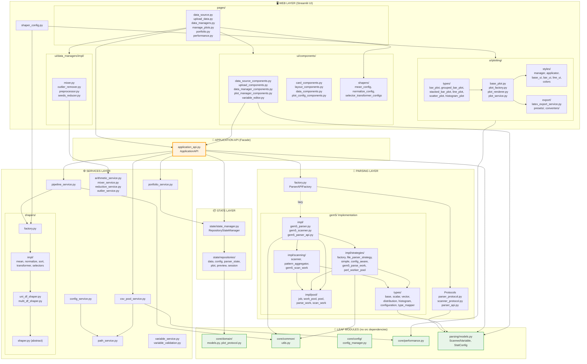

# RING-5 Full Project Architecture

This document provides a comprehensive view of the RING-5 codebase architecture, including all modules, their dependencies, and the layered structure.

## Architecture Overview

## Layer Descriptions

### 🌱 LEAF MODULES
Foundational modules with **zero** internal dependencies. These form the stable base of the architecture:
- **domain/**: Core type definitions (PortfolioData, PlotProtocol)
- **common/utils.py**: Shared utilities (path normalization, JSON validation)
- **config/**: Configuration schema validation
- **performance.py**: Caching, profiling decorators
- **parsing/models.py**: Data models (ScannedVariable, StatConfig)

### 📦 STATE LAYER
Application state management using the Repository pattern:
- **repositories/**: Individual state stores (data, config, parser, plot, preview, session)
- **state_manager.py**: Facade composing all repositories

### 🔬 PARSING LAYER
gem5 simulator output parsing with Strategy pattern:
- **Protocols**: Simulator-agnostic interfaces (ParserProtocol, ScannerProtocol)
- **Factory**: Creates parser instances by simulator type
- **gem5/**: Complete gem5 implementation
  - **types/**: Stat type handlers (scalar, vector, distribution, histogram)
  - **impl/pool/**: Work pool for parallel execution
  - **impl/scanning/**: Variable discovery and pattern aggregation
  - **impl/strategies/**: Parsing strategies (simple, config-aware)

### ⚙️ SERVICES LAYER
Business logic services:
- **path_service.py**: Centralized file system navigation
- **csv_pool_service.py**: CSV file discovery and caching
- **pipeline_service.py**: Shaper pipeline composition
- **portfolio_service.py**: Analysis state persistence
- **shapers/**: Data transformation strategies (mean, normalize, sort, select)
- **Compute services**: arithmetic, mixer, reduction, outlier

### 🎯 APPLICATION API (Facade)
Single entry point for all backend operations:
- Orchestrates parsing, CSV loading, pipelines, portfolios
- All web layer components import through this facade

### 🖥️ WEB LAYER (Streamlit UI)
Presentation layer:
- **pages/**: Page-level components (data source, upload, plots, portfolio)
- **ui/components/**: Reusable UI widgets
- **ui/data_managers/**: Data preprocessing UIs (mixer, outlier, reducer)
- **ui/plotting/**: Plot creation, rendering, styles, LaTeX export
- **ui/shaper_config.py**: Shaper pipeline UI

## Key Design Principles

1. **Layered Architecture**: Strict dependency direction (leaf → core → web)
2. **Facade Pattern**: ApplicationAPI as clean boundary between core and web
3. **Repository Pattern**: State management with specialized repositories
4. **Strategy Pattern**: Pluggable parsing strategies and shapers
5. **Factory Pattern**: Dynamic creation of parsers, shapers, plots
6. **Protocol-Based Interfaces**: Type-safe contracts between layers

## Dependency Rules

| From Layer | Can Import From |
|------------|-----------------|
| Leaf Modules | *(nothing)* |
| State | domain |
| Parsing | models, common |
| Services | common, performance, domain, state, shapers |
| ApplicationAPI | parsing, services, state |
| Web | ApplicationAPI, services (compute), performance |

**Important**: The only `core→web` dependency is a `TYPE_CHECKING`-only import in `session_repository.py` for `BasePlot` type hints.
