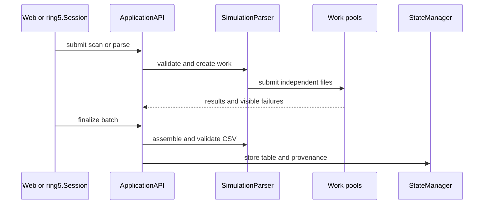
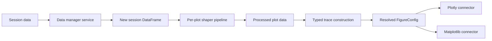

# Data flow

## Parse and load

<!--
`uman~ring5.ingestion.parse-output-provenance.documentation~1`

Covers:
- req~ring5.ingestion.parse-output-provenance~1

`uman~ring5.quality.async-ownership.documentation~1`

Covers:
- req~ring5.quality.async-ownership~1

-->

Scan and parse work follows submit/finalize contracts. Submission returns owned futures; finalization
aggregates results and preserves per-file failures. Do not hide asynchronous work inside a component
or fabricate a placeholder value after a parser error.

`Session.load` and the CSV pool converge on `ApplicationAPI.load_data`, which stores a DataFrame in
the session repository. The generic CSV contract requires a header and rows; individual services
validate operation-specific columns and types.

The review-before-load path first creates an immutable `ImportPreview` in the core service. Format
detection, corrections, inference, and row classification do not touch session state. Loading
re-reads the bounded source, verifies its SHA-256 fingerprint and the complete preview result, then
stores only accepted rows through `ApplicationAPI.load_import_preview`.

## Transform and plot

Manager services and shapers copy their inputs. A confirmed manager result replaces the workspace
table; a shaper result belongs to its plot. The render controller pairs processed data, persisted
configuration, rendering engine, and a cache key before reusing a figure.

## Save and restore

Portfolio saving serializes the active table, plots, plot configuration, pipelines, parser
provenance, and history. `PortfolioMigrator` upgrades older JSON before
`StateManager.restore_session` restores compatible items and returns a `RestoreReport`.

Headless replay loads the same portfolio, renders each restored plot through the selected connector,
and exports it. A partial restore remains visible; the CLI refuses to upgrade a portfolio when
re-saving would discard skipped content.
