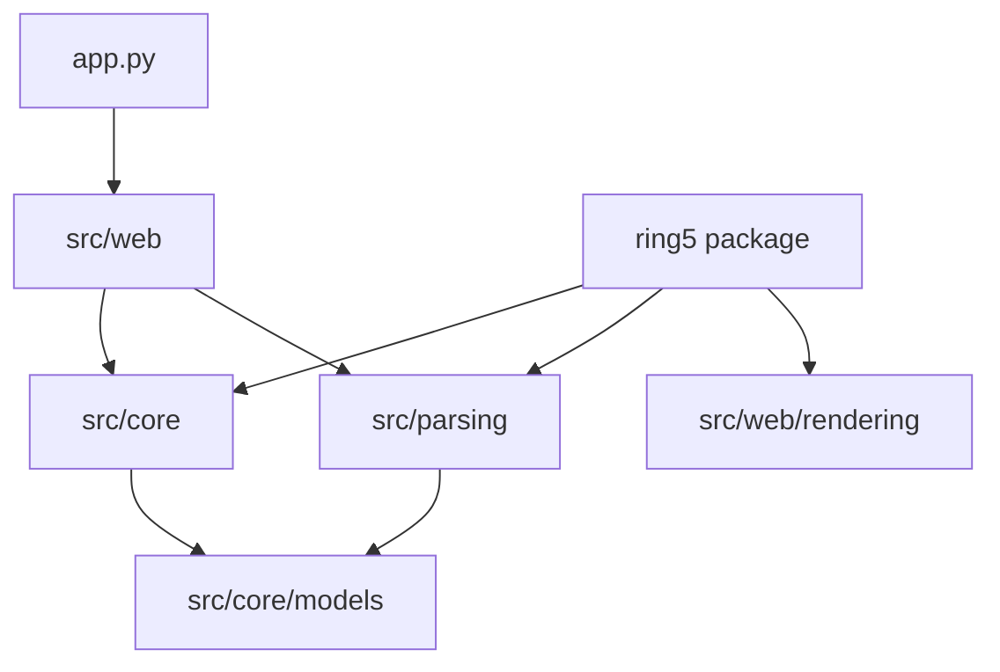

# Architecture overview

RING-5 has two composition roots and a one-way dependency structure. `app.py` builds a Streamlit
workspace; `ring5/` builds the supported headless workflow. Both compose parsing, core services, and
rendering without moving UI dependencies into the domain.

## Ownership

| Area | Owns | Does not own |
| --- | --- | --- |
| `src/parsing/` | Simulator discovery, variable scanning, parser strategies, CSV assembly | Streamlit state or plot rendering |
| `src/core/models/` | Cross-boundary dataclasses, typed mappings, protocols, visualization configuration | Service orchestration or UI widgets |
| `src/core/services/` | Data operations, shaper execution, persistent application data, portfolio migration | Streamlit rendering |
| `src/core/state/` | Repository-backed workspace state | UI-only widget state |
| `src/web/components/` | Streamlit widgets and visual output | Domain decisions |
| `src/web/controllers/` | UI orchestration across components and protocols | Persistent domain state implementations |
| `src/web/rendering/` | Plotly and Matplotlib connectors, figure configuration resolution, export bytes | Core business rules |
| `ring5/` | Stable Python facade, typed errors, CLI, headless composition | A promise that `src.*` is public API |

`src/core/application_api.py` is the facade used by the web application. It exposes services and
state operations without allowing components to construct repositories directly.

## Visualization boundary

Plot implementations under `src/web/pages/ui/plotting/` map processed data into typed,
engine-independent traces. Rendering connectors translate those traces and the resolved figure
configuration into Plotly or Matplotlib figures. The public API uses the same builder and exporters,
so a headless Matplotlib render follows the application path below the Streamlit component.

## State boundary

`RepositoryStateManager` delegates to repositories for session data, parser configuration,
previews, plots, visualization state, and history. Web-only transient state remains behind
`UIStateManager`. Core and parsing code never access `st.session_state`.

## Extension boundary

Registries select simulator backends, parsing strategies, plots, and shapers. Serialized plot and
shaper identifiers are compatibility contracts for portfolios and pipelines. Add migration support
before renaming one.

Continue with [Data Flow]({{site.baseurl}}/developer-guide/architecture/data-flow/) and
[Layer Boundaries]({{site.baseurl}}/developer-guide/architecture/layer-boundaries/).
