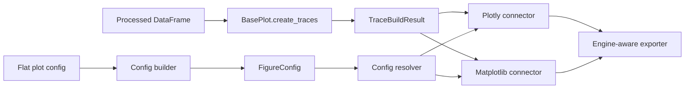

# Visualization subsystem

Visualization separates data mapping, styling, and backend translation.

## Engine-independent traces

<!--
`uman~ring5.render.engine-independent-traces.documentation~1`

Covers:
- req~ring5.render.engine-independent-traces~1

-->

Every registered plot type produces a typed `TraceBuildResult` before backend rendering. It carries
bar, line, scatter, histogram, or heatmap traces plus backend-neutral separators, shaded regions,
rules, annotations, tick positions, and secondary-axis metadata.

Plot types live under `src/web/pages/ui/plotting/types/` because their configuration UI and current
composition are web-owned. They emit models from `src/core/models/visualization/` and do not create
backend marks directly.

`src/web/rendering/config_builder.py` maps persisted flat configuration into `FigureConfig`.
`src/core/services/visualization/config_resolver.py` replaces inheritance sentinels on a copy before
a connector runs. Plotly and Matplotlib connectors apply the same ordered styling contract; trace
renderers handle mark-specific translation.

Export bytes are produced by `src/web/rendering/figure_export.py` and shared by the download UI and
the `ring5` facade. The UI owns Matplotlib figure lifecycle and session caches; connectors remain
stateless and do not close caller-owned figures.

When adding a visual setting, update its model round trip, builder, UI, both connectors, and public
`FigureSpec` when it belongs to the supported scripting surface. See
[Add a Renderer]({{site.baseurl}}/developer-guide/extension-guides/adding-a-renderer/).
