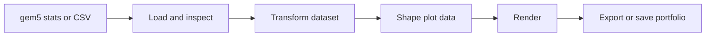

# RING-5 documentation

<!--
`uman~ring5.workspace.documentation-hub.documentation~2`

Covers:
- req~ring5.workspace.documentation-hub~2
-->

RING-5 turns gem5 statistics and CSV datasets into figures through a web application, Python API,
or CLI.

## Choose a guide

| Guide | Use it to |
| --- | --- |
| [User Guide](user-guide/) | Install RING-5, load results, transform data, create figures, save portfolios, automate analyses, and troubleshoot common failures. |
| [Developer Guide](developer-guide/) | Understand the architecture, prepare a contribution, work on a subsystem, or add an extension. |

New users can follow [Installation](user-guide/getting-started/installation/) and then
[First Analysis](user-guide/getting-started/first-analysis/). For a common research workflow, see
[Compare Configurations](user-guide/guides/compare-configurations/).

Contributors should begin with the [Architecture](developer-guide/architecture/) and
[Development Setup](developer-guide/development/setup/).

## Analysis flow

Source code and issue tracking are on
[GitHub](https://github.com/nikiitin/RING-5). RING-5 is licensed under GPL-3.0-or-later.
