# RING-5 Parsing Module — Complete Architecture

Comprehensive architecture documentation for `src/core/parsing/`, covering every class, dependency, protocol relationship, singleton, and the complete scanning/parsing data flows.

---

## Module Structure Diagram

```mermaid
flowchart TB
    subgraph INTERFACE["📐 INTERFACE LAYER — src/core/parsing/"]
        direction TB

        subgraph PROTOCOLS["Protocols"]
            direction LR
            ParserProto["🔷 ParserProtocol\n─────────────────\n+ submit_parse_async() → List‹Future›\n+ finalize_parsing() → Optional‹str›\n+ construct_final_csv() → Optional‹str›"]
            ScannerProto["🔷 ScannerProtocol\n─────────────────\n+ submit_scan_async() → List‹Future›\n+ aggregate_scan_results() → List‹ScannedVariable›"]
            ParserAPI_P["🔷 ParserAPI\n─────────────────\nCombines Parser + Scanner\n(instance method signatures)"]
        end

        models_box["📦 models.py\n─────────────────\n❄ ScannedVariable (frozen)\n  name, type, entries,\n  minimum, maximum,\n  pattern_indices\n─────────────────\n❄ StatConfig (frozen)\n  name, type, repeat,\n  params, statistics_only"]

        factory_box["🏭 ParserAPIFactory\n─────────────────\n+ create(simulator='gem5')\n  → ParserAPI"]

        ParserAPI_P --> ParserProto
        ParserAPI_P --> ScannerProto
        factory_box -.->|lazy import| Gem5ParserAPI_box
    end

    subgraph GEM5["🔬 gem5/ IMPLEMENTATION"]
        direction TB

        subgraph FACADE["Facade — gem5/impl/"]
            Gem5ParserAPI_box["🎯 Gem5ParserAPI\nimplements ParserAPI\n─────────────────\nDelegates to:\n→ Gem5Parser (static)\n→ Gem5Scanner (static)"]

            Gem5Parser_box["⚙️ Gem5Parser\nimplements ParserProtocol\n─────────────────\n+ submit_parse_async()\n  1. Regex expansion\n  2. Strategy resolution\n  3. Work item creation\n  4. Pool submission\n+ finalize_parsing()\n+ construct_final_csv()"]

            Gem5Scanner_box["🔍 Gem5Scanner\nimplements ScannerProtocol\n─────────────────\n+ submit_scan_async()\n  1. Path discovery\n  2. ScanWork creation\n  3. Pool submission\n+ aggregate_scan_results()\n  1. Merge across files\n  2. Pattern aggregation"]

            Gem5ParserAPI_box --> Gem5Parser_box
            Gem5ParserAPI_box --> Gem5Scanner_box
        end

        subgraph TYPES["📋 gem5/types/ — Stat Type System"]
            direction TB
            Registry["🏛️ StatTypeRegistry\n─────────────────\n+ register(type_name) → decorator\n+ create(type_name) → StatType\n+ get_types() → List‹str›"]

            StatTypeBase["🔶 StatType (base)\n─────────────────\n+ content (property)\n+ reduced_content (property)\n+ balance_content()\n+ reduce_duplicates()\n+ entries (property)"]

            subgraph TYPE_IMPL["Registered Types"]
                direction LR
                Scalar["Scalar\n@register('scalar')"]
                Vector["Vector\n@register('vector')\nentries: List‹str›"]
                Distrib["Distribution\n@register('distribution')\nmin, max, statistics"]
                Histo["Histogram\n@register('histogram')\nbins, rebinning"]
                Config["Configuration\n@register('configuration')\nonEmpty default"]
            end

            TypeMapperBox["🔄 TypeMapper\n─────────────────\n+ normalize_type()\n+ map_scan_result()\n+ is_entry_type()\n+ create_stat(config) → StatType"]

            Registry --> StatTypeBase
            Scalar --> StatTypeBase
            Vector --> StatTypeBase
            Distrib --> StatTypeBase
            Histo --> StatTypeBase
            Config --> StatTypeBase
            TypeMapperBox --> Registry
        end

        subgraph POOL["🏊 gem5/impl/pool/ — Work Pool"]
            direction TB
            JobABC["🔶 Job (ABC)\n+ __call__() → Any"]

            WorkPoolBox["♻️ WorkPool «singleton»\n─────────────────\nProcessPoolExecutor\nThreadPoolExecutor\n+ submit(task) → Future"]

            ParseWorkABC["📄 ParseWork(Job)\n+ __call__() → ParsedVarsDict"]
            ScanWorkABC["📄 ScanWork(Job)\n+ __call__() → Any"]

            ParseWP["♻️ ParseWorkPool «singleton»\n+ submit_batch_async(works)\n  → List‹Future›"]
            ScanWP["♻️ ScanWorkPool «singleton»\n+ submit_batch_async(works)\n  → List‹Future›"]

            ParseWorkABC --> JobABC
            ScanWorkABC --> JobABC
            ParseWP --> WorkPoolBox
            ScanWP --> WorkPoolBox
            ParseWP -.->|submits| ParseWorkABC
            ScanWP -.->|submits| ScanWorkABC
        end

        subgraph SCANNING["🔎 gem5/impl/scanning/ — Variable Discovery"]
            direction TB
            ScannerSingleton["♻️ Gem5StatsScanner «singleton»\n─────────────────\n+ scan_file(path)\n  → List‹ScannedVariable›\n\nCalls: perl statsScanner.pl\nParses: JSON output\nMaps: TypeMapper.map_scan_result()"]

            PatternAgg["🧩 PatternAggregator\n─────────────────\n+ aggregate_patterns(vars)\n  → List‹ScannedVariable›\n\ncpu0,cpu1..cpu15 →\n  cpu\\d+ [vector]"]

            Gem5ScanWorkBox["📦 Gem5ScanWork(ScanWork)\n─────────────────\n+ __call__()\n  → scanner.scan_file(path)"]

            Gem5ScanWorkBox --> ScannerSingleton
            Gem5ScanWorkBox --> ScanWorkABC
        end

        subgraph STRATEGIES["⚔️ gem5/impl/strategies/ — Parse Strategies"]
            direction TB
            StratFactoryBox["🏭 StrategyFactory\n+ create(type) → Strategy"]

            FileParserProto["🔷 FileParserStrategy «Protocol»\n─────────────────\n+ execute(path, pattern, vars)\n+ get_work_items() → Seq‹ParseWork›\n+ post_process(results)"]

            SimpleBox["📗 SimpleStatsStrategy\n─────────────────\n+ execute()\n+ get_work_items()\n  1. _get_files() → glob\n  2. _map_variables() → TypeMapper\n  3. Gem5ParseWork per file"]

            ConfigAwareBox["📘 ConfigAwareStrategy\nextends Simple\n─────────────────\n+ post_process()\n  → augments with config.ini"]

            Gem5ParseWorkBox["📦 Gem5ParseWork(ParseWork)\n─────────────────\n+ __call__() → ParsedVarsDict\n  1. _runPerlScript()\n     → PerlWorkerPool\n  2. _processOutput()\n     → line-by-line parsing\n     → StatType.content = value"]

            PerlPoolBox["🐪 PerlWorkerPool «singleton»\n─────────────────\nPersistent Perl processes\nfileParserServer.pl\n+ parse_file(path, vars)\n  → List‹str› output lines"]

            StratFactoryBox -.->|lazy| SimpleBox
            StratFactoryBox -.->|lazy| ConfigAwareBox
            ConfigAwareBox --> SimpleBox
            SimpleBox -.->|creates| Gem5ParseWorkBox
            Gem5ParseWorkBox --> PerlPoolBox
            Gem5ParseWorkBox --> ParseWorkABC
        end

        %% Facade → submodule connections
        Gem5Parser_box --> StratFactoryBox
        Gem5Parser_box --> ParseWP
        Gem5Scanner_box --> PatternAgg
        Gem5Scanner_box --> Gem5ScanWorkBox
        Gem5Scanner_box --> ScanWP

        %% Type system connections
        ScannerSingleton --> TypeMapperBox
        SimpleBox --> TypeMapperBox
        Gem5ParseWorkBox --> TypeMapperBox
    end

    %% Models connections
    models_box -.->|used by| ParserProto
    models_box -.->|used by| ScannerProto
    models_box -.->|used by| Gem5Parser_box
    models_box -.->|used by| Gem5Scanner_box
    models_box -.->|used by| ScannerSingleton
    models_box -.->|used by| PatternAgg
    models_box -.->|used by| TypeMapperBox

    %% External
    PerlScripts["🐪 Perl Scripts\n─────────────────\nstatsScanner.pl\nfileParserServer.pl\nlibs/Scanning/Type/*"]
    CommonUtils["📦 core/common/utils\n─────────────────\nnormalize_user_path()\nsanitize_log_value()\ncheckFileExistsOrException()"]

    ScannerSingleton -->|subprocess| PerlScripts
    PerlPoolBox -->|persistent process| PerlScripts
    Gem5Parser_box --> CommonUtils
    Gem5Scanner_box --> CommonUtils
    SimpleBox --> CommonUtils

    classDef protocol fill:#e3f2fd,stroke:#1565c0,stroke-width:2px,color:#0d47a1
    classDef singleton fill:#fff8e1,stroke:#f9a825,stroke-width:2px
    classDef abc fill:#fce4ec,stroke:#c62828,stroke-width:2px
    classDef impl fill:#e8f5e9,stroke:#2e7d32,stroke-width:2px
    classDef data fill:#f3e5f5,stroke:#6a1b9a,stroke-width:2px
    classDef facade fill:#fff3e0,stroke:#e65100,stroke-width:3px
    classDef external fill:#eceff1,stroke:#546e6a,stroke-width:1px,stroke-dasharray: 5 5

    class ParserProto,ScannerProto,ParserAPI_P,FileParserProto protocol
    class WorkPoolBox,ScannerSingleton,ParseWP,ScanWP,PerlPoolBox singleton
    class JobABC,ParseWorkABC,ScanWorkABC,StatTypeBase abc
    class SimpleBox,ConfigAwareBox,Gem5ParseWorkBox,Gem5ScanWorkBox,Scalar,Vector,Distrib,Histo,Config impl
    class models_box,Registry data
    class Gem5ParserAPI_box,factory_box facade
    class PerlScripts,CommonUtils external
```

---

## Scanning Data Flow

---

## Parsing Data Flow

```mermaid
sequenceDiagram
    autonumber
    participant Caller as Caller<br>(ApplicationAPI)
    participant API as Gem5ParserAPI
    participant Parser as Gem5Parser
    participant SF as StrategyFactory
    participant Strat as SimpleStatsStrategy
    participant TM as TypeMapper
    participant Pool as ParseWorkPool
    participant Work as Gem5ParseWork
    participant PP as PerlWorkerPool<br>(Singleton)
    participant Perl as fileParserServer.pl
    participant CSV as construct_final_csv

    Note over Caller, CSV: ━━━ PARSING FLOW ━━━

    Caller->>API: submit_parse_async(path, pattern, vars, out_dir, scanned_vars)
    API->>Parser: submit_parse_async()

    Note over Parser: Step 1: Regex Expansion
    Parser->>Parser: For each var with regex chars:<br>Match against scanned_vars<br>Expand pattern_indices → leaf vars<br>Inject parsed_ids into params

    Note over Parser: Step 2: Strategy Resolution
    Parser->>SF: create(strategy_type)
    SF-->>Parser: SimpleStatsStrategy | ConfigAwareStrategy

    Note over Strat: Step 3: Work Item Generation
    Parser->>Strat: get_work_items(path, pattern, configs)
    Strat->>Strat: _get_files() → glob → List[str]
    Strat->>TM: create_stat(config) for each var
    TM->>TM: StatTypeRegistry.create(type, **kwargs)
    TM-->>Strat: Dict[str, StatType]
    Strat-->>Parser: List[Gem5ParseWork]

    Note over Pool,Work: Step 4: Parallel Submission
    Parser->>Pool: submit_batch_async(work_items)
    Pool-->>Caller: List[Future[ParsedVarsDict]]

    par Worker Process 1
        Work->>PP: get_worker_pool()
        Work->>PP: parse_file(path, var_keys)
        PP->>Perl: stdin: PARSE|path|var1,var2,...
        Perl-->>PP: stdout: Type/VarID/Value lines
        PP-->>Work: List[str] output
        Work->>Work: _processOutput()
        Note over Work: Line format: Type/VarID/Value<br>Entry types → buffer<br>Scalar → content = value<br>Summary → aggregate
        Work->>Work: _applyBufferedEntries()
        Work->>Work: _validateVars()
        Work-->>Pool: ParsedVarsDict
    and Worker Process N
        Work->>PP: parse_file(...)
        PP->>Perl: stdin: PARSE|...|...
        Perl-->>PP: output lines
        Work-->>Pool: ParsedVarsDict
    end

    Caller->>Caller: results = [f.result() for f in futures]

    Note over Caller,CSV: Step 5: Finalization
    Caller->>API: finalize_parsing(out_dir, results, strategy)
    API->>Parser: finalize_parsing()
    Parser->>Strat: post_process(results)
    Note over Strat: ConfigAware: augment with config.ini<br>Simple: passthrough

    Parser->>CSV: construct_final_csv(out_dir, results)
    Note over CSV: For each var in results:<br>  balance_content() → pad to repeat<br>  reduce_duplicates() → arithmetic mean<br>  reduced_content → CSV values<br><br>Entry types → var..entry1, var..entry2<br>Scalar types → var
    CSV-->>Caller: path/to/results.csv
```

---

## class hierarchy

```mermaid
classDiagram
    direction TB

    class ParserProtocol {
        <<Protocol>>
        +submit_parse_async()$ List~Future~
        +finalize_parsing()$ Optional~str~
        +construct_final_csv()$ Optional~str~
    }

    class ScannerProtocol {
        <<Protocol>>
        +submit_scan_async()$ List~Future~
        +aggregate_scan_results()$ List~ScannedVariable~
    }

    class ParserAPI {
        <<Protocol>>
        +submit_parse_async() List~Future~
        +finalize_parsing() Optional~str~
        +submit_scan_async() List~Future~
        +aggregate_scan_results() List~ScannedVariable~
    }

    class Gem5ParserAPI {
        +submit_parse_async()
        +finalize_parsing()
        +submit_scan_async()
        +aggregate_scan_results()
    }

    class Gem5Parser {
        +submit_parse_async()$
        +finalize_parsing()$
        +construct_final_csv()$
    }

    class Gem5Scanner {
        +submit_scan_async()$
        +aggregate_scan_results()$
        -_merge_variable()$
    }

    ParserAPI --|> ParserProtocol
    ParserAPI --|> ScannerProtocol
    Gem5ParserAPI ..|> ParserAPI : implements
    Gem5Parser ..|> ParserProtocol : implements
    Gem5Scanner ..|> ScannerProtocol : implements
    Gem5ParserAPI --> Gem5Parser : delegates
    Gem5ParserAPI --> Gem5Scanner : delegates

    class Job {
        <<ABC>>
        +__call__()* Any
    }

    class ParseWork {
        +__call__() ParsedVarsDict
    }

    class ScanWork {
        +__call__() Any
    }

    class Gem5ParseWork {
        -fileToParse: str
        -varsToParse: Dict
        +__call__() ParsedVarsDict
        -_runPerlScript() str
        -_processOutput()
    }

    class Gem5ScanWork {
        -file_path: str
        +__call__() List~ScannedVariable~
    }

    ParseWork --|> Job
    ScanWork --|> Job
    Gem5ParseWork --|> ParseWork
    Gem5ScanWork --|> ScanWork

    class FileParserStrategy {
        <<Protocol>>
        +execute()
        +get_work_items() Sequence~ParseWork~
        +post_process()
    }

    class SimpleStatsStrategy {
        +execute()
        +get_work_items()
        +post_process()
        -_get_files()
        -_map_variables()
    }

    class ConfigAwareStrategy {
        +post_process()
        -_parse_config()
    }

    SimpleStatsStrategy ..|> FileParserStrategy : implements
    ConfigAwareStrategy --|> SimpleStatsStrategy

    class StatType {
        <<base>>
        #_content: Any
        #_repeat: int
        +content
        +reduced_content
        +balance_content()
        +reduce_duplicates()
        +entries
    }

    class Scalar
    class Vector {
        +_entries: List~str~
    }
    class Distribution {
        +minimum: float
        +maximum: float
        +statistics: bool
    }
    class Histogram {
        +bins: int
        +_entries: List~str~
    }
    class Configuration {
        +onEmpty: str
    }

    Scalar --|> StatType
    Vector --|> StatType
    Distribution --|> StatType
    Histogram --|> StatType
    Configuration --|> StatType
```

---

## Design Pattern Inventory

### Protocols (Structural Typing)

| Protocol | File | Implementors |
|----------|------|-------------|
| `ParserProtocol` | `parser_protocol.py` | `Gem5Parser` (static methods) |
| `ScannerProtocol` | `scanner_protocol.py` | `Gem5Scanner` (static methods) |
| `ParserAPI` | `parser_api.py` | `Gem5ParserAPI` (instance methods) |
| `FileParserStrategy` | `strategies/file_parser_strategy.py` | `SimpleStatsStrategy`, `ConfigAwareStrategy` |

### Singletons

| Singleton | Pattern | File |
|-----------|---------|------|
| `WorkPool` | `__new__` override | `pool/work_pool.py` |
| `ScanWorkPool` | `_singleton` classvar | `pool/pool.py` |
| `ParseWorkPool` | `_instance` classvar | `pool/pool.py` |
| `Gem5StatsScanner` | `_instance` classvar | `scanning/scanner.py` |
| `PerlWorkerPool` | Module-level `_worker_pool_instance` | `strategies/perl_worker_pool.py` |

### Factories

| Factory | Method | Products |
|---------|--------|----------|
| `ParserAPIFactory` | `create(simulator)` | `Gem5ParserAPI` |
| `StrategyFactory` | `create(strategy_type)` | `SimpleStatsStrategy`, `ConfigAwareStrategy` |
| `StatTypeRegistry` | `create(type_name)` | `Scalar`, `Vector`, `Distribution`, `Histogram`, `Configuration` |

### Other Patterns

| Pattern | Where | Description |
|---------|-------|-------------|
| **Strategy** | `FileParserStrategy` → Simple/ConfigAware | Pluggable parsing strategies |
| **Command** | `Job` → `ParseWork`/`ScanWork` | Encapsulated work units |
| **Facade** | `Gem5ParserAPI` | Combines parser + scanner behind unified API |
| **Registry** | `StatTypeRegistry._types` | Type name → class registration |
| **Template Method** | `StatType.content` setter | Calls `_validate_content` + `_set_content` hooks |

---

## Complete Dependency Matrix

| File | Depends On |
|------|-----------|
| `models.py` | *(none — leaf)* |
| `parser_protocol.py` | `models` |
| `scanner_protocol.py` | `models` |
| `parser_api.py` | `models` |
| `factory.py` | `parser_api`, `gem5_parser_api` (lazy) |
| `__init__.py` | `gem5_parser`, `gem5_scanner` |
| `gem5/types/base.py` | *(none — leaf)* |
| `gem5/types/scalar.py` | `types/base` |
| `gem5/types/vector.py` | `types/base` |
| `gem5/types/distribution.py` | `types/base` |
| `gem5/types/histogram.py` | `types/base` |
| `gem5/types/configuration.py` | `types/base` |
| `gem5/types/type_mapper.py` | `models`, `types/__init__` |
| `gem5/impl/pool/job.py` | *(none — leaf)* |
| `gem5/impl/pool/work_pool.py` | `pool/job` |
| `gem5/impl/pool/parse_work.py` | `pool/job` |
| `gem5/impl/pool/scan_work.py` | `pool/job` |
| `gem5/impl/pool/pool.py` | `pool/work_pool`, `pool/parse_work`, `pool/scan_work` |
| `gem5/impl/scanning/scanner.py` | `models`, `types/type_mapper` |
| `gem5/impl/scanning/pattern_aggregator.py` | `models` |
| `gem5/impl/scanning/gem5_scan_work.py` | `models`, `scanning/scanner`, `pool/scan_work` |
| `gem5/impl/strategies/file_parser_strategy.py` | `models`, `pool/parse_work` |
| `gem5/impl/strategies/factory.py` | `strategies/file_parser_strategy`, `strategies/simple` (lazy), `strategies/config_aware` (lazy) |
| `gem5/impl/strategies/perl_worker_pool.py` | *(none — leaf, uses subprocess)* |
| `gem5/impl/strategies/gem5_parse_work.py` | `common/utils`, `types/type_mapper`, `pool/parse_work`, `strategies/perl_worker_pool` |
| `gem5/impl/strategies/simple.py` | `common/utils`, `models`, `types/type_mapper`, `pool/pool`, `strategies/gem5_parse_work` |
| `gem5/impl/strategies/config_aware.py` | `strategies/simple` |
| `gem5/impl/gem5_parser.py` | `common/utils`, `models`, `strategies/factory`, `pool/pool` |
| `gem5/impl/gem5_scanner.py` | `common/utils`, `models`, `scanning/pattern_aggregator`, `scanning/gem5_scan_work`, `pool/pool` |
| `gem5/impl/gem5_parser_api.py` | `gem5_parser`, `gem5_scanner`, `models` |

### External Dependencies (outside parsing/)

| External Module | Used By | Purpose |
|-----------------|---------|---------|
| `core/common/utils.normalize_user_path` | `Gem5Parser`, `Gem5Scanner`, `SimpleStatsStrategy` | Path resolution |
| `core/common/utils.sanitize_log_value` | `SimpleStatsStrategy` | Safe logging |
| `core/common/utils.checkFileExistsOrException` | `Gem5ParseWork` | File guard |
| `gem5/perl/statsScanner.pl` | `Gem5StatsScanner` | Variable discovery |
| `gem5/perl/fileParserServer.pl` | `PerlWorkerPool` | Persistent parse server |
