# Services Module Architecture

This document describes the internal architecture of the `src/core/services/` module — the business logic layer of RING-5.

## Overview

The services module is organized into **three domain-aligned submodules**, each with a Protocol (API) and a default implementation. A top-level `ServicesAPI` facade provides unified access.

## Module Diagram

```mermaid
flowchart TB
    subgraph SERVICES["services/"]
        direction TB

        subgraph FACADE["Facade Layer"]
            direction LR
            api["ServicesAPI<br><i>(Protocol)</i>"]
            impl["DefaultServicesAPI<br><i>(Composition Root)</i>"]
            impl -.->|implements| api
        end

        subgraph MANAGERS["managers/"]
            direction TB
            mgr_api["ManagersAPI<br><i>(Protocol)</i>"]
            mgr_impl["DefaultManagersAPI"]
            mgr_impl -.->|implements| mgr_api

            subgraph MGR_SVC["Service Implementations"]
                direction LR
                arith["ArithmeticService<br>list_operators()<br>apply_operation()<br>apply_mixer()<br>validate_merge_inputs()"]
                outlier["OutlierService<br>remove_outliers()<br>validate_outlier_inputs()"]
                reduction["ReductionService<br>reduce_seeds()<br>validate_seeds_reducer_inputs()"]
            end

            mgr_impl --> arith
            mgr_impl --> outlier
            mgr_impl --> reduction
        end

        subgraph DATA_SVC["data_services/"]
            direction TB
            ds_api["DataServicesAPI<br><i>(Protocol)</i>"]
            ds_impl["DefaultDataServicesAPI"]
            ds_impl -.->|implements| ds_api

            subgraph DS_SVC["Service Implementations"]
                direction LR
                csv["CsvPoolService<br>load_csv_pool()<br>add_to_csv_pool()<br>delete_from_csv_pool()<br>load_csv_file()"]
                config["ConfigService<br>save_configuration()<br>load_configuration()<br>load_saved_configs()<br>delete_configuration()"]
                path["PathService<br>get_data_dir()<br>get_pipelines_dir()<br>get_portfolios_dir()"]
                variable["VariableService<br>generate_variable_id()<br>add/update/delete_variable()<br>filter_internal_stats()"]
                portfolio["PortfolioService<br>list/save/load/delete_portfolio()"]
            end

            ds_impl --> csv
            ds_impl --> config
            ds_impl --> path
            ds_impl --> variable
            ds_impl --> portfolio
        end

        subgraph SHAPERS["shapers/"]
            direction TB
            sh_api["ShapersAPI<br><i>(Protocol)</i>"]
            sh_impl["DefaultShapersAPI"]
            sh_impl -.->|implements| sh_api

            subgraph SH_CORE["Pipeline & Factory"]
                direction LR
                pipeline["PipelineService<br>list/save/load/delete_pipeline()<br>process_pipeline()"]
                factory["ShaperFactory<br>create_shaper()<br>get_available_types()"]
            end

            subgraph SH_BASE["Shaper Base Classes"]
                direction LR
                shaper["Shaper<br><i>(abstract)</i>"]
                uni["UniDfShaper"]
                uni -->|extends| shaper
            end

            subgraph SH_IMPL["impl/ (Shaper Strategies)"]
                direction LR
                mean["mean.py"]
                normalize["normalize.py"]
                sort["sort.py"]
                selector["selector.py"]
                transformer["transformer.py"]
            end

            sh_impl --> pipeline
            sh_impl --> factory
            pipeline --> factory
            factory --> SH_IMPL
            SH_IMPL --> SH_BASE
        end

        impl --> mgr_impl
        impl --> ds_impl
        impl --> sh_impl
    end

    %% Dependency injection
    impl -->|"injects pipelines_dir: Path"| sh_impl
    path -.->|"provides path at<br>composition root"| impl

    %% External dependencies
    state_mgr["state/StateManager"]
    models["core/models/"]
    common["core/common/utils"]
    perf["core/performance"]

    portfolio --> state_mgr
    csv --> path
    csv --> perf
    config --> path
    pipeline --> common
    ds_api --> models

    classDef protocol fill:#e8eaf6,stroke:#3f51b5,stroke-width:2px
    classDef impl fill:#e3f2fd,stroke:#2196f3,stroke-width:1px
    classDef facade fill:#fff3e0,stroke:#ff9800,stroke-width:3px
    classDef service fill:#e8f5e9,stroke:#4caf50,stroke-width:1px
    classDef external fill:#f3e5f5,stroke:#9c27b0,stroke-width:1px,stroke-dasharray: 5

    class api,mgr_api,ds_api,sh_api protocol
    class impl,mgr_impl,ds_impl,sh_impl facade
    class arith,outlier,reduction,csv,config,path,variable,portfolio,pipeline,factory service
    class state_mgr,models,common,perf external
```



## Dependency Injection

Cross-module dependencies are resolved at the **composition root** (`DefaultServicesAPI.__init__`):

```python
# services_impl.py — the only file that bridges submodules
class DefaultServicesAPI:
    def __init__(self, state_manager: StateManager) -> None:
        self._managers = DefaultManagersAPI()
        self._data_services = DefaultDataServicesAPI(state_manager)
        self._shapers = DefaultShapersAPI(PathService.get_pipelines_dir())  # injection
```

`PipelineService` receives `pipelines_dir: Path` as a constructor argument — it never imports `PathService` directly.

## Sub-API Method Summary

### ManagersAPI (8 methods)

| Category | Methods |
|----------|---------|
| Arithmetic | `list_operators()`, `apply_operation()` |
| Mixer | `apply_mixer()`, `validate_merge_inputs()` |
| Outlier | `remove_outliers()`, `validate_outlier_inputs()` |
| Reduction | `reduce_seeds()`, `validate_seeds_reducer_inputs()` |

### DataServicesAPI (~30 methods)

| Category | Methods |
|----------|---------|
| CSV Pool | `load_csv_pool()`, `add_to_csv_pool()`, `delete_from_csv_pool()`, `load_csv_file()` |
| Config | `save_configuration()`, `load_configuration()`, `load_saved_configs()`, `delete_configuration()` |
| Cache | `get_cache_stats()`, `clear_caches()` |
| Variables | `generate_variable_id()`, `add_variable()`, `update_variable()`, `delete_variable()`, `ensure_variable_ids()`, `filter_internal_stats()`, `find_variable_by_name()`, `aggregate_discovered_entries()`, `aggregate_distribution_range()`, `parse_comma_separated_entries()`, `format_entries_as_string()` |
| Portfolios | `list_portfolios()`, `save_portfolio()`, `load_portfolio()`, `delete_portfolio()` |

### ShapersAPI (7 methods)

| Category | Methods |
|----------|---------|
| Pipeline CRUD | `list_pipelines()`, `save_pipeline()`, `load_pipeline()`, `delete_pipeline()` |
| Execution | `process_pipeline()`, `create_shaper()`, `get_available_shaper_types()` |

## Design Principles

1. **Zero cross-module imports**: `managers/`, `data_services/`, and `shapers/` never import from each other
2. **Protocol-based contracts**: Each submodule defines a Protocol; consumers depend on abstractions
3. **Composition root**: `DefaultServicesAPI` is the only place where submodules are wired together
4. **Dependency injection**: Runtime values (e.g., `pipelines_dir`) are injected rather than imported
5. **Stateless managers**: Arithmetic, outlier, and reduction services are pure functions over DataFrames
