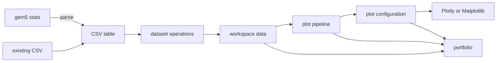

# Core concepts

RING-5 separates data preparation from per-figure shaping so one loaded dataset can support several
figures without hidden mutation.

## Data source

The gem5 parser scans a directory tree for files that match a pattern such as `stats.txt`. A
variable describes a statistic or configuration value to extract. Scanning discovers candidates;
parsing writes the selected values into a CSV table.

You may also load an existing CSV through `ring5.Session.load`. RING-5 requires a header and at
least one data row, but it does not require gem5-specific column names. Each later operation checks
the columns and data types it uses.

## Dataset operations

The **Data Managers** page changes the workspace dataset for downstream plots. Use it for operations
such as seed reduction, outlier removal, or derived values that should apply broadly.

These operations return new DataFrames in the Python API. They do not mutate caller-owned input.

## Plot and shaper pipeline

A plot stores a plot type, a configuration, processed data, and an ordered shaper pipeline. A
shaper transforms data for that plot only. For example, one plot can normalize IPC to a baseline
while another uses absolute IPC from the same workspace dataset.

Pipeline order matters: filtering before calculating a mean can produce a different result from
calculating the mean before filtering. Preview intermediate output and finalize the pipeline before
configuring the plot.

## Rendering and export

Plot types build engine-independent traces. Plotly renders an interactive figure; Matplotlib renders
a static figure. Their export formats and optional dependencies differ. Choose an engine before
checking the available downloads. See
[Rendering and Export]({{site.baseurl}}/user-guide/reference/rendering-export/).

## Portfolio

A portfolio is a named snapshot of workspace data, plot definitions, pipelines, and related parse
configuration. Loading a portfolio returns a restore report in the Python API because older or
partially incompatible content may be skipped. Treat the source statistics and analysis script as
the durable research inputs; use a portfolio to reproduce RING-5 workspace state.
