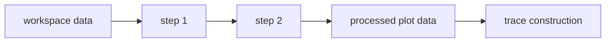

# Create and configure plots

Each plot owns its transformation pipeline and configuration. Changes to one plot do not rewrite
the workspace dataset or another plot's pipeline.

## Create a plot

<!--
`uman~ring5.plots.change-type.documentation~1`

Covers:
- req~ring5.plots.change-type~1

`uman~ring5.plots.create-multiple.documentation~1`

Covers:
- req~ring5.plots.create-multiple~1

`uman~ring5.plots.delete.documentation~1`

Covers:
- req~ring5.plots.delete~1

`uman~ring5.plots.duplicate.documentation~1`

Covers:
- req~ring5.plots.duplicate~1

`uman~ring5.plots.rename.documentation~1`

Covers:
- req~ring5.plots.rename~1

-->

1. Load data, then open **Manage Plots**.
2. Enter a **New plot name**, choose a registry identifier in **Plot type**, and select **Create
   Plot**.
3. Use the plot selector to switch among saved plots. Rename, duplicate, or delete the active plot
   with the controls beside it.

The **Plot Type** selector inside the active plot can convert it to another registered type. RING-5
keeps the plot identity, transformation pipeline, and processed table. Type-specific mappings and
figure settings reset, so configure the fields required by the new type after conversion.

Choose the plot type from the relationship you need to show, not from styling. See
[Plot Types]({{site.baseurl}}/user-guide/reference/plot-types/) for selection guidance. Python users can inspect the live
registry with `ring5.available_plot_types()`.

## Shape data for this plot

<!--
`uman~ring5.shaping.independent-pipelines.documentation~1`

Covers:
- req~ring5.shaping.independent-pipelines~1

`uman~ring5.shaping.pipeline-editor.documentation~1`

Covers:
- req~ring5.shaping.pipeline-editor~1

-->

The **Data Processing Pipeline** runs before trace construction:



Select a transformation under **Add transformation**, add it to the pipeline, and configure it.
Preview the result after each step. Reorder steps when their dependency changes—for example, select
the baseline rows before normalizing only if the normalizer still receives every required baseline.

Select **Finalize Pipeline for Plotting** after the preview matches the intended table. See
[Shapers]({{site.baseurl}}/user-guide/reference/shapers/) for configuration rules.

## Share a pipeline configuration

<!--
`uman~ring5.shaping.config-import-export.documentation~1`

Covers:
- req~ring5.shaping.config-import-export~1

-->

Open **Import or export pipeline** below the transformation selector. Give the configuration a
recognizable name and description, then select **Download pipeline configuration**. RING-5 checks
every step before producing a deterministic `.ring5-pipeline.json` file; an incomplete step remains
visible in the editor and blocks the download.

To reuse a file, upload it under **Pipeline configuration JSON**, choose what should happen when its
logical name already exists, and select **Import, save, and use**:

- **Stop and keep both unchanged** leaves the saved catalog and active plot untouched.
- **Save as a numbered copy** keeps the existing record and adds a name such as `Paper pipeline
  (2)`.
- **Replace the saved configuration** writes the validated import, then removes the older record
  with the same logical name.

The importer accepts current versioned files and migrates legacy unversioned saved-configuration
JSON. It rejects unknown future versions, unregistered or incomplete shapers, non-finite values,
unsupported fields, and files larger than 256 KiB before changing the active pipeline. A successful
import is also saved in the local configuration catalog and reports whether migration or conflict
handling occurred. It becomes the active editor pipeline; select **Finalize Pipeline for Plotting**
after reviewing its previews to update the plot data.

Python scripts use the same validation and conflict rules:

```python
import ring5

pipeline = [
    {"type": "columnSelector", "columns": ["benchmark", "ipc"]},
]

with ring5.Session() as session:
    payload = session.export_pipeline_configuration(
        "Paper pipeline",
        pipeline,
        description="Columns reviewed for the paper figures.",
    )
    result = session.import_pipeline_configuration(payload, conflict="rename")
    print(result.name, result.path)
```

## Map columns and configure the figure

<!--
`uman~ring5.figure.error-bars.documentation~1`

Covers:
- req~ring5.figure.error-bars~1

`uman~ring5.figure.plot-filtering.documentation~1`

Covers:
- req~ring5.figure.plot-filtering~1

-->

<!--
`uman~ring5.plots.refresh-cache.documentation~1`

Covers:
- req~ring5.plots.refresh-cache~1

-->

Under **Plot Configuration**, map the processed columns to the fields required by the plot type.
The UI prevents many invalid selections, but it cannot decide whether a column has the intended
scientific meaning.

Applicable plot types also expose X-category and group filters. These filters change the visible
plot selection without rewriting the finalized pipeline output or shared workspace table.

Plots with uncertainty support read companion `.sd` columns into their engine-independent trace
data. Plotly displays those trace error bars. The current Matplotlib trace renderer does not draw
them, so verify uncertainty output with Plotly.

Settings are grouped by purpose. Keep **Show advanced settings** off until the data mapping and
basic figure are correct. Then use the settings selector for layout, axes, legend, labels, colors,
and plot-specific controls. See
[Figure Settings]({{site.baseurl}}/user-guide/reference/settings/).

Automatic refresh controls whether widget changes immediately regenerate the figure. With it off,
select **Refresh Plot** after a change. An unrefreshed figure continues to use the last persisted
configuration.

## Select a rendering engine and export

Choose Plotly for interactive exploration and HTML output. Choose Matplotlib for static output and
PGF when XeLaTeX is installed. Both engines consume the same trace and figure configuration, but
backend capabilities and text metrics differ.

Always inspect the engine you will export. Use the download controls below that rendered figure;
see [Rendering and Export]({{site.baseurl}}/user-guide/reference/rendering-export/) for supported combinations.

## Create a plot in Python

```python
import ring5

with ring5.Session() as session:
    data = session.load("results.csv")
    spec = ring5.FigureSpec(
        x="benchmark",
        y_columns=["ipc"],
        title="Instructions per cycle",
        ylabel="IPC",
    )
    figure = session.plot(
        "bar", data=data, config=spec, engine="matplotlib"
    )
    session.export(figure, "figures/ipc.pdf", deterministic=True)
```

`FigureSpec` covers common figure settings. Its `extra` mapping carries supported flat renderer
configuration when a setting is not represented by a typed field. Treat those extra keys as a more
specialized interface and test them against both engines.
