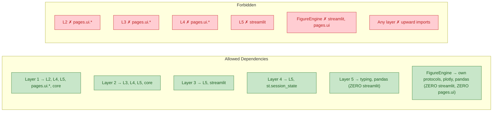
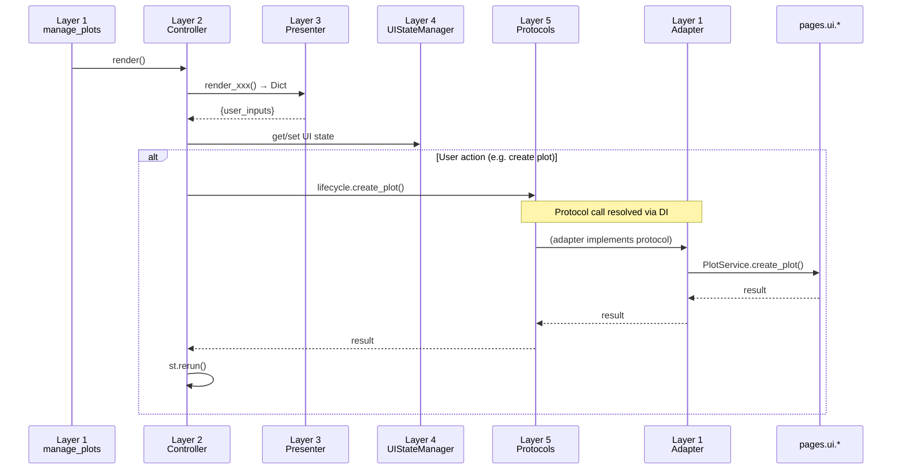

# Web Layer — 5-Layer Architecture

The web layer (`src/web/`) follows a strict **5-layer architecture** with
protocol-based dependency injection, ensuring testability, separation of
concerns, and clean boundaries between orchestration, rendering, state, and
data contracts.

## Layer Diagram

```mermaid
flowchart TB
    %% ── Colour palette ──────────────────────────────────────────────
    classDef page       fill:#e8f5e9,stroke:#388e3c,stroke-width:2px,color:#1b5e20
    classDef controller fill:#e3f2fd,stroke:#1565c0,stroke-width:2px,color:#0d47a1
    classDef presenter  fill:#fff3e0,stroke:#e65100,stroke-width:2px,color:#bf360c
    classDef state      fill:#f3e5f5,stroke:#7b1fa2,stroke-width:2px,color:#4a148c
    classDef model      fill:#fce4ec,stroke:#c62828,stroke-width:2px,color:#b71c1c
    classDef engine     fill:#e0f7fa,stroke:#00838f,stroke-width:2px,color:#006064
    classDef adapter    fill:#f1f8e9,stroke:#558b2f,stroke-width:2px,color:#33691e
    classDef oldcode    fill:#f5f5f5,stroke:#9e9e9e,stroke-width:1px,color:#616161,stroke-dasharray:5 5

    %% ─────────────────────────────────────────────────────────────────
    %% Layer 1 — Pages (thin wiring + DI composition)
    %% ─────────────────────────────────────────────────────────────────
    subgraph L1["Layer 1 — Pages"]
        direction LR
        page_v2["manage_plots.py<br/><i>Thin page – DI composition</i>"]
        adapters["plot_adapters.py<br/><i>4 adapters bridging old → protocols</i>"]
    end
    class page_v2 page
    class adapters adapter

    %% ─────────────────────────────────────────────────────────────────
    %% Layer 2 — Controllers (orchestration, flow control)
    %% ─────────────────────────────────────────────────────────────────
    subgraph L2["Layer 2 — Controllers"]
        direction LR
        creation_ctrl["PlotCreationController<br/><i>create / select / rename / delete /<br/>duplicate / save-load dialogs</i>"]
        pipeline_ctrl["PipelineController<br/><i>shaper pipeline editing</i>"]
        render_ctrl["PlotRenderController<br/><i>config → display</i>"]
    end
    class creation_ctrl controller
    class pipeline_ctrl controller
    class render_ctrl controller

    %% ─────────────────────────────────────────────────────────────────
    %% Layer 3 — Presenters (widget rendering, returns data dicts)
    %% ─────────────────────────────────────────────────────────────────
    subgraph L3["Layer 3 — Presenters"]
        direction LR
        sel_p["SelectorPresenter"]
        cre_p["CreationPresenter"]
        ctl_p["ControlsPresenter"]
        pip_p["PipelinePresenter"]
        pst_p["PipelineStepPresenter"]
        cht_p["ChartPresenter"]
        sav_p["SaveDialogPresenter"]
        lod_p["LoadDialogPresenter"]
        cfg_p["ConfigPresenter"]
    end
    class sel_p,cre_p,ctl_p,pip_p,pst_p,cht_p,sav_p,lod_p,cfg_p presenter

    %% ─────────────────────────────────────────────────────────────────
    %% Layer 4 — UI State Manager (transient session state)
    %% ─────────────────────────────────────────────────────────────────
    subgraph L4["Layer 4 — UIStateManager"]
        direction LR
        plot_state["_PlotUIState<br/><i>auto-refresh, dialogs,<br/>ordering, pending updates</i>"]
        mgr_state["_ManagerUIState<br/><i>load triggers, form values</i>"]
        nav_state["_NavUIState<br/><i>current page & tab</i>"]
        exp_state["_ExportUIState<br/><i>last export path</i>"]
    end
    class plot_state,mgr_state,nav_state,exp_state state

    %% ─────────────────────────────────────────────────────────────────
    %% Layer 5 — Models + Protocols (pure data, ZERO Streamlit)
    %% ─────────────────────────────────────────────────────────────────
    subgraph L5["Layer 5 — Models & Protocols"]
        direction LR
        typedicts["plot_models.py<br/><i>8 TypedDicts:<br/>PlotDisplayConfig, ShaperStep,<br/>TypographyConfig, MarginsConfig,<br/>SeriesStyleConfig, …</i>"]
        protocols["plot_protocols.py<br/><i>6 Protocols:<br/>PlotHandle, ConfigRenderer,<br/>PlotLifecycleService,<br/>PlotTypeRegistry, ChartDisplay,<br/>PipelineExecutor</i>"]
    end
    class typedicts,protocols model

    %% ─────────────────────────────────────────────────────────────────
    %% FigureEngine (pure domain, ZERO Streamlit)
    %% ─────────────────────────────────────────────────────────────────
    subgraph FE["FigureEngine"]
        direction LR
        fe_proto["protocols.py<br/><i>FigureCreator, FigureStyler</i>"]
        fe_engine["engine.py<br/><i>build(type, data, config) → Figure<br/>Protocol-based injection</i>"]
    end
    class fe_proto,fe_engine engine

    %% ─────────────────────────────────────────────────────────────────
    %% Old code (pages.ui.*) — accessed ONLY through Layer 1 adapters
    %% ─────────────────────────────────────────────────────────────────
    old_code["pages.ui.*<br/><i>PlotFactory, PlotService,<br/>PlotRenderer, BasePlot,<br/>StyleApplicator, configure_shaper,<br/>apply_shapers</i>"]
    class old_code oldcode

    %% ─────────────────────────────────────────────────────────────────
    %% Core Application API (domain backbone)
    %% ─────────────────────────────────────────────────────────────────
    core_api["src.core.ApplicationAPI<br/><i>Domain backbone – state,<br/>parsing, services</i>"]

    %% ═══════════════════════════════════════════════════════════════
    %% DEPENDENCY ARROWS
    %% ═══════════════════════════════════════════════════════════════

    %% Layer 1 → Layer 2 (wires controllers)
    page_v2 --> creation_ctrl
    page_v2 --> pipeline_ctrl
    page_v2 --> render_ctrl

    %% Layer 1 → Adapters → Old code
    page_v2 --> adapters
    adapters -.->|bridges| old_code

    %% Controllers → Presenters (Layer 2 → Layer 3)
    creation_ctrl --> sel_p
    creation_ctrl --> cre_p
    creation_ctrl --> ctl_p
    creation_ctrl --> sav_p
    creation_ctrl --> lod_p
    pipeline_ctrl --> pip_p
    pipeline_ctrl --> pst_p
    render_ctrl --> cht_p
    render_ctrl --> cfg_p

    %% Controllers → UIStateManager (Layer 2 → Layer 4)
    creation_ctrl --> plot_state
    pipeline_ctrl --> plot_state
    render_ctrl --> plot_state

    %% Controllers → Protocols (Layer 2 → Layer 5, via DI)
    creation_ctrl -.->|DI| protocols
    pipeline_ctrl -.->|DI| protocols
    render_ctrl -.->|DI| protocols

    %% Presenters → Models (Layer 3 → Layer 5)
    cfg_p -.-> protocols

    %% Controllers → Core API
    creation_ctrl --> core_api
    pipeline_ctrl --> core_api
    render_ctrl --> core_api

    %% FigureEngine → own protocols only
    fe_engine --> fe_proto
```



## Dependency Rules



## Layer Details

### Layer 1 — Pages (`src/web/pages/`)

**Role**: Thin composition root. Creates adapters, injects dependencies into
controllers, contains minimal wiring logic.

| File | Purpose |
|------|---------|
| `manage_plots.py` | Entry point. Creates 4 adapters, 3 controllers, calls their `render()` methods |
| `plot_adapters.py` | 4 adapter classes bridging old `pages.ui.*` code to Layer 5 protocols |

**Adapters**:

| Adapter | Protocol | Wraps |
|---------|----------|-------|
| `PlotLifecycleAdapter` | `PlotLifecycleService` | `PlotService` static methods |
| `PlotTypeRegistryAdapter` | `PlotTypeRegistry` | `PlotFactory.get_available_plot_types()` |
| `ChartDisplayAdapter` | `ChartDisplay` | `PlotRenderer.render_plot()` |
| `PipelineExecutorAdapter` | `PipelineExecutor` | `apply_shapers`, `configure_shaper` |

### Layer 2 — Controllers (`src/web/controllers/plot/`)

**Role**: Orchestration and flow control. Receives user actions from
presenters, delegates domain work to injected protocol services, triggers
`st.rerun()` for state transitions.

| Controller | Injected Protocols | Presenters Used |
|------------|-------------------|-----------------|
| `PlotCreationController` | `PlotLifecycleService`, `PlotTypeRegistry` | Selector, Creation, Controls, SaveDialog, LoadDialog |
| `PipelineController` | `PipelineExecutor` | Pipeline, PipelineStep |
| `PlotRenderController` | `PlotLifecycleService`, `PlotTypeRegistry`, `ChartDisplay` | Chart, Config |

**Allowed `st.*` calls** (flow control only):
`st.rerun()`, `st.warning()`, `st.success()`, `st.error()`

### Layer 3 — Presenters (`src/web/presenters/plot/`)

**Role**: Pure widget rendering. Each presenter renders Streamlit widgets and
returns a plain `Dict[str, Any]` with user inputs — no domain logic, no
side effects beyond widget display.

| Presenter | Widgets | Returns |
|-----------|---------|---------|
| `SelectorPresenter` | `st.radio` | Selected plot name |
| `CreationPresenter` | `st.text_input`, `st.selectbox`, `st.button` | Name, type, create flag |
| `ControlsPresenter` | `st.text_input`, `st.button` | Rename, delete, duplicate, save/load flags |
| `PipelinePresenter` | `st.selectbox`, `st.button`, `st.markdown` | Add shaper, reorder, delete flags |
| `PipelineStepPresenter` | `st.expander`, `st.dataframe` | Step config, move/delete flags, preview |
| `ChartPresenter` | `st.toggle`, `st.button` | Auto-refresh, manual refresh, should_generate |
| `SaveDialogPresenter` | `st.text_input`, `st.button` | Name, confirm, cancel flags |
| `LoadDialogPresenter` | `st.selectbox`, `st.button` | Selected pipeline, confirm, cancel flags |
| `ConfigPresenter` | Delegates to `ConfigRenderer` protocol | Config dict, type change |

### Layer 4 — UIStateManager (`src/web/state/`)

**Role**: Typed, namespaced access to `st.session_state` for transient UI
state. Prevents scattered key access and naming collisions.

| Sub-Manager | Scope |
|-------------|-------|
| `_PlotUIState` | Auto-refresh, dialog visibility, ordering, pending updates, shape editing |
| `_ManagerUIState` | Load triggers, form values |
| `_NavUIState` | Current page and tab |
| `_ExportUIState` | Last export path |

### Layer 5 — Models & Protocols (`src/web/models/`)

**Role**: Pure data contracts. Zero runtime dependencies on Streamlit.

**TypedDicts** (`plot_models.py`):
`PlotDisplayConfig`, `ShaperStep`, `TypographyConfig`, `MarginsConfig`,
`SeriesStyleConfig`, `AnnotationShapeConfig`, `AnnotationLineConfig`,
`RelayoutEventData`

**Protocols** (`plot_protocols.py`):

| Protocol | Purpose | Key Methods |
|----------|---------|-------------|
| `PlotHandle` | Abstract plot reference | `.plot_id`, `.name`, `.plot_type`, `.config`, `.processed_data`, `.pipeline` |
| `ConfigRenderer` | Render config widgets | `.render_config_ui()`, `.render_advanced_options()`, `.render_display_options()`, `.render_theme_options()` |
| `PlotLifecycleService` | Plot CRUD | `.create_plot()`, `.delete_plot()`, `.duplicate_plot()`, `.change_plot_type()` |
| `PlotTypeRegistry` | Available plot types | `.get_available_types()` |
| `ChartDisplay` | Render chart figure | `.render_chart()` |
| `PipelineExecutor` | Run shaper pipeline | `.apply_shapers()`, `.configure_shaper()` |

### FigureEngine (`src/web/figures/`)

**Role**: Streamlit-free figure generation facade. Dispatches to registered
`FigureCreator` instances for type-specific figure creation, then applies
`FigureStyler` for visual styling.

| File | Purpose |
|------|---------|
| `protocols.py` | `FigureCreator` and `FigureStyler` protocols |
| `engine.py` | `FigureEngine.build(type, data, config) → go.Figure` |

## Data Flow



## File Map

```text
src/web/
├── models/                          ← Layer 5
│   ├── __init__.py                      Re-exports TypedDicts + Protocols
│   ├── plot_models.py                   8 TypedDicts
│   └── plot_protocols.py                6 Protocols
├── figures/                         ← FigureEngine
│   ├── __init__.py                      Re-exports
│   ├── protocols.py                     FigureCreator, FigureStyler
│   └── engine.py                        FigureEngine facade
├── state/                           ← Layer 4
│   └── ui_state_manager.py              UIStateManager + 4 sub-managers
├── presenters/plot/                 ← Layer 3
│   ├── __init__.py                      Re-exports all 9 presenters
│   ├── selector_presenter.py
│   ├── creation_presenter.py
│   ├── controls_presenter.py
│   ├── pipeline_presenter.py
│   ├── pipeline_step_presenter.py
│   ├── chart_presenter.py
│   ├── save_dialog_presenter.py
│   ├── load_dialog_presenter.py
│   └── config_presenter.py
├── controllers/plot/                ← Layer 2
│   ├── __init__.py                      Re-exports 3 controllers
│   ├── creation_controller.py
│   ├── pipeline_controller.py
│   └── render_controller.py
└── pages/                           ← Layer 1
    ├── manage_plots.py                   Thin page + DI composition
    ├── plot_adapters.py                 4 protocol adapters
    └── ui/                              Old code (wrapped by adapters)
        └── plotting/...
```
