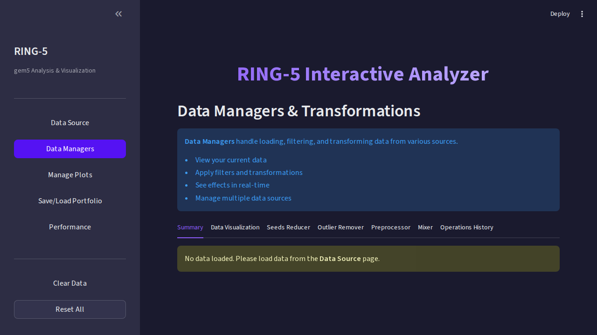
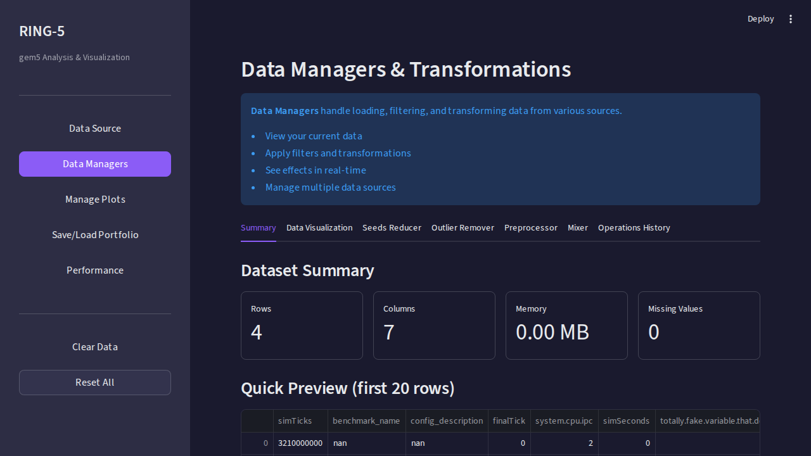

# Data Managers Page

After loading data, use **Data Managers** to clean, filter, and prepare your
dataset before visualization. Each manager is a separate tab with its own
purpose.

---

## Overview

Data Managers follow a consistent **configure → preview → confirm** pattern:

1. **Configure** the transformation parameters
2. **Preview** the effect on a sample of your data
3. **Apply** to commit the change

All transformations are **non-destructive** — they create a new processed
dataset without modifying the original loaded data.

---

## Available Managers

### Preprocessor

Clean and restructure your data before analysis.

| Operation | Description |
|-----------|-------------|
| **Column Selection** | Keep only the columns you need |
| **Column Renaming** | Give columns meaningful display names |
| **Type Conversion** | Ensure numeric columns are properly typed |

**When to use**: After loading raw parsed data with many unused columns,
or when column names are too verbose for plot labels.

---

### Outlier Remover

Detect and remove statistical outliers from numeric columns.

| Method | How It Works | Best For |
|--------|-------------|----------|
| **Z-Score** | Flags values > N standard deviations from mean | Normal distributions |
| **IQR** | Flags values outside 1.5× the interquartile range | Skewed distributions |

**Steps:**
1. Select the value column (e.g., `stat_value`)
2. Choose the detection method and threshold
3. Preview flagged outliers
4. Apply to remove them

**When to use**: When a few extreme values distort your averages or
chart scales.

---

### Seeds Reducer

Aggregate multiple random seeds (runs) per configuration.

| Parameter | Description |
|-----------|-------------|
| **Group By** | Columns that identify a unique configuration (e.g., `simulation_name`, `benchmark_name`, `stat_name`) |
| **Aggregation** | `mean`, `median`, or `geomean` |

**When to use**: Standard practice in computer architecture research — run
each configuration with multiple seeds and report the mean/geomean.

**Example**: If you ran each benchmark 5 times with different seeds:
- **Before**: 5 rows per (config, benchmark, stat)
- **After**: 1 row per (config, benchmark, stat) with the averaged value

---

### Mixer

Combine data from multiple CSV sources into a single dataset.

| Step | Action |
|------|--------|
| 1 | Load a second CSV source |
| 2 | Choose join strategy (concatenate or merge on common columns) |
| 3 | Preview the combined result |
| 4 | Apply to merge |

**When to use**: Comparing results from separate experiment campaigns,
or combining baseline data with new experimental data.

---

## Before and After

📷 Data Managers state

| No data loaded | Data loaded |
|:---:|:---:|
|  |  |

---

## Tips

- **Apply managers in order**: Preprocessor → Outlier Remover → Seeds Reducer is
  the typical sequence
- **Check row counts**: After each step, verify the data dimensions in
  the summary bar at the top of the page
- **Undo**: Reload the original data from Data Source to start fresh

---

## Next Steps

Once your data is clean, head to [Manage Plots](Manage-Plots.md) to create
your first visualization.
