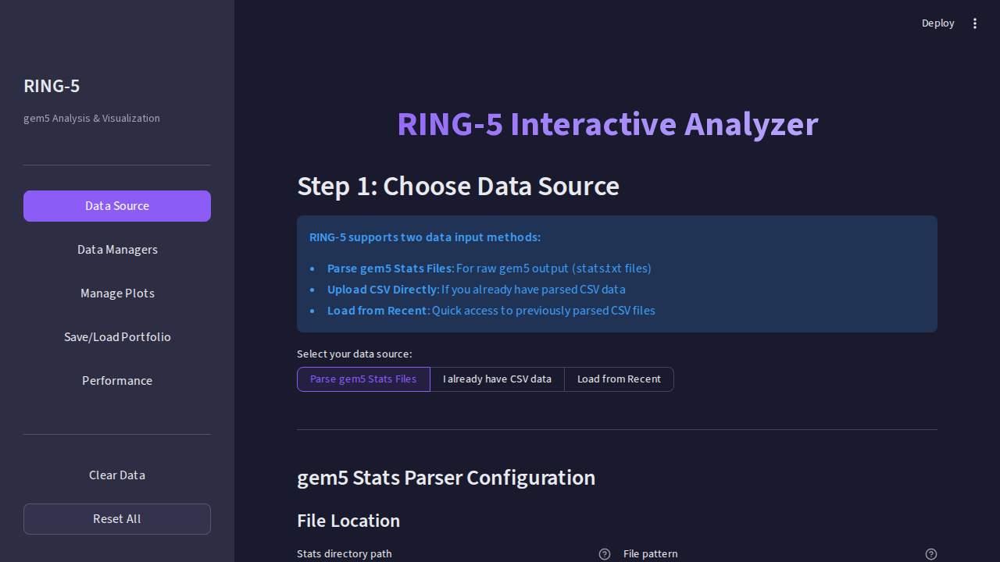
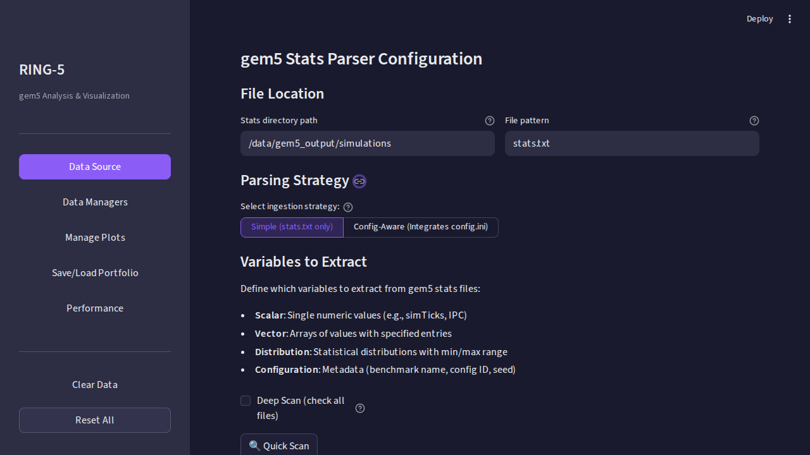
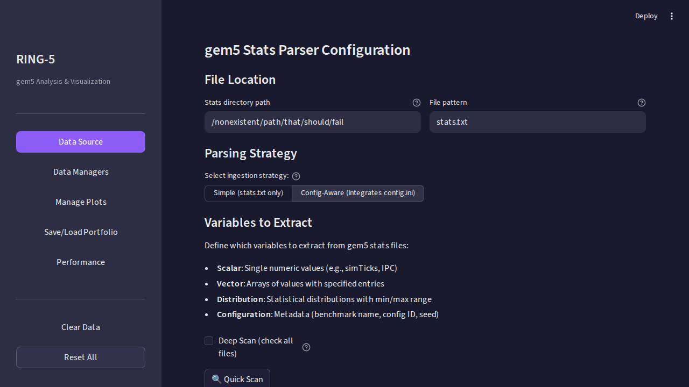
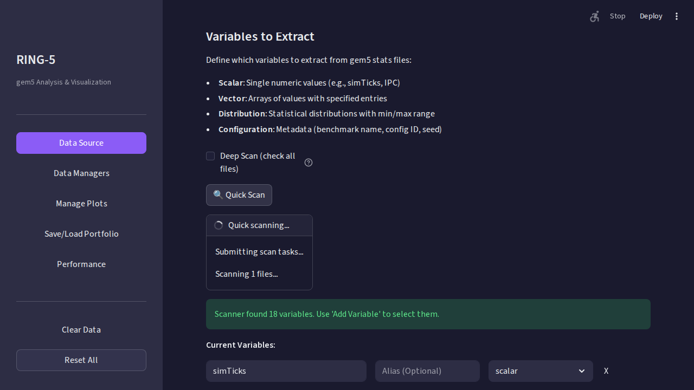
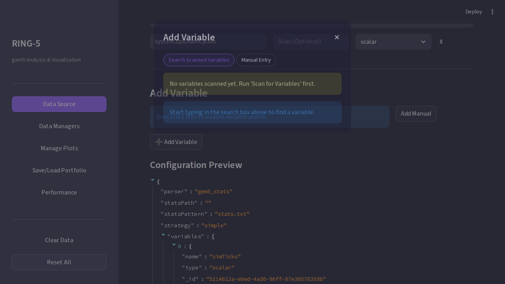
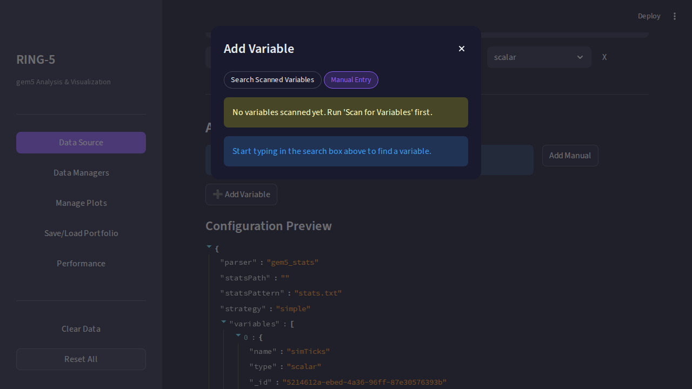
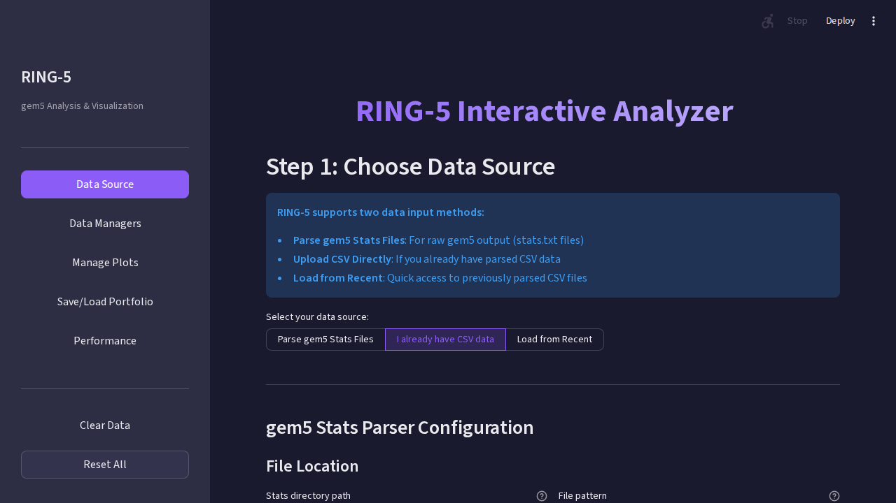
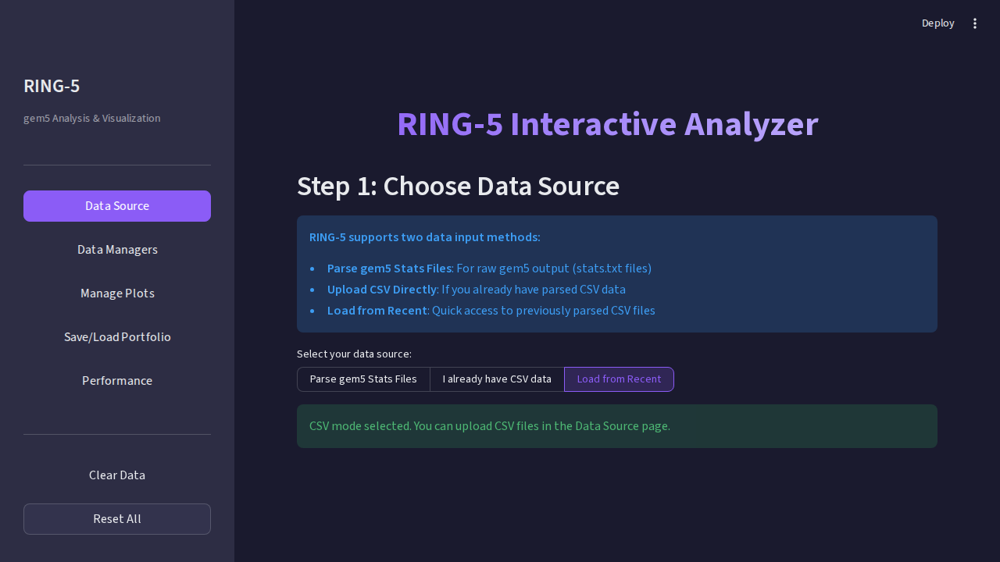

# Data Source Page

The **Data Source** page is your entry point into RING-5. Load simulation data
using one of three methods, then proceed to analysis.

---

## Choosing a Data Source Mode

At the top of the page, a **segmented control** lets you choose how to load data:

| Mode            | When to Use                                                             |
| --------------- | ----------------------------------------------------------------------- |
| **Parse Stats** | You have raw gem5 `stats.txt` output files                              |
| **I Have CSV**  | You have a pre-processed CSV (from a previous session or external tool) |
| **Recent**      | Quickly reload a previously parsed dataset                              |

📷 Segmented control screenshot

---

## Parse Stats (Primary Workflow)

This is the most common workflow. RING-5 scans your gem5 output directory,
discovers available statistics, and extracts them into a structured CSV.

### Step-by-Step

#### 1. Configure Paths

Fill in two fields:

- **Stats Directory**: Path to your gem5 output folder (e.g., `/path/to/simulations/`)
- **File Pattern**: Glob pattern for stats files (default: `stats.txt`)

📷 Path configuration

|                 Initial view                  |                After filling paths                |
| :-------------------------------------------: | :-----------------------------------------------: |
|  |  |

#### 2. Choose a Parsing Strategy

Two strategies are available:

| Strategy         | What It Reads              | Speed  | Use Case                                          |
| ---------------- | -------------------------- | ------ | ------------------------------------------------- |
| **Simple**       | `stats.txt` only           | Fast   | Most analyses                                     |
| **Config-Aware** | `stats.txt` + `config.ini` | Slower | When you need configuration parameters as columns |

**Config-Aware** adds columns like cache sizes, CPU type, and pipeline
widths to your dataset — perfect for sensitivity analyses.

📷 Config-Aware strategy

#### 3. Scan for Variables

Click **Scan Variables**. RING-5 will:

1. Walk your directory tree
2. Parse stats files to discover all available metrics
3. **Aggregate patterns** — e.g., `cpu0.numCycles`, `cpu1.numCycles`, ..., `cpu15.numCycles` become a single `cpu\d+.numCycles` pattern (reduces variable count by up to 94%)

📷 After scanning

#### 4. Select Variables

Browse the discovered variables and add the ones you need. Two methods:

- **Search mode**: Filter the scanned list by name, type, or keyword
- **Manual mode**: Type a variable name directly (for known stats not auto-discovered)

📷 Variable selection

|                     Search mode                     |                     Manual mode                     |
| :-------------------------------------------------: | :-------------------------------------------------: |
|  |  |

#### 5. Parse

Click **Parse** to extract data. RING-5 runs concurrent workers and
produces a CSV file with the selected statistics structured for analysis.

---

## CSV Upload Mode

Already have a CSV? Upload it directly. The CSV must contain these columns:

| Column            | Type    | Description               |
| ----------------- | ------- | ------------------------- |
| `simulation_name` | string  | Unique run identifier     |
| `benchmark_name`  | string  | Benchmark being simulated |
| `stat_name`       | string  | Metric name               |
| `stat_value`      | numeric | Metric value              |

Additional columns (from config-aware parsing or manual enrichment)
are preserved and available for grouping/filtering.

📷 CSV upload

---

## Recent Mode

Previously parsed CSV files are cached locally. Select any recent entry
to reload instantly — no re-parsing needed.

Each entry shows:

- File path
- Parse date
- Data dimensions (rows × columns)

📷 Recent files

---

## Next Steps

Once data is loaded, proceed to [Data Managers](Data-Managers.md) to clean
and prepare your data, or jump directly to [Manage Plots](Manage-Plots.md)
if your data is ready.
