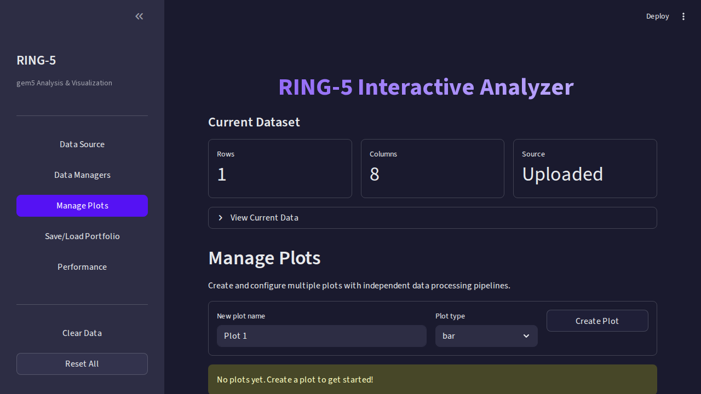
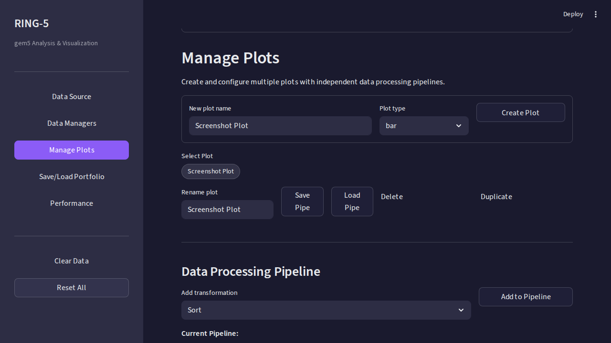

<!-- trunk-ignore-all(markdownlint/MD033) -->
<!-- trunk-ignore-all(markdownlint/MD025) -->

# Manage Plots Page

This is the core analysis page. Create publication-quality plots, apply
data transformations per-plot, and configure every visual detail.

---

## Creating a Plot

1. Enter a descriptive name (e.g., "IPC by Benchmark")
2. Select a plot type from the dropdown
3. Click **Create Plot**

📷 Empty state and plot creation

|                Empty state                 |               After creating               |
| :----------------------------------------: | :----------------------------------------: |
|  |  |

### Available Plot Types

| Plot Type                 | Best For                          | Key Config              |
| ------------------------- | --------------------------------- | ----------------------- |
| **Bar**                   | Comparing categories              | X-axis, Y-axis          |
| **Grouped Bar**           | Multi-group comparison            | X, Y, Group-by column   |
| **Stacked Bar**           | Composition of totals             | X, Y, Stack-by column   |
| **Grouped Stacked Bar**   | Combined grouping + stacking      | X, Y, Group, Stack      |
| **Histogram**             | Value distributions               | Value column, bin count |
| **Line**                  | Trends over ordered data          | X (continuous), Y       |
| **Scatter**               | Correlation between variables     | X, Y, optional Color-by |
| **Dual Axis (Bar + Dot)** | Two metrics with different scales | Left-Y and Right-Y      |

---

## Shaper Pipeline

Each plot has its own **shaper pipeline** — a sequence of data
transformations applied before rendering. Shapers are executed
top-to-bottom.

| Shaper              | What It Does                                               |
| ------------------- | ---------------------------------------------------------- |
| **Column Selector** | Pick which columns to include in the plot                  |
| **Sort**            | Reorder rows by custom column values                       |
| **Mean Calculator** | Add aggregated mean rows (arithmetic, geometric, harmonic) |
| **Normalize**       | Scale values relative to a baseline configuration          |
| **Filter**          | Remove rows by condition                                   |
| **Split-Apply**     | Apply a transformation within each sub-group               |
| **Transformer**     | Compute derived columns (ratios, differences, etc.)        |

### Adding a Shaper

1. Select a shaper type from the dropdown
2. Configure its parameters
3. The pipeline preview updates automatically

### Reordering

Drag pipeline steps up/down to change execution order. Order matters —
for example, normalizing before filtering gives different results than
filtering first.

---

## Data Mapping

After building your pipeline, map your processed data to chart axes:

1. **X-Axis**: Choose the categorical or continuous column
2. **Y-Axis**: Choose the numeric value column
3. **Group/Stack/Color**: Additional mapping columns (plot-type dependent)
4. Click **Refresh** to render

---

## Rendering Engines

Switch between two engines at any time — both use the same configuration:

| Engine         | Strengths                                          | Best For                                  |
| -------------- | -------------------------------------------------- | ----------------------------------------- |
| **Plotly**     | Hover tooltips, zoom, pan, interactive exploration | Exploratory analysis                      |
| **Matplotlib** | LaTeX-rendered text, PGF/PDF output                | Publication figures (ISCA, MICRO, ASPLOS) |

---

## Plot Management

On the left, a plot selector lets you switch between multiple plots. Each
plot has independent controls:

| Action        | Description                            |
| ------------- | -------------------------------------- |
| **Rename**    | Change the plot's display name         |
| **Delete**    | Remove the plot                        |
| **Duplicate** | Create an identical copy to iterate on |

---

## Configuring the Visual Appearance

Plot settings are organized into **pills** — compact tabs that reveal
settings on click. See the dedicated [Plot Settings](Plot-Settings.md)
page for details on each settings category.

📷 Full page with chart and controls

---

## Next Steps

- **Fine-tune appearance**: [Plot Settings](Plot-Settings.md)
- **Export your figure**: [Export & Download](Export-Download.md)
- **Save your session**: [Portfolios](../Portfolios.md)
